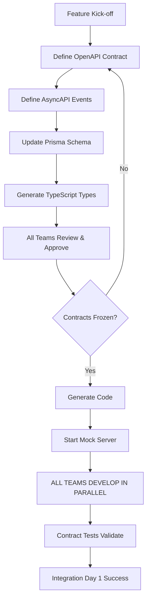

# ADR 0002: Contract-First Development with OpenAPI and AsyncAPI

**Date**: 2025-11-06
**Status**: Accepted


## Context

NxLoy requires **parallel development** across 7 teams/agents:
- Backend (NestJS)
- Web (Next.js)
- Mobile (React Native)
- AI/MCP (Node.js)
- Infrastructure (Terraform/K8s)
- Blockchain/NFT (Solidity)
- Documentation

**Problem**: Traditional "backend-first" development causes:
- ❌ Frontend teams wait for backend completion (2-3 weeks blocked)
- ❌ Integration issues discovered late (costly rework)
- ❌ Contract mismatches between teams (type errors, field mismatches)
- ❌ No way to develop/test frontend without running backend
- ❌ API documentation becomes stale (diverges from implementation)

**Example Failure Scenario**:
```
Week 1-3: Backend builds loyalty template API
Week 4: Frontend starts integration
Week 4 Day 2: "Wait, we need these additional fields!"
Week 4 Day 3: "These validation rules don't match our UI!"
Result: 1 week of rework, missed sprint goals
```

## Decision

We will adopt **Contract-First Development** using:

1. **OpenAPI 3.1** for REST API contracts
2. **AsyncAPI 3.0** for event/message contracts
3. **Prisma Schema** for database contracts
4. **TypeScript Interfaces** as the shared type system

### Contract-First Workflow



### Contract Storage

```
docs/contracts/
├── README.md                 # Contract usage guide
├── openapi.yaml              # REST API specification (OpenAPI 3.1)
├── events.asyncapi.yaml      # Event contracts (AsyncAPI 3.0)
└── database.prisma           # Link to apps/backend/prisma/schema.prisma
```

### Code Generation

```typescript
// OpenAPI → TypeScript Client
// Generated in packages/shared-api/

import { api } from '@nxloy/shared-api';

// ✅ Type-safe API calls
const templates = await api.templates.findAll({ industry: 'COFFEE' });
//    ^? LoyaltyRuleTemplate[]

// ✅ IDE autocomplete for all endpoints
// ✅ Compile-time errors if contract changes
// ✅ No manual API client code
```

## Alternatives Considered

### 1. Backend-First Development
**Pros**:
- Traditional approach, familiar to teams
- Backend controls the API design

**Cons**:
- ❌ Frontend blocked for weeks
- ❌ Integration issues discovered late
- ❌ No parallel development possible
- ❌ Manual API client code prone to errors

**Rejected**: Doesn't support our multi-agent parallelism requirement.

### 2. Code-First with Auto-Generated Docs
**Approach**: Write NestJS code, generate OpenAPI from decorators

**Pros**:
- ✅ Documentation always matches implementation
- ✅ Less upfront design work

**Cons**:
- ❌ Frontend still blocked until backend implements
- ❌ Can't develop in parallel
- ❌ No contract validation before coding

**Decision**: We'll use BOTH:
- Start with manual OpenAPI contract
- Use NestJS decorators to validate implementation
- Compare manual vs auto-generated to catch drift

### 3. GraphQL Schema-First
**Pros**:
- ✅ Single query language
- ✅ Strong typing built-in
- ✅ Eliminates over-fetching

**Cons**:
- ❌ Learning curve for team
- ❌ REST is more widely supported (browsers, mobile, AI agents)
- ❌ Complex caching vs REST

**Decision**: Start with REST + OpenAPI, evaluate GraphQL in Phase 3.

### 4. Protocol Buffers + gRPC
**Pros**:
- ✅ Better performance (8x faster)
- ✅ Strong typing via protobuf
- ✅ Streaming support

**Cons**:
- ❌ No native browser support (needs envoy proxy)
- ❌ Less familiar to web developers
- ❌ AI agents have better OpenAPI support

**Decision**: Skip for now, re-evaluate for internal services in Phase 4.

## Consequences

### Positive

1. **True Parallel Development**
   - Backend, web, mobile all start Day 1
   - Mock server (Prism) enables frontend development without backend
   - Zero waiting time between teams

2. **Type Safety Across Stack**
   ```typescript
   // Same types everywhere
   // Backend (NestJS)
   @ApiResponse({ type: LoyaltyRuleTemplate })

   // Web (React)
   const template: LoyaltyRuleTemplate = ...

   // Mobile (React Native)
   const template: LoyaltyRuleTemplate = ...

   // All share generated types from OpenAPI
   ```

3. **Catching Integration Issues Early**
   - Contract tests (Pact) validate before deployment
   - Breaking changes fail CI build
   - No surprise integration failures

4. **Living Documentation**
   - OpenAPI spec IS the documentation
   - Swagger UI auto-generates interactive docs
   - Always up-to-date (if implementation diverges, tests fail)

5. **Mock Server for Development**
   ```bash
   # Start Prism mock server from OpenAPI spec
   npx prism mock docs/contracts/openapi.yaml

   # Frontend develops against mock
   # Backend implements real endpoints
   # Integration works Day 1
   ```

6. **AI Agent Friendly**
   - Machines can read OpenAPI/AsyncAPI
   - Code generation eliminates boilerplate
   - Clear contracts reduce ambiguity

### Negative

1. **Upfront Design Time**
   - Must design contracts before coding (2-3 days per feature)
   - Requires all teams to participate in design
   - Mitigation: Template contracts, reuse patterns

2. **Contract Maintenance**
   - Manual OpenAPI must stay in sync with code
   - Risk of contract drift
   - Mitigation: Contract tests, auto-generation comparison

3. **Learning Curve**
   - Team must learn OpenAPI/AsyncAPI syntax
   - Tooling setup required (Prism, generators)
   - Mitigation: Templates, documentation, training

4. **Rigidity During Early Development**
   - Harder to change contracts mid-sprint
   - "Contract freeze" on Day 3 limits flexibility
   - Mitigation: Versioning, deprecation strategy

### Neutral

1. **Tool Dependencies**
   - Requires OpenAPI/AsyncAPI generators
   - Requires Prism mock server
   - Requires contract testing tools (Pact)

2. **File Organization**
   - Contracts live separately from code
   - Must maintain mapping between contracts and implementation

## Implementation Plan

### Week 1: Setup Foundation

**Day 1-2: Install Tooling**
```bash
# OpenAPI tools
pnpm add -D @stoplight/prism-cli       # Mock server
pnpm add -D @openapitools/openapi-generator-cli  # Code gen
pnpm add -D swagger-cli                # Validation

# AsyncAPI tools
pnpm add -D @asyncapi/cli              # Event validation
pnpm add -D @asyncapi/generator        # Event code gen

# Contract testing
pnpm add -D @pact-foundation/pact      # Contract tests
```

**Day 3: Create First Contract**
```yaml
# docs/contracts/openapi.yaml
openapi: 3.1.0
info:
  title: NxLoy API
  version: 1.0.0

paths:
  /api/v1/templates:
    get:
      summary: List loyalty templates
      # ... full specification
```

**Day 4-5: Setup Code Generation**
```json
// package.json scripts
{
  "generate:api-client": "openapi-generator-cli generate -i docs/contracts/openapi.yaml -g typescript-axios -o packages/shared-api/src/generated",
  "generate:types": "openapi-generator-cli generate -i docs/contracts/openapi.yaml -g typescript-node -o packages/shared-types/src/generated",
  "validate:contracts": "swagger-cli validate docs/contracts/openapi.yaml",
  "mock:api": "prism mock docs/contracts/openapi.yaml -p 3001"
}
```

### Week 2-4: Feature Development Pattern

**For Each New Feature:**

1. **Design Phase** (Day 1-3)
   - Write OpenAPI paths
   - Write AsyncAPI events
   - Update Prisma schema
   - Generate types
   - ALL TEAMS review
   - Contract freeze

2. **Implementation Phase** (Day 4-15)
   - Backend implements endpoints
   - Web/Mobile use generated client
   - AI/MCP consumes events
   - Infrastructure deploys
   - ALL DEVELOP IN PARALLEL

3. **Integration Phase** (Day 16-20)
   - Contract tests verify compliance
   - E2E tests validate workflows
   - Performance tests check SLAs
   - Deploy to staging

### Month 3: Advanced Patterns

**Add Contract Testing**
```typescript
// Pact consumer test (Web)
describe('Templates API', () => {
  it('should list templates', async () => {
    await provider
      .given('templates exist')
      .uponReceiving('a request for templates')
      .withRequest({
        method: 'GET',
        path: '/api/v1/templates',
        query: { industry: 'COFFEE' }
      })
      .willRespondWith({
        status: 200,
        headers: { 'Content-Type': 'application/json' },
        body: Matchers.eachLike({
          id: Matchers.uuid(),
          name: Matchers.string(),
          industry: ['COFFEE']
        })
      });
  });
});

// Backend verifies this contract
```

## Success Metrics

### Immediate (Month 1-2)
- [ ] All features start with OpenAPI contract
- [ ] Mock server running for frontend development
- [ ] TypeScript types auto-generated
- [ ] Zero manual API client code

### Short-Term (Month 3-6)
- [ ] Contract tests cover all critical paths
- [ ] Integration issues caught in CI (not production)
- [ ] Frontend/backend develop in parallel (0 blocking)
- [ ] API documentation always current

### Long-Term (Month 6-12)
- [ ] <1% contract drift (manual vs auto-generated)
- [ ] 0 integration rework after contract freeze
- [ ] <5% of development time on contract design
- [ ] 100% team satisfaction with approach

## Tooling Ecosystem

### OpenAPI Tools
- **Prism**: Mock server for development
- **OpenAPI Generator**: TypeScript client generation
- **Swagger UI**: Interactive documentation
- **Spectral**: Contract linting and validation

### AsyncAPI Tools
- **AsyncAPI Generator**: Event handler generation
- **AsyncAPI Studio**: Visual editor
- **AsyncAPI Validator**: Schema validation

### Contract Testing
- **Pact**: Consumer-driven contract testing
- **Pact Broker**: Contract versioning and discovery

### Integration
- **NestJS Swagger**: Auto-generate OpenAPI from code
- **GraphQL Code Generator**: If using GraphQL
- **Prisma**: Database schema as code

## Migration Path

### Phase 1 (Current): Manual Contracts
- Write OpenAPI by hand
- Generate types and clients
- Use mock server

### Phase 2 (Month 3): Hybrid Approach
- NestJS auto-generates OpenAPI
- Compare with manual contract
- Flag discrepancies in CI

### Phase 3 (Month 6): Code-First with Validation
- NestJS decorators generate contracts
- Contract tests validate compliance
- Manual contracts for new features only

## References

- [OpenAPI 3.1 Specification](https://spec.openapis.org/oas/v3.1.0)
- [AsyncAPI 3.0 Specification](https://www.asyncapi.com/docs/reference/specification/v3.0.0)
- [Prism Mock Server](https://stoplight.io/open-source/prism)
- [Pact Contract Testing](https://docs.pact.io/)
- [NestJS OpenAPI](https://docs.nestjs.com/openapi/introduction)

## Decision Owners

- **API Contracts**: Backend Team + Web Team + Mobile Team (consensus required)
- **Event Contracts**: Backend Team + AI/MCP Team (consensus required)
- **Breaking Changes**: All affected teams must approve
- **Contract Freeze**: Product Manager decides based on team readiness

---

**Rationale**: Contract-first development is the ONLY way to achieve true parallel development across 7 teams/agents. The upfront design cost (2-3 days) is recovered within the first sprint through elimination of rework and integration delays.
