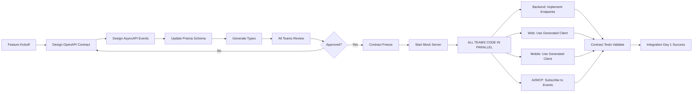

# NxLoy API Contracts

This directory contains **machine-readable API contracts** that serve as the **single source of truth** for all teams developing NxLoy in parallel.

## Quick Start

```bash
# 1. Validate contracts
pnpm run validate:contracts

# 2. Generate TypeScript types
pnpm run generate:types

# 3. Generate API client
pnpm run generate:api-client

# 4. Start mock server (for frontend development)
pnpm run mock:api
```

## Files

| File | Purpose | Spec Version | Owner |
|------|---------|--------------|-------|
| `openapi.yaml` | REST API specification | OpenAPI 3.1 | Backend + Web + Mobile |
| `events.asyncapi.yaml` | Event/message contracts | AsyncAPI 3.0 | Backend + AI/MCP |
| `database.prisma` | Database schema (link) | Prisma 5.x | Backend |

## Contract-First Workflow



## OpenAPI Contract (`openapi.yaml`)

### Purpose

Defines **REST API endpoints** for synchronous request/response operations.

### Structure

```yaml
openapi: 3.1.0
info:
  title: NxLoy Loyalty Platform API
  version: 1.0.0
  description: Multi-tenant loyalty platform with industry templates

servers:
  - url: https://api.nxloy.com/v1
    description: Production
  - url: http://localhost:8000/api/v1
    description: Development
  - url: http://localhost:3001
    description: Mock server (Prism)

paths:
  /loyalty/templates:
    get:
      summary: List loyalty templates
      operationId: listLoyaltyTemplates
      tags: [Loyalty]
      parameters:
        - name: industry
          in: query
          schema:
            $ref: '#/components/schemas/BusinessIndustry'
      responses:
        '200':
          description: List of loyalty templates
          content:
            application/json:
              schema:
                type: array
                items:
                  $ref: '#/components/schemas/LoyaltyRuleTemplate'

components:
  schemas:
    LoyaltyRuleTemplate:
      type: object
      required: [id, name, industry, ruleType]
      properties:
        id:
          type: string
          format: uuid
        name:
          type: string
        industry:
          $ref: '#/components/schemas/BusinessIndustry'
        ruleType:
          $ref: '#/components/schemas/LoyaltyRuleType'
```

### What Goes in OpenAPI?

✅ **Include**:
- CRUD operations (create, read, update, delete)
- Query endpoints (list, search, filter)
- Synchronous commands (that return immediate response)
- DTOs (Data Transfer Objects)
- Validation rules (min, max, pattern, required)
- Error responses (400, 401, 404, 500)

❌ **Exclude**:
- Asynchronous events (use AsyncAPI)
- Internal implementation details
- Database schema (use Prisma)
- Background jobs

### Example: Full Endpoint Specification

```yaml
paths:
  /loyalty/programs:
    post:
      summary: Create loyalty program
      operationId: createLoyaltyProgram
      tags: [Loyalty]
      security:
        - bearerAuth: []
      requestBody:
        required: true
        content:
          application/json:
            schema:
              $ref: '#/components/schemas/CreateLoyaltyProgramDto'
            examples:
              coffee-shop:
                summary: Coffee shop punch card
                value:
                  name: "Coffee Lover Card"
                  businessId: "b1234567-89ab-cdef-0123-456789abcdef"
                  ruleType: "PUNCH_CARD"
                  config:
                    requiredPunches: 10
                    reward:
                      type: "free_item"
                      value: "Free coffee"
      responses:
        '201':
          description: Loyalty program created
          content:
            application/json:
              schema:
                $ref: '#/components/schemas/LoyaltyProgram'
        '400':
          description: Validation error
          content:
            application/json:
              schema:
                $ref: '#/components/schemas/ErrorResponse'
        '401':
          description: Unauthorized
        '403':
          description: Forbidden (not business owner)
```

### Validation

```bash
# Validate OpenAPI spec
npx swagger-cli validate docs/contracts/openapi.yaml

# Lint for best practices
npx spectral lint docs/contracts/openapi.yaml
```

## AsyncAPI Contract (`events.asyncapi.yaml`)

### Purpose

Defines **domain events** for asynchronous, event-driven communication between bounded contexts.

### Structure

```yaml
asyncapi: 3.0.0
info:
  title: NxLoy Event Bus
  version: 1.0.0
  description: Domain events for cross-context integration

servers:
  development:
    host: localhost:6379
    protocol: redis
    description: Local Redis
  production:
    host: redis.nxloy.com:6379
    protocol: redis
    description: Production Redis

channels:
  loyalty/points-earned:
    address: loyalty.points.earned
    messages:
      PointsEarnedEvent:
        $ref: '#/components/messages/PointsEarnedEvent'
    description: Published when customer earns loyalty points

  customer/registered:
    address: customer.registered
    messages:
      CustomerRegisteredEvent:
        $ref: '#/components/messages/CustomerRegisteredEvent'
    description: Published when new customer registers

components:
  messages:
    PointsEarnedEvent:
      name: PointsEarnedEvent
      title: Points Earned
      summary: Customer earned loyalty points
      contentType: application/json
      payload:
        type: object
        required: [eventId, timestamp, customerId, points, programId]
        properties:
          eventId:
            type: string
            format: uuid
          timestamp:
            type: string
            format: date-time
          customerId:
            type: string
            format: uuid
          points:
            type: number
            minimum: 0
          programId:
            type: string
            format: uuid
          transactionId:
            type: string
            format: uuid
```

### What Goes in AsyncAPI?

✅ **Include**:
- Domain events (something happened)
- Cross-context notifications
- Asynchronous workflows
- Event payload schemas
- Channel/topic names
- Event versioning

❌ **Exclude**:
- REST API endpoints (use OpenAPI)
- Synchronous request/response
- Internal implementation (how events are stored)

### Event Naming Convention

Pattern: `{Domain}.{Entity}.{Action}[.{Detail}]`

Examples:
- `loyalty.points.earned`
- `customer.registered`
- `rewards.redeemed`
- `subscription.payment.succeeded`
- `tier.upgraded`

### Validation

```bash
# Validate AsyncAPI spec
npx asyncapi validate docs/contracts/events.asyncapi.yaml

# Generate documentation
npx asyncapi generate:html docs/contracts/events.asyncapi.yaml
```

## Database Contract (`database.prisma`)

### Purpose

Link to Prisma schema which defines database tables, relationships, and constraints.

### Location

Actual file: `apps/backend/prisma/schema.prisma`

This directory contains a **symbolic link** for documentation purposes.

### Structure

```prisma
// Example from Prisma schema
model LoyaltyProgram {
  id           String   @id @default(uuid())
  businessId   String
  name         String
  ruleType     LoyaltyRuleType
  config       Json
  status       ProgramStatus
  createdAt    DateTime @default(now())
  updatedAt    DateTime @updatedAt

  business     Business @relation(fields: [businessId], references: [id])
  rules        LoyaltyRule[]
  transactions LoyaltyTransaction[]

  @@map("loyalty_programs")
}

enum LoyaltyRuleType {
  POINTS_BASED
  PUNCH_CARD
  AMOUNT_SPENT
  TIER_BASED
  VISIT_FREQUENCY
  STAMP_CARD
}
```

### What's Included?

✅ **Include**:
- Tables and columns
- Data types
- Relationships (foreign keys)
- Indexes
- Enums
- Default values
- Constraints

### Contract Alignment

**CRITICAL**: Prisma schema MUST align with OpenAPI/AsyncAPI schemas.

```typescript
// OpenAPI schema
{
  "LoyaltyProgram": {
    "type": "object",
    "properties": {
      "id": { "type": "string", "format": "uuid" },
      "name": { "type": "string" },
      "ruleType": { "$ref": "#/components/schemas/LoyaltyRuleType" }
    }
  }
}

// Must match Prisma
model LoyaltyProgram {
  id       String          @id @default(uuid())
  name     String
  ruleType LoyaltyRuleType
}
```

## Code Generation

### Generate TypeScript Types

```bash
# Generate from OpenAPI
npx openapi-generator-cli generate \
  -i docs/contracts/openapi.yaml \
  -g typescript-node \
  -o packages/shared-types/src/generated

# Generate from Prisma
cd apps/backend
npx prisma generate
```

**Generated Files**:
- `packages/shared-types/src/generated/models/*` - DTOs
- `node_modules/.prisma/client/*` - Prisma types

### Generate API Client

```bash
# Generate TypeScript Axios client
npx openapi-generator-cli generate \
  -i docs/contracts/openapi.yaml \
  -g typescript-axios \
  -o packages/shared-api/src/generated
```

**Usage**:
```typescript
// Web app
import { LoyaltyApi } from '@nxloy/shared-api';

const api = new LoyaltyApi({ basePath: 'http://localhost:8000/api/v1' });
const templates = await api.listLoyaltyTemplates({ industry: 'COFFEE' });
//    ^? LoyaltyRuleTemplate[]  (Type-safe!)
```

### Generate Event Handlers

```bash
# Generate from AsyncAPI
npx asyncapi generate:fromTemplate docs/contracts/events.asyncapi.yaml \
  @asyncapi/nodejs-template \
  -o apps/backend/src/generated/events
```

## Mock Server (Prism)

### Purpose

Enable **frontend development without backend** by serving mock responses from OpenAPI contract.

### Start Mock Server

```bash
# Start Prism mock server
npx @stoplight/prism-cli mock docs/contracts/openapi.yaml \
  --port 3001 \
  --dynamic

# Now frontend can develop against http://localhost:3001
```

### Example Usage

```typescript
// Web app connects to mock server during development
const apiUrl = process.env.NEXT_PUBLIC_API_URL || 'http://localhost:3001';

const api = new LoyaltyApi({ basePath: apiUrl });
const templates = await api.listLoyaltyTemplates({ industry: 'COFFEE' });

// Mock server returns example data from OpenAPI spec
// Backend team implements real endpoints in parallel
```

### Mock Server Features

- ✅ Returns example data from OpenAPI spec
- ✅ Validates request bodies
- ✅ Returns appropriate status codes
- ✅ Supports dynamic responses
- ✅ CORS enabled for local development

## Contract Testing (Pact)

### Purpose

Validate that **backend implementation** matches **frontend expectations** (consumer-driven contracts).

### Consumer Test (Web)

```typescript
// Web app defines expectations
import { pactWith } from 'jest-pact';

pactWith({ consumer: 'web', provider: 'backend' }, (provider) => {
  describe('Loyalty API', () => {
    it('should list loyalty templates', async () => {
      await provider
        .given('templates exist for COFFEE industry')
        .uponReceiving('a request for templates')
        .withRequest({
          method: 'GET',
          path: '/api/v1/loyalty/templates',
          query: { industry: 'COFFEE' }
        })
        .willRespondWith({
          status: 200,
          headers: { 'Content-Type': 'application/json' },
          body: Matchers.eachLike({
            id: Matchers.uuid(),
            name: Matchers.string(),
            industry: Matchers.term({
              generate: 'COFFEE',
              matcher: '^(COFFEE|RETAIL|RESTAURANTS)$'
            }),
            ruleType: Matchers.string()
          })
        });

      const api = new LoyaltyApi({ basePath: provider.mockService.baseUrl });
      const templates = await api.listLoyaltyTemplates({ industry: 'COFFEE' });

      expect(templates.length).toBeGreaterThan(0);
    });
  });
});
```

### Provider Verification (Backend)

```typescript
// Backend verifies it meets web's expectations
import { Verifier } from '@pact-foundation/pact';

describe('Pact Verification', () => {
  it('should validate backend against web contract', async () => {
    const opts = {
      provider: 'backend',
      providerBaseUrl: 'http://localhost:8000',
      pactUrls: ['./pacts/web-backend.json'],
      stateHandlers: {
        'templates exist for COFFEE industry': async () => {
          // Setup database state
          await seedLoyaltyTemplates();
        }
      }
    };

    await new Verifier(opts).verifyProvider();
  });
});
```

## Contract Versioning

### Versioning Strategy

**Semantic Versioning** for contracts:
- `MAJOR.MINOR.PATCH`
- **MAJOR**: Breaking changes (remove field, change type)
- **MINOR**: Additive changes (add optional field)
- **PATCH**: Documentation updates

### Breaking Change Process

1. **Deprecation Warning** (1 release)
   ```yaml
   components:
     schemas:
       LoyaltyProgram:
         properties:
           oldField:
             type: string
             deprecated: true
             description: "DEPRECATED: Use newField instead. Will be removed in v2.0.0"
           newField:
             type: string
   ```

2. **Support Both Fields** (1-2 releases)
   - Backend returns both `oldField` and `newField`
   - Frontend migrates to `newField`

3. **Remove Deprecated Field** (next major version)
   - Increment MAJOR version (1.x.x → 2.0.0)
   - Remove `oldField` from contract
   - Backend stops returning `oldField`

### Version in URL

```yaml
servers:
  - url: https://api.nxloy.com/v1  # Current
  - url: https://api.nxloy.com/v2  # Next major
```

## Team Responsibilities

| Team | Contract | Responsibilities |
|------|----------|------------------|
| **Backend** | All 3 | Implements OpenAPI endpoints, publishes AsyncAPI events, owns Prisma schema |
| **Web** | OpenAPI | Consumes OpenAPI contract, uses generated client, writes Pact consumer tests |
| **Mobile** | OpenAPI | Consumes OpenAPI contract, uses generated client, writes Pact consumer tests |
| **AI/MCP** | AsyncAPI | Subscribes to AsyncAPI events, processes event payloads |
| **Infrastructure** | All 3 | Deploys contract validation in CI/CD, manages Prism mock server |
| **Blockchain** | AsyncAPI | Publishes blockchain events (NFT minted, token transferred) |

## Contract Change Workflow

### For New Features

1. **Design Phase** (Day 1-3)
   - Product: Write user story
   - Backend + Web + Mobile: Collaborate on OpenAPI contract
   - Backend + AI/MCP: Collaborate on AsyncAPI events
   - Backend: Update Prisma schema
   - **All teams review and approve**

2. **Contract Freeze** (Day 3)
   - No changes allowed after freeze
   - Generate types and clients
   - Start mock server

3. **Implementation Phase** (Day 4-15)
   - Backend: Implement endpoints
   - Web: Use generated client + mock server
   - Mobile: Use generated client + mock server
   - AI/MCP: Subscribe to events
   - **All work in parallel**

4. **Integration Phase** (Day 16-20)
   - Backend: Verify against Pact contracts
   - Web/Mobile: Switch from mock to real backend
   - Contract tests validate alignment
   - E2E tests

### For Contract Changes Mid-Sprint

**IF** contract must change after freeze:

1. **Assess Impact**
   - Breaking change? → Requires all team approval
   - Additive change? → Easier to accommodate

2. **Update Contracts**
   - Update OpenAPI/AsyncAPI
   - Regenerate types and clients
   - Update mock server

3. **Notify All Teams**
   - Slack: "@channel Contract changed: {description}"
   - Teams must pull latest and regenerate

4. **Re-test**
   - All teams re-test against new contract

## Tools and Scripts

### package.json Scripts

```json
{
  "scripts": {
    "validate:contracts": "npm run validate:openapi && npm run validate:asyncapi",
    "validate:openapi": "swagger-cli validate docs/contracts/openapi.yaml",
    "validate:asyncapi": "asyncapi validate docs/contracts/events.asyncapi.yaml",

    "generate:types": "openapi-generator-cli generate -i docs/contracts/openapi.yaml -g typescript-node -o packages/shared-types/src/generated",
    "generate:api-client": "openapi-generator-cli generate -i docs/contracts/openapi.yaml -g typescript-axios -o packages/shared-api/src/generated",
    "generate:events": "asyncapi generate:fromTemplate docs/contracts/events.asyncapi.yaml @asyncapi/nodejs-template -o apps/backend/src/generated/events",

    "mock:api": "prism mock docs/contracts/openapi.yaml --port 3001 --dynamic",

    "lint:contracts": "spectral lint docs/contracts/openapi.yaml",

    "test:contracts": "pact-broker publish ./pacts --consumer-app-version=$CI_COMMIT_SHA --broker-base-url=$PACT_BROKER_URL"
  }
}
```

### CI/CD Integration

```yaml
# .github/workflows/contracts.yml
name: Contract Validation

on: [pull_request]

jobs:
  validate:
    runs-on: ubuntu-latest
    steps:
      - uses: actions/checkout@v4

      - name: Validate OpenAPI
        run: pnpm run validate:openapi

      - name: Validate AsyncAPI
        run: pnpm run validate:asyncapi

      - name: Lint contracts
        run: pnpm run lint:contracts

      - name: Check contract changes
        run: |
          if git diff --name-only origin/main | grep 'docs/contracts/'; then
            echo "⚠️ Contract changed! Review carefully."
            echo "Breaking changes require all team approval."
          fi
```

## Resources

### Official Documentation
- [OpenAPI 3.1 Specification](https://spec.openapis.org/oas/v3.1.0)
- [AsyncAPI 3.0 Specification](https://www.asyncapi.com/docs/reference/specification/v3.0.0)
- [Prisma Documentation](https://www.prisma.io/docs)

### Tools
- [Swagger Editor](https://editor.swagger.io/) - Visual OpenAPI editor
- [AsyncAPI Studio](https://studio.asyncapi.com/) - Visual AsyncAPI editor
- [Prism Mock Server](https://stoplight.io/open-source/prism)
- [OpenAPI Generator](https://openapi-generator.tech/)
- [Pact Documentation](https://docs.pact.io/)

### Examples
- [OpenAPI Examples](https://github.com/OAI/OpenAPI-Specification/tree/main/examples)
- [AsyncAPI Examples](https://github.com/asyncapi/spec/tree/master/examples)

---

**Contract-first development is the ONLY way to achieve true parallel development across 7 teams/agents.** The upfront design cost (2-3 days) is recovered within the first sprint through elimination of rework and integration delays.
