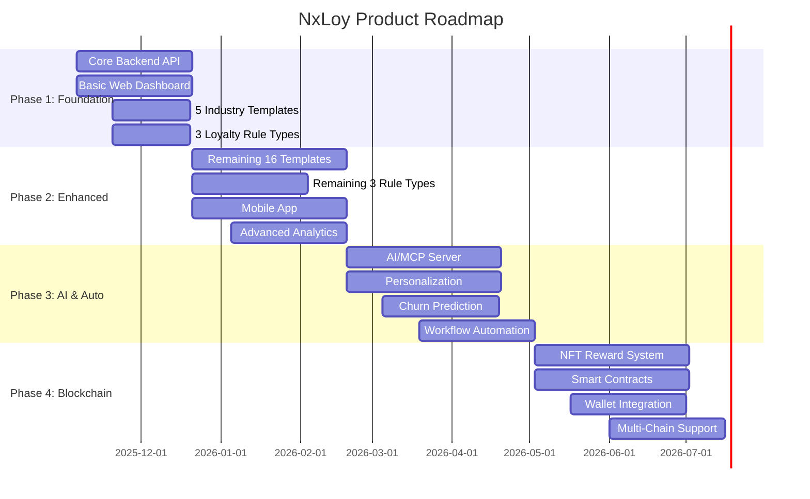

# NxLoy Product Roadmap

**Version**: 2.0.0
**Date**: 2025-11-09
**Status**: Active
**Planning Horizon**: 18 months

**v2.0.0 Updates**:
- Added Unified Wallet features (Phase 1) - Store credit, digital rewards, multi-tender redemption
- Clarified Social & Community features placement (Phase 5)
- Added Content Management features (Phase 2-3)
- Added Viral Growth mechanics integration across phases

## Roadmap Overview

NxLoy development is organized into **4 major phases** over 12 months, followed by enterprise enhancements in Year 2.

## Phase 1: Foundation (Months 1-3)

**Timeline**: Month 1-3 (Weeks 1-12)
**Goal**: Launch MVP with core loyalty features for 5 industries
**Target**: 100 beta customers

### Backend (Weeks 1-12)

**Authentication & Authorization** (Weeks 1-2)
- [x] User registration and login
- [x] JWT token authentication
- [x] OAuth 2.0 integration (Google, Facebook)
- [x] 2FA (two-factor authentication)
- [x] Role-based access control (RBAC)
- [ ] Session management
- [ ] Password reset flow

**Business Management** (Weeks 2-3)
- [ ] Business profile CRUD
- [ ] Multi-tenancy isolation
- [ ] Industry selection
- [ ] Business settings and configuration
- [ ] Logo and branding uploads
- [ ] Timezone and localization

**Customer Management** (Weeks 3-4)
- [ ] Customer registration (web, mobile, POS)
- [ ] Customer profile CRUD
- [ ] Customer search and filtering
- [ ] Customer segmentation (basic)
- [ ] Import customers (CSV)
- [ ] Export customers (GDPR compliance)

**Loyalty Programs** (Weeks 4-6)
- [ ] Loyalty program CRUD
- [ ] Template-based program creation
- [ ] Custom program creation
- [ ] Program activation/deactivation
- [ ] Program rules configuration
- [ ] Points calculation engine

**Loyalty Rule Types** (Weeks 6-8)
- [ ] POINTS_BASED: Earn points per dollar
- [ ] PUNCH_CARD: Digital stamp cards
- [ ] AMOUNT_SPENT: Spend-based milestones
- [ ] Rule type configuration schema
- [ ] Rule validation logic
- [ ] Points earning workflows

**Transactions** (Weeks 8-9)
- [ ] Transaction recording (POS integration stub)
- [ ] Transaction history per customer
- [ ] Points earning on transaction
- [ ] Transaction filtering and search
- [ ] Transaction analytics (basic)

**Rewards Catalog** (Weeks 9-10)
- [ ] Reward item CRUD
- [ ] Point pricing configuration
- [ ] Reward categories
- [ ] Reward availability rules
- [ ] Inventory management (basic)

**Redemptions** (Weeks 10-11)
- [ ] Reward redemption flow
- [ ] Point deduction logic
- [ ] Redemption history
- [ ] Redemption validation
- [ ] Redemption limits (per customer, per period)

**Unified Wallet** (Weeks 11-12) **NEW v2.0.0**
- [ ] Store credit issuance and redemption
- [ ] Digital reward issuance and redemption
- [ ] Multi-currency support (USD, KHR, SGD, THB, VND, MYR, PHP, IDR)
- [ ] Multi-tender redemption (points + store credit + digital rewards)
- [ ] FIFO redemption logic (earliest expiration first)
- [ ] Wallet balance aggregation API
- [ ] Expiration management (12-month + 30-day grace period)
- [ ] Breakage revenue tracking (IFRS 15 compliance)

**Industry Templates** (Weeks 11-12)
- [ ] Template data seeding
- [ ] 5 Industry templates:
  - ☕ COFFEE (punch card, 10 stamps)
  - 🏪 RETAIL (points-based, 10 pts/$1)
  - 🍽️ RESTAURANTS (punch card + points hybrid)
  - 💪 FITNESS (visit frequency)
  - 🛒 ECOMMERCE (tier-based with points)
- [ ] Template customization logic
- [ ] Template preview/demo

### Web Frontend (Weeks 1-12)

**Landing & Marketing** (Weeks 1-2)
- [ ] Landing page with industry examples
- [ ] Pricing page (3-tier model)
- [ ] Features showcase
- [ ] Customer testimonials (placeholder)
- [ ] Free trial sign-up flow

**Authentication UI** (Weeks 2-3)
- [ ] Login page
- [ ] Registration page (business onboarding)
- [ ] Password reset flow
- [ ] OAuth integration (Google, Facebook)
- [ ] Email verification

**Business Dashboard** (Weeks 3-5)
- [ ] Dashboard home (KPIs at a glance)
- [ ] Quick stats: Total customers, active programs, points issued
- [ ] Recent transactions list
- [ ] Program performance charts
- [ ] Navigation sidebar

**Customer Management UI** (Weeks 5-6)
- [ ] Customer list (table with search/filter)
- [ ] Customer detail page
- [ ] Add/edit customer form
- [ ] Import customers (CSV upload)
- [ ] Export customers (CSV download)

**Loyalty Program Builder** (Weeks 6-8)
- [ ] Program list view
- [ ] Create from template wizard (3 steps)
- [ ] Create custom program wizard
- [ ] Program configuration form
- [ ] Program preview
- [ ] Program activation

**Rewards Catalog UI** (Weeks 8-9)
- [ ] Reward list view
- [ ] Add/edit reward form
- [ ] Reward categories management
- [ ] Inventory tracking
- [ ] Reward preview

**Analytics & Reports** (Weeks 9-10)
- [ ] Program performance dashboard
- [ ] Customer segments view
- [ ] Transaction history table
- [ ] Export reports (CSV)
- [ ] Date range filtering

**Settings** (Weeks 10-11)
- [ ] Business profile settings
- [ ] Branding (logo, colors)
- [ ] Notification preferences
- [ ] API keys management
- [ ] Subscription/billing info

**Mobile-Responsive Design** (Weeks 11-12)
- [ ] Responsive layouts for all pages
- [ ] Mobile navigation
- [ ] Touch-friendly interactions
- [ ] Performance optimization

### Shared Packages (Weeks 1-12)

**shared-types** (Weeks 1-3)
- [ ] DTOs for all domain entities
- [ ] Enums (Industry, RuleType, Status)
- [ ] API request/response types
- [ ] Event payload types

**shared-validation** (Weeks 2-4)
- [ ] Zod schemas for all DTOs
- [ ] Validation error types
- [ ] Custom validators (email, phone, URL)

**shared-utils** (Weeks 3-5)
- [ ] Date formatters
- [ ] Currency formatters
- [ ] String utilities
- [ ] Number utilities

**shared-config** (Weeks 4-6)
- [ ] ESLint configuration
- [ ] Prettier configuration
- [ ] TypeScript configuration presets

### Infrastructure (Weeks 1-12)

**Development Environment** (Weeks 1-2)
- [ ] Docker Compose for local services
- [ ] PostgreSQL setup
- [ ] Redis setup
- [ ] Environment configuration

**CI/CD Pipeline** (Weeks 3-4)
- [ ] GitHub Actions workflows
- [ ] Automated testing
- [ ] Build and deploy (staging)
- [ ] Linting and type-checking

**Staging Environment** (Weeks 5-6)
- [ ] AWS infrastructure (Terraform)
- [ ] Database (RDS PostgreSQL)
- [ ] Cache (ElastiCache Redis)
- [ ] Load balancer (ALB)
- [ ] Container orchestration (ECS or EKS)

**Monitoring** (Weeks 7-8)
- [ ] Application logs (CloudWatch)
- [ ] Error tracking (Sentry)
- [ ] Uptime monitoring (Pingdom)
- [ ] Performance monitoring (New Relic or Datadog)

### Phase 1 Deliverables

**MVP Launch Criteria**:
- ✅ Backend API (auth, customers, loyalty, rewards)
- ✅ Web dashboard (program builder, analytics)
- ✅ **NEW (v2.0.0)**: Unified Wallet (store credit, digital rewards, multi-tender)
- ✅ 5 industry templates
- ✅ 3 loyalty rule types
- ✅ Staging environment deployed
- ✅ Beta customers onboarded (10-20)

**Wallet Features (v2.0.0)**:
- ✅ Store Credit as loyalty reward (CASHBACK reward type)
- ✅ Digital Gift Cards as loyalty reward (DIGITAL_GIFT reward type)
- ✅ Multi-currency support (8 ASEAN currencies)
- ✅ Multi-tender redemption (combine balance types)
- ✅ ASEAN compliance (Cambodia, Singapore focus)

## Phase 2: Enhanced Features (Months 4-6)

**Timeline**: Month 4-6 (Weeks 13-24)
**Goal**: Scale to 500 customers across 21 industries
**Focus**: Mobile app, advanced features, remaining templates

### Backend (Weeks 13-24)

**Remaining Loyalty Rule Types** (Weeks 13-15)
- [ ] TIER_BASED: Bronze/Silver/Gold/Platinum
- [ ] VISIT_FREQUENCY: Visit-based rewards
- [ ] STAMP_CARD: Item-specific collections
- [ ] Tier upgrade logic
- [ ] Visit tracking
- [ ] Item collection mechanics

**Remaining Industry Templates** (Weeks 15-18)
- [ ] 16 additional templates:
  - 🚗 CAR_WASH
  - 💇 SALON_BEAUTY
  - 🏨 HOTEL_HOSPITALITY
  - 🏢 COWORKING
  - 🏦 BANKING_FINANCE (basic)
  - 🏥 HEALTHCARE (basic)
  - 📦 SUBSCRIPTION_BOX
  - 👔 PROFESSIONAL_SERVICES
  - 🐾 PET_SERVICES
  - 🎓 EDUCATION
  - ✈️ AIRLINES_TRAVEL
  - 💻 SAAS
  - 🎭 ENTERTAINMENT
  - 🎮 GAMING
  - 📺 STREAMING
  - ⚙️ OTHER (customizable)

**Partner Network** (Weeks 18-20)
- [ ] Partner directory
- [ ] Partner program configuration
- [ ] Cross-business point earning
- [ ] Cross-redemption logic
- [ ] Revenue sharing calculation
- [ ] Partner analytics

**Subscription Management** (Weeks 20-22)
- [ ] Subscription tiers (Starter, Growth, Pro)
- [ ] Billing integration (Stripe)
- [ ] Usage-based pricing (SMS, emails)
- [ ] Invoice generation
- [ ] Payment method management
- [ ] Subscription analytics (MRR, churn)

**Notifications** (Weeks 22-24)
- [ ] Email notifications (SendGrid/AWS SES)
- [ ] SMS notifications (Twilio)
- [ ] Push notifications (Firebase Cloud Messaging)
- [ ] Notification templates
- [ ] Notification preferences
- [ ] Notification analytics (open rates, click rates)

**Content Management** (Weeks 23-24) **NEW v2.0.0**
- [ ] Content library for marketing assets
- [ ] Template management (email, SMS, push)
- [ ] Dynamic content personalization
- [ ] A/B testing content variations
- [ ] Content scheduling and publishing
- [ ] Multi-language content support

**Viral Growth Mechanics - Phase 1** (Weeks 23-24) **NEW v2.0.0**
- [ ] Basic referral tracking
- [ ] Referral code generation
- [ ] Dual-sided rewards (referrer + referee)
- [ ] Share buttons (social media integration)
- [ ] Viral loop analytics
- [ ] Fraud detection (duplicate referrals)

### Mobile App (React Native) (Weeks 13-24)

**Customer-Facing Features** (Weeks 13-18)
- [ ] Customer registration/login
- [ ] View loyalty cards (digital wallet)
- [ ] View point balance and tier status
- [ ] Transaction history
- [ ] Browse rewards catalog
- [ ] Redeem rewards (QR code)
- [ ] Push notifications

**QR Code Features** (Weeks 18-20)
- [ ] QR code generation (customer ID)
- [ ] QR code scanning (business app)
- [ ] Transaction confirmation
- [ ] Points earned confirmation

**Personalization** (Weeks 20-22)
- [ ] Personalized offers
- [ ] Recommended rewards
- [ ] Birthday rewards
- [ ] Nearby businesses (geolocation)

**Offline Support** (Weeks 22-24)
- [ ] Offline mode (cached data)
- [ ] Sync when online
- [ ] Offline redemption queue

### Web Frontend Enhancements (Weeks 13-24)

**Advanced Analytics** (Weeks 13-16)
- [ ] Customer Lifetime Value (CLV) calculation
- [ ] Cohort analysis
- [ ] Retention curves
- [ ] Churn prediction (basic)
- [ ] Campaign performance tracking

**Campaign Builder** (Weeks 16-19)
- [ ] Email campaign builder
- [ ] SMS campaign builder
- [ ] Push notification campaigns
- [ ] Customer segmentation UI
- [ ] A/B testing (basic)
- [ ] Campaign scheduling

**Partner Network UI** (Weeks 19-21)
- [ ] Partner directory (discover partners)
- [ ] Partner invitation flow
- [ ] Partner program configuration
- [ ] Partner analytics dashboard

**White-Label Customization** (Weeks 21-24)
- [ ] Custom domain setup
- [ ] Branding customization (advanced)
- [ ] Email template customization
- [ ] SMS sender name customization
- [ ] Mobile app white-labeling (basic)

### Phase 2 Deliverables

**Enhanced Product**:
- ✅ Mobile app (iOS + Android)
- ✅ 21 industry templates
- ✅ 6 loyalty rule types
- ✅ Partner network
- ✅ Advanced analytics
- ✅ Email/SMS campaigns
- ✅ **NEW (v2.0.0)**: Content management system
- ✅ **NEW (v2.0.0)**: Basic viral growth mechanics (referrals)
- ✅ 500+ customers

## Phase 3: AI & Automation (Months 7-9)

**Timeline**: Month 7-9 (Weeks 25-36)
**Goal**: AI-powered platform with intelligent automation
**Target**: 1,500 customers

### AI/MCP Server (Weeks 25-36)

**AI Recommendation Engine** (Weeks 25-28)
- [ ] Customer segmentation (ML-based)
- [ ] Personalized reward recommendations
- [ ] Optimal reward pricing suggestions
- [ ] Churn prediction model
- [ ] CLV prediction model
- [ ] Next-best-action recommendations

**Model Context Protocol Integration** (Weeks 28-30)
- [ ] MCP server setup
- [ ] Natural language queries (conversational analytics)
- [ ] AI-assisted program configuration
- [ ] Automated insight generation
- [ ] Integration with Claude, GPT-4

**Churn Prediction** (Weeks 30-32)
- [ ] At-risk customer identification
- [ ] Churn probability scoring
- [ ] Retention campaign automation
- [ ] Win-back campaign suggestions

**Workflow Automation Engine** (Weeks 32-36)
- [ ] Visual workflow builder
- [ ] Trigger-based automation (customer registered, tier upgraded, etc.)
- [ ] Conditional logic (if/then/else)
- [ ] Multi-step workflows
- [ ] Workflow templates per industry

### Backend Enhancements (Weeks 25-36)

**Advanced Segmentation** (Weeks 25-27)
- [ ] RFM analysis (Recency, Frequency, Monetary)
- [ ] Behavioral segmentation
- [ ] Predictive segments (ML-based)
- [ ] Dynamic segments (auto-update)

**Campaign Automation** (Weeks 27-29)
- [ ] Automated birthday campaigns
- [ ] Re-engagement campaigns (inactive customers)
- [ ] Tier upgrade congratulations
- [ ] Reward expiration reminders

**API Enhancements** (Weeks 29-31)
- [ ] Webhooks for all domain events
- [ ] GraphQL API (complement REST)
- [ ] API rate limiting
- [ ] API usage analytics

**Integrations** (Weeks 31-36)
- [ ] POS integrations (Square, Clover, Toast)
- [ ] CRM integrations (Salesforce, HubSpot)
- [ ] Email service providers (Mailchimp, Klaviyo)
- [ ] Payment gateways (Stripe, PayPal)
- [ ] Zapier integration (1,000+ apps)

**Viral Growth Mechanics - Phase 2** (Weeks 34-36) **NEW v2.0.0**
- [ ] Advanced referral campaigns (milestone-based)
- [ ] Viral loops (invite 3 friends, get bonus)
- [ ] Social sharing incentives
- [ ] Influencer partnership program
- [ ] Viral coefficient tracking (K-factor)
- [ ] Network effects analytics

### Web Frontend Enhancements (Weeks 25-36)

**AI Features UI** (Weeks 25-28)
- [ ] AI insights dashboard
- [ ] Churn risk alerts
- [ ] Recommended actions
- [ ] Natural language query interface

**Workflow Builder UI** (Weeks 28-32)
- [ ] Visual workflow canvas (drag-and-drop)
- [ ] Workflow templates library
- [ ] Workflow testing and preview
- [ ] Workflow analytics

**Integration Marketplace** (Weeks 32-36)
- [ ] Integration directory
- [ ] One-click integration setup
- [ ] Integration configuration UI
- [ ] Integration health monitoring

### Phase 3 Deliverables

**AI-Powered Platform**:
- ✅ AI/MCP server operational
- ✅ Churn prediction live
- ✅ Workflow automation engine
- ✅ Visual workflow builder
- ✅ 10+ integrations
- ✅ **NEW (v2.0.0)**: Advanced viral growth mechanics
- ✅ 1,500+ customers

## Phase 4: Blockchain (Months 10-12)

**Timeline**: Month 10-12 (Weeks 37-48)
**Goal**: Web3-enabled rewards with NFTs
**Target**: 2,500 customers

### Blockchain Infrastructure (Weeks 37-48)

**Smart Contracts** (Weeks 37-40)
- [ ] ERC-721 (NFT) contract for rewards
- [ ] ERC-20 (Token) contract for points
- [ ] Marketplace contract for trading
- [ ] Multi-signature wallet for business
- [ ] Contract testing and auditing

**Wallet Integration** (Weeks 40-43)
- [ ] Custodial wallet creation
- [ ] Non-custodial wallet linking (MetaMask, Coinbase Wallet)
- [ ] Wallet balance tracking
- [ ] Transaction history (on-chain)
- [ ] Gas fee management

**NFT Reward System** (Weeks 43-46)
- [ ] NFT minting for rewards
- [ ] NFT metadata (image, attributes)
- [ ] NFT redemption logic
- [ ] NFT transfers (customer-to-customer)
- [ ] NFT marketplace integration (OpenSea)

**Multi-Chain Support** (Weeks 46-48)
- [ ] Ethereum mainnet
- [ ] Polygon (low gas fees)
- [ ] Base (Coinbase L2)
- [ ] Cross-chain bridging
- [ ] Chain selection per reward

### Backend Blockchain Integration (Weeks 37-48)

**Blockchain Service** (Weeks 37-40)
- [ ] Web3 provider integration (Alchemy, Infura)
- [ ] Smart contract interaction layer
- [ ] Event listeners (on-chain events)
- [ ] Gas price optimization

**NFT Management** (Weeks 40-43)
- [ ] NFT minting API
- [ ] NFT transfer API
- [ ] NFT metadata storage (IPFS)
- [ ] NFT ownership verification

**Token Management** (Weeks 43-46)
- [ ] Token issuance
- [ ] Token transfers
- [ ] Token balance tracking
- [ ] Token burn (redemption)

**Blockchain Analytics** (Weeks 46-48)
- [ ] On-chain transaction history
- [ ] NFT ownership stats
- [ ] Token circulation metrics
- [ ] Gas cost tracking

### Web/Mobile Blockchain Features (Weeks 37-48)

**Web Frontend** (Weeks 37-43)
- [ ] Wallet connection UI
- [ ] NFT reward gallery
- [ ] NFT minting UI
- [ ] Token balance display
- [ ] Transaction history (blockchain)

**Mobile App** (Weeks 43-48)
- [ ] Mobile wallet integration (WalletConnect)
- [ ] NFT collection view
- [ ] QR code for NFT redemption
- [ ] Blockchain transaction notifications

### Phase 4 Deliverables

**Web3-Enabled Platform**:
- ✅ Smart contracts deployed (Ethereum, Polygon, Base)
- ✅ NFT reward system operational
- ✅ Token-based points (optional)
- ✅ Custodial + non-custodial wallet support
- ✅ Multi-chain support (3 chains)
- ✅ 2,500+ customers

## Phase 5: Social & Community + Enterprise (Year 2)

**Timeline**: Month 13-18
**Goal**: Social-first loyalty platform + Enterprise-ready features
**Target**: 5,000 customers, 10 enterprise clients, 50% Gen Z customer base

### Social & Community Features **NEW v2.0.0**

**Social Feed & Sharing** (Month 13-14)
- [ ] Instagram-style social feed
- [ ] Share purchases, rewards, achievements
- [ ] Like, comment, react on posts
- [ ] User-generated content (UGC)
- [ ] Content moderation (AI + manual)
- [ ] Social graph (friends, followers)

**Group Challenges & Gamification** (Month 14-15)
- [ ] Team-based challenges (buy 50 coffees as a group)
- [ ] Leaderboards (global, friends, local)
- [ ] Social badges and achievements
- [ ] Challenge creation tools (businesses create custom challenges)
- [ ] Real-time challenge progress tracking
- [ ] Challenge rewards distribution

**Gifting & Social Commerce** (Month 15-16)
- [ ] Send rewards to friends/family
- [ ] Gift points or store credit
- [ ] Social wish lists (customers save favorite rewards)
- [ ] Group purchases (split bills for rewards)
- [ ] Gift card purchases for others

**Influencer & Community Programs** (Month 16-17)
- [ ] Micro-influencer partnerships
- [ ] Brand ambassador programs
- [ ] Community events (virtual & in-person)
- [ ] Exclusive community perks
- [ ] Influencer analytics dashboard

**Social Integration** (Month 17-18)
- [ ] Instagram integration (share to Stories)
- [ ] TikTok integration (challenge videos)
- [ ] Facebook integration (share achievements)
- [ ] Twitter/X integration (social proof)
- [ ] WhatsApp sharing (invite friends)

### Enterprise Features

**Advanced RBAC** (Month 13)
- [ ] Custom roles and permissions
- [ ] Organization hierarchy
- [ ] Single sign-on (SSO) - SAML, OIDC
- [ ] Audit logs for all actions

**SOC 2 Type II Compliance** (Month 13-15)
- [ ] Security controls implementation
- [ ] Audit preparation
- [ ] Third-party audit
- [ ] Certification

**Custom Integrations Platform** (Month 14-16)
- [ ] SDK for custom integrations
- [ ] Integration marketplace
- [ ] Certified partner program
- [ ] Revenue sharing for integrations

**Advanced Analytics** (Month 15-17)
- [ ] Predictive analytics dashboard
- [ ] Custom report builder
- [ ] Data warehouse integration (Snowflake)
- [ ] BI tool integrations (Tableau, Looker)

**Marketplace for Third-Party Apps** (Month 16-18)
- [ ] App store for NxLoy extensions
- [ ] Developer portal
- [ ] App review and approval process
- [ ] Revenue sharing model

## Feature Prioritization Framework

### Prioritization Criteria

Each feature is scored 1-5 on:
1. **Customer Impact**: How many customers benefit?
2. **Revenue Impact**: Does it increase ARPA or reduce churn?
3. **Competitive Advantage**: Does it differentiate us?
4. **Development Effort**: How long does it take? (inverse score: 5 = fast, 1 = slow)
5. **Technical Debt**: Does it create or reduce debt?

**Priority Score** = Sum of criteria (5-25 points)
- 20-25: Must Have (Phase 1-2)
- 15-19: Should Have (Phase 2-3)
- 10-14: Nice to Have (Phase 3-4)
- 5-9: Future (Phase 5+)

### Example Scoring

| Feature | Customer | Revenue | Competitive | Effort | Tech Debt | **Total** | **Phase** |
|---------|----------|---------|-------------|--------|-----------|-----------|-----------|
| Loyalty Templates | 5 | 5 | 5 | 4 | 4 | **23** | Phase 1 |
| Mobile App | 5 | 4 | 4 | 2 | 3 | **18** | Phase 2 |
| AI Recommendations | 4 | 4 | 5 | 2 | 4 | **19** | Phase 3 |
| NFT Rewards | 2 | 3 | 5 | 2 | 3 | **15** | Phase 4 |
| Custom Reporting | 3 | 3 | 3 | 3 | 3 | **15** | Phase 4 |

## Success Metrics by Phase

### Phase 1 (Month 3)

| Metric | Target | Actual | Status |
|--------|--------|--------|--------|
| Beta Customers | 100 | TBD | 🟡 Pending |
| Programs Created | 150 | TBD | 🟡 Pending |
| End Customers | 10K | TBD | 🟡 Pending |
| API Uptime | >99% | TBD | 🟡 Pending |
| NPS | >40 | TBD | 🟡 Pending |

### Phase 2 (Month 6)

| Metric | Target | Actual | Status |
|--------|--------|--------|--------|
| Paying Customers | 500 | TBD | 🟡 Pending |
| MRR | $75K | TBD | 🟡 Pending |
| Mobile App Downloads | 50K | TBD | 🟡 Pending |
| Churn Rate | <2%/mo | TBD | 🟡 Pending |
| NPS | >50 | TBD | 🟡 Pending |

### Phase 3 (Month 9)

| Metric | Target | Actual | Status |
|--------|--------|--------|--------|
| Paying Customers | 1,500 | TBD | 🟡 Pending |
| MRR | $225K | TBD | 🟡 Pending |
| AI Recommendations Used | >60% | TBD | 🟡 Pending |
| Automated Workflows | 5K+ | TBD | 🟡 Pending |
| NPS | >60 | TBD | 🟡 Pending |

### Phase 4 (Month 12)

| Metric | Target | Actual | Status |
|--------|--------|--------|--------|
| Paying Customers | 2,500 | TBD | 🟡 Pending |
| ARR | $4.5M | TBD | 🟡 Pending |
| NFTs Minted | 100K+ | TBD | 🟡 Pending |
| Blockchain Txns | 500K+ | TBD | 🟡 Pending |
| NPS | >65 | TBD | 🟡 Pending |

## Release Strategy

### Release Cadence

- **Major Releases**: Quarterly (end of each phase)
- **Minor Releases**: Monthly (new features, improvements)
- **Patch Releases**: Weekly (bug fixes, hotfixes)

### Release Process

1. **Development**: Feature branches merged to `develop`
2. **Testing**: Staging deployment, QA testing, beta customers
3. **Release Candidate**: `develop` → `release/vX.Y.0` branch
4. **Production**: `release/vX.Y.0` → `main`, tagged as `vX.Y.0`
5. **Post-Release**: Monitor, hotfix if needed, retrospective

### Beta Program

- **Closed Beta** (Phase 1): 10-20 hand-picked customers
- **Open Beta** (Phase 2): 100-500 early adopters
- **General Availability** (Phase 2 end): All customers

## Appendix

### Roadmap Assumptions

1. **Team Size**: 7 full-time agents/developers
2. **Parallel Development**: All teams work simultaneously (enabled by contract-first approach)
3. **No Major Blockers**: No unforeseen technical debt or infrastructure issues
4. **Customer Feedback**: Continuous feedback loop to adjust priorities

### Dependencies

- **Phase 2** depends on Phase 1 MVP launch
- **Phase 3** AI features depend on sufficient data (>10K end customers)
- **Phase 4** Blockchain depends on smart contract audits (4-6 weeks)
- **Phase 5** Enterprise features depend on SOC 2 audit (3-6 months)

### Change Log

| Date | Version | Changes | Author |
|------|---------|---------|--------|
| 2025-11-06 | 1.0.0 | Initial roadmap | Ploy Lab |
| 2025-11-09 | 2.0.0 | Added Unified Wallet (Phase 1), Content Management (Phase 2), Viral Growth mechanics (Phase 2-3), Social & Community features (Phase 5) | Claude Code |

---

**Document Owner**: Product Team
**Review Cycle**: Monthly
**Last Review**: 2025-11-09
**Next Review**: 2025-12-09
