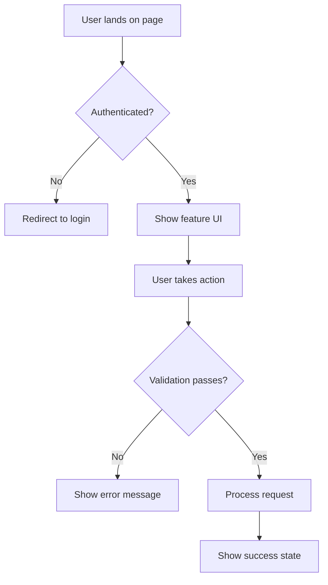

# [Feature Name]

**Status**: 🟡 Draft
**Priority**: P0 (Critical) | P1 (High) | P2 (Medium) | P3 (Low)
**Phase**: Phase 1 | Phase 2 | Phase 3 | Phase 4
**Teams**: Backend, Web, Mobile, AI/MCP, Infrastructure, Blockchain
**Estimated Effort**: X weeks
**Target Release**: YYYY-MM-DD

## Overview

### Problem Statement

**Who** has **what problem** that needs solving?

Example:
> Business owners need a way to create loyalty programs quickly without technical expertise. Currently, they must manually configure complex rules, which takes hours and is error-prone.

### Solution Summary

**How** will we solve this problem?

Example:
> Provide pre-configured industry templates that businesses can customize in under 10 minutes. Templates include best-practice rules, terminology, and reward configurations for 21 industries.

### Success Criteria

How will we know this feature is successful?

- [ ] Metric 1: e.g., 80% of new businesses use templates
- [ ] Metric 2: e.g., <10 minutes from signup to first program launch
- [ ] Metric 3: e.g., >90% satisfaction score for template users

## User Stories

### Primary User Story

**As a** [type of user]
**I want** [an action]
**So that** [a benefit/outcome]

**Acceptance Criteria**:
- [ ] Given [context], when [action], then [expected result]
- [ ] Given [context], when [action], then [expected result]

**Example**:
> **As a** coffee shop owner
> **I want** to create a loyalty program from a template
> **So that** I can launch a program in under 10 minutes without technical knowledge
>
> **Acceptance Criteria**:
> - [ ] Given I'm on the program creation page, when I select "Coffee Shop" template, then I see pre-configured punch card rules
> - [ ] Given I've selected a template, when I customize the reward, then changes are saved immediately
> - [ ] Given I've customized the template, when I click "Activate", then the program goes live within 60 seconds

### Secondary User Stories

List additional user stories for different personas or use cases.

## Requirements

### Functional Requirements

**Must Have (MVP)**:
- [ ] Requirement 1: Specific, measurable capability
- [ ] Requirement 2: Another essential feature
- [ ] Requirement 3: Core functionality

**Should Have (Phase 1)**:
- [ ] Requirement 4: Important but not critical
- [ ] Requirement 5: Enhances usability

**Could Have (Phase 2+)**:
- [ ] Requirement 6: Nice to have
- [ ] Requirement 7: Future enhancement

**Won't Have (Explicitly Out of Scope)**:
- ❌ Feature X: Why it's not included
- ❌ Feature Y: Deferred to Phase N

### Non-Functional Requirements

**Performance**:
- API response time: <200ms (p95)
- Page load time: <2 seconds
- Concurrent users: Support X simultaneous users

**Security**:
- Authentication: JWT required
- Authorization: RBAC with specific roles
- Data encryption: In transit (TLS 1.3) and at rest (AES-256)

**Scalability**:
- Horizontal scaling: Support X,XXX businesses
- Database: Read replicas for high-traffic endpoints
- Caching: Redis for frequently accessed data

**Availability**:
- Uptime SLA: 99.9%
- Degraded mode: Graceful degradation if dependencies fail
- Monitoring: Alerts for critical failures

## User Experience

### User Flow Diagram



### Wireframes / Mockups

Link to Figma, Sketch, or include screenshots:
- [Link to design files]
- [Screenshot 1: Main screen]
- [Screenshot 2: Interaction state]

### UI Copy

**Page Title**: "Create Loyalty Program"
**Primary CTA**: "Create from Template"
**Help Text**: "Choose a pre-configured template for your industry, then customize as needed."

## Technical Design

### Architecture Overview

High-level architecture diagram or description:

```
┌─────────────┐     ┌─────────────┐     ┌─────────────┐
│   Web UI    │────▶│  Backend    │────▶│  Database   │
└─────────────┘     │   API       │     │ (PostgreSQL)│
                    └─────────────┘     └─────────────┘
                           │
                           ▼
                    ┌─────────────┐
                    │ Event Bus   │
                    │  (Redis)    │
                    └─────────────┘
```

### Domain Model

Key entities and their relationships:

```typescript
// Example domain model
interface LoyaltyTemplate {
  id: string;
  name: string;
  industry: BusinessIndustry;
  ruleType: LoyaltyRuleType;
  config: TemplateConfig;
  description: string;
}
```

### Database Schema Changes

**New Tables**:
```sql
CREATE TABLE loyalty_templates (
  id UUID PRIMARY KEY,
  name VARCHAR(255) NOT NULL,
  industry VARCHAR(50) NOT NULL,
  rule_type VARCHAR(50) NOT NULL,
  config JSONB NOT NULL,
  created_at TIMESTAMP DEFAULT NOW()
);
```

**Modified Tables**:
- Table: `loyalty_programs`
  - Add column: `template_id UUID REFERENCES loyalty_templates(id)`

**Indexes**:
```sql
CREATE INDEX idx_templates_industry ON loyalty_templates(industry);
```

### API Endpoints

**See CONTRACTS.md for full OpenAPI specification**

Summary:
- `GET /api/v1/templates` - List templates
- `GET /api/v1/templates/{id}` - Get template details
- `POST /api/v1/programs` - Create program from template

### Domain Events

**See CONTRACTS.md for full AsyncAPI specification**

Summary:
- `templates.template.created` - When template is added
- `programs.program.created` - When program created from template

## Dependencies

### Internal Dependencies

- **Feature X**: Must be completed first
- **Domain Y**: Relies on this bounded context

### External Dependencies

- **Third-party Service**: e.g., Stripe for payments
- **Library**: e.g., Prisma for database access

### Blocked By

- [ ] Issue #123: Database migration must be deployed
- [ ] Feature ABC: User authentication must be complete

### Blocks

- [ ] Issue #456: Cannot implement feature Z until this is done

## Testing Strategy

### Unit Tests

**Backend**:
- Template service methods (CRUD operations)
- Validation logic
- Error handling

**Frontend**:
- Component rendering
- User interactions
- State management

**Coverage Target**: >80%

### Integration Tests

- API endpoint tests (request/response)
- Database interactions
- Event publishing/subscribing

### End-to-End Tests

See `ACCEPTANCE.feature` for Gherkin scenarios.

Example:
- User creates program from template
- User customizes template settings
- User activates program and customers can enroll

### Performance Tests

- Load test: X concurrent users
- Stress test: Y requests per second
- Endurance test: Z hours continuous operation

## Rollout Plan

### Phase 1: Development (Week 1-2)

- Backend implements API endpoints
- Web implements UI components
- Mobile implements screens (if applicable)
- All teams write tests

### Phase 2: Testing (Week 3)

- Unit tests passing (>80% coverage)
- Integration tests passing
- E2E tests passing
- Performance tests passing

### Phase 3: Staging Deployment (Week 4)

- Deploy to staging environment
- QA testing
- Bug fixes
- Documentation review

### Phase 4: Production Rollout (Week 5)

**Gradual Rollout**:
- Day 1: 5% of users (beta testers)
- Day 3: 25% of users
- Day 5: 50% of users
- Day 7: 100% of users

**Rollback Plan**:
- Feature flag: Can disable immediately
- Database rollback: Migration scripts prepared
- Monitoring: Alerts for errors or performance degradation

### Phase 5: Post-Launch (Week 6+)

- Monitor metrics (success criteria)
- Collect user feedback
- Iterate based on data
- Document lessons learned

## Monitoring & Analytics

### Metrics to Track

**Usage Metrics**:
- Number of templates viewed
- Template selection rate
- Customization completion rate
- Time to program activation

**Performance Metrics**:
- API response time (p50, p95, p99)
- Error rate
- Database query performance

**Business Metrics**:
- Conversion rate (signup → active program)
- User satisfaction score
- Support ticket volume

### Dashboards

- [Grafana Dashboard Link]
- [Datadog Dashboard Link]

### Alerts

- Error rate >1%: Page engineering team
- Response time >500ms: Alert on-call engineer
- Database CPU >80%: Alert infrastructure team

## Documentation

### User-Facing Documentation

- [ ] Help article: "How to Create a Loyalty Program from Template"
- [ ] Video tutorial: Template customization walkthrough
- [ ] FAQ: Common questions about templates

### Developer Documentation

- [ ] API documentation: OpenAPI spec updated
- [ ] Code comments: All public methods documented
- [ ] Architecture decision: ADR created if needed
- [ ] Runbook: Operations guide for this feature

## Risks & Mitigation

### Risk 1: [Risk Name]

**Probability**: High | Medium | Low
**Impact**: High | Medium | Low

**Description**: What could go wrong?

**Mitigation**:
- Strategy 1: How to prevent or reduce risk
- Strategy 2: Contingency plan if risk occurs

**Example**:
> **Risk**: Database performance degrades with large number of templates
> **Probability**: Medium
> **Impact**: High
>
> **Mitigation**:
> - Add database indexes on frequently queried columns
> - Implement Redis caching for template list
> - Load test with 10,000+ templates before launch
> - Monitoring alerts for slow queries

### Risk 2: [Risk Name]

[Repeat structure]

## Open Questions

- [ ] Question 1: e.g., Should we allow businesses to create custom templates?
- [ ] Question 2: e.g., How do we handle template versioning?
- [ ] Question 3: e.g., What happens if a template is deleted after programs use it?

**Decision Deadline**: YYYY-MM-DD
**Decision Owner**: [Name/Role]

## Stakeholders

### Accountable

- **Product Owner**: [Name] - Final approval
- **Engineering Lead**: [Name] - Technical approval

### Responsible

- **Backend Lead**: [Name]
- **Frontend Lead**: [Name]
- **Mobile Lead**: [Name]

### Consulted

- **UX Designer**: [Name] - Design review
- **QA Lead**: [Name] - Testing strategy

### Informed

- **Customer Success**: [Name] - Notified of launch
- **Marketing**: [Name] - Announcement coordination

## Timeline

| Milestone | Date | Owner | Status |
|-----------|------|-------|--------|
| Spec approval | YYYY-MM-DD | Product | 🟡 Pending |
| Contract freeze | YYYY-MM-DD | Backend | 🟡 Pending |
| Development complete | YYYY-MM-DD | Engineering | 🟡 Pending |
| Testing complete | YYYY-MM-DD | QA | 🟡 Pending |
| Staging deployment | YYYY-MM-DD | DevOps | 🟡 Pending |
| Production launch | YYYY-MM-DD | Product | 🟡 Pending |

## References

### Related Documents

- [ADR-XXXX: Related architectural decision]
- [Domain Specification: Loyalty System]
- [Integration Guide: Template API]

### External References

- [Industry Research Paper]
- [Competitor Analysis]
- [User Research Findings]

## Change Log

| Date | Version | Changes | Author |
|------|---------|---------|--------|
| YYYY-MM-DD | 1.0.0 | Initial draft | [Name] |
| YYYY-MM-DD | 1.1.0 | Updated after review feedback | [Name] |

---

**Last Updated**: YYYY-MM-DD
**Next Review**: YYYY-MM-DD
**Document Owner**: [Name/Team]
