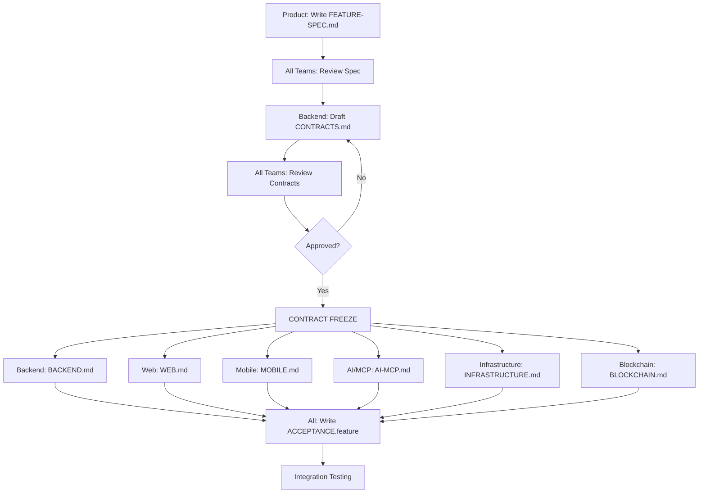

# Feature Template Guide

This directory contains the standard template for documenting features in NxLoy. Every feature should follow this structure to enable parallel development across all teams.

## Template Structure

Each feature should have its own directory under `docs/requirements/features/{feature-name}/` with the following files:

```
features/{feature-name}/
├── FEATURE-SPEC.md          # High-level feature overview
├── CONTRACTS.md             # OpenAPI/AsyncAPI specifications
├── BACKEND.md               # Backend implementation details
├── WEB.md                   # Web frontend implementation
├── MOBILE.md                # Mobile app implementation
├── AI-MCP.md                # AI/MCP integration details
├── BLOCKCHAIN.md            # Blockchain/NFT features (if applicable)
├── INFRASTRUCTURE.md        # Infrastructure and deployment
└── ACCEPTANCE.feature       # Gherkin acceptance criteria
```

## How to Use This Template

### Step 1: Copy Template Directory

```bash
# From the features directory
cp -r _TEMPLATE {your-feature-name}
cd {your-feature-name}
```

### Step 2: Fill Out FEATURE-SPEC.md First

Start with the high-level overview:
- What problem does this solve?
- Who are the users?
- What are the acceptance criteria?
- Which teams are involved?

### Step 3: Define CONTRACTS.md

Before any implementation:
- Define OpenAPI endpoints
- Define AsyncAPI events
- Define database schema changes
- Get approval from ALL teams

### Step 4: Fill Team-Specific Files in Parallel

Once contracts are approved, all teams can work simultaneously:
- Backend team fills BACKEND.md
- Web team fills WEB.md
- Mobile team fills MOBILE.md
- AI/MCP team fills AI-MCP.md
- Infrastructure team fills INFRASTRUCTURE.md
- Blockchain team fills BLOCKCHAIN.md (if applicable)

### Step 5: Write Acceptance Tests

Create ACCEPTANCE.feature with Gherkin scenarios that validate the feature works end-to-end.

## When to Create a New Feature Spec

Create a new feature spec when:
- ✅ Adding a new user-facing capability
- ✅ Building a new API endpoint or domain
- ✅ Implementing a new bounded context
- ✅ Creating a new integration
- ✅ Adding a new business rule type

Don't create a feature spec for:
- ❌ Bug fixes (use issue tracker)
- ❌ Performance improvements (unless architectural change)
- ❌ Refactoring (unless public API changes)
- ❌ Documentation updates
- ❌ Configuration changes

## Template Files Overview

### 1. FEATURE-SPEC.md
- **Purpose**: High-level overview for all stakeholders
- **Audience**: Product, engineering, design, business
- **Content**: Problem, solution, user stories, acceptance criteria

### 2. CONTRACTS.md
- **Purpose**: API and event contracts (single source of truth)
- **Audience**: All engineering teams
- **Content**: OpenAPI paths, AsyncAPI events, database schema

### 3. BACKEND.md
- **Purpose**: Backend implementation details
- **Audience**: Backend team
- **Content**: Services, repositories, domain logic, tests

### 4. WEB.md
- **Purpose**: Web frontend implementation
- **Audience**: Web team
- **Content**: Components, pages, state management, API integration

### 5. MOBILE.md
- **Purpose**: Mobile app implementation
- **Audience**: Mobile team
- **Content**: Screens, navigation, offline support, push notifications

### 6. AI-MCP.md
- **Purpose**: AI/MCP integration
- **Audience**: AI/MCP team
- **Content**: Event subscriptions, ML models, recommendations

### 7. BLOCKCHAIN.md
- **Purpose**: Blockchain/NFT features
- **Audience**: Blockchain team
- **Content**: Smart contracts, wallet integration, token logic

### 8. INFRASTRUCTURE.md
- **Purpose**: Infrastructure and deployment
- **Audience**: Infrastructure team
- **Content**: Database migrations, environment variables, scaling

### 9. ACCEPTANCE.feature
- **Purpose**: Executable acceptance criteria
- **Audience**: All teams, QA
- **Content**: Gherkin scenarios for E2E testing

## Contract-First Workflow



## Example Feature Directory

```
features/loyalty-templates/
├── FEATURE-SPEC.md          # Overview of loyalty template feature
├── CONTRACTS.md             # GET /api/v1/templates, TemplateCreatedEvent
├── BACKEND.md               # TemplateService, TemplateRepository, tests
├── WEB.md                   # TemplateList, TemplateDetail components
├── MOBILE.md                # Template browsing screens
├── AI-MCP.md                # Template recommendations
├── BLOCKCHAIN.md            # N/A (not applicable for this feature)
├── INFRASTRUCTURE.md        # Template seeding, database indexes
└── ACCEPTANCE.feature       # "List templates by industry" scenarios
```

## Cross-References

Each feature spec should link to:
- Related ADRs (`docs/adr/`)
- Domain specifications (`docs/requirements/domain-specs/`)
- Integration guides (`docs/requirements/integration/`)
- OpenAPI contract (`docs/contracts/openapi.yaml`)
- AsyncAPI contract (`docs/contracts/events.asyncapi.yaml`)

## Status Tracking

Each feature file should include a status badge:

```markdown
**Status**: 🟡 Draft | 🟢 Approved | 🔵 In Progress | ✅ Complete
```

- 🟡 **Draft**: Specification being written
- 🟢 **Approved**: Reviewed and approved by all teams
- 🔵 **In Progress**: Implementation started
- ✅ **Complete**: Feature shipped to production

## Review Process

### Initial Review (Before Contract Freeze)
- [ ] Product reviews FEATURE-SPEC.md
- [ ] Backend reviews CONTRACTS.md
- [ ] Web reviews CONTRACTS.md
- [ ] Mobile reviews CONTRACTS.md
- [ ] AI/MCP reviews CONTRACTS.md
- [ ] Infrastructure reviews CONTRACTS.md
- [ ] All stakeholders approve

### Implementation Review (During Development)
- [ ] Backend completes BACKEND.md
- [ ] Web completes WEB.md
- [ ] Mobile completes MOBILE.md
- [ ] AI/MCP completes AI-MCP.md
- [ ] Infrastructure completes INFRASTRUCTURE.md
- [ ] All teams write ACCEPTANCE.feature scenarios

### Final Review (Before Release)
- [ ] All acceptance tests passing
- [ ] Integration tests passing
- [ ] Documentation complete
- [ ] Stakeholder sign-off

## Tips for Success

### DO:
- ✅ Start with FEATURE-SPEC.md (shared understanding)
- ✅ Define CONTRACTS.md before any code
- ✅ Get all teams to review contracts
- ✅ Freeze contracts before implementation
- ✅ Update docs as implementation progresses
- ✅ Write acceptance tests early

### DON'T:
- ❌ Start coding before contracts are approved
- ❌ Change contracts mid-implementation (without re-approval)
- ❌ Skip team-specific files (breaks parallel development)
- ❌ Write docs after the fact (won't be accurate)
- ❌ Ignore acceptance criteria

## Questions?

- Review existing features in `docs/requirements/features/`
- Check ADR-0002: Contract-First Development
- Consult `docs/contracts/README.md`
- Ask in #docs-questions Slack channel

---

**Remember**: The goal is to enable all 7 teams to work in parallel without blocking each other. Good documentation makes this possible!
