# AI-Powered Personalization - Feature Specification

**Feature**: AI-Powered Personalization
**Version**: 1.0.0
**Status**: 🟡 Phase 5 Feature (Months 13-18)
**Priority**: P1 (Critical for competitive differentiation)
**Last Updated**: 2025-11-07

---

## Problem Statement

**Current Challenge**: Traditional loyalty programs offer generic rewards and one-size-fits-all experiences. This results in:
- Low engagement rates (~15-20% active usage)
- Poor redemption rates (~10-15% of earned rewards redeemed)
- High customer churn (30-40% annual churn rate)
- Inefficient marketing spend (70% of offers ignored)
- No predictive capabilities for customer behavior
- Manual segmentation that's outdated within weeks

**Business Impact**:
- $1M+ in unredeemed rewards liability (cost to business)
- Lost revenue from churned customers ($500K+ annually)
- Wasted marketing budget on irrelevant offers
- Poor customer experience leading to negative brand perception

**Why This Matters**:
Starbucks increased redemption rates by 3x after implementing AI-powered personalization. Sephora's Beauty Insider program uses ML to drive 80% of transactions from loyalty members. Modern customers expect Netflix-level personalization across all digital experiences.

---

## Solution Summary

Build an AI-powered personalization engine that delivers:

1. **Hyper-Personalized Recommendations**: ML models predict which rewards each customer is most likely to redeem
2. **Churn Prediction & Prevention**: Identify at-risk customers 30-60 days before they churn and trigger retention campaigns
3. **Dynamic Pricing**: Optimize reward costs based on customer value, inventory, and predicted conversion
4. **Smart Segmentation**: Auto-generate behavioral segments that update in real-time
5. **Natural Language Insights**: Ask questions like "Which customers will churn next month?" and get instant answers
6. **Image Recognition**: Identify products in customer photos for instant rewards
7. **Predictive Customer Lifetime Value**: Score customers by predicted future value, not just past spend

**Technology Stack**:
- ML Models: TensorFlow, PyTorch, scikit-learn
- Feature Store: Feast, Tecton
- Model Serving: TensorFlow Serving, MLflow
- Vector Database: Pinecone, Weaviate (for embeddings)
- Real-Time Processing: Apache Kafka, Flink
- Experiment Platform: Optimizely, LaunchDarkly
- Monitoring: Grafana, Prometheus, Weights & Biases

---

## Success Criteria

| Metric | Current Baseline | Target (6 months) | Measurement |
|--------|------------------|-------------------|-------------|
| Engagement Rate | 15-20% | 40%+ | DAU/MAU ratio |
| Redemption Rate | 10-15% | 35%+ | Redeemed rewards / Earned rewards |
| Churn Rate | 30-40% annually | <20% annually | Customers inactive for 90+ days |
| Recommendation CTR | N/A | 25%+ | Clicks on AI recommendations / Total impressions |
| Prediction Accuracy | N/A | 85%+ | Churn model AUC-ROC score |
| Recommendation Latency | N/A | <100ms | P95 latency for model inference |
| Model Training Time | N/A | <4 hours | Time to retrain all models |
| A/B Test Velocity | N/A | 10+ tests/month | Number of concurrent experiments |

---

## User Stories

### Business Owner

**Story 1: Predictive Churn Prevention**
```
As a business owner,
I want to identify customers at risk of churning 30-60 days before they leave,
So that I can proactively send retention offers and reduce churn by 50%.

Acceptance Criteria:
- Churn model predicts 60-day churn probability with 85%+ accuracy
- Dashboard shows "At-Risk Customers" segment with predicted churn date
- Automated campaigns trigger for customers with >70% churn probability
- Track retention rate for at-risk customers who received interventions
```

**Story 2: Revenue-Maximizing Recommendations**
```
As a business owner,
I want to recommend rewards that maximize customer lifetime value,
So that I can increase revenue per customer by 30% while reducing reward costs.

Acceptance Criteria:
- Recommendation engine optimizes for CLV, not just engagement
- A/B test shows AI recommendations drive 20%+ higher revenue vs. generic offers
- Reward cost per conversion decreases by 15%+ (better targeting)
- Dashboard shows revenue impact of AI recommendations vs. control group
```

### Customer

**Story 3: Personalized Reward Discovery**
```
As a frequent customer,
I want to see rewards tailored to my preferences,
So that I don't waste time browsing irrelevant offers and redeem rewards 3x more often.

Acceptance Criteria:
- Homepage shows 5+ personalized reward recommendations
- Recommendations update daily based on recent behavior
- "Why this reward?" explanations show personalization factors
- "Not interested" feedback improves future recommendations
- Recommendation relevance score >80% (user survey)
```

**Story 4: Surprise & Delight Moments**
```
As a loyal customer,
I want the app to surprise me with rewards at perfect moments (birthday, after bad experience),
So that I feel valued and emotionally connected to the brand.

Acceptance Criteria:
- AI detects "moments that matter" (birthday, anniversary, negative sentiment)
- Automated "surprise rewards" sent within 1 hour of detected moment
- Personalized reward type based on customer preferences
- 90%+ positive sentiment in customer feedback surveys
```

### Data Scientist / Product Manager

**Story 5: Self-Service ML Experimentation**
```
As a data scientist,
I want to deploy new ML models to production without engineering bottlenecks,
So that I can iterate on models weekly and continuously improve personalization.

Acceptance Criteria:
- Model registry with versioning and metadata
- CI/CD pipeline auto-deploys models passing validation tests
- A/B testing framework for model variants (80/20 traffic split)
- Model monitoring dashboard (accuracy, latency, drift detection)
- Rollback capability within 5 minutes if model degrades
```

**Story 6: Natural Language Analytics**
```
As a product manager,
I want to ask questions in plain English like "Which customers will churn next month?",
So that I can get instant insights without writing SQL or waiting for data team.

Acceptance Criteria:
- NLP interface accepts natural language queries
- Responds within 3 seconds with data + visualizations
- Supports 20+ common questions (churn, CLV, segment analysis)
- Export results to CSV or integrate with BI tools
- Query accuracy >90% compared to manual SQL queries
```

---

## Functional Requirements

### Must Have (Phase 5.1: Months 13-15)

#### FR1: Personalized Recommendation Engine
**Description**: ML model that predicts top 5-10 rewards for each customer

**Features**:
- Collaborative filtering (customers who liked X also liked Y)
- Content-based filtering (match reward attributes to customer preferences)
- Hybrid ensemble model combining multiple algorithms
- Real-time feature computation (<100ms)
- Explainability (show why reward was recommended)

**Input Features**:
```typescript
interface CustomerFeatures {
  // Demographics
  ageGroup: string;
  location: string;
  membershipTier: string;

  // Behavioral
  totalPurchases: number;
  averageOrderValue: number;
  purchaseFrequency: number; // purchases per month
  daysSinceLastPurchase: number;
  favoriteCategories: string[]; // top 3 categories
  averageSessionDuration: number; // seconds

  // Engagement
  emailOpenRate: number;
  pushNotificationClickRate: number;
  appOpenFrequency: number; // times per week

  // Rewards
  totalRewardsEarned: number;
  totalRewardsRedeemed: number;
  redemptionRate: number;
  preferredRewardTypes: string[]; // discount, free_item, experience

  // Temporal
  dayOfWeek: string;
  timeOfDay: string;
  seasonality: string; // holiday_season, back_to_school, etc.
}
```

**API Endpoint**:
```typescript
POST /api/v1/ml/recommendations
{
  "customerId": "cust-123",
  "context": {
    "page": "homepage",
    "timeOfDay": "morning",
    "location": "San Francisco, CA"
  },
  "numRecommendations": 5
}

Response:
{
  "recommendations": [
    {
      "rewardId": "reward-456",
      "name": "Free Latte",
      "score": 0.89, // predicted redemption probability
      "explanation": "You redeem coffee rewards 3x more than other customers",
      "reasoning": ["high_affinity_category", "time_of_day_match", "similar_users_liked"]
    },
    // ... 4 more
  ],
  "modelVersion": "v2.3.1",
  "latency": 87 // ms
}
```

---

#### FR2: Churn Prediction Model
**Description**: Predict which customers will churn in next 30, 60, 90 days

**Features**:
- Binary classification model (churn vs. no churn)
- Churn probability score (0-100%)
- Churn risk segments (low, medium, high, critical)
- Predicted churn date
- Top 5 churn factors per customer (feature importance)

**Model Training**:
```python
# Churn Definition
churned_customer = {
  "days_since_last_purchase": 90,
  "days_since_last_app_open": 60,
  "unsubscribed_from_email": True
}

# Features
features = [
  "recency", # days since last purchase
  "frequency", # purchases in last 90 days
  "monetary", # total spend in last 90 days
  "engagement_score", # app opens + email clicks
  "redemption_rate",
  "customer_lifetime_value",
  "tenure_days",
  "negative_feedback_count"
]

# Model: Gradient Boosting (XGBoost)
model = XGBClassifier(
  n_estimators=200,
  max_depth=6,
  learning_rate=0.1
)

# Evaluation
auc_roc = 0.87 # target: 0.85+
precision = 0.82
recall = 0.79
```

**API Endpoint**:
```typescript
GET /api/v1/ml/churn/predict?customerId=cust-123

Response:
{
  "customerId": "cust-123",
  "churnProbability": 0.73, // 73% chance of churning
  "riskLevel": "HIGH",
  "predictedChurnDate": "2026-01-15",
  "daysUntilChurn": 45,
  "topFactors": [
    { "factor": "recency", "impact": 0.31, "description": "35 days since last purchase (avg: 15 days)" },
    { "factor": "engagement", "impact": 0.24, "description": "No app opens in 21 days" },
    { "factor": "redemption_rate", "impact": 0.18, "description": "Only 5% redemption (avg: 25%)" }
  ],
  "recommendedActions": [
    "Send personalized re-engagement offer",
    "Offer bonus points for next purchase",
    "Request feedback via survey"
  ]
}
```

**Dashboard**:
```
🚨 At-Risk Customers (High Churn Probability)

Filters: Risk Level [All ▼] | Days Until Churn [<60 ▼] | Segment [All ▼]

Total At-Risk: 1,247 customers ($234K in CLV at risk)

┌────────────────────────────────────────────────────────────┐
│ Customer         | Churn Prob | Days Until | CLV    | Action│
├────────────────────────────────────────────────────────────┤
│ Alice Johnson    | 87%        | 23 days    | $450   | [Send]│
│ Bob Smith        | 81%        | 31 days    | $380   | [Send]│
│ Carol Martinez   | 76%        | 45 days    | $520   | [Send]│
│ ...              |            |            |        |       │
└────────────────────────────────────────────────────────────┘

[Send Retention Campaign to All] [Export CSV]
```

---

#### FR3: Dynamic Pricing & Offer Optimization
**Description**: Automatically adjust reward costs to maximize ROI

**Features**:
- Price elasticity model (how reward cost affects redemption rate)
- Customer-specific pricing (high-value customers get better deals)
- Inventory-aware pricing (discount surplus items)
- Multi-armed bandit algorithm (explore/exploit trade-off)

**Pricing Strategy**:
```typescript
interface DynamicPricing {
  rewardId: string;
  basePrice: number; // default point cost

  // Personalized pricing
  customerSegment: string;
  customerCLV: number;
  churnRisk: number;
  priceMultiplier: number; // 0.7 - 1.3

  // Inventory optimization
  inventoryLevel: number; // 0-100%
  expirationDate?: Date;
  inventoryMultiplier: number; // 0.5 - 1.0

  // Final price
  dynamicPrice: number; // basePrice * customerMultiplier * inventoryMultiplier
  discount: number; // % off base price
}
```

**Example**:
```typescript
// Base reward: Free Coffee (500 points)

// Customer A (high CLV, low churn risk)
dynamicPrice = 500 * 1.0 * 1.0 = 500 points (no change)

// Customer B (low CLV, high churn risk)
dynamicPrice = 500 * 0.7 * 1.0 = 350 points (30% discount to retain)

// Customer C (medium CLV, surplus inventory)
dynamicPrice = 500 * 1.0 * 0.6 = 300 points (40% discount to move inventory)
```

**API Endpoint**:
```typescript
POST /api/v1/ml/pricing/optimize
{
  "rewardId": "reward-123",
  "customerId": "cust-456",
  "context": {
    "inventoryLevel": 0.85, // 85% stock remaining
    "expirationDate": "2025-12-31",
    "competitorPricing": 450 // competitor offers similar reward for 450 points
  }
}

Response:
{
  "basePrice": 500,
  "dynamicPrice": 375,
  "discount": 25, // %
  "reasoning": [
    "Customer has 73% churn risk (applied 0.8x multiplier)",
    "Inventory at 85% with 60 days to expiration (applied 0.9x multiplier)"
  ],
  "expectedROI": 2.3, // $2.30 revenue per $1 reward cost
  "conversionProbability": 0.68
}
```

---

#### FR4: Smart Customer Segmentation
**Description**: Auto-generate behavioral segments using clustering algorithms

**Features**:
- Unsupervised learning (K-means, DBSCAN, hierarchical clustering)
- 10-20 segments auto-discovered from customer data
- Segment profiles with key characteristics
- Real-time segment assignment (customers move between segments)
- Segment performance tracking (CLV, churn rate, engagement)

**Segment Examples**:
```typescript
interface CustomerSegment {
  id: string;
  name: string;
  description: string;
  size: number; // number of customers
  characteristics: {
    averageCLV: number;
    averageFrequency: number;
    churnRate: number;
    redemptionRate: number;
  };
  topFeatures: string[]; // features that define this segment
}

// Example Segments
const segments = [
  {
    id: "seg-1",
    name: "High-Value Loyalists",
    description: "Frequent purchasers with high spend and low churn risk",
    size: 3247,
    characteristics: {
      averageCLV: 850,
      averageFrequency: 12, // purchases/month
      churnRate: 0.05,
      redemptionRate: 0.45
    },
    topFeatures: ["high_frequency", "high_spend", "high_engagement"]
  },
  {
    id: "seg-2",
    name: "At-Risk Champions",
    description: "Previously high-value customers showing decline in engagement",
    size: 892,
    characteristics: {
      averageCLV: 620,
      averageFrequency: 2, // down from 10+
      churnRate: 0.68,
      redemptionRate: 0.12
    },
    topFeatures: ["declining_frequency", "high_recency", "low_engagement"]
  },
  {
    id: "seg-3",
    name: "Bargain Hunters",
    description: "Only engage during promotions, low organic spend",
    size: 5431,
    characteristics: {
      averageCLV: 180,
      averageFrequency: 1.5,
      churnRate: 0.42,
      redemptionRate: 0.78 // high redemption during sales
    },
    topFeatures: ["promo_driven", "low_frequency", "high_redemption"]
  }
];
```

**API Endpoint**:
```typescript
GET /api/v1/ml/segments

Response:
{
  "segments": [...], // array of 15 segments
  "lastUpdated": "2025-11-07T12:00:00Z",
  "modelVersion": "v1.2.0"
}

GET /api/v1/ml/segments/assign?customerId=cust-123

Response:
{
  "customerId": "cust-123",
  "primarySegment": "seg-2", // At-Risk Champions
  "segmentName": "At-Risk Champions",
  "confidence": 0.87,
  "secondarySegments": ["seg-5", "seg-8"], // customer exhibits traits of multiple segments
  "assignedAt": "2025-11-07T14:30:00Z"
}
```

---

### Should Have (Phase 5.2: Months 16-17)

#### FR5: Natural Language Query Interface
**Description**: Ask questions in plain English and get instant AI-powered answers

**Features**:
- NLP model converts natural language → SQL/analytics query
- Supports 50+ common business questions
- Auto-generates visualizations (charts, tables)
- Export results to CSV, PDF, or BI tools
- Query history and saved queries

**Supported Questions**:
```typescript
const supportedQueries = [
  // Churn
  "Which customers will churn next month?",
  "Why is customer X at risk of churning?",
  "What's the churn rate for segment Y?",

  // CLV
  "Who are my top 100 customers by lifetime value?",
  "What's the average CLV for new customers?",
  "Which segment has the highest CLV?",

  // Engagement
  "Which rewards have the highest redemption rate?",
  "How many customers opened the app this week?",
  "What's the click-through rate for email campaign Z?",

  // Recommendations
  "What should I recommend to customer X?",
  "Which customers are most likely to redeem reward Y?",
  "Show me customers similar to customer X",

  // Trends
  "How has engagement changed over the last 3 months?",
  "Which day of the week has the most purchases?",
  "What's the trend in churn rate over time?"
];
```

**API Endpoint**:
```typescript
POST /api/v1/ml/query
{
  "query": "Which customers will churn next month?",
  "businessId": "biz-123"
}

Response:
{
  "query": "Which customers will churn next month?",
  "interpretation": "Churn prediction query for 30-day window",
  "results": {
    "totalCustomers": 1247,
    "data": [
      { "customerId": "cust-456", "name": "Alice Johnson", "churnProbability": 0.87, "predictedDate": "2025-12-05" },
      // ... more rows
    ],
    "visualization": {
      "type": "table",
      "columns": ["Customer", "Churn Probability", "Predicted Date", "Action"]
    }
  },
  "exportOptions": ["CSV", "PDF", "Google Sheets"],
  "relatedQueries": [
    "Why is Alice Johnson at risk?",
    "What's the churn rate trend over time?",
    "Show me retention campaign performance"
  ]
}
```

**UI Mockup**:
```
┌─────────────────────────────────────────────────────────────┐
│ 🤖 AI Insights                                    [Export ▼]│
├─────────────────────────────────────────────────────────────┤
│ Ask a question about your customers...                      │
│ ┌─────────────────────────────────────────────────────────┐ │
│ │ Which customers will churn next month?              [→] │ │
│ └─────────────────────────────────────────────────────────┘ │
│                                                             │
│ 💡 AI Answer:                                               │
│ "1,247 customers have >50% probability of churning in the   │
│  next 30 days, representing $234K in at-risk CLV."          │
│                                                             │
│ 📊 Results:                                                 │
│ ┌────────────────────────────────────────────────────────┐  │
│ │ Customer         | Churn Prob | Days Until | CLV      │  │
│ ├────────────────────────────────────────────────────────┤  │
│ │ Alice Johnson    | 87%        | 23         | $450     │  │
│ │ Bob Smith        | 81%        | 31         | $380     │  │
│ │ ...              |            |            |          │  │
│ └────────────────────────────────────────────────────────┘  │
│                                                             │
│ 🎯 Recommended Actions:                                     │
│ • Send retention campaign to high-risk customers            │
│ • Offer personalized discounts to top 100 at-risk          │
│ • Schedule follow-up query in 7 days to track progress     │
│                                                             │
│ [Send Retention Campaign] [Export to CSV]                  │
└─────────────────────────────────────────────────────────────┘
```

---

#### FR6: Image Recognition for Rewards
**Description**: Customers upload photos of products → AI identifies them → instant rewards

**Features**:
- Computer vision model (ResNet, EfficientNet, or custom CNN)
- Product detection in customer photos
- Brand/logo recognition
- Receipt scanning and OCR
- Auto-reward on verified product purchase

**Use Cases**:
1. **Proof of Purchase**: Customer buys coffee at partner location → uploads receipt photo → AI verifies → credits points
2. **Product Engagement**: Customer posts Instagram photo with product → AI detects brand → rewards social engagement
3. **Gamification**: Scavenger hunt challenges ("Find and photograph 5 products this week")

**API Endpoint**:
```typescript
POST /api/v1/ml/image-recognition
Content-Type: multipart/form-data

{
  "image": [binary image data],
  "context": {
    "challengeId": "challenge-123", // optional: scavenger hunt
    "expectedProduct": "coffee_cup" // optional: validate specific product
  }
}

Response:
{
  "detectedObjects": [
    {
      "object": "coffee_cup",
      "brand": "Starbucks",
      "confidence": 0.94,
      "boundingBox": { "x": 120, "y": 340, "width": 200, "height": 280 }
    }
  ],
  "isReceiptDetected": false,
  "rewardEligible": true,
  "reward": {
    "rewardId": "reward-789",
    "name": "Social Engagement Bonus",
    "points": 50,
    "reason": "Detected coffee cup in uploaded photo"
  }
}
```

---

#### FR7: Predictive Customer Lifetime Value (pCLV)
**Description**: Predict future customer value over next 12-24 months

**Features**:
- Regression model predicting future spend
- Time-series forecasting (ARIMA, Prophet)
- pCLV score (0-1000+)
- pCLV segments (low, medium, high, very high)
- Investment recommendations (how much to spend acquiring/retaining customer)

**Model**:
```python
# Predicted CLV = Sum of predicted purchases over next 12 months
pCLV = sum([
  predicted_purchase_probability(month) * predicted_order_value(month)
  for month in range(1, 13)
])

# Features
features = [
  "historical_spend",
  "purchase_frequency",
  "average_order_value",
  "tenure_months",
  "engagement_score",
  "redemption_rate",
  "churn_probability"
]

# Model: Gradient Boosting Regressor
model = XGBRegressor(n_estimators=200, max_depth=6)
```

**API Endpoint**:
```typescript
GET /api/v1/ml/clv/predict?customerId=cust-123

Response:
{
  "customerId": "cust-123",
  "historicalCLV": 450, // past spend
  "predictedCLV": 620, // predicted next 12 months
  "totalCLV": 1070, // historical + predicted
  "clvSegment": "HIGH",
  "monthlyBreakdown": [
    { "month": "2025-12", "predictedSpend": 52, "probability": 0.87 },
    { "month": "2026-01", "predictedSpend": 48, "probability": 0.84 },
    // ... 10 more months
  ],
  "recommendations": {
    "maxAcquisitionCost": 214, // 20% of pCLV
    "maxRetentionSpend": 62, // 10% of pCLV
    "recommendedActions": [
      "Invest in retention (high pCLV)",
      "Offer premium membership tier",
      "Prioritize for VIP support"
    ]
  }
}
```

---

### Could Have (Phase 5.3: Month 18+)

#### FR8: Sentiment Analysis & Emotion Detection
**Description**: Analyze customer feedback (reviews, support tickets) to detect sentiment

**Features**:
- NLP sentiment classification (positive, neutral, negative)
- Emotion detection (happy, frustrated, angry, confused)
- Topic extraction (what are customers talking about?)
- Automated response routing (escalate negative sentiment)
- Sentiment-triggered rewards ("Sorry for the bad experience, here's 500 points")

#### FR9: Next Best Action Engine
**Description**: Recommend the best action to take for each customer (not just rewards)

**Actions**:
- Send email campaign
- Push notification
- SMS offer
- Personal outreach from support
- Upgrade to premium tier
- Request review/feedback
- Social media engagement

#### FR10: Multi-Touch Attribution
**Description**: Track which touchpoints (email, app, social, in-store) drive conversions

**Features**:
- Attribution model (first-touch, last-touch, linear, time-decay, data-driven)
- Channel performance tracking
- Campaign ROI analysis
- Customer journey visualization

---

## Non-Functional Requirements

### Performance

**NFR1: Model Inference Latency**
- P50 latency: <50ms
- P95 latency: <100ms
- P99 latency: <200ms
- Recommendation endpoint SLA: 99.9% uptime

**NFR2: Model Training Time**
- Churn model: <2 hours (daily retraining)
- Recommendation model: <4 hours (weekly retraining)
- Segmentation model: <6 hours (monthly retraining)

**NFR3: Real-Time Feature Computation**
- Feature store latency: <10ms
- Feature freshness: <5 minutes (near real-time)
- Handle 10,000+ feature requests per second

### Scalability

**NFR4: Multi-Tenancy**
- Separate models per business (model isolation)
- Shared infrastructure for small businesses (<10K customers)
- Dedicated model serving for enterprise (>100K customers)

**NFR5: Data Volume**
- Support 10M+ customers per business
- Process 1B+ events per day
- Store 2 years of historical data for training

### Security & Privacy

**NFR6: Data Privacy Compliance**
- GDPR compliant (right to erasure, data portability)
- CCPA compliant (opt-out of data sale)
- Anonymize PII in training data
- Customer consent for data usage in ML models

**NFR7: Model Explainability**
- SHAP values for feature importance
- "Why this recommendation?" explanations for customers
- Bias detection and mitigation (fairness metrics)

**NFR8: Data Encryption**
- Encrypt customer data at rest (AES-256)
- Encrypt data in transit (TLS 1.3)
- Secure model storage (signed model artifacts)

### Monitoring & Observability

**NFR9: Model Performance Monitoring**
- Track accuracy, precision, recall, AUC-ROC daily
- Alert on model degradation (>5% drop in accuracy)
- Data drift detection (feature distribution changes)
- Prediction distribution monitoring (output drift)

**NFR10: Business Metrics Tracking**
- Engagement rate (before/after AI personalization)
- Redemption rate uplift
- Churn rate reduction
- Revenue per customer increase
- A/B test results dashboard

---

## User Flows

### Flow 1: Personalized Homepage Experience


### Flow 2: Churn Prevention Campaign


### Flow 3: Dynamic Pricing for Reward


### Flow 4: Image Recognition Challenge

```mermaid
sequenceDiagram
    participant C as Customer
    participant App as Mobile App
    participant API as Backend API
    participant ML as ML Service
    participant Storage as Cloud Storage

    C->>App: Accepts "Coffee Photo Challenge"
    Note over C: "Upload a photo of your coffee"
    C->>App: Takes photo with camera
    App->>Storage: Upload image
    Storage-->>App: Image URL
    App->>API: POST /ml/image-recognition
    API->>ML: Analyze image
    ML->>ML: Run computer vision model
    Note over ML: Detected: Coffee cup (94% confidence)
    Note over ML: Brand: Starbucks
    ML-->>API: Detection results
    API->>API: Validate challenge completion
    API->>API: Award 50 bonus points
    API-->>App: Challenge completed!
    App-->>C: 🎉 "Challenge complete! +50 points"
    Note over C: Immediate reward feedback
```



---

## Wireframes

### Wireframe 1: Personalized Homepage ("For You" Section)

```
┌─────────────────────────────────────────────────────────┐
│  ☰  Coffee Rewards                    🔔 👤             │
├─────────────────────────────────────────────────────────┤
│                                                         │
│  👋 Good morning, Alice!                                │
│  You have 1,250 points                                  │
│                                                         │
│  ⭐ For You                                             │
│  Personalized rewards based on your preferences         │
│                                                         │
│  ┌───────────────────────────────────────────────────┐ │
│  │  ☕ Free Latte                                     │ │
│  │  350 points (30% off!)                             │ │
│  │                                                    │ │
│  │  💡 Why this reward?                               │ │
│  │  You redeem coffee rewards 3x more often           │ │
│  │                                                    │ │
│  │  [Redeem Now]                    [Not Interested] │ │
│  └───────────────────────────────────────────────────┘ │
│                                                         │
│  ┌───────────────────────────────────────────────────┐ │
│  │  🍪 Free Cookie                                    │ │
│  │  200 points                                        │ │
│  │                                                    │ │
│  │  💡 Perfect for your afternoon snack!              │ │
│  │  You usually visit around 3pm                      │ │
│  │                                                    │ │
│  │  [Redeem Now]                    [Not Interested] │ │
│  └───────────────────────────────────────────────────┘ │
│                                                         │
│  [See More Recommendations]                             │
│                                                         │
│  🔥 Popular Rewards                                     │
│  Trending with customers like you                       │
│  [View All →]                                           │
│                                                         │
└─────────────────────────────────────────────────────────┘
```

### Wireframe 2: Business Dashboard - At-Risk Customers

```
┌─────────────────────────────────────────────────────────────┐
│ NxLoy Dashboard - Coffee Rewards                      [User]│
├─────────────────────────────────────────────────────────────┤
│ [Overview] [Customers] [Rewards] [Campaigns] [AI Insights]  │
├─────────────────────────────────────────────────────────────┤
│                                                             │
│  🤖 AI Insights > Churn Prevention                          │
│                                                             │
│  🚨 At-Risk Customers                                       │
│  1,247 customers with >50% churn probability                │
│  $234K in total CLV at risk                                 │
│                                                             │
│  Filters:                                                   │
│  Risk Level: [High ▼]  Days Until: [<60 ▼]  Segment: [All] │
│                                                             │
│  ┌──────────────────────────────────────────────────────┐   │
│  │ Risk Distribution                                    │   │
│  │ ████████████ 342 Critical (80-100%)                  │   │
│  │ ██████████ 458 High (60-80%)                         │   │
│  │ ██████ 447 Medium (40-60%)                           │   │
│  └──────────────────────────────────────────────────────┘   │
│                                                             │
│  Top At-Risk Customers:                                     │
│  ┌────────────────────────────────────────────────────────┐ │
│  │ Customer        │Churn│Days│CLV  │Top Factor  │Action │ │
│  ├────────────────────────────────────────────────────────┤ │
│  │ Alice Johnson   │ 87% │ 23 │$450 │Recency ↑   │[Send]│ │
│  │ Bob Smith       │ 81% │ 31 │$380 │Engagement ↓│[Send]│ │
│  │ Carol Martinez  │ 76% │ 45 │$520 │Redemption ↓│[Send]│ │
│  │ ...             │     │    │     │            │      │ │
│  └────────────────────────────────────────────────────────┘ │
│                                                             │
│  [Send Retention Campaign to All] [Export CSV] [Schedule]  │
│                                                             │
│  📊 Campaign Performance                                    │
│  Last retention campaign (Oct 15):                          │
│  • Sent to 892 at-risk customers                            │
│  • 234 converted (26% success rate)                         │
│  • $47K in CLV saved                                        │
│  • ROI: 8.3x                                                │
│                                                             │
└─────────────────────────────────────────────────────────────┘
```

### Wireframe 3: AI Query Interface

```
┌─────────────────────────────────────────────────────────────┐
│ 🤖 AI Insights - Natural Language Query                     │
├─────────────────────────────────────────────────────────────┤
│                                                             │
│ Ask a question about your customers...                      │
│ ┌─────────────────────────────────────────────────────────┐ │
│ │ Which customers will churn next month?              [→] │ │
│ └─────────────────────────────────────────────────────────┘ │
│                                                             │
│ 💡 Suggestions:                                             │
│ • What's the churn rate trend over the last 3 months?       │
│ • Who are my top 100 customers by lifetime value?           │
│ • Which rewards have the highest redemption rate?           │
│ • Show me customers similar to Alice Johnson                │
│                                                             │
├─────────────────────────────────────────────────────────────┤
│                                                             │
│ 🎯 AI Answer:                                               │
│ "1,247 customers have >50% probability of churning in the   │
│  next 30 days, representing $234K in at-risk CLV. The top   │
│  churn factors are decreased purchase frequency and low     │
│  engagement with recent campaigns."                         │
│                                                             │
│ 📊 Results (1,247 customers):                               │
│ ┌────────────────────────────────────────────────────────┐  │
│ │ Customer         │ Churn Prob │ Days Until │ CLV      │  │
│ ├────────────────────────────────────────────────────────┤  │
│ │ Alice Johnson    │ 87%        │ 23         │ $450     │  │
│ │ Bob Smith        │ 81%        │ 31         │ $380     │  │
│ │ Carol Martinez   │ 76%        │ 45         │ $520     │  │
│ │ ...              │            │            │          │  │
│ │                                           [Load More] │  │
│ └────────────────────────────────────────────────────────┘  │
│                                                             │
│ 📈 Visualization:                                           │
│ ┌────────────────────────────────────────────────────────┐  │
│ │ Churn Probability Distribution                         │  │
│ │                                                        │  │
│ │  500 │     ██                                          │  │
│ │  400 │   ████                                          │  │
│ │  300 │ ██████                                          │  │
│ │  200 │████████                                         │  │
│ │  100 │██████████                                       │  │
│ │    0 └─────────────────────────                       │  │
│ │       50-60 60-70 70-80 80-90 90-100 (%)              │  │
│ └────────────────────────────────────────────────────────┘  │
│                                                             │
│ 🎯 Recommended Actions:                                     │
│ • Send retention campaign to 342 critical-risk customers    │
│ • Offer personalized discounts (avg 25% off)                │
│ • Schedule follow-up in 7 days to measure impact            │
│                                                             │
│ [Send Campaign] [Export CSV] [Save Query] [Ask Follow-Up]  │
│                                                             │
└─────────────────────────────────────────────────────────────┘
```

---

## Technical Design

### Architecture Overview

```
┌─────────────────────────────────────────────────────────────┐
│                     NxLoy Platform                          │
├─────────────────────────────────────────────────────────────┤
│                                                             │
│  ┌────────────┐    ┌────────────┐    ┌────────────┐       │
│  │  Mobile    │    │    Web     │    │  Business  │       │
│  │    App     │    │    App     │    │  Dashboard │       │
│  └──────┬─────┘    └──────┬─────┘    └──────┬─────┘       │
│         │                 │                 │              │
│         └─────────────────┴─────────────────┘              │
│                           │                                │
│              ┌────────────▼────────────┐                   │
│              │     API Gateway          │                   │
│              │   (NestJS Backend)       │                   │
│              └────────────┬────────────┘                   │
│                           │                                │
│         ┌─────────────────┼─────────────────┐              │
│         │                 │                 │              │
│  ┌──────▼──────┐   ┌──────▼──────┐   ┌──────▼──────┐     │
│  │  Customer   │   │   Loyalty   │   │  Rewards    │     │
│  │  Service    │   │  Service    │   │  Service    │     │
│  └──────┬──────┘   └──────┬──────┘   └──────┬──────┘     │
│         │                 │                 │              │
│         └─────────────────┴─────────────────┘              │
│                           │                                │
│              ┌────────────▼────────────┐                   │
│              │   AI/ML Platform        │                   │
│              └─────────────────────────┘                   │
│                                                             │
└─────────────────────────────────────────────────────────────┘

┌─────────────────────────────────────────────────────────────┐
│                   AI/ML Platform (Detailed)                 │
├─────────────────────────────────────────────────────────────┤
│                                                             │
│  ┌────────────────────────────────────────────────────┐    │
│  │            ML Service (Python/FastAPI)              │    │
│  │                                                     │    │
│  │  ┌──────────────┐  ┌──────────────┐  ┌──────────┐ │    │
│  │  │ Recommend    │  │    Churn     │  │ Dynamic  │ │    │
│  │  │   Engine     │  │  Prediction  │  │ Pricing  │ │    │
│  │  └──────────────┘  └──────────────┘  └──────────┘ │    │
│  │                                                     │    │
│  │  ┌──────────────┐  ┌──────────────┐  ┌──────────┐ │    │
│  │  │ Segmentation │  │     NLP      │  │  Image   │ │    │
│  │  │              │  │    Query     │  │   Recog  │ │    │
│  │  └──────────────┘  └──────────────┘  └──────────┘ │    │
│  └────────────┬───────────────────────────────────────┘    │
│               │                                             │
│  ┌────────────▼───────────────────────────────────────┐    │
│  │         Model Serving (TF Serving / MLflow)        │    │
│  │  • Model versioning                                 │    │
│  │  • A/B testing                                      │    │
│  │  • Canary deployments                               │    │
│  └────────────┬───────────────────────────────────────┘    │
│               │                                             │
│  ┌────────────▼───────────────────────────────────────┐    │
│  │           Feature Store (Feast / Tecton)           │    │
│  │  • Real-time features (<10ms)                       │    │
│  │  • Batch features (daily refresh)                   │    │
│  │  • Feature versioning                               │    │
│  └────────────┬───────────────────────────────────────┘    │
│               │                                             │
│  ┌────────────▼───────────────────────────────────────┐    │
│  │        Data Pipeline (Kafka + Flink)               │    │
│  │  • Event streaming                                  │    │
│  │  • Real-time aggregation                            │    │
│  │  • Feature computation                              │    │
│  └────────────┬───────────────────────────────────────┘    │
│               │                                             │
│  ┌────────────▼───────────────────┬───────────────────┐    │
│  │                                │                   │    │
│  │  ┌──────────────┐  ┌───────────▼────────┐  ┌─────▼──┐ │
│  │  │ PostgreSQL   │  │  Data Warehouse    │  │ Redis  │ │
│  │  │ (Transact)   │  │  (Snowflake/BQ)    │  │ (Cache)│ │
│  │  └──────────────┘  └────────────────────┘  └────────┘ │
│  │                                                         │
│  └─────────────────────────────────────────────────────────┘
│                                                             │
│  ┌─────────────────────────────────────────────────────┐   │
│  │      Model Training (Scheduled Jobs)                │   │
│  │  • Churn model: Daily (2 hours)                      │   │
│  │  • Recommendations: Weekly (4 hours)                 │   │
│  │  • Segmentation: Monthly (6 hours)                   │   │
│  └─────────────────────────────────────────────────────┘   │
│                                                             │
│  ┌─────────────────────────────────────────────────────┐   │
│  │          Monitoring (Grafana + W&B)                 │   │
│  │  • Model performance metrics                         │   │
│  │  • Data drift detection                              │   │
│  │  • Business metrics tracking                         │   │
│  └─────────────────────────────────────────────────────┘   │
│                                                             │
└─────────────────────────────────────────────────────────────┘
```

### Domain Model

```typescript
// AI Personalization Domain

// Aggregates

class RecommendationAggregate {
  id: UUID;
  customerId: UUID;
  businessId: UUID;
  generatedAt: Date;
  context: RecommendationContext;
  recommendations: Recommendation[];
  modelVersion: string;

  static generate(
    customerId: UUID,
    businessId: UUID,
    context: RecommendationContext,
    mlService: MLService
  ): RecommendationAggregate;

  public recordClick(recommendationId: UUID): void;
  public recordConversion(recommendationId: UUID, rewardId: UUID): void;
}

class ChurnPredictionAggregate {
  id: UUID;
  customerId: UUID;
  businessId: UUID;
  predictedAt: Date;
  churnProbability: number; // 0-1
  riskLevel: RiskLevel; // LOW, MEDIUM, HIGH, CRITICAL
  predictedChurnDate: Date;
  topFactors: ChurnFactor[];
  modelVersion: string;

  static predict(
    customerId: UUID,
    businessId: UUID,
    mlService: MLService
  ): ChurnPredictionAggregate;

  public updatePrediction(): void;
  public recordIntervention(campaignId: UUID): void;
}

class CustomerSegmentAggregate {
  id: UUID;
  businessId: UUID;
  name: string;
  description: string;
  size: number;
  characteristics: SegmentCharacteristics;
  createdAt: Date;
  updatedAt: Date;
  modelVersion: string;

  static discover(
    businessId: UUID,
    mlService: MLService
  ): CustomerSegmentAggregate[];

  public assignCustomer(customerId: UUID): void;
  public removeCustomer(customerId: UUID): void;
}

// Value Objects

class RecommendationContext {
  constructor(
    public readonly page: string, // homepage, catalog, checkout
    public readonly timeOfDay: string,
    public readonly location?: string,
    public readonly deviceType?: string
  ) {}
}

class Recommendation {
  constructor(
    public readonly id: UUID,
    public readonly rewardId: UUID,
    public readonly score: number, // 0-1 predicted probability
    public readonly rank: number, // 1-N position
    public readonly explanation: string,
    public readonly reasoning: string[] // feature names
  ) {}
}

class ChurnFactor {
  constructor(
    public readonly factor: string, // recency, frequency, engagement
    public readonly impact: number, // 0-1 feature importance
    public readonly description: string,
    public readonly currentValue: number,
    public readonly expectedValue: number
  ) {}
}

class SegmentCharacteristics {
  constructor(
    public readonly averageCLV: number,
    public readonly averageFrequency: number,
    public readonly churnRate: number,
    public readonly redemptionRate: number,
    public readonly topFeatures: string[]
  ) {}
}

// Domain Services

class GenerateRecommendationsService {
  async execute(
    customerId: UUID,
    businessId: UUID,
    context: RecommendationContext,
    numRecommendations: number
  ): Promise<RecommendationAggregate> {
    // 1. Fetch customer features from feature store
    const features = await this.featureStore.getCustomerFeatures(customerId);

    // 2. Call ML model for predictions
    const predictions = await this.mlService.predict('recommendation', {
      customerId,
      features,
      context
    });

    // 3. Rank and filter recommendations
    const topRecommendations = predictions
      .sort((a, b) => b.score - a.score)
      .slice(0, numRecommendations);

    // 4. Generate explanations
    const recommendations = topRecommendations.map(pred =>
      this.generateExplanation(pred, features)
    );

    // 5. Create aggregate
    const aggregate = RecommendationAggregate.generate(
      customerId,
      businessId,
      context,
      recommendations
    );

    // 6. Save to repository
    await this.recommendationRepo.save(aggregate);

    // 7. Publish event
    await this.eventBus.publish(new RecommendationsGeneratedEvent(aggregate));

    return aggregate;
  }
}

class PredictChurnService {
  async execute(
    customerId: UUID,
    businessId: UUID
  ): Promise<ChurnPredictionAggregate> {
    // 1. Fetch customer features
    const features = await this.featureStore.getCustomerFeatures(customerId);

    // 2. Call churn model
    const prediction = await this.mlService.predict('churn', {
      customerId,
      features
    });

    // 3. Calculate churn factors (SHAP values)
    const factors = await this.mlService.explainPrediction('churn', {
      customerId,
      features
    });

    // 4. Create aggregate
    const aggregate = ChurnPredictionAggregate.predict(
      customerId,
      businessId,
      prediction.churnProbability,
      prediction.predictedChurnDate,
      factors
    );

    // 5. Save to repository
    await this.churnPredictionRepo.save(aggregate);

    // 6. Publish event (if high risk)
    if (aggregate.riskLevel === 'HIGH' || aggregate.riskLevel === 'CRITICAL') {
      await this.eventBus.publish(new HighChurnRiskDetectedEvent(aggregate));
    }

    return aggregate;
  }
}
```

### Database Schema

```prisma
// Prisma Schema

model Recommendation {
  id              String   @id @default(uuid()) @db.Uuid
  customerId      String   @db.Uuid
  businessId      String   @db.Uuid
  generatedAt     DateTime @default(now())
  context         Json     // RecommendationContext
  recommendations Json     // Recommendation[]
  modelVersion    String   @db.VarChar(50)

  // Tracking
  impressions     Int      @default(0)
  clicks          Int      @default(0)
  conversions     Int      @default(0)

  // Relations
  customer        Customer @relation(fields: [customerId], references: [id])
  business        Business @relation(fields: [businessId], references: [id])

  // Indexes
  @@index([customerId, generatedAt])
  @@index([businessId, generatedAt])
  @@map("recommendations")
}

model RecommendationFeedback {
  id               String   @id @default(uuid()) @db.Uuid
  recommendationId String   @db.Uuid
  customerId       String   @db.Uuid
  rewardId         String   @db.Uuid
  eventType        String   @db.VarChar(20) // IMPRESSION, CLICK, CONVERSION, NEGATIVE_FEEDBACK
  timestamp        DateTime @default(now())
  metadata         Json?

  // Relations
  recommendation   Recommendation @relation(fields: [recommendationId], references: [id])
  customer         Customer       @relation(fields: [customerId], references: [id])
  reward           Reward         @relation(fields: [rewardId], references: [id])

  @@index([recommendationId, eventType])
  @@index([customerId, timestamp])
  @@map("recommendation_feedback")
}

model ChurnPrediction {
  id                 String   @id @default(uuid()) @db.Uuid
  customerId         String   @db.Uuid
  businessId         String   @db.Uuid
  predictedAt        DateTime @default(now())
  churnProbability   Float    // 0-1
  riskLevel          String   @db.VarChar(20) // LOW, MEDIUM, HIGH, CRITICAL
  predictedChurnDate DateTime
  topFactors         Json     // ChurnFactor[]
  modelVersion       String   @db.VarChar(50)

  // Intervention tracking
  interventionSent   Boolean  @default(false)
  interventionDate   DateTime?
  actualChurned      Boolean?
  churnDate          DateTime?

  // Relations
  customer           Customer @relation(fields: [customerId], references: [id])
  business           Business @relation(fields: [businessId], references: [id])

  @@index([customerId, predictedAt])
  @@index([businessId, riskLevel, predictedAt])
  @@map("churn_predictions")
}

model CustomerSegment {
  id              String   @id @default(uuid()) @db.Uuid
  businessId      String   @db.Uuid
  name            String   @db.VarChar(100)
  description     String   @db.Text
  size            Int      @default(0)
  characteristics Json     // SegmentCharacteristics
  createdAt       DateTime @default(now())
  updatedAt       DateTime @updatedAt
  modelVersion    String   @db.VarChar(50)

  // Relations
  business        Business              @relation(fields: [businessId], references: [id])
  assignments     CustomerSegmentAssignment[]

  @@index([businessId, updatedAt])
  @@map("customer_segments")
}

model CustomerSegmentAssignment {
  id           String   @id @default(uuid()) @db.Uuid
  customerId   String   @db.Uuid
  segmentId    String   @db.Uuid
  assignedAt   DateTime @default(now())
  confidence   Float    // 0-1
  isPrimary    Boolean  @default(false) // primary segment for customer

  // Relations
  customer     Customer        @relation(fields: [customerId], references: [id])
  segment      CustomerSegment @relation(fields: [segmentId], references: [id])

  @@unique([customerId, segmentId])
  @@index([customerId, isPrimary])
  @@map("customer_segment_assignments")
}

model MLModel {
  id              String   @id @default(uuid()) @db.Uuid
  businessId      String?  @db.Uuid // null = global model
  modelType       String   @db.VarChar(50) // recommendation, churn, segmentation, pricing
  modelName       String   @db.VarChar(100)
  version         String   @db.VarChar(50)

  // Model metadata
  algorithm       String   @db.VarChar(100) // xgboost, collaborative_filtering, etc.
  hyperparameters Json
  features        String[] // feature names

  // Performance metrics
  accuracy        Float?
  precision       Float?
  recall          Float?
  auc             Float?

  // Training info
  trainedAt       DateTime
  trainingSamples Int
  trainingTime    Int      // seconds

  // Deployment
  status          String   @db.VarChar(20) // TRAINING, DEPLOYED, ARCHIVED
  deployedAt      DateTime?
  isActive        Boolean  @default(false)

  // Relations
  business        Business? @relation(fields: [businessId], references: [id])

  @@index([businessId, modelType, isActive])
  @@map("ml_models")
}

model FeatureStore {
  id              String   @id @default(uuid()) @db.Uuid
  customerId      String   @db.Uuid
  businessId      String   @db.Uuid
  computedAt      DateTime @default(now())

  // Feature groups
  demographics    Json     // age, location, tenure
  behavioral      Json     // purchase_frequency, avg_order_value, recency
  engagement      Json     // app_opens, email_clicks, push_clicks
  rewards         Json     // redemption_rate, favorite_categories
  temporal        Json     // day_of_week, time_of_day, seasonality

  // Relations
  customer        Customer @relation(fields: [customerId], references: [id])
  business        Business @relation(fields: [businessId], references: [id])

  @@index([customerId, computedAt])
  @@index([businessId, computedAt])
  @@map("feature_store")
}
```

---

## API Endpoints

### Recommendations

```typescript
// Generate personalized recommendations
POST /api/v1/ml/recommendations
{
  "customerId": "cust-123",
  "context": {
    "page": "homepage",
    "timeOfDay": "morning",
    "location": "San Francisco, CA"
  },
  "numRecommendations": 5
}

// Record recommendation feedback
POST /api/v1/ml/recommendations/{id}/feedback
{
  "eventType": "CLICK", // IMPRESSION, CLICK, CONVERSION, NEGATIVE_FEEDBACK
  "rewardId": "reward-456",
  "metadata": {}
}

// Get recommendation history
GET /api/v1/ml/recommendations?customerId=cust-123&limit=20
```

### Churn Prediction

```typescript
// Predict customer churn
GET /api/v1/ml/churn/predict?customerId=cust-123

// Get at-risk customers
GET /api/v1/ml/churn/at-risk
  ?businessId=biz-123
  &riskLevel=HIGH
  &daysUntilChurn=60
  &limit=100

// Update churn prediction (after intervention)
PUT /api/v1/ml/churn/{id}/intervention
{
  "campaignId": "campaign-789",
  "interventionType": "RETENTION_OFFER"
}

// Record actual churn
POST /api/v1/ml/churn/{id}/actual-churn
{
  "churned": true,
  "churnDate": "2025-12-01"
}
```

### Segmentation

```typescript
// Get all segments
GET /api/v1/ml/segments?businessId=biz-123

// Assign customer to segment
POST /api/v1/ml/segments/assign
{
  "customerId": "cust-123"
}

// Get segment details
GET /api/v1/ml/segments/{id}

// Get customers in segment
GET /api/v1/ml/segments/{id}/customers?limit=100&offset=0
```

### Dynamic Pricing

```typescript
// Optimize reward pricing
POST /api/v1/ml/pricing/optimize
{
  "rewardId": "reward-123",
  "customerId": "cust-456",
  "context": {
    "inventoryLevel": 0.85,
    "expirationDate": "2025-12-31",
    "competitorPricing": 450
  }
}

// Bulk pricing optimization
POST /api/v1/ml/pricing/optimize-bulk
{
  "customerId": "cust-456",
  "rewardIds": ["reward-1", "reward-2", "reward-3"]
}
```

### Natural Language Query

```typescript
// Ask natural language question
POST /api/v1/ml/query
{
  "query": "Which customers will churn next month?",
  "businessId": "biz-123"
}

// Get supported queries
GET /api/v1/ml/query/templates

// Get query history
GET /api/v1/ml/query/history?businessId=biz-123&limit=20
```

### Image Recognition

```typescript
// Analyze image
POST /api/v1/ml/image-recognition
Content-Type: multipart/form-data
{
  "image": [binary],
  "context": {
    "challengeId": "challenge-123",
    "expectedProduct": "coffee_cup"
  }
}

// Get recognition history
GET /api/v1/ml/image-recognition/history?customerId=cust-123
```

### Model Management

```typescript
// Get active models
GET /api/v1/ml/models?businessId=biz-123&modelType=recommendation

// Deploy model version
POST /api/v1/ml/models/{id}/deploy

// Get model performance
GET /api/v1/ml/models/{id}/performance

// A/B test models
POST /api/v1/ml/models/ab-test
{
  "modelAId": "model-123",
  "modelBId": "model-456",
  "trafficSplit": 0.8 // 80% A, 20% B
}
```

---

## Domain Events

```typescript
// Recommendation events
ml.recommendation.generated: {
  recommendationId, customerId, businessId, rewardIds, scores, modelVersion, timestamp
}

ml.recommendation.clicked: {
  recommendationId, customerId, rewardId, rank, timestamp
}

ml.recommendation.converted: {
  recommendationId, customerId, rewardId, redemptionId, timestamp
}

// Churn events
ml.churn.high_risk_detected: {
  predictionId, customerId, businessId, churnProbability, riskLevel, predictedChurnDate, topFactors, timestamp
}

ml.churn.intervention_sent: {
  predictionId, customerId, campaignId, interventionType, timestamp
}

ml.churn.prevented: {
  predictionId, customerId, originalRisk, currentRisk, timestamp
}

// Segmentation events
ml.segment.discovered: {
  segmentId, businessId, name, size, characteristics, modelVersion, timestamp
}

ml.segment.customer_assigned: {
  customerId, segmentId, confidence, isPrimary, timestamp
}

// Model events
ml.model.training_started: {
  modelId, modelType, businessId, timestamp
}

ml.model.training_completed: {
  modelId, modelType, accuracy, precision, recall, trainingTime, timestamp
}

ml.model.deployed: {
  modelId, modelType, version, timestamp
}

ml.model.performance_degraded: {
  modelId, modelType, currentAccuracy, expectedAccuracy, timestamp
}
```

---

## Dependencies

### External Services

1. **ML Infrastructure**
   - TensorFlow Serving (model hosting)
   - MLflow (experiment tracking)
   - Feast or Tecton (feature store)
   - Weights & Biases (model monitoring)

2. **Data Pipeline**
   - Apache Kafka (event streaming)
   - Apache Flink (real-time processing)
   - Snowflake or BigQuery (data warehouse)
   - dbt (data transformation)

3. **Compute**
   - AWS SageMaker or GCP Vertex AI (model training)
   - GPU instances for training (p3.2xlarge or better)
   - Auto-scaling for inference

4. **Storage**
   - S3 or GCS (model artifacts, training data)
   - Redis (feature cache)
   - PostgreSQL (transactional data)

### Internal Dependencies

1. **Customer Domain** - Customer data, profiles, behavior
2. **Loyalty Domain** - Points, tiers, activity history
3. **Rewards Domain** - Reward catalog, redemptions
4. **Analytics Domain** - Event tracking, funnel analysis

---

## Testing Strategy

### Unit Tests

```typescript
// Test recommendation scoring
describe('RecommendationEngine', () => {
  test('should score rewards based on customer preferences', () => {
    const customer = createMockCustomer({ favoriteCategories: ['coffee', 'pastry'] });
    const rewards = [
      createMockReward({ category: 'coffee' }),
      createMockReward({ category: 'merchandise' })
    ];

    const recommendations = engine.generateRecommendations(customer, rewards);

    expect(recommendations[0].category).toBe('coffee');
    expect(recommendations[0].score).toBeGreaterThan(recommendations[1].score);
  });
});

// Test churn prediction
describe('ChurnPredictionService', () => {
  test('should identify high-risk customers', async () => {
    const customer = createMockCustomer({
      daysSinceLastPurchase: 45,
      purchaseFrequency: 1, // down from 10
      engagementScore: 0.1
    });

    const prediction = await service.predictChurn(customer.id);

    expect(prediction.riskLevel).toBe('HIGH');
    expect(prediction.churnProbability).toBeGreaterThan(0.7);
  });
});
```

### Integration Tests

```typescript
// Test recommendation endpoint
describe('POST /api/v1/ml/recommendations', () => {
  test('should return personalized recommendations', async () => {
    const response = await request(app)
      .post('/api/v1/ml/recommendations')
      .send({
        customerId: 'cust-123',
        context: { page: 'homepage' },
        numRecommendations: 5
      });

    expect(response.status).toBe(200);
    expect(response.body.recommendations).toHaveLength(5);
    expect(response.body.recommendations[0]).toHaveProperty('score');
    expect(response.body.latency).toBeLessThan(100); // ms
  });
});
```

### Model Validation Tests

```python
# Test model accuracy
def test_churn_model_accuracy():
    X_test, y_test = load_test_data()
    model = load_model('churn_v2.pkl')

    y_pred = model.predict(X_test)
    auc = roc_auc_score(y_test, y_pred)

    assert auc >= 0.85, f"AUC {auc} below threshold 0.85"

# Test prediction latency
def test_recommendation_latency():
    customer_features = generate_mock_features()

    start = time.time()
    recommendations = model.predict(customer_features)
    latency = (time.time() - start) * 1000 # ms

    assert latency < 100, f"Latency {latency}ms exceeds 100ms threshold"

# Test data drift
def test_feature_distribution():
    train_features = load_training_features()
    prod_features = load_production_features(days=7)

    for feature in ['recency', 'frequency', 'monetary']:
        drift_score = calculate_ks_statistic(
            train_features[feature],
            prod_features[feature]
        )
        assert drift_score < 0.1, f"Drift detected in {feature}: {drift_score}"
```

### A/B Tests

```typescript
// Test new recommendation model
experiment('recommendation_model_v3', {
  control: 'model_v2', // 80% traffic
  variant: 'model_v3', // 20% traffic

  metrics: [
    'recommendation_ctr',
    'redemption_rate',
    'revenue_per_customer'
  ],

  successCriteria: {
    recommendation_ctr: { increase: 0.05 }, // 5% lift
    redemption_rate: { increase: 0.10 } // 10% lift
  },

  duration: '14 days'
});
```

---

## Rollout Plan

### Phase 5.1: Core ML Infrastructure (Months 13-15)

**Month 13: Foundation**
- [ ] Set up ML infrastructure (TensorFlow Serving, MLflow, Feature Store)
- [ ] Build data pipeline (Kafka → Flink → Feature Store)
- [ ] Implement basic recommendation engine (collaborative filtering)
- [ ] Deploy to staging environment

**Month 14: Churn Prediction**
- [ ] Train churn prediction model (XGBoost)
- [ ] Build churn dashboard for business owners
- [ ] Implement automated retention campaigns
- [ ] A/B test churn interventions

**Month 15: Dynamic Pricing**
- [ ] Build price elasticity model
- [ ] Implement multi-armed bandit algorithm
- [ ] Deploy personalized pricing to 10% of customers (A/B test)
- [ ] Measure ROI and conversion rate impact

**Success Criteria (Month 15)**:
- Recommendation engine deployed to 100% of customers
- Churn model accuracy >85% AUC-ROC
- 20%+ engagement rate increase vs. baseline
- <100ms recommendation latency (P95)

---

### Phase 5.2: Advanced Features (Months 16-17)

**Month 16: NLP Query Interface**
- [ ] Build NLP model (fine-tuned BERT or GPT)
- [ ] Implement 50+ supported queries
- [ ] Create AI insights dashboard
- [ ] Train business users on NLP interface

**Month 17: Image Recognition**
- [ ] Train computer vision model (EfficientNet)
- [ ] Build image upload and processing pipeline
- [ ] Launch "Photo Challenge" gamification feature
- [ ] Integrate with reward redemption flow

**Success Criteria (Month 17)**:
- 50+ supported NLP queries with 90%+ accuracy
- Image recognition accuracy >90%
- 1,000+ photos uploaded per week
- 30%+ engagement increase from gamification

---

### Phase 5.3: Optimization & Scale (Month 18+)

**Month 18: Smart Segmentation**
- [ ] Train unsupervised clustering models
- [ ] Auto-generate 15+ customer segments
- [ ] Build segment performance tracking
- [ ] Enable segment-based campaign targeting

**Ongoing: Model Improvement**
- [ ] Weekly model retraining
- [ ] Monthly A/B tests of model variants
- [ ] Quarterly feature engineering sprints
- [ ] Continuous monitoring and alerting

**Success Criteria (Month 18+)**:
- 40%+ engagement rate (2x baseline)
- 35%+ redemption rate (3x baseline)
- <20% churn rate (50% reduction)
- 25%+ recommendation CTR

---

## Monitoring & Analytics

### Model Performance Dashboard

```
┌─────────────────────────────────────────────────────────────┐
│ 📊 ML Model Performance - Coffee Rewards                    │
├─────────────────────────────────────────────────────────────┤
│                                                             │
│  Recommendation Model (v2.3.1)                              │
│  ┌────────────────────────────────────────────────────┐    │
│  │ CTR: 27% ↑ (+5% vs last week)                      │    │
│  │ Conversion Rate: 12% ↑ (+2%)                        │    │
│  │ Latency (P95): 87ms ✅                              │    │
│  │ Impressions: 1.2M/day                               │    │
│  │ Clicks: 324K/day                                    │    │
│  └────────────────────────────────────────────────────┘    │
│                                                             │
│  Churn Model (v1.4.2)                                       │
│  ┌────────────────────────────────────────────────────┐    │
│  │ AUC-ROC: 0.87 ✅ (target: 0.85+)                    │    │
│  │ Precision: 0.82                                     │    │
│  │ Recall: 0.79                                        │    │
│  │ At-Risk Customers: 1,247 (8.3% of total)           │    │
│  │ Retention Success: 34% ↑ (+12% vs baseline)        │    │
│  └────────────────────────────────────────────────────┘    │
│                                                             │
│  Data Drift Alerts 🚨                                       │
│  • Feature "recency": Drift score 0.08 (threshold: 0.10)   │
│  • Feature "engagement": Drift score 0.05 ✅               │
│  • Feature "monetary": Drift score 0.03 ✅                 │
│                                                             │
│  [View Details] [Retrain Models] [A/B Test Setup]          │
└─────────────────────────────────────────────────────────────┘
```

### Business Metrics Dashboard

```
┌─────────────────────────────────────────────────────────────┐
│ 📈 AI Impact - Business Metrics                             │
├─────────────────────────────────────────────────────────────┤
│                                                             │
│  Before AI (Baseline)         After AI (Current)            │
│  ├─ Engagement: 15%           ├─ Engagement: 42% ↑ (+180%) │
│  ├─ Redemption: 12%           ├─ Redemption: 38% ↑ (+217%) │
│  ├─ Churn: 35%                ├─ Churn: 18% ↓ (-49%)       │
│  └─ CLV: $280                 └─ CLV: $420 ↑ (+50%)        │
│                                                             │
│  Revenue Impact                                             │
│  ┌────────────────────────────────────────────────────┐    │
│  │ Additional Revenue (AI-driven): $1.2M/month        │    │
│  │ Cost Savings (retention): $450K/month              │    │
│  │ ROI: 12.3x                                         │    │
│  └────────────────────────────────────────────────────┘    │
│                                                             │
│  AI Feature Adoption                                        │
│  • Personalized recommendations: 94% of customers          │
│  • Churn interventions: 1,247 at-risk customers reached   │
│  • Dynamic pricing: 78% of rewards                         │
│  • NLP queries: 342 queries/month (business users)         │
│                                                             │
└─────────────────────────────────────────────────────────────┘
```

---

## Open Questions

1. **Model Training Frequency**: Should we retrain churn model daily, or is weekly sufficient? (Trade-off: freshness vs. compute cost)

2. **Explainability vs. Accuracy**: Should we prioritize model explainability (simpler models like logistic regression) or accuracy (complex models like deep learning)?

3. **Multi-Tenancy**: Should small businesses share a global model, or does each business get a custom model? (Trade-off: performance vs. cost)

4. **Cold Start Problem**: How do we handle new customers with no historical data? (Use demographic-based recommendations? Hybrid approach?)

5. **Bias & Fairness**: How do we ensure AI models don't discriminate by age, gender, or location? (Fairness metrics, bias audits)

6. **Data Retention**: How long should we store customer data for ML training? (Trade-off: model accuracy vs. privacy/storage cost)

---

## Risks & Mitigation

### Risk 1: Poor Model Accuracy (High Impact, Medium Probability)

**Risk**: Churn model accuracy <70%, leading to wasted marketing spend on false positives

**Mitigation**:
- Set minimum accuracy threshold (85% AUC-ROC) before production deployment
- A/B test models before full rollout
- Monthly model retraining with latest data
- Feature engineering sprints to improve signal
- Ensemble multiple models to reduce variance

### Risk 2: High Infrastructure Costs (Medium Impact, Medium Probability)

**Risk**: ML infrastructure costs $50K+/month, eroding ROI

**Mitigation**:
- Use spot/preemptible instances for training (70% cost savings)
- Implement aggressive caching (Redis for feature store)
- Share models across small businesses (multi-tenancy)
- Monitor and optimize model serving costs weekly
- Set budget alerts at $30K/month threshold

### Risk 3: Data Quality Issues (High Impact, High Probability)

**Risk**: Garbage in, garbage out - bad data leads to bad predictions

**Mitigation**:
- Implement data validation pipeline (schema checks, anomaly detection)
- Monitor data drift weekly (KS test, population stability index)
- Automated alerts for missing/corrupt data
- Data quality dashboard for engineering team
- Quarterly data audits

### Risk 4: User Adoption (Business Users) (Medium Impact, Medium Probability)

**Risk**: Business users don't adopt NLP query interface or AI insights dashboard

**Mitigation**:
- User training sessions (monthly webinars)
- In-app tutorials and tooltips
- Pre-built query templates (50+ common questions)
- Success stories and case studies
- Dedicated customer success manager for enterprise clients

### Risk 5: Regulatory Compliance (High Impact, Low Probability)

**Risk**: GDPR/CCPA violations due to improper data usage in ML models

**Mitigation**:
- Legal review of ML data usage
- Implement "right to erasure" (GDPR Article 17)
- Anonymize PII in training data
- Customer consent flow for AI features
- Annual compliance audits

---

## References

- [Feature Spec: Customer Management](/docs/requirements/features/customer-management/FEATURE-SPEC.md)
- [Feature Spec: Loyalty Programs](/docs/requirements/features/loyalty-programs/FEATURE-SPEC.md)
- [Feature Spec: Reward Catalog](/docs/requirements/features/reward-catalog/FEATURE-SPEC.md)
- [Domain Spec: Customer](/docs/requirements/domain-specs/customer/)
- [Domain Spec: Loyalty](/docs/requirements/domain-specs/loyalty/)
- [Product Roadmap](/docs/requirements/PRODUCT-ROADMAP.md)
- [Business Requirements](/docs/requirements/BUSINESS-REQUIREMENTS.md)

---

**Document Owner**: Backend Team (ML Squad)
**Last Updated**: 2025-11-07
**Status**: Ready for Review
