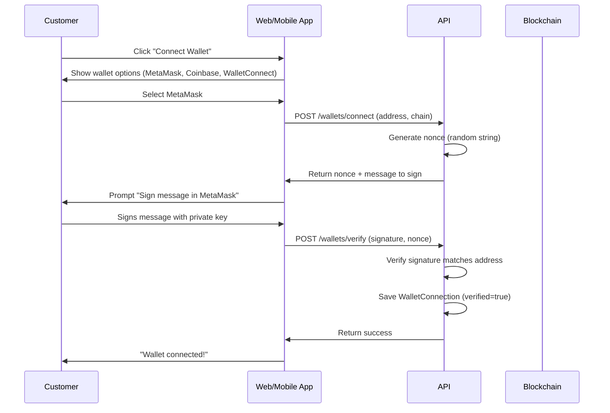
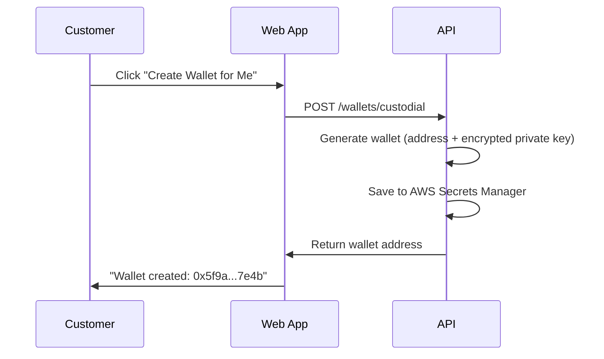
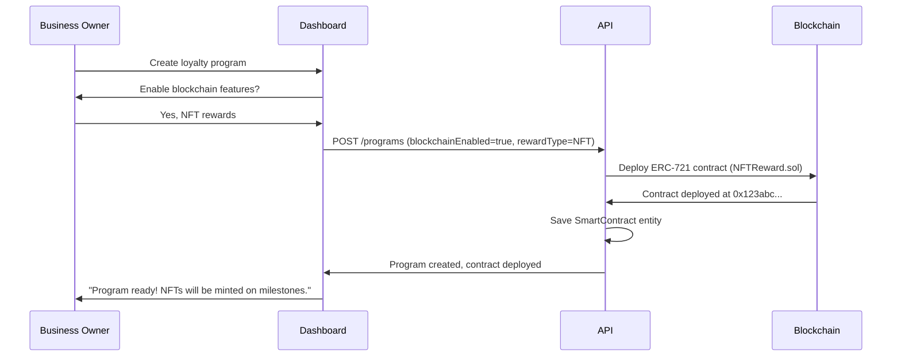
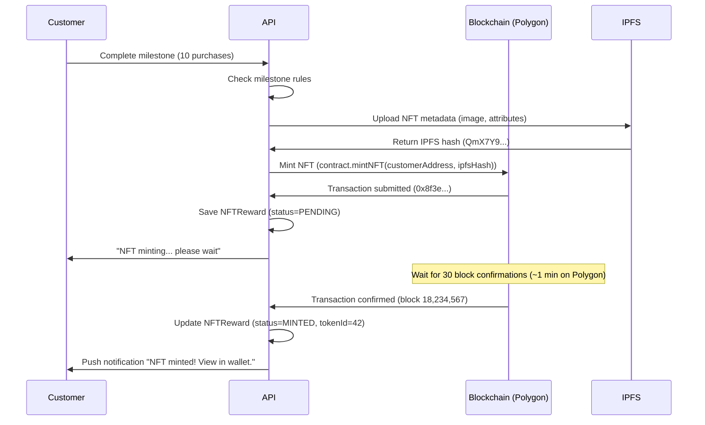
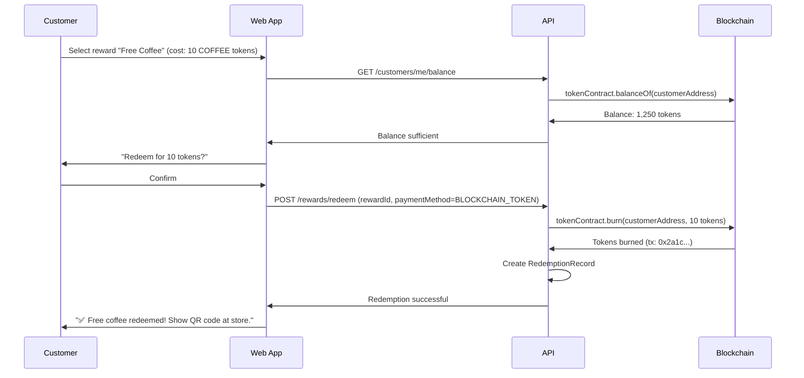

# Blockchain & NFT Integration

**Status**: 🟡 Planned
**Priority**: P2 (Phase 4)
**Phase**: Phase 4
**Teams**: Backend (Web3 Squad), Web, Mobile, Infrastructure, Security
**Estimated Effort**: 8 weeks
**Target Release**: 2026-Q1

## Overview

### Problem Statement

**Business owners** seek innovative ways to differentiate their loyalty programs and attract crypto-savvy customers. Traditional points systems lack true ownership - points are database entries controlled by the business, not transferable, and have no value outside the program. **Crypto-native customers** want rewards they truly own, can trade, and use across platforms. They're accustomed to NFTs and tokens from Web3 experiences and expect the same from loyalty programs.

**Current Pain Points**:
- Traditional points have no portability (locked in one program)
- Customers don't "own" their rewards (business controls database)
- No secondary market for loyalty rewards
- Cannot prove loyalty status across platforms
- Difficult to create truly scarce/limited edition rewards
- No transparency in reward distribution
- Cannot integrate with broader crypto ecosystem (DeFi, NFT marketplaces)

### Solution Summary

Enable businesses to offer blockchain-based loyalty rewards including:
- **NFT Rewards**: Digital collectibles, membership cards, event tickets, milestone badges
- **Token-Based Points**: ERC-20 tokens customers truly own and can transfer/trade
- **Wallet Integration**: Connect MetaMask, Coinbase Wallet, or use custodial wallets
- **Multi-Chain Support**: Polygon (low cost), Ethereum (prestige), Base (Coinbase L2)
- **Smart Contracts**: Automated reward distribution and transparent rules
- **Decentralized Storage**: NFT metadata on IPFS for permanence

**Key Features**:
- Mint NFTs as loyalty rewards (punch cards, badges, memberships)
- Issue blockchain tokens instead of traditional points
- Connect customer wallets (non-custodial + custodial options)
- Deploy smart contracts for programs
- On-chain reward distribution (transparent and auditable)
- OpenSea integration for NFT trading
- Gas fee optimization and subsidization
- Multi-chain wallet support

### Success Criteria

- [ ] Metric 1: 100,000+ wallet connections within 6 months of launch
- [ ] Metric 2: 1,000,000+ NFTs minted in first year
- [ ] Metric 3: $100,000+ secondary market trading volume (OpenSea)
- [ ] Metric 4: 50,000+ token-based loyalty programs created
- [ ] Metric 5: <$0.02 average gas cost per NFT mint (Polygon)
- [ ] Metric 6: 95%+ wallet connection success rate
- [ ] Metric 7: <3 seconds NFT mint confirmation time (Polygon)
- [ ] Metric 8: Zero smart contract security vulnerabilities (post-audit)

## User Stories

### Primary User Story

**As a** business owner
**I want** to offer NFT rewards and token-based loyalty programs
**So that** I can attract crypto-native customers and create unique, tradeable rewards

**Acceptance Criteria**:
- [ ] Given I'm creating a loyalty program, when I enable blockchain features, then I can choose between NFT rewards, token-based points, or both
- [ ] Given I've enabled NFT rewards, when customers complete milestones, then NFTs are automatically minted to their wallets
- [ ] Given I've enabled token-based points, when customers earn points, then tokens are minted to their wallets
- [ ] Given customers have blockchain rewards, when they view their wallets, then they see NFTs and tokens with proper metadata
- [ ] Given I'm viewing analytics, when I check blockchain metrics, then I see mints, transfers, and secondary market activity

### Secondary User Stories

**As a** crypto-native customer
**I want** to receive loyalty rewards as NFTs and tokens in my wallet
**So that** I truly own them and can trade or show them off

**Acceptance Criteria**:
- [ ] Given I'm signing up, when I connect my wallet, then my wallet is verified and linked to my account
- [ ] Given I've earned a reward, when it's an NFT, then it's minted to my wallet and visible in MetaMask
- [ ] Given I've earned points, when they're tokens, then I can see my token balance in my wallet
- [ ] Given I hold an NFT reward, when I want to sell it, then I can list it on OpenSea
- [ ] Given I want to send tokens to a friend, when I initiate transfer, then tokens move between wallets

**As a** non-crypto customer
**I want** an easy way to receive blockchain rewards without complexity
**So that** I can benefit from Web3 without learning crypto

**Acceptance Criteria**:
- [ ] Given I'm signing up, when blockchain is offered, then I can choose "Create Wallet for Me" (custodial)
- [ ] Given I have a custodial wallet, when I earn rewards, then they appear automatically without manual actions
- [ ] Given I'm viewing my rewards, when I tap an NFT, then I see a simple explanation and visual
- [ ] Given I want to upgrade, when I'm ready, then I can export my wallet to MetaMask

**As a** business owner concerned about costs
**I want** to understand and control blockchain gas costs
**So that** I can budget for blockchain features

**Acceptance Criteria**:
- [ ] Given I'm enabling blockchain, when I review costs, then I see estimated gas fees per operation
- [ ] Given I'm configuring programs, when I choose a chain, then I see cost comparison (Ethereum vs Polygon vs Base)
- [ ] Given I'm running a program, when I view spending, then I see total gas costs and cost per customer
- [ ] Given gas fees spike, when costs exceed budget, then I receive alerts

## Requirements

### Functional Requirements

**Must Have (MVP - Phase 4.1)**:
- [ ] **Wallet Connection**:
  - Connect MetaMask (browser extension)
  - Connect Coinbase Wallet (mobile + browser)
  - WalletConnect integration (all mobile wallets)
  - Signature verification (prove wallet ownership)
  - Multi-wallet support per customer
  - Primary wallet designation

- [ ] **Custodial Wallets**:
  - Auto-create custodial wallets for beginners
  - Secure private key storage (AWS Secrets Manager)
  - Export to non-custodial wallet (MetaMask)

- [ ] **NFT Rewards**:
  - Mint ERC-721 NFTs on Polygon
  - Upload metadata to IPFS
  - Award NFTs on loyalty milestones
  - Transfer NFTs between wallets
  - Burn NFTs on redemption (vouchers)
  - View NFT history

- [ ] **Token-Based Loyalty**:
  - Deploy ERC-20 token contracts
  - Mint tokens on point earn
  - Burn tokens on redemption
  - Transfer tokens between customers
  - View token balance and history

- [ ] **Smart Contracts**:
  - Deploy NFT contracts (ERC-721)
  - Deploy token contracts (ERC-20)
  - Upgradeable contracts (OpenZeppelin proxy pattern)
  - Access control (only business can mint)
  - Gas optimization (batch operations)

- [ ] **Multi-Chain Support**:
  - Polygon (primary, low cost)
  - Ethereum (optional, high prestige)
  - Base (Coinbase L2)

- [ ] **Transaction Management**:
  - Track transaction status (pending, confirmed, failed)
  - Retry failed transactions (up to 3 times)
  - Gas fee tracking (USD equivalent)
  - Transaction confirmations (12 blocks Ethereum, 30 blocks Polygon)

- [ ] **Gas Fee Subsidization**:
  - Business pays gas fees (meta-transactions)
  - Customers receive rewards gasless
  - Gas budget and alerts

**Should Have (Phase 4.2)**:
- [ ] **OpenSea Integration**:
  - NFTs automatically listed on OpenSea
  - View secondary market sales
  - Track trading volume and floor price

- [ ] **Limited Edition NFTs**:
  - Max supply caps (e.g., 1/100)
  - Scarcity mechanics
  - Serial numbers in metadata

- [ ] **Dynamic NFTs**:
  - Update metadata based on status (active/expired subscription)
  - Evolving NFTs (tier upgrades)
  - Time-based updates

- [ ] **Token Features**:
  - Token staking for benefits
  - Liquidity pools (Uniswap integration)
  - Cross-business token sharing (partner networks)

- [ ] **Fraud Prevention**:
  - Rate limiting (max 100 NFTs/hour per business)
  - Duplicate detection
  - Suspicious pattern alerts

**Could Have (Phase 5+)**:
- [ ] Solana support (high throughput, low cost)
- [ ] Arbitrum support (additional L2 option)
- [ ] DAO governance for program changes
- [ ] NFT royalties on secondary sales
- [ ] Soulbound tokens (non-transferable achievements)
- [ ] zkSync support (privacy + scalability)
- [ ] Cross-chain bridges

### Non-Functional Requirements

**Performance**:
- NFT mint confirmation: <30 seconds (Polygon), <3 minutes (Ethereum)
- Wallet connection: <5 seconds
- Transaction status updates: Real-time via WebSocket
- IPFS metadata upload: <10 seconds
- Smart contract deployment: <2 minutes (Polygon)

**Security**:
- Smart contract audits: CertiK or OpenZeppelin (required for production)
- Private key encryption: AES-256
- Signature verification: ECDSA (secp256k1)
- Rate limiting: 100 operations/hour per business
- Access control: Role-based (MINTER_ROLE, ADMIN_ROLE)

**Scalability**:
- Support 100,000+ concurrent wallet connections
- Handle 10,000+ NFT mints per day
- Support 1,000+ smart contracts deployed
- Manage 100,000,000+ tokens minted

**Compliance**:
- AML/KYC for high-value tokens (>$10,000)
- Tax disclaimer for token/NFT rewards
- Terms of service acceptance before wallet connection
- GDPR compliance (right to be forgotten)

**Reliability**:
- 99.9% uptime for wallet connection service
- Automatic retry on transaction failures
- Transaction confirmation guarantees (12+ blocks)
- Backup RPC providers (primary + fallback)

## User Flows

### Flow 1: Customer Connects Wallet



**Alternative Flow: Custodial Wallet**:


---

### Flow 2: Business Creates NFT Reward Program



---

### Flow 3: Customer Earns NFT Reward



---

### Flow 4: Customer Redeems Token-Based Reward



---

## Wireframes

### Wallet Connection Screen

```
┌─────────────────────────────────────┐
│  🎉 Earn Crypto Rewards!            │
├─────────────────────────────────────┤
│                                     │
│  Connect your wallet to receive:   │
│  • NFT rewards (badges, collectibles)
│  • COFFEE tokens (transferable)    │
│  • True ownership of rewards       │
│                                     │
│  ┌───────────────────────────────┐ │
│  │ 🦊 Connect MetaMask           │ │
│  └───────────────────────────────┘ │
│                                     │
│  ┌───────────────────────────────┐ │
│  │ 🔷 Connect Coinbase Wallet    │ │
│  └───────────────────────────────┘ │
│                                     │
│  ┌───────────────────────────────┐ │
│  │ 📱 WalletConnect              │ │
│  └───────────────────────────────┘ │
│                                     │
│  ┌───────────────────────────────┐ │
│  │ ⚙️  Create Wallet for Me      │ │
│  │    (Recommended for beginners)│ │
│  └───────────────────────────────┘ │
│                                     │
│  [Skip] (Use traditional points)  │
└─────────────────────────────────────┘
```

### NFT Reward Claim Screen

```
┌─────────────────────────────────────┐
│  🏆 Milestone Achieved!             │
├─────────────────────────────────────┤
│                                     │
│  ┌─────────────────────────────┐   │
│  │                             │   │
│  │      [NFT Image]            │   │
│  │    Gold Badge #42           │   │
│  │                             │   │
│  └─────────────────────────────┘   │
│                                     │
│  Congratulations! You've reached   │
│  100 purchases!                    │
│                                     │
│  Claim your exclusive NFT:         │
│  • Limited edition (42/100)        │
│  • Tradeable on OpenSea           │
│  • Grants 5x points multiplier    │
│                                     │
│  Cost: FREE (we cover gas)         │
│                                     │
│  ┌─────────────────────────────┐   │
│  │     [Claim NFT]              │   │
│  └─────────────────────────────┘   │
│                                     │
│  [View on PolygonScan] [Learn More]│
└─────────────────────────────────────┘
```

### Token Balance View

```
┌─────────────────────────────────────┐
│  💰 Your COFFEE Tokens              │
├─────────────────────────────────────┤
│                                     │
│  Balance: 1,250 COFFEE              │
│  USD Value: ~$62.50 ($0.05 each)   │
│                                     │
│  Wallet: 0x742d...f0bEb             │
│  Network: Polygon                   │
│                                     │
│  Recent Transactions:               │
│  ┌─────────────────────────────┐   │
│  │ +50 COFFEE • Purchase       │   │
│  │ 2 hours ago                 │   │
│  └─────────────────────────────┘   │
│  ┌─────────────────────────────┐   │
│  │ -10 COFFEE • Redeemed       │   │
│  │ 1 day ago                   │   │
│  └─────────────────────────────┘   │
│                                     │
│  ┌─────────────────────────────┐   │
│  │ [Redeem Rewards]             │   │
│  └─────────────────────────────┘   │
│  ┌─────────────────────────────┐   │
│  │ [Send to Friend]             │   │
│  └─────────────────────────────┘   │
│  ┌─────────────────────────────┐   │
│  │ [Trade on Uniswap]           │   │
│  └─────────────────────────────┘   │
│                                     │
│  [View on PolygonScan]              │
└─────────────────────────────────────┘
```

---

## Technical Design

### Domain Model

```typescript
// NFT Reward Aggregate
class NFTRewardAggregate {
  constructor(
    public readonly id: UUID,
    public readonly businessId: UUID,
    public readonly programId: UUID,
    private customerId: UUID,
    private tokenId: number,
    private contractAddress: ContractAddress,
    private chain: BlockchainNetwork,
    private status: NFTStatus,
    private metadata: NFTMetadata,
    private transferHistory: NFTTransfer[],
    private transactionHash: TransactionHash | null,
    public readonly mintedAt: Date | null,
    private mintedBy: UUID
  ) {}

  public static create(
    businessId: UUID,
    programId: UUID,
    customerId: UUID,
    contractAddress: ContractAddress,
    metadata: NFTMetadata,
    mintedBy: UUID
  ): NFTRewardAggregate;

  public markAsMinted(tokenId: number, txHash: TransactionHash, blockNumber: number): void;
  public transfer(to: UUID, toAddress: WalletAddress, txHash: TransactionHash): void;
  public burn(customerId: UUID, txHash: TransactionHash): void;
}

// Token Program Aggregate
class TokenProgramAggregate {
  constructor(
    public readonly id: UUID,
    public readonly businessId: UUID,
    public readonly programId: UUID,
    private name: string,
    private symbol: string,
    private decimals: number,
    private totalSupply: TokenAmount,
    private maxSupply: TokenAmount,
    private contractAddress: ContractAddress | null,
    private chain: BlockchainNetwork,
    private status: TokenProgramStatus
  ) {}

  public deploy(contractAddress: ContractAddress): void;
  public mint(amount: TokenAmount, recipient: UUID): void;
  public burn(amount: TokenAmount): void;
}

// Wallet Connection Aggregate
class WalletConnectionAggregate {
  constructor(
    public readonly id: UUID,
    public readonly customerId: UUID,
    private walletAddress: WalletAddress,
    private walletType: WalletType,
    private isVerified: boolean,
    private verificationProof: SignatureProof | null,
    private isPrimary: boolean,
    private nonce: string
  ) {}

  public verify(proof: SignatureProof): void;
  public markAsPrimary(): void;
}
```

---

### Database Schema (Prisma)

```prisma
model NFTReward {
  id              String   @id @default(uuid()) @db.Uuid
  businessId      String   @db.Uuid
  programId       String   @db.Uuid
  customerId      String   @db.Uuid
  tokenId         Int
  contractAddress String   @db.VarChar(42)
  chain           String   @db.VarChar(20)
  status          String   @db.VarChar(20) // PENDING, MINTED, TRANSFERRED, BURNED, FAILED
  transactionHash String?  @db.VarChar(66)
  mintedAt        DateTime?
  mintedBy        String   @db.Uuid
  createdAt       DateTime @default(now())
  updatedAt       DateTime @updatedAt

  metadata        NFTMetadata?
  transferHistory NFTTransfer[]

  @@index([businessId])
  @@index([customerId])
  @@index([contractAddress, chain])
  @@index([contractAddress, tokenId])
  @@index([status])
}

model NFTMetadata {
  id          String   @id @default(uuid()) @db.Uuid
  nftId       String   @unique @db.Uuid
  name        String   @db.VarChar(100)
  description String   @db.Text
  image       String   @db.VarChar(255) // IPFS URL
  externalUrl String?  @db.VarChar(255)
  attributes  Json     @db.JsonB
  ipfsHash    String   @db.VarChar(46) // CID
  createdAt   DateTime @default(now())

  nft NFTReward @relation(fields: [nftId], references: [id])
}

model TokenProgram {
  id              String   @id @default(uuid()) @db.Uuid
  businessId      String   @db.Uuid
  programId       String   @db.Uuid
  name            String   @db.VarChar(100)
  symbol          String   @db.VarChar(5)
  decimals        Int      @default(18)
  totalSupply     String   @db.VarChar(78) // bigint as string
  maxSupply       String   @db.VarChar(78)
  contractAddress String?  @db.VarChar(42)
  chain           String   @db.VarChar(20)
  status          String   @db.VarChar(20) // DRAFT, DEPLOYING, ACTIVE, PAUSED, ENDED
  transferable    Boolean  @default(true)
  createdAt       DateTime @default(now())
  updatedAt       DateTime @updatedAt

  @@index([businessId])
  @@index([programId])
  @@index([contractAddress, chain])
  @@unique([businessId, symbol])
}

model WalletConnection {
  id                    String   @id @default(uuid()) @db.Uuid
  customerId            String   @db.Uuid
  walletAddress         String   @db.VarChar(66) // Ethereum or Solana
  chain                 String   @db.VarChar(20)
  walletType            String   @db.VarChar(50) // METAMASK, COINBASE_WALLET, CUSTODIAL, etc.
  isVerified            Boolean  @default(false)
  verifiedAt            DateTime?
  verificationSignature String?  @db.Text
  isPrimary             Boolean  @default(false)
  nonce                 String   @db.VarChar(64)
  lastUsedAt            DateTime @default(now())
  createdAt             DateTime @default(now())
  updatedAt             DateTime @updatedAt

  @@index([customerId])
  @@index([walletAddress, chain])
  @@unique([walletAddress, chain])
}

model SmartContract {
  id                     String   @id @default(uuid()) @db.Uuid
  businessId             String   @db.Uuid
  type                   String   @db.VarChar(50) // NFT_REWARD, TOKEN_LOYALTY, etc.
  address                String   @db.VarChar(42)
  chain                  String   @db.VarChar(20)
  deployedBy             String   @db.Uuid
  deployedAt             DateTime
  transactionHash        String   @db.VarChar(66)
  abi                    String   @db.Text
  bytecode               String   @db.Text
  isUpgradeable          Boolean  @default(false)
  proxyAddress           String?  @db.VarChar(42)
  implementationAddress  String?  @db.VarChar(42)
  status                 String   @db.VarChar(20) // DEPLOYING, ACTIVE, PAUSED
  gasUsed                Int
  auditStatus            String   @db.VarChar(50) // NOT_AUDITED, IN_PROGRESS, PASSED, FAILED
  auditReport            String?  @db.Text
  createdAt              DateTime @default(now())
  updatedAt              DateTime @updatedAt

  @@index([businessId])
  @@index([address, chain])
  @@unique([address, chain])
}

model BlockchainTransaction {
  id              String   @id @default(uuid()) @db.Uuid
  businessId      String   @db.Uuid
  entityType      String   @db.VarChar(50) // NFT, TOKEN, CONTRACT
  entityId        String   @db.Uuid
  transactionHash String   @db.VarChar(66)
  chain           String   @db.VarChar(20)
  fromAddress     String   @db.VarChar(66)
  toAddress       String   @db.VarChar(66)
  type            String   @db.VarChar(50) // MINT_NFT, TRANSFER_NFT, MINT_TOKEN, etc.
  status          String   @db.VarChar(20) // PENDING, CONFIRMING, CONFIRMED, FAILED
  blockNumber     Int?
  confirmations   Int      @default(0)
  gasUsed         Int?
  gasFeeWei       String?  @db.VarChar(78)
  gasFeeUSD       Decimal? @db.Decimal(10, 2)
  submittedAt     DateTime
  confirmedAt     DateTime?
  failedAt        DateTime?
  errorMessage    String?  @db.Text
  retryCount      Int      @default(0)
  maxRetries      Int      @default(3)
  metadata        Json?    @db.JsonB
  createdAt       DateTime @default(now())
  updatedAt       DateTime @updatedAt

  @@index([transactionHash, chain])
  @@index([entityType, entityId])
  @@index([status, submittedAt])
}
```

---

## API Endpoints

### Wallet Management

```typescript
// Connect wallet (initiate)
POST /api/v1/customers/me/wallets/connect
Request: { walletAddress, chain, walletType }
Response: { nonce, message }

// Verify wallet (complete)
POST /api/v1/customers/me/wallets/verify
Request: { walletAddress, chain, signature, nonce }
Response: { verified: true, walletConnectionId }

// List customer wallets
GET /api/v1/customers/me/wallets
Response: [{ walletAddress, chain, isVerified, isPrimary, ... }]

// Set primary wallet
PUT /api/v1/customers/me/wallets/{id}/primary
Response: { isPrimary: true }

// Create custodial wallet
POST /api/v1/customers/me/wallets/custodial
Request: { chain }
Response: { walletAddress, custodial: true }

// Disconnect wallet
DELETE /api/v1/customers/me/wallets/{id}
Response: { disconnected: true }
```

### NFT Rewards

```typescript
// List customer NFTs
GET /api/v1/customers/me/nfts
Query: { status?, chain?, limit?, offset? }
Response: { data: [...nfts], total, limit, offset }

// Get NFT details
GET /api/v1/nfts/{id}
Response: { id, tokenId, metadata, transferHistory, ... }

// Transfer NFT (if allowed)
POST /api/v1/nfts/{id}/transfer
Request: { toCustomerId, toWalletAddress }
Response: { transactionHash, status }

// Burn NFT (redeem voucher)
POST /api/v1/nfts/{id}/burn
Response: { transactionHash, burned: true }
```

### Token Programs

```typescript
// Get customer token balance
GET /api/v1/customers/me/tokens/{programId}
Response: { balance, symbol, decimals, chain }

// Get token transaction history
GET /api/v1/customers/me/tokens/{programId}/transactions
Query: { limit?, offset? }
Response: { data: [...transactions], total }

// Transfer tokens (if transferable)
POST /api/v1/tokens/{programId}/transfer
Request: { toCustomerId, toWalletAddress, amount }
Response: { transactionHash, status }
```

### Blockchain Transactions

```typescript
// Get transaction status
GET /api/v1/blockchain/transactions/{id}
Response: { id, transactionHash, status, confirmations, ... }

// List transactions
GET /api/v1/blockchain/transactions
Query: { entityType?, status?, limit?, offset? }
Response: { data: [...transactions], total }
```

---

## Domain Events

```typescript
// NFT Events
blockchain.nft.pending
blockchain.nft.minted
blockchain.nft.transferred
blockchain.nft.burned
blockchain.nft.mint_failed

// Token Events
blockchain.token_program.created
blockchain.token_program.deployed
blockchain.token.minted
blockchain.token.transferred
blockchain.token.burned

// Wallet Events
blockchain.wallet.connected
blockchain.wallet.verified
blockchain.wallet.disconnected

// Transaction Events
blockchain.transaction.confirmed
blockchain.transaction.failed

// Smart Contract Events
blockchain.smart_contract.deployed
blockchain.smart_contract.upgraded
```

---

## Dependencies

### External Services

- **Blockchain RPC Providers**:
  - Alchemy (primary)
  - Infura (fallback)
  - QuickNode (tertiary)

- **IPFS Storage**:
  - Pinata (primary)
  - Infura IPFS (fallback)

- **Smart Contract Audits**:
  - CertiK
  - OpenZeppelin Defender

- **Gas Price Oracles**:
  - Chainlink Gas Price Feeds
  - EthGasStation (Ethereum)

### Internal Dependencies

- Customer Management (wallet ownership)
- Loyalty Programs (token issuance rules)
- Reward Catalog (NFT reward definitions)
- Billing (gas cost tracking)

---

## Testing Strategy

### Unit Tests (100% coverage)

- Value objects (WalletAddress, GasFee, TokenAmount, etc.)
- Aggregates (NFTRewardAggregate, TokenProgramAggregate, etc.)
- Domain services (MintNFTRewardService, ConnectWalletService, etc.)

### Integration Tests

- Wallet connection flow (signature verification)
- NFT minting flow (IPFS upload + on-chain mint)
- Token issuance flow (mint + balance check)
- Smart contract deployment

### E2E Tests

- Connect MetaMask (using test wallet)
- Earn NFT reward (full flow)
- Redeem tokens for reward
- Transfer NFT to another customer

### Smart Contract Tests

- Solidity unit tests (Hardhat)
- Gas optimization benchmarks
- Security tests (reentrancy, access control)
- Upgrade tests (proxy pattern)

---

## Rollout Plan

### Phase 4.1: Core Blockchain (Weeks 1-4)

**Week 1-2: Wallet Connection**
- MetaMask integration
- Signature verification
- Custodial wallet creation

**Week 3-4: NFT Rewards**
- Deploy NFT contracts
- IPFS metadata upload
- Mint NFT on milestone

### Phase 4.2: Token Programs (Weeks 5-6)

**Week 5: Token Contracts**
- Deploy ERC-20 contracts
- Mint tokens on point earn
- Token burn on redemption

**Week 6: Token Features**
- Transfer tokens
- Token balance tracking
- Transaction history

### Phase 4.3: Advanced Features (Weeks 7-8)

**Week 7: Multi-Chain**
- Add Ethereum support
- Add Base support
- Chain selection UI

**Week 8: OpenSea Integration**
- NFT metadata optimization
- Collection pages
- Secondary market tracking

---

## Monitoring & Analytics

### Key Metrics

**Blockchain Operations**:
- Wallet connections per day
- NFTs minted per day
- Tokens minted per day
- Transaction success rate
- Average transaction confirmation time
- Gas costs per day (USD)

**User Engagement**:
- % of customers with connected wallets
- % of customers with custodial wallets
- NFT claim rate (% of eligible customers who claim)
- Token transfer rate
- OpenSea listing rate

**Business Metrics**:
- Revenue from blockchain features (premium tier)
- Gas cost per customer
- Secondary market trading volume
- Floor price trends

### Dashboards

**Blockchain Operations Dashboard**:
- Real-time transaction queue
- Pending vs confirmed transactions
- Failed transaction alerts
- Gas price trends
- RPC provider health

**Business Analytics Dashboard**:
- Total NFTs minted by program
- Token supply and circulation
- Customer wallet adoption
- Gas cost breakdown
- Secondary market activity

---

## Open Questions

1. **Smart Contract Upgradeability**: Should all contracts be upgradeable via proxy pattern, or only certain types?
2. **Gas Fee Budgets**: What's the default gas budget per business? How do we handle overages?
3. **Audit Requirements**: Require audits for all contracts or only those handling high value?
4. **Custodial Wallet Export**: Should we allow exporting custodial wallets, or keep them locked for security?
5. **Cross-Chain Bridges**: Support bridging NFTs/tokens between chains, or keep them chain-specific?
6. **DAO Governance**: Allow token holders to vote on program changes? (Phase 5 feature?)
7. **Royalties**: Should businesses get royalties on secondary NFT sales?

---

## Risks & Mitigation

### Risk 1: High Gas Costs on Ethereum

**Impact**: High (could make feature economically unviable)
**Probability**: High (Ethereum mainnet fees are $2-50 per transaction)

**Mitigation**:
- Default to Polygon (100x cheaper)
- Only recommend Ethereum for high-value programs
- Gas budgets and alerts
- Batch operations where possible

### Risk 2: Smart Contract Vulnerabilities

**Impact**: Critical (could lose customer funds/NFTs)
**Probability**: Low (with proper audits)

**Mitigation**:
- Mandatory security audits (CertiK, OpenZeppelin)
- Use audited OpenZeppelin contracts
- Bug bounty program
- Upgradeable contracts for emergency fixes
- Insurance for smart contract risks

### Risk 3: User Education (Crypto Complexity)

**Impact**: Medium (low adoption if too complex)
**Probability**: High (many users unfamiliar with Web3)

**Mitigation**:
- Custodial wallet option (zero crypto knowledge needed)
- In-app tutorials and tooltips
- Video guides for wallet connection
- Simple language (avoid jargon)
- 24/7 support for wallet issues

### Risk 4: Regulatory Uncertainty

**Impact**: High (could require major changes)
**Probability**: Medium (regulations evolving)

**Mitigation**:
- Legal review of token classification
- AML/KYC for high-value programs
- Terms of service with clear disclaimers
- Monitor regulatory developments
- Geographic restrictions if needed

### Risk 5: Blockchain Network Downtime

**Impact**: Medium (transactions fail during outage)
**Probability**: Low (rare on Polygon/Ethereum)

**Mitigation**:
- Multiple RPC providers (Alchemy, Infura, QuickNode)
- Automatic failover to backup provider
- Transaction retry logic
- Status page for blockchain health

---

## References

- [Blockchain Domain Specification](../../domain-specs/blockchain/)
- [Loyalty Programs Blockchain Integration](../loyalty-programs/BLOCKCHAIN.md)
- [Loyalty Templates Blockchain Integration](../loyalty-templates/BLOCKCHAIN.md)
- [ERC-721 Standard](https://eips.ethereum.org/EIPS/eip-721)
- [ERC-20 Standard](https://eips.ethereum.org/EIPS/eip-20)
- [OpenZeppelin Contracts](https://docs.openzeppelin.com/contracts/)

---

**Document Owner**: Web3 Squad
**Last Updated**: 2025-11-07
**Next Review**: 2026-02-07
