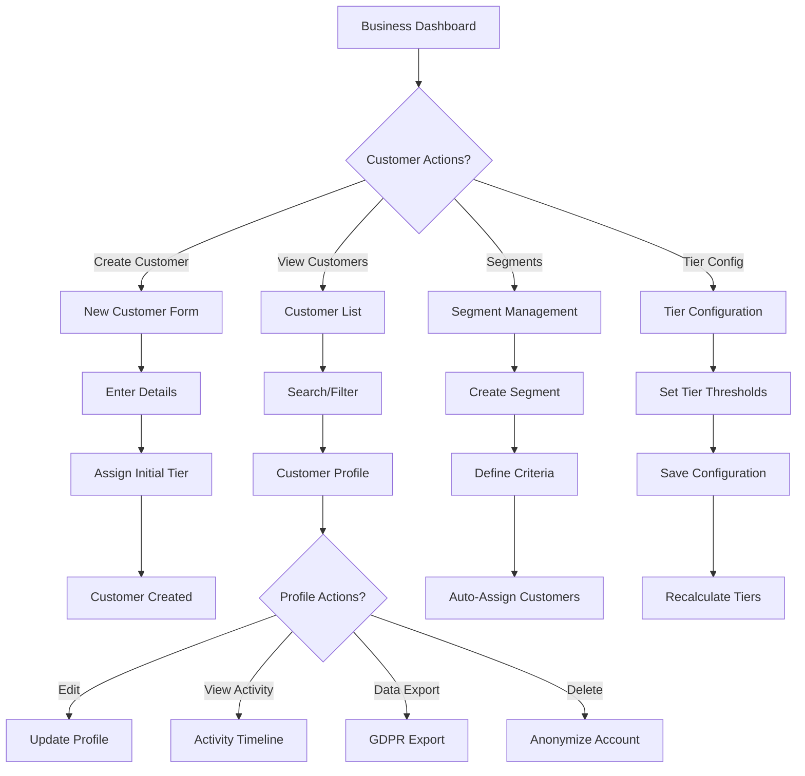

# Customer Management

**Status**: 🟢 Approved
**Priority**: P0 (Critical - MVP Requirement)
**Phase**: Phase 1
**Teams**: Backend, Web, Mobile, AI/MCP, Infrastructure
**Estimated Effort**: 5 weeks
**Target Release**: 2026-Q1

## Overview

### Problem Statement

**Business owners** need a centralized system to manage customer profiles, track engagement, segment audiences, and comply with data privacy regulations (GDPR/CCPA). Currently, there is no unified view of customer data across loyalty programs, transactions, and communication channels.

### Solution Summary

Provide a comprehensive customer management system that allows businesses to:
- Create and manage customer profiles with tier progression
- Segment customers dynamically based on behavior and demographics
- Track customer lifetime value (CLV) and engagement metrics
- Manage communication preferences (email, SMS, push notifications)
- Export customer data for GDPR/CCPA compliance
- Automate customer success workflows and journeys
- Monitor tier progression with audit trails

### Success Criteria

- [ ] Metric 1: 100% of transactions link to customer profiles
- [ ] Metric 2: <100ms API response time for customer queries (p95)
- [ ] Metric 3: 95% accuracy in dynamic segment assignments
- [ ] Metric 4: <24 hours for GDPR data export requests
- [ ] Metric 5: 99.9% data integrity (no orphaned records)

## User Stories

### Primary User Story

**As a** business owner
**I want** to manage customer profiles and segment my audience
**So that** I can personalize marketing campaigns and improve customer retention

**Acceptance Criteria**:
- [ ] Given I'm on the customers page, when I search for a customer, then I see their complete profile with loyalty status
- [ ] Given a customer makes purchases, when tier thresholds are met, then automatic tier upgrades occur
- [ ] Given I create a customer segment, when criteria are defined, then customers are auto-assigned
- [ ] Given I view customer analytics, when I check CLV, then I see current and predicted lifetime value
- [ ] Given a customer requests data export, when I approve it, then complete data is exported within 24 hours

### Secondary User Stories

**As a** customer
**I want** to control my communication preferences
**So that** I only receive notifications I'm interested in

**Acceptance Criteria**:
- [ ] Given I access my profile, when I update preferences, then changes apply immediately
- [ ] Given I opt out of marketing, when businesses send campaigns, then I'm excluded
- [ ] Given I set quiet hours, when notifications are scheduled, then they're delayed until allowed time

**As a** compliance officer
**I want** to export customer data and delete accounts
**So that** I can comply with GDPR/CCPA regulations

**Acceptance Criteria**:
- [ ] Given a customer requests data export, when I initiate it, then all data is packaged within 24 hours
- [ ] Given a customer requests account deletion, when I approve it, then all PII is anonymized within 30 days
- [ ] Given data is exported, when I review it, then it includes all systems (loyalty, transactions, communications)

## Requirements

### Functional Requirements

**Must Have (MVP - Phase 1)**:
- [ ] Customer profile CRUD operations
- [ ] Tier system (4 tiers: BRONZE, SILVER, GOLD, PLATINUM)
- [ ] Automatic tier progression based on configurable thresholds
- [ ] Customer segmentation engine with dynamic assignment
- [ ] Communication preferences per customer per business
- [ ] GDPR/CCPA data export functionality
- [ ] Customer data anonymization (right to be forgotten)
- [ ] Customer search and filtering
- [ ] Customer lifetime value (CLV) calculation
- [ ] Customer analytics dashboard
- [ ] Tier configuration with audit trail
- [ ] Business-customer many-to-many relationship
- [ ] Soft delete support

**Should Have (Phase 1)**:
- [ ] Customer import (CSV, Excel)
- [ ] Bulk customer operations (segment assignment, tier override)
- [ ] Customer merge (duplicate detection)
- [ ] Customer notes and tags
- [ ] Customer activity timeline
- [ ] Automated tier downgrade protection (grace period)
- [ ] Customer referral tracking

**Could Have (Phase 2+)**:
- [ ] AI-powered customer insights (churn prediction, upsell opportunities)
- [ ] Customer success workflows (automated outreach)
- [ ] Customer journey automation (welcome series, re-engagement)
- [ ] Social media profile integration (Facebook, Instagram)
- [ ] Customer sentiment analysis (NPS, CSAT scores)
- [ ] Customer health scoring

**Won't Have (Explicitly Out of Scope)**:
- ❌ CRM features (sales pipeline, lead management) - use dedicated CRM
- ❌ Email service provider integration (SendGrid, Mailchimp) - Phase 3
- ❌ SMS gateway integration (Twilio) - Phase 3
- ❌ Customer portal (Phase 2)
- ❌ Mobile app customer login (Phase 1 Web only)

### Non-Functional Requirements

**Performance**:
- API response time: <100ms for customer queries (p95)
- Segment recalculation: <5 minutes for 10,000 customers
- CLV calculation: <30 seconds per customer
- Data export: <24 hours for 1GB of data
- Search: <200ms for 100,000 customers

**Security**:
- Authentication: JWT required for all endpoints
- Authorization: Business owners access their own customers only
- PII encryption: At rest (AES-256) and in transit (TLS 1.3)
- Data anonymization: Irreversible hashing for deleted accounts
- Audit logging: Track all PII access and modifications

**Scalability**:
- Support 1M+ customers per business
- Support 10,000+ concurrent customer queries
- Database: Read replicas for analytics queries
- Caching: Redis cache for tier thresholds (1-hour TTL)

**Availability**:
- Uptime SLA: 99.9%
- Degraded mode: Read-only access if writes fail
- Monitoring: Alerts for segment recalculation failures
- Backup: Daily snapshots, 30-day retention

**Data Integrity**:
- Transaction safety: Profile updates are atomic
- Referential integrity: Cascade deletes to related entities
- Audit trail: Complete history of tier changes
- GDPR compliance: Data portability, right to be forgotten

## User Experience

### User Flow Diagram



### UI Copy

**Page Title**: "Customers"
**Primary CTA**: "Add Customer"
**Help Text**: "Manage customer profiles, track engagement, and segment your audience for personalized campaigns."

**Tier Labels**:
- 🥉 Bronze - "New customers (entry level)"
- 🥈 Silver - "Regular customers (mid tier)"
- 🥇 Gold - "Loyal customers (high tier)"
- 💎 Platinum - "VIP customers (top tier)"

**Segment Criteria Types**:
- Total Spend (lifetime, last 30/90/365 days)
- Visit Frequency (visits per month)
- Loyalty Points (current balance)
- Tier Level (Bronze, Silver, Gold, Platinum)
- Last Visit Date (active, at-risk, churned)
- Average Order Value
- Product Categories (specific purchases)

## Technical Design

### Architecture Overview

```
┌─────────────────────────────────────────────────────────────┐
│                    Web/Mobile UI Layer                      │
│  - Customer List & Search                                   │
│  - Customer Profile & Timeline                              │
│  - Segment Management                                       │
│  - Tier Configuration Dashboard                             │
└────────────────────┬────────────────────────────────────────┘
                     │
                     ▼
┌─────────────────────────────────────────────────────────────┐
│                 Backend API Layer (NestJS)                  │
│  ┌─────────────────────────────────────────────────────┐   │
│  │        CustomerController                           │   │
│  │  - POST /customers (create)                         │   │
│  │  - GET /customers (list with filters)               │   │
│  │  - GET /customers/{id} (profile)                    │   │
│  │  - PUT /customers/{id} (update)                     │   │
│  │  - DELETE /customers/{id} (anonymize)               │   │
│  │  - POST /customers/{id}/export (GDPR)               │   │
│  └─────────────────────┬───────────────────────────────┘   │
│                        ▼                                    │
│  ┌─────────────────────────────────────────────────────┐   │
│  │        CustomerSegmentController                    │   │
│  │  - POST /segments (create)                          │   │
│  │  - GET /segments (list)                             │   │
│  │  - POST /segments/{id}/recalculate                  │   │
│  └─────────────────────┬───────────────────────────────┘   │
│                        ▼                                    │
│  ┌─────────────────────────────────────────────────────┐   │
│  │        CustomerService                              │   │
│  │  - Profile management                               │   │
│  │  - Tier progression engine                          │   │
│  │  - CLV calculation                                  │   │
│  │  - Data export (GDPR)                               │   │
│  │  - Anonymization (right to be forgotten)            │   │
│  └─────────────────────┬───────────────────────────────┘   │
│                        ▼                                    │
│  ┌─────────────────────────────────────────────────────┐   │
│  │        SegmentationService                          │   │
│  │  - Criteria evaluation engine                       │   │
│  │  - Dynamic segment assignment                       │   │
│  │  - Segment recalculation scheduler                  │   │
│  └─────────────────────┬───────────────────────────────┘   │
└────────────────────────┼────────────────────────────────────┘
                         │
                         ▼
┌─────────────────────────────────────────────────────────────┐
│                PostgreSQL Database                          │
│  - customers (core profiles)                                │
│  - customer_communication_preferences                       │
│  - customer_segments (criteria definitions)                 │
│  - customer_segment_assignments (many-to-many)              │
│  - tier_configurations (thresholds)                         │
│  - tier_config_audits (change history)                      │
│  - customer_data_exports (GDPR requests)                    │
│  - customer_lifetime_values (CLV analytics)                 │
│  - customer_success_workflows (automation)                  │
│  - customer_journeys (multi-step campaigns)                 │
└─────────────────────────────────────────────────────────────┘
                         │
                         ▼
┌─────────────────────────────────────────────────────────────┐
│                   Redis Cache Layer                         │
│  - Tier thresholds (1-hour TTL)                             │
│  - Popular segments (10-minute TTL)                         │
│  - Customer profiles (5-minute TTL for high-traffic)        │
└─────────────────────────────────────────────────────────────┘
                         │
                         ▼
┌─────────────────────────────────────────────────────────────┐
│                Event Bus (AsyncAPI)                         │
│  - customers.customer.created                               │
│  - customers.customer.updated                               │
│  - customers.customer.deleted                               │
│  - customers.tier.upgraded                                  │
│  - customers.tier.downgraded                                │
│  - customers.segment.assigned                               │
│  - customers.data_export.requested                          │
│  - customers.data_export.completed                          │
└─────────────────────────────────────────────────────────────┘
```

### Domain Model

```typescript
// Core customer entity
interface Customer {
  id: string;
  email: string;
  phone: string | null;
  firstName: string | null;
  lastName: string | null;
  dateOfBirth: Date | null;
  loyaltyTier: LoyaltyTier;
  tierUpdatedAt: Date;
  preferredLanguage: string;
  telegramChatId: string | null;
  isActive: boolean;
  createdAt: Date;
  updatedAt: Date;
  deletedAt: Date | null;

  // Relations
  communicationPreferences: CustomerCommunicationPreference[];
  segments: CustomerSegment[]; // via CustomerSegmentAssignment
  businesses: Business[]; // Many-to-many
  loyaltyBalances: LoyaltyBalance[];
  transactions: Transaction[];
  redemptions: RewardRedemption[];
  dataExports: CustomerDataExport[];
  lifetimeValue: CustomerLifetimeValue | null;

  // Computed
  fullName: string; // firstName + lastName
  tierProgress: number; // % to next tier
  totalSpent: number; // Sum of all transactions
  visitCount: number; // Count of transactions
  avgOrderValue: number; // totalSpent / visitCount
  lastVisit: Date | null; // Most recent transaction
  daysSinceLastVisit: number;
  isAtRisk: boolean; // Not visited in 90+ days
}

// Loyalty tiers
enum LoyaltyTier {
  BRONZE = 'BRONZE',
  SILVER = 'SILVER',
  GOLD = 'GOLD',
  PLATINUM = 'PLATINUM'
}

// Communication preferences
interface CustomerCommunicationPreference {
  id: string;
  customerId: string;
  businessId: string;
  emailMarketing: boolean;
  smsMarketing: boolean;
  pushNotifications: boolean;
  loyaltyUpdates: boolean;
  transactionReceipts: boolean;
  promotionalOffers: boolean;
  surveyInvitations: boolean;
  newsletterSubscription: boolean;
  frequency: 'IMMEDIATE' | 'DAILY_DIGEST' | 'WEEKLY_DIGEST';
  preferredChannel: 'EMAIL' | 'SMS' | 'PUSH';
  timezone: string;
  quietHoursStart: string | null; // "22:00"
  quietHoursEnd: string | null;   // "08:00"
  createdAt: Date;
  updatedAt: Date;
}

// Customer segments
interface CustomerSegment {
  id: string;
  businessId: string;
  name: string;
  description: string | null;
  criteria: SegmentCriteria;
  isActive: boolean;
  createdAt: Date;
  updatedAt: Date;
  deletedAt: Date | null;

  // Relations
  assignments: CustomerSegmentAssignment[];

  // Computed
  customerCount: number;
  lastRecalculated: Date;
}

// Segment criteria
interface SegmentCriteria {
  rules: SegmentRule[];
  operator: 'AND' | 'OR'; // How to combine rules
}

interface SegmentRule {
  field: string; // 'totalSpent', 'visitCount', 'loyaltyTier', 'lastVisit', etc.
  operator: 'equals' | 'not_equals' | 'greater_than' | 'less_than' | 'in' | 'not_in' | 'between' | 'contains';
  value: any;
  timeframe?: 'last_30_days' | 'last_90_days' | 'last_365_days' | 'lifetime';
}

// Example segment criteria
const highValueSegment: SegmentCriteria = {
  operator: 'AND',
  rules: [
    {
      field: 'totalSpent',
      operator: 'greater_than',
      value: 1000,
      timeframe: 'last_365_days'
    },
    {
      field: 'loyaltyTier',
      operator: 'in',
      value: ['GOLD', 'PLATINUM']
    }
  ]
};

// Tier configuration
interface TierConfiguration {
  id: string;
  businessId: string;
  thresholds: TierThresholds;
  updatedBy: string | null;
  createdAt: Date;
  updatedAt: Date;
  deletedAt: Date | null;

  // Relations
  audits: TierConfigAudit[];
}

interface TierThresholds {
  silver: {
    spendingThreshold?: number;    // Total spent
    visitThreshold?: number;        // Number of visits
    pointsThreshold?: number;       // Loyalty points
    evaluationPeriod: 'monthly' | 'quarterly' | 'yearly' | 'lifetime';
  };
  gold: {
    spendingThreshold?: number;
    visitThreshold?: number;
    pointsThreshold?: number;
    evaluationPeriod: 'monthly' | 'quarterly' | 'yearly' | 'lifetime';
  };
  platinum: {
    spendingThreshold?: number;
    visitThreshold?: number;
    pointsThreshold?: number;
    evaluationPeriod: 'monthly' | 'quarterly' | 'yearly' | 'lifetime';
  };
}

// GDPR data export
interface CustomerDataExport {
  id: string;
  customerId: string;
  businessId: string | null;
  exportType: CustomerExportType;
  status: CustomerExportStatus;
  requestedBy: string;
  requestReason: string | null;
  exportData: Record<string, any> | null;
  fileUrl: string | null; // S3 URL
  expiresAt: Date; // 30 days after creation
  completedAt: Date | null;
  createdAt: Date;
  updatedAt: Date;
}

enum CustomerExportType {
  GDPR_FULL = 'GDPR_FULL',           // All data
  GDPR_BASIC = 'GDPR_BASIC',         // Profile + transactions only
  BUSINESS_ANALYTICS = 'BUSINESS_ANALYTICS' // Anonymized analytics
}

enum CustomerExportStatus {
  PENDING = 'PENDING',
  PROCESSING = 'PROCESSING',
  COMPLETED = 'COMPLETED',
  FAILED = 'FAILED',
  EXPIRED = 'EXPIRED'
}

// Customer lifetime value
interface CustomerLifetimeValue {
  id: string;
  businessId: string;
  customerId: string;
  currentLTV: number;       // Actual value to date
  predictedLTV: number;     // AI-predicted future value
  totalRevenue: number;
  averageOrderValue: number;
  purchaseFrequency: number; // Orders per month
  lifespan: number;         // Days since first purchase
  acquisitionCost: number | null;
  retentionRate: number | null;
  calculatedAt: Date;
  modelVersion: string;
  metadata: Record<string, any> | null;
}
```

### Database Schema Changes

**Existing Tables** (already exists in Ploy - see schema.prisma lines 375-6275)

**New Migration** (for NxLoy):

```sql
-- Migration: 003_customer_management.sql

CREATE TYPE loyalty_tier AS ENUM (
  'BRONZE',
  'SILVER',
  'GOLD',
  'PLATINUM'
);

CREATE TYPE customer_export_type AS ENUM (
  'GDPR_FULL',
  'GDPR_BASIC',
  'BUSINESS_ANALYTICS'
);

CREATE TYPE customer_export_status AS ENUM (
  'PENDING',
  'PROCESSING',
  'COMPLETED',
  'FAILED',
  'EXPIRED'
);

-- Customers table
CREATE TABLE customers (
  id UUID PRIMARY KEY DEFAULT gen_random_uuid(),
  email VARCHAR(255) NOT NULL UNIQUE,
  phone VARCHAR(50) UNIQUE,
  first_name VARCHAR(100),
  last_name VARCHAR(100),
  date_of_birth DATE,
  loyalty_tier loyalty_tier NOT NULL DEFAULT 'BRONZE',
  tier_updated_at TIMESTAMP NOT NULL DEFAULT NOW(),
  preferred_language VARCHAR(10) DEFAULT 'EN',
  telegram_chat_id VARCHAR(255),
  is_active BOOLEAN NOT NULL DEFAULT true,
  created_at TIMESTAMP NOT NULL DEFAULT NOW(),
  updated_at TIMESTAMP NOT NULL DEFAULT NOW(),
  deleted_at TIMESTAMP,

  CONSTRAINT valid_email CHECK (email ~* '^[A-Za-z0-9._%+-]+@[A-Za-z0-9.-]+\.[A-Z|a-z]{2,}$')
);

-- Customer communication preferences
CREATE TABLE customer_communication_preferences (
  id UUID PRIMARY KEY DEFAULT gen_random_uuid(),
  customer_id UUID NOT NULL REFERENCES customers(id) ON DELETE CASCADE,
  business_id UUID NOT NULL REFERENCES businesses(id) ON DELETE CASCADE,
  email_marketing BOOLEAN NOT NULL DEFAULT true,
  sms_marketing BOOLEAN NOT NULL DEFAULT true,
  push_notifications BOOLEAN NOT NULL DEFAULT true,
  loyalty_updates BOOLEAN NOT NULL DEFAULT true,
  transaction_receipts BOOLEAN NOT NULL DEFAULT true,
  promotional_offers BOOLEAN NOT NULL DEFAULT true,
  survey_invitations BOOLEAN NOT NULL DEFAULT false,
  newsletter_subscription BOOLEAN NOT NULL DEFAULT false,
  frequency VARCHAR(20) NOT NULL DEFAULT 'IMMEDIATE',
  preferred_channel VARCHAR(20) NOT NULL DEFAULT 'EMAIL',
  timezone VARCHAR(50) NOT NULL DEFAULT 'UTC',
  quiet_hours_start VARCHAR(5), -- "22:00"
  quiet_hours_end VARCHAR(5),   -- "08:00"
  created_at TIMESTAMP NOT NULL DEFAULT NOW(),
  updated_at TIMESTAMP NOT NULL DEFAULT NOW(),

  UNIQUE(customer_id, business_id)
);

-- Customer segments
CREATE TABLE customer_segments (
  id UUID PRIMARY KEY DEFAULT gen_random_uuid(),
  business_id UUID NOT NULL REFERENCES businesses(id) ON DELETE CASCADE,
  name VARCHAR(255) NOT NULL,
  description TEXT,
  criteria JSONB NOT NULL,
  is_active BOOLEAN NOT NULL DEFAULT true,
  created_at TIMESTAMP NOT NULL DEFAULT NOW(),
  updated_at TIMESTAMP NOT NULL DEFAULT NOW(),
  deleted_at TIMESTAMP,

  UNIQUE(business_id, name)
);

-- Customer segment assignments (many-to-many)
CREATE TABLE customer_segment_assignments (
  id UUID PRIMARY KEY DEFAULT gen_random_uuid(),
  customer_id UUID NOT NULL REFERENCES customers(id) ON DELETE CASCADE,
  segment_id UUID NOT NULL REFERENCES customer_segments(id) ON DELETE CASCADE,
  assigned_at TIMESTAMP NOT NULL DEFAULT NOW(),
  last_calculated TIMESTAMP NOT NULL DEFAULT NOW(),
  metadata JSONB,
  created_at TIMESTAMP NOT NULL DEFAULT NOW(),
  updated_at TIMESTAMP NOT NULL DEFAULT NOW(),

  UNIQUE(customer_id, segment_id)
);

-- Tier configurations
CREATE TABLE tier_configurations (
  id UUID PRIMARY KEY DEFAULT gen_random_uuid(),
  business_id UUID NOT NULL UNIQUE REFERENCES businesses(id) ON DELETE CASCADE,
  thresholds JSONB NOT NULL,
  updated_by UUID REFERENCES users(id),
  created_at TIMESTAMP NOT NULL DEFAULT NOW(),
  updated_at TIMESTAMP NOT NULL DEFAULT NOW(),
  deleted_at TIMESTAMP
);

-- Tier configuration audit trail
CREATE TABLE tier_config_audits (
  id UUID PRIMARY KEY DEFAULT gen_random_uuid(),
  config_id UUID NOT NULL REFERENCES tier_configurations(id) ON DELETE CASCADE,
  business_id UUID NOT NULL,
  previous_thresholds JSONB NOT NULL,
  new_thresholds JSONB NOT NULL,
  changed_by VARCHAR(255) NOT NULL,
  changed_at TIMESTAMP NOT NULL DEFAULT NOW(),
  reason TEXT
);

-- Customer data exports (GDPR)
CREATE TABLE customer_data_exports (
  id UUID PRIMARY KEY DEFAULT gen_random_uuid(),
  customer_id UUID NOT NULL REFERENCES customers(id) ON DELETE CASCADE,
  business_id UUID REFERENCES businesses(id) ON DELETE CASCADE,
  export_type customer_export_type NOT NULL,
  status customer_export_status NOT NULL DEFAULT 'PENDING',
  requested_by VARCHAR(255) NOT NULL,
  request_reason TEXT,
  export_data JSONB,
  file_url TEXT,
  expires_at TIMESTAMP NOT NULL,
  completed_at TIMESTAMP,
  created_at TIMESTAMP NOT NULL DEFAULT NOW(),
  updated_at TIMESTAMP NOT NULL DEFAULT NOW()
);

-- Customer lifetime values
CREATE TABLE customer_lifetime_values (
  id UUID PRIMARY KEY DEFAULT gen_random_uuid(),
  business_id UUID NOT NULL REFERENCES businesses(id) ON DELETE CASCADE,
  customer_id UUID REFERENCES customers(id) ON DELETE CASCADE,
  current_ltv DECIMAL(12, 2) NOT NULL,
  predicted_ltv DECIMAL(12, 2) NOT NULL,
  total_revenue DECIMAL(12, 2) NOT NULL,
  average_order_value DECIMAL(10, 2) NOT NULL,
  purchase_frequency DECIMAL(10, 2) NOT NULL,
  lifespan INTEGER NOT NULL,
  acquisition_cost DECIMAL(10, 2),
  retention_rate DECIMAL(5, 2),
  calculated_at TIMESTAMP NOT NULL DEFAULT NOW(),
  model_version VARCHAR(50) NOT NULL,
  metadata JSONB
);

-- Indexes
CREATE INDEX idx_customers_email ON customers(email);
CREATE INDEX idx_customers_phone ON customers(phone);
CREATE INDEX idx_customers_tier ON customers(loyalty_tier);
CREATE INDEX idx_customers_active ON customers(is_active) WHERE deleted_at IS NULL;
CREATE INDEX idx_customers_deleted ON customers(deleted_at);

CREATE INDEX idx_comm_prefs_customer ON customer_communication_preferences(customer_id);
CREATE INDEX idx_comm_prefs_business ON customer_communication_preferences(business_id);

CREATE INDEX idx_segments_business_active ON customer_segments(business_id, is_active) WHERE deleted_at IS NULL;
CREATE INDEX idx_segments_deleted ON customer_segments(deleted_at);

CREATE INDEX idx_segment_assignments_customer ON customer_segment_assignments(customer_id);
CREATE INDEX idx_segment_assignments_segment ON customer_segment_assignments(segment_id);
CREATE INDEX idx_segment_assignments_assigned ON customer_segment_assignments(assigned_at);

CREATE INDEX idx_tier_configs_business ON tier_configurations(business_id);
CREATE INDEX idx_tier_configs_deleted ON tier_configurations(deleted_at);

CREATE INDEX idx_tier_audits_config ON tier_config_audits(config_id);
CREATE INDEX idx_tier_audits_business ON tier_config_audits(business_id);
CREATE INDEX idx_tier_audits_changed ON tier_config_audits(changed_at);

CREATE INDEX idx_data_exports_customer ON customer_data_exports(customer_id);
CREATE INDEX idx_data_exports_business ON customer_data_exports(business_id);
CREATE INDEX idx_data_exports_status ON customer_data_exports(status);
CREATE INDEX idx_data_exports_expires ON customer_data_exports(expires_at);

CREATE INDEX idx_clv_business ON customer_lifetime_values(business_id);
CREATE INDEX idx_clv_customer ON customer_lifetime_values(customer_id);
CREATE INDEX idx_clv_current ON customer_lifetime_values(current_ltv);
CREATE INDEX idx_clv_predicted ON customer_lifetime_values(predicted_ltv);
CREATE INDEX idx_clv_calculated ON customer_lifetime_values(calculated_at);

-- Triggers
CREATE TRIGGER update_customers_updated_at
BEFORE UPDATE ON customers
FOR EACH ROW
EXECUTE FUNCTION update_updated_at_column();

-- (Similar triggers for other tables...)
```

### API Endpoints

**See CONTRACTS.md for full OpenAPI specification**

Summary of endpoints:

**Customer CRUD**:
- `POST /api/v1/customers` - Create customer
- `GET /api/v1/customers` - List customers (filters: tier, segment, status, search)
- `GET /api/v1/customers/{id}` - Get customer profile with analytics
- `PUT /api/v1/customers/{id}` - Update customer profile
- `DELETE /api/v1/customers/{id}` - Anonymize account (GDPR)
- `POST /api/v1/customers/{id}/merge` - Merge duplicate customers

**Communication Preferences**:
- `GET /api/v1/customers/{id}/preferences` - Get communication preferences
- `PUT /api/v1/customers/{id}/preferences` - Update preferences

**Segments**:
- `POST /api/v1/segments` - Create segment
- `GET /api/v1/segments` - List segments
- `PUT /api/v1/segments/{id}` - Update segment criteria
- `DELETE /api/v1/segments/{id}` - Delete segment
- `POST /api/v1/segments/{id}/recalculate` - Trigger segment recalculation

**Tier Management**:
- `GET /api/v1/tiers/configuration` - Get tier thresholds
- `PUT /api/v1/tiers/configuration` - Update tier thresholds
- `POST /api/v1/tiers/recalculate` - Recalculate all customer tiers
- `GET /api/v1/tiers/audits` - Get tier configuration history

**GDPR Compliance**:
- `POST /api/v1/customers/{id}/export` - Request data export
- `GET /api/v1/exports/{id}` - Get export status
- `GET /api/v1/exports/{id}/download` - Download export file

### Domain Events

**See CONTRACTS.md for full AsyncAPI specification**

**Customer Lifecycle Events**:
- `customers.customer.created`
- `customers.customer.updated`
- `customers.customer.deleted` (anonymized)
- `customers.tier.upgraded`
- `customers.tier.downgraded`

**Segment Events**:
- `customers.segment.created`
- `customers.segment.updated`
- `customers.segment.deleted`
- `customers.segment.assigned`
- `customers.segment.unassigned`

**GDPR Events**:
- `customers.data_export.requested`
- `customers.data_export.completed`
- `customers.data_export.failed`

## Dependencies

### Internal Dependencies

- **Business Management**: Customers belong to businesses (must exist first)
- **Authentication**: JWT tokens for API access (must exist first)
- **Loyalty Programs**: Tier progression based on loyalty balances (parallel OK)
- **Transactions**: CLV calculation based on transaction history (parallel OK)

### External Dependencies

- **Prisma ORM**: Database access layer
- **NestJS**: Backend framework
- **PostgreSQL 14+**: Database with JSONB support for segment criteria
- **Redis**: Caching layer for tier thresholds and segments
- **AWS S3**: Data export file storage
- **Bull**: Job queue for segment recalculation and CLV calculation

### Blocked By

- [ ] Business entity must exist
- [ ] Authentication system must be complete
- [ ] File storage infrastructure (S3) must be set up

### Blocks

- [ ] Loyalty balance tracking (needs customer entity)
- [ ] Transaction processing (needs customer entity)
- [ ] Marketing campaigns (needs customer segments)
- [ ] Customer analytics dashboards (needs CLV data)

## Testing Strategy

### Unit Tests

**Backend**:
- CustomerService methods (CRUD, tier progression, anonymization)
- SegmentationService methods (criteria evaluation, assignment logic)
- TierProgressionEngine (threshold calculations, upgrade/downgrade logic)
- CLVCalculator (lifetime value prediction algorithms)
- GDPRExportService (data packaging, file generation)

**Coverage Target**: >80% (100% for tier progression and GDPR compliance)

### Integration Tests

**API Integration**:
- Full customer lifecycle (create → update → tier upgrade → anonymize)
- Segment creation with dynamic assignment
- Tier recalculation after threshold changes
- GDPR data export generation
- Customer merge operations

### End-to-End Tests

See `ACCEPTANCE.feature` for Gherkin scenarios.

**Critical Flows**:
1. Customer signs up, makes purchases, automatically upgrades to Silver tier
2. Business creates "High Value" segment, customers auto-assigned
3. Customer requests data export, receives complete data within 24 hours
4. Customer requests account deletion, PII is anonymized
5. Business updates tier thresholds, all customers recalculated
6. Customer updates communication preferences, marketing excludes them

### Performance Tests

**Load Test**:
- 10,000 concurrent customer profile queries
- 1,000 concurrent segment recalculations
- 500 concurrent CLV calculations
- Target: <100ms p95 for queries, <5 min for segment recalculation

## Rollout Plan

See standard rollout plan in Loyalty Programs feature spec (same 5-phase approach).

## Monitoring & Analytics

### Metrics to Track

**Usage Metrics**:
- Customers created per day
- Tier distribution (% in each tier)
- Segment membership counts
- Communication preference opt-out rate
- GDPR export requests per month

**Performance Metrics**:
- Customer query response time (p50, p95, p99)
- Segment recalculation duration
- CLV calculation time
- Data export generation time

**Business Metrics**:
- Average CLV per tier
- Tier upgrade rate (% upgrading per month)
- Customer churn rate (% inactive >90 days)
- Segment conversion rate (campaign effectiveness)

## Documentation

- [ ] Help article: "Managing Customer Profiles"
- [ ] Help article: "Creating Customer Segments"
- [ ] Help article: "Understanding the Tier System"
- [ ] Help article: "GDPR Compliance: Data Exports and Deletion"
- [ ] Video tutorial: "Customer Segmentation for Marketing Campaigns"

## Risks & Mitigation

### Risk 1: GDPR Compliance Violations

**Probability**: Medium
**Impact**: Critical

**Mitigation**:
- Legal review of data export format and anonymization logic
- Automated testing for data completeness in exports
- 30-day retention policy for exports (auto-delete)
- Audit logging for all PII access
- Annual compliance audits

### Risk 2: Tier Calculation Errors

**Probability**: Low
**Impact**: High

**Mitigation**:
- Comprehensive unit tests for tier thresholds
- Audit trail for all tier changes
- Manual override capability for corrections
- Tier downgrade protection (grace period)
- Integration tests for edge cases

### Risk 3: Segment Recalculation Performance

**Probability**: Medium
**Impact**: Medium

**Mitigation**:
- Incremental segment updates (not full recalculation)
- Background job queue (Bull) for async processing
- Database query optimization (indexed fields)
- Horizontal scaling for segment workers
- Monitoring alerts for long-running recalculations

## Open Questions

- [ ] **Question 1**: Should tier downgrades happen automatically or with grace period?
  - **Decision Deadline**: Week 1 of development
  - **Decision Owner**: Product team
  - **Recommendation**: 3-month grace period (industry standard)

- [ ] **Question 2**: How long should GDPR exports be accessible before auto-deletion?
  - **Decision Deadline**: Week 1 of development
  - **Decision Owner**: Legal + Product
  - **Recommendation**: 30 days (GDPR-compliant)

- [ ] **Question 3**: Should businesses be able to customize tier names (beyond Bronze/Silver/Gold/Platinum)?
  - **Decision Deadline**: Week 2 of development
  - **Decision Owner**: Product team
  - **Recommendation**: Phase 2 feature (custom tier naming)

## Stakeholders

See Loyalty Programs feature spec for standard stakeholder list.

## Timeline

| Milestone | Date | Owner | Status |
|-----------|------|-------|--------|
| Spec approval | 2025-W45 | Product | 🟢 Approved |
| Contract freeze | 2025-W46 | Backend | 🟡 Pending |
| Development complete | 2025-W50 | Engineering | 🟡 Pending |
| Testing complete | 2025-W51 | QA | 🟡 Pending |
| Staging deployment | 2025-W52 | DevOps | 🟡 Pending |
| Production launch | 2026-W03 | Product | 🟡 Pending |

## References

### Related Documents

- [ADR-0002: Contract-First Development](/docs/adr/0002-contract-first-development.md)
- [Feature Spec: Loyalty Programs](/docs/requirements/features/loyalty-programs/FEATURE-SPEC.md)
- [CONTRACTS.md: OpenAPI Specification](/docs/contracts/CONTRACTS.md)
- [GDPR Compliance Guide](/docs/compliance/gdpr.md)

## Change Log

| Date | Version | Changes | Author |
|------|---------|---------|--------|
| 2025-11-06 | 1.0.0 | Initial draft | Ploy Lab |

---

**Last Updated**: 2025-11-06
**Next Review**: 2025-11-13
**Document Owner**: Backend Team
