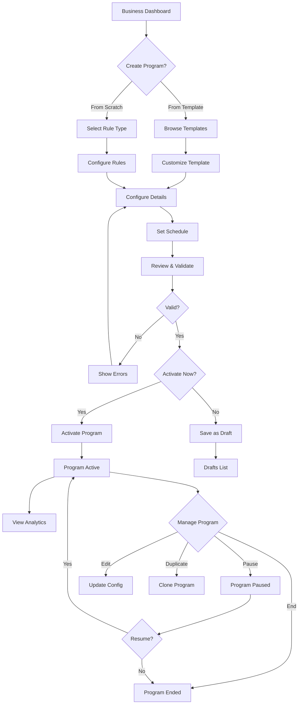

# Loyalty Programs

**Status**: 🟢 Approved
**Priority**: P0 (Critical - MVP Requirement)
**Phase**: Phase 1
**Teams**: Backend, Web, Mobile, AI/MCP, Infrastructure
**Estimated Effort**: 4 weeks
**Target Release**: 2026-Q1

## Overview

### Problem Statement

**Business owners** need to create, configure, and manage loyalty programs that match their specific business model and customer engagement strategy. Currently, there is no flexible system that supports multiple rule types (points, punch cards, tiers, etc.) with customizable configurations while maintaining ease of use.

### Solution Summary

Provide a comprehensive loyalty program management system that allows businesses to:
- Create programs from templates or scratch
- Configure multiple rule types (6 types: POINTS_BASED, PUNCH_CARD, AMOUNT_SPENT, TIER_BASED, VISIT_FREQUENCY, STAMP_CARD)
- Manage program lifecycle (draft, active, paused, ended)
- Track program performance and customer engagement
- Configure rewards and redemption rules
- Support time-based activation and expiration

### Success Criteria

- [ ] Metric 1: 95% of businesses create at least one active program within 24 hours of signup
- [ ] Metric 2: <5 seconds to create a program from template
- [ ] Metric 3: Support 10,000+ concurrent active programs per instance
- [ ] Metric 4: 99.99% program configuration validation accuracy (no runtime errors)
- [ ] Metric 5: <200ms API response time for program CRUD operations (p95)

## User Stories

### Primary User Story

**As a** business owner
**I want** to create and manage loyalty programs with flexible rule configurations
**So that** I can reward customers in ways that match my business model and increase retention

**Acceptance Criteria**:
- [ ] Given I'm on the program creation page, when I select a template, then I see the pre-configured rule settings
- [ ] Given I've selected a template, when I customize the configuration, then validation provides immediate feedback
- [ ] Given I've configured a program, when I activate it, then customers can immediately start earning rewards
- [ ] Given I have an active program, when I pause it, then customers cannot earn new rewards but retain existing progress
- [ ] Given I have a program, when I view analytics, then I see enrollment count, active participants, and redemption rates

### Secondary User Stories

**As a** multi-location business owner
**I want** to create programs that work across all my locations
**So that** customers can earn and redeem rewards at any location

**Acceptance Criteria**:
- [ ] Given I have multiple locations, when I create a program, then I can select which locations participate
- [ ] Given a customer visits any participating location, when they make a purchase, then their loyalty progress updates
- [ ] Given a customer has rewards, when they visit any participating location, then they can redeem

**As a** business owner with seasonal campaigns
**I want** to schedule program start and end dates
**So that** I can run limited-time promotions without manual intervention

**Acceptance Criteria**:
- [ ] Given I'm creating a program, when I set start and end dates, then the program auto-activates and auto-expires
- [ ] Given a program has an end date, when the date is reached, then customers receive notifications about expiring rewards
- [ ] Given a program has ended, when I view it, then I can duplicate it for a new campaign

## Requirements

### Functional Requirements

**Must Have (MVP - Phase 1)**:
- [ ] CRUD operations for loyalty programs
- [ ] Support 6 rule types with validation:
  - POINTS_BASED (earn points per dollar spent)
  - PUNCH_CARD (fixed number of punches for reward)
  - AMOUNT_SPENT (threshold-based rewards)
  - TIER_BASED (customer tier progression)
  - VISIT_FREQUENCY (reward for consecutive visits)
  - STAMP_CARD (collect stamps for reward)
- [ ] Rule configuration validation per rule type
- [ ] Program lifecycle management (draft → active → paused → ended)
- [ ] Template-based program creation
- [ ] Custom program creation
- [ ] Business ownership validation
- [ ] Multi-location support
- [ ] Time-based activation (startsAt/endsAt)
- [ ] Soft delete support
- [ ] Program analytics (enrollment, participation, redemptions)

**Should Have (Phase 1)**:
- [ ] Program duplication (clone existing program)
- [ ] Bulk program operations (activate/pause multiple)
- [ ] Program versioning (track configuration changes)
- [ ] A/B testing support (run multiple variations)
- [ ] Customer segmentation (target specific customer groups)
- [ ] Advanced scheduling (recurring campaigns, blackout dates)

**Could Have (Phase 2+)**:
- [ ] Multi-rule programs (combine multiple rule types)
- [ ] Dynamic rule adjustment based on performance
- [ ] AI-recommended configuration optimization
- [ ] Gamification elements (achievements, badges, leaderboards)
- [ ] Social sharing incentives
- [ ] Partner network integration (cross-business programs)

**Won't Have (Explicitly Out of Scope)**:
- ❌ Real-time rule engine changes (requires program restart)
- ❌ Customer-specific rule customization (handled by customer segments)
- ❌ Blockchain/NFT features (Phase 4)
- ❌ Custom scripting for rules (security concern, Phase 3+)

### Non-Functional Requirements

**Performance**:
- API response time: <200ms for CRUD operations (p95)
- Program activation: <1 second
- Bulk operations: Support 100+ programs per request
- Concurrent programs: 10,000+ active programs per instance
- Configuration validation: <50ms per rule type

**Security**:
- Authentication: JWT required for all endpoints
- Authorization: Business owners can only manage their own programs
- Input validation: Strict JSON schema validation for rule configurations
- Rate limiting: 100 requests per minute per business
- Audit logging: Track all program configuration changes

**Scalability**:
- Horizontal scaling: Stateless API design
- Database: Indexed queries for program lookups (businessId, ruleType, isActive)
- Caching: Redis cache for active program configurations (5-minute TTL)
- Read replicas: Program queries use read-only replicas

**Availability**:
- Uptime SLA: 99.9%
- Degraded mode: Read-only mode if database primary fails
- Monitoring: Alerts for program creation failures, validation errors
- Backup: Daily snapshots, point-in-time recovery

**Data Integrity**:
- Transaction safety: Program state changes are atomic
- Validation: Prevent invalid configurations from being saved
- Referential integrity: Cascade deletes to related entities (balances, rewards)
- Audit trail: Complete history of program modifications

## User Experience

### User Flow Diagram



### Wireframes / Mockups

**Program Creation Flow**:
1. **Step 1: Choose Template or Rule Type**
   - Grid of templates by industry
   - "Create from Scratch" option with rule type selector

2. **Step 2: Configure Rules**
   - Dynamic form based on rule type
   - Real-time validation with helpful error messages
   - Preview panel showing customer experience

3. **Step 3: Program Details**
   - Program name and description
   - Location selection (multi-select)
   - Schedule settings (start/end dates, timezone)

4. **Step 4: Review & Activate**
   - Summary of all settings
   - Validation checklist
   - "Save as Draft" or "Activate Now" buttons

**Program Management Dashboard**:
- List view with filters (status, rule type, location)
- Quick actions (activate, pause, edit, duplicate, analytics)
- Bulk selection for multi-program operations
- Search by name or ID

### UI Copy

**Page Title**: "Loyalty Programs"
**Primary CTA**: "Create Program"
**Help Text**: "Create loyalty programs to reward customers for purchases, visits, or referrals. Choose from pre-configured templates or build your own custom program."

**Status Labels**:
- 🟡 Draft - "Not visible to customers"
- 🟢 Active - "Customers can enroll and earn rewards"
- 🟠 Paused - "New earning disabled, existing progress retained"
- 🔴 Ended - "Archived, customers notified"

**Validation Messages**:
- "Minimum purchase amount must be greater than $0"
- "Punches required must be between 2 and 50"
- "Points per dollar must be a positive number"
- "End date must be after start date"

## Technical Design

### Architecture Overview

```
┌─────────────────────────────────────────────────────────────┐
│                    Web/Mobile UI Layer                      │
│  - Program Creation Wizard                                  │
│  - Program Management Dashboard                             │
│  - Analytics & Reporting                                    │
└────────────────────┬────────────────────────────────────────┘
                     │
                     ▼
┌─────────────────────────────────────────────────────────────┐
│                 Backend API Layer (NestJS)                  │
│  ┌─────────────────────────────────────────────────────┐   │
│  │        LoyaltyProgramController                     │   │
│  │  - POST /programs (create)                          │   │
│  │  - GET /programs (list with filters)                │   │
│  │  - GET /programs/{id} (details)                     │   │
│  │  - PUT /programs/{id} (update)                      │   │
│  │  - DELETE /programs/{id} (soft delete)              │   │
│  │  - POST /programs/{id}/activate                     │   │
│  │  - POST /programs/{id}/pause                        │   │
│  │  - POST /programs/{id}/duplicate                    │   │
│  └─────────────────────┬───────────────────────────────┘   │
│                        ▼                                    │
│  ┌─────────────────────────────────────────────────────┐   │
│  │        LoyaltyProgramService                        │   │
│  │  - Configuration validation per rule type           │   │
│  │  - Business ownership checks                        │   │
│  │  - Template application logic                       │   │
│  │  - State transition management                      │   │
│  │  - Analytics aggregation                            │   │
│  └─────────────────────┬───────────────────────────────┘   │
│                        ▼                                    │
│  ┌─────────────────────────────────────────────────────┐   │
│  │        LoyaltyProgramRepository                     │   │
│  │  - CRUD operations via Prisma                       │   │
│  │  - Query optimization with indexes                  │   │
│  │  - Soft delete support                              │   │
│  └─────────────────────┬───────────────────────────────┘   │
└────────────────────────┼────────────────────────────────────┘
                         │
                         ▼
┌─────────────────────────────────────────────────────────────┐
│                PostgreSQL Database                          │
│  - loyalty_programs table                                   │
│  - loyalty_rule_templates table                             │
│  - loyalty_balances table (related)                         │
│  - rewards table (related)                                  │
└─────────────────────────────────────────────────────────────┘
                         │
                         ▼
┌─────────────────────────────────────────────────────────────┐
│                   Redis Cache Layer                         │
│  - Active program configurations (5-min TTL)                │
│  - Rule validation schemas (1-hour TTL)                     │
└─────────────────────────────────────────────────────────────┘
                         │
                         ▼
┌─────────────────────────────────────────────────────────────┐
│                Event Bus (AsyncAPI)                         │
│  - loyalty.program.created                                  │
│  - loyalty.program.updated                                  │
│  - loyalty.program.activated                                │
│  - loyalty.program.paused                                   │
│  - loyalty.program.ended                                    │
└─────────────────────────────────────────────────────────────┘
```

### Domain Model

```typescript
// Core entities
interface LoyaltyProgram {
  id: string;
  businessId: string;
  name: string;
  description: string | null;
  ruleType: LoyaltyRuleType;
  ruleConfigDomain: LoyaltyRuleConfigDomain;
  ruleConfig: RuleConfig; // Type varies by ruleType
  isActive: boolean;
  startsAt: Date | null;
  endsAt: Date | null;
  createdAt: Date;
  updatedAt: Date;
  deletedAt: Date | null;

  // Computed fields (not in DB)
  status: ProgramStatus;
  enrollmentCount: number;
  activeParticipants: number;
  totalRedemptions: number;
}

// Rule type enumeration
enum LoyaltyRuleType {
  POINTS_BASED = 'POINTS_BASED',
  PUNCH_CARD = 'PUNCH_CARD',
  AMOUNT_SPENT = 'AMOUNT_SPENT',
  TIER_BASED = 'TIER_BASED',
  VISIT_FREQUENCY = 'VISIT_FREQUENCY',
  STAMP_CARD = 'STAMP_CARD'
}

// Rule configuration domain
enum LoyaltyRuleConfigDomain {
  SIMPLE = 'SIMPLE',
  ADVANCED = 'ADVANCED',
  PREMIUM = 'PREMIUM'
}

// Program status (derived from isActive, startsAt, endsAt)
enum ProgramStatus {
  DRAFT = 'DRAFT',           // isActive = false, no startsAt
  SCHEDULED = 'SCHEDULED',   // isActive = true, startsAt > now
  ACTIVE = 'ACTIVE',         // isActive = true, startsAt <= now < endsAt
  PAUSED = 'PAUSED',         // isActive = false, has startsAt
  ENDED = 'ENDED'            // endsAt <= now or deletedAt !== null
}

// Rule-specific configurations
interface PointsBasedConfig {
  pointsPerDollar: number;                    // e.g., 10 points per $1
  minimumPurchaseAmount?: number;             // e.g., $5 minimum
  categoryMultipliers?: Record<string, number>; // e.g., { "wine": 2.0 }
  redemptionRate: number;                     // e.g., 100 points = $1
  expirationMonths?: number;                  // e.g., points expire after 12 months
}

interface PunchCardConfig {
  punchesRequired: number;                    // e.g., 8 punches
  minimumPurchaseAmount?: number;             // e.g., $3.50 per punch
  rewardType: 'free_item' | 'discount' | 'credit';
  rewardValue: string | number;               // e.g., "free_coffee" or 5.00
  rewardDescription: string;                  // e.g., "Free coffee of any size"
  categoryFilter?: string;                    // e.g., "coffee" category only
  validHours?: { start: number; end: number }; // e.g., 6 AM to 2 PM
}

interface AmountSpentConfig {
  thresholdAmount: number;                    // e.g., $100 spent
  rewardType: 'discount' | 'credit' | 'free_item';
  rewardValue: string | number;               // e.g., 10 (for 10% discount)
  rewardDescription: string;
  resetPeriod?: 'monthly' | 'quarterly' | 'yearly' | 'lifetime';
}

interface TierBasedConfig {
  tiers: {
    name: string;                             // e.g., "Silver", "Gold", "Platinum"
    threshold: {
      type: 'spending' | 'visits' | 'points';
      value: number;
      period: 'monthly' | 'quarterly' | 'yearly' | 'lifetime';
    };
    benefits: string[];                       // e.g., ["late_checkout", "wifi"]
    multipliers?: Record<string, number>;     // e.g., { "points": 1.5 }
  }[];
  evaluationPeriod: 'monthly' | 'quarterly' | 'yearly';
  degradationRules?: {
    enabled: boolean;
    gracePeriodMonths: number;
  };
}

interface VisitFrequencyConfig {
  visitsRequired: number;                     // e.g., 5 visits
  withinDays: number;                         // e.g., within 30 days
  consecutiveRequired?: boolean;              // e.g., must be consecutive
  rewardType: 'discount' | 'credit' | 'free_item';
  rewardValue: string | number;
  rewardDescription: string;
}

interface StampCardConfig {
  stampsRequired: number;                     // e.g., 12 stamps
  stampEarnRule: {
    type: 'per_visit' | 'per_item' | 'per_dollar';
    value: number;                            // e.g., 1 stamp per visit
  };
  rewardType: 'free_item' | 'discount' | 'credit';
  rewardValue: string | number;
  rewardDescription: string;
  categoryFilter?: string;
}

// Union type for all rule configs
type RuleConfig =
  | PointsBasedConfig
  | PunchCardConfig
  | AmountSpentConfig
  | TierBasedConfig
  | VisitFrequencyConfig
  | StampCardConfig;
```

### Database Schema Changes

**Existing Tables** (no changes needed - already exists in Ploy):

```sql
-- loyalty_programs table already exists
-- See schema.prisma lines 479-518

-- Key fields:
-- - id (UUID, primary key)
-- - businessId (UUID, foreign key to businesses)
-- - name (VARCHAR)
-- - description (TEXT, nullable)
-- - ruleType (ENUM: LoyaltyRuleType)
-- - ruleConfigDomain (ENUM: LoyaltyRuleConfigDomain)
-- - ruleConfig (JSONB)
-- - isActive (BOOLEAN, default true)
-- - startsAt (TIMESTAMP, nullable)
-- - endsAt (TIMESTAMP, nullable)
-- - createdAt, updatedAt, deletedAt

-- Indexes:
CREATE INDEX idx_programs_business_active ON loyalty_programs(businessId, isActive);
CREATE INDEX idx_programs_rule_type ON loyalty_programs(ruleType);
CREATE INDEX idx_programs_rule_type_domain ON loyalty_programs(ruleType, ruleConfigDomain);
CREATE INDEX idx_programs_deleted ON loyalty_programs(deletedAt);
```

**New Migration** (for NxLoy):

```sql
-- Migration: 001_loyalty_programs.sql
-- Create loyalty_programs table in NxLoy

CREATE TYPE loyalty_rule_type AS ENUM (
  'POINTS_BASED',
  'PUNCH_CARD',
  'AMOUNT_SPENT',
  'TIER_BASED',
  'VISIT_FREQUENCY',
  'STAMP_CARD'
);

CREATE TYPE loyalty_rule_config_domain AS ENUM (
  'SIMPLE',
  'ADVANCED',
  'PREMIUM'
);

CREATE TABLE loyalty_programs (
  id UUID PRIMARY KEY DEFAULT gen_random_uuid(),
  business_id UUID NOT NULL REFERENCES businesses(id) ON DELETE CASCADE,
  name VARCHAR(255) NOT NULL,
  description TEXT,
  rule_type loyalty_rule_type NOT NULL,
  rule_config_domain loyalty_rule_config_domain NOT NULL,
  rule_config JSONB NOT NULL,
  is_active BOOLEAN NOT NULL DEFAULT true,
  starts_at TIMESTAMP,
  ends_at TIMESTAMP,
  created_at TIMESTAMP NOT NULL DEFAULT NOW(),
  updated_at TIMESTAMP NOT NULL DEFAULT NOW(),
  deleted_at TIMESTAMP,

  -- Denormalized fields for query performance (optional)
  config_type VARCHAR(50),
  reward_type VARCHAR(50),
  punches_required INTEGER,
  stamps INTEGER,
  points_per_dollar DECIMAL(10, 2),
  visits_required INTEGER,
  threshold_amount INTEGER,

  CONSTRAINT valid_date_range CHECK (starts_at IS NULL OR ends_at IS NULL OR starts_at < ends_at)
);

-- Indexes for performance
CREATE INDEX idx_programs_business_active ON loyalty_programs(business_id, is_active) WHERE deleted_at IS NULL;
CREATE INDEX idx_programs_rule_type ON loyalty_programs(rule_type) WHERE deleted_at IS NULL;
CREATE INDEX idx_programs_rule_type_domain ON loyalty_programs(rule_type, rule_config_domain) WHERE deleted_at IS NULL;
CREATE INDEX idx_programs_deleted ON loyalty_programs(deleted_at);
CREATE INDEX idx_programs_schedule ON loyalty_programs(starts_at, ends_at) WHERE is_active = true;

-- Trigger for updated_at
CREATE TRIGGER update_loyalty_programs_updated_at
BEFORE UPDATE ON loyalty_programs
FOR EACH ROW
EXECUTE FUNCTION update_updated_at_column();
```

### API Endpoints

**See CONTRACTS.md for full OpenAPI specification**

Summary of endpoints:

**Program CRUD**:
- `POST /api/v1/loyalty/programs` - Create program (from template or scratch)
- `GET /api/v1/loyalty/programs` - List programs (with filters: status, ruleType, locationId)
- `GET /api/v1/loyalty/programs/{id}` - Get program details with analytics
- `PUT /api/v1/loyalty/programs/{id}` - Update program configuration
- `DELETE /api/v1/loyalty/programs/{id}` - Soft delete program

**Program Lifecycle**:
- `POST /api/v1/loyalty/programs/{id}/activate` - Activate program
- `POST /api/v1/loyalty/programs/{id}/pause` - Pause program
- `POST /api/v1/loyalty/programs/{id}/resume` - Resume paused program
- `POST /api/v1/loyalty/programs/{id}/end` - End program permanently

**Program Operations**:
- `POST /api/v1/loyalty/programs/{id}/duplicate` - Clone program
- `GET /api/v1/loyalty/programs/{id}/analytics` - Get program analytics
- `POST /api/v1/loyalty/programs/{id}/validate` - Validate configuration without saving

**Request/Response Examples**:

```typescript
// POST /api/v1/loyalty/programs
// Create punch card program
{
  "name": "Coffee Punch Card",
  "description": "Buy 8 coffees, get the 9th free",
  "ruleType": "PUNCH_CARD",
  "ruleConfigDomain": "SIMPLE",
  "ruleConfig": {
    "punchesRequired": 8,
    "minimumPurchaseAmount": 3.50,
    "rewardType": "free_item",
    "rewardValue": "free_coffee",
    "rewardDescription": "Free coffee of any size",
    "categoryFilter": "coffee",
    "validHours": { "start": 6, "end": 14 }
  },
  "startsAt": "2026-01-01T00:00:00Z",
  "endsAt": null,
  "isActive": true
}

// Response 201 Created
{
  "id": "550e8400-e29b-41d4-a716-446655440000",
  "businessId": "123e4567-e89b-12d3-a456-426614174000",
  "name": "Coffee Punch Card",
  "description": "Buy 8 coffees, get the 9th free",
  "ruleType": "PUNCH_CARD",
  "ruleConfigDomain": "SIMPLE",
  "ruleConfig": { /* as above */ },
  "isActive": true,
  "startsAt": "2026-01-01T00:00:00Z",
  "endsAt": null,
  "status": "SCHEDULED",
  "createdAt": "2025-11-06T10:30:00Z",
  "updatedAt": "2025-11-06T10:30:00Z"
}

// GET /api/v1/loyalty/programs?status=ACTIVE&ruleType=POINTS_BASED
// List active points-based programs

// Response 200 OK
{
  "data": [
    {
      "id": "...",
      "name": "Rewards Points Program",
      "ruleType": "POINTS_BASED",
      "status": "ACTIVE",
      "enrollmentCount": 1250,
      "activeParticipants": 832,
      "createdAt": "2025-10-01T00:00:00Z"
    }
  ],
  "pagination": {
    "page": 1,
    "pageSize": 20,
    "totalPages": 3,
    "totalCount": 47
  }
}
```

### Domain Events

**See CONTRACTS.md for full AsyncAPI specification**

Summary of events:

**Program Lifecycle Events**:
- `loyalty.program.created` - When program is created (draft or active)
- `loyalty.program.updated` - When program configuration changes
- `loyalty.program.activated` - When program transitions to active
- `loyalty.program.paused` - When program is paused
- `loyalty.program.resumed` - When paused program is resumed
- `loyalty.program.ended` - When program ends (scheduled or manual)
- `loyalty.program.deleted` - When program is soft deleted

**Event Payloads**:

```typescript
// loyalty.program.created
{
  eventId: "uuid",
  eventType: "loyalty.program.created",
  timestamp: "2025-11-06T10:30:00Z",
  payload: {
    programId: "uuid",
    businessId: "uuid",
    name: "Coffee Punch Card",
    ruleType: "PUNCH_CARD",
    status: "SCHEDULED",
    startsAt: "2026-01-01T00:00:00Z"
  }
}

// loyalty.program.activated
{
  eventId: "uuid",
  eventType: "loyalty.program.activated",
  timestamp: "2026-01-01T00:00:00Z",
  payload: {
    programId: "uuid",
    businessId: "uuid",
    name: "Coffee Punch Card",
    ruleType: "PUNCH_CARD",
    activatedBy: "system", // or "user:uuid"
    previousStatus: "SCHEDULED"
  }
}
```

## Dependencies

### Internal Dependencies

- **Loyalty Templates**: Programs can be created from templates (parallel development OK)
- **Business Management**: Programs belong to businesses (must exist first)
- **Authentication**: JWT tokens for API access (must exist first)
- **Authorization**: Business ownership validation (must exist first)

### External Dependencies

- **Prisma ORM**: Database access layer
- **NestJS**: Backend framework
- **PostgreSQL 14+**: Database with JSONB support
- **Redis**: Caching layer for active programs

### Blocked By

- [ ] Business entity must exist (User → Business relationship)
- [ ] Authentication system must be complete (JWT tokens)
- [ ] Database migrations infrastructure must be set up

### Blocks

- [ ] Loyalty Balance tracking (needs program to exist)
- [ ] Reward redemption (needs program configuration)
- [ ] Customer enrollment (needs active program)
- [ ] Transaction processing with loyalty (needs program rules)

## Testing Strategy

### Unit Tests

**Backend**:
- LoyaltyProgramService methods:
  - `createProgram()` with all rule types
  - `validateRuleConfig()` for each rule type
  - `updateProgram()` with state transitions
  - `activateProgram()` with date validations
  - `pauseProgram()` and `resumeProgram()`
  - `duplicateProgram()` with config cloning
  - `deleteProgram()` with soft delete
- LoyaltyProgramController endpoints:
  - Request validation (DTOs)
  - Authorization checks
  - Error handling (404, 400, 403)
- Rule validators:
  - PointsBasedValidator
  - PunchCardValidator
  - AmountSpentValidator
  - TierBasedValidator
  - VisitFrequencyValidator
  - StampCardValidator

**Frontend (Web)**:
- ProgramForm component:
  - Rule type selection
  - Dynamic form rendering
  - Real-time validation
  - Template application
- ProgramList component:
  - Filtering and sorting
  - Status badge rendering
  - Bulk operations
- ProgramAnalytics component:
  - Data visualization
  - Metric calculations

**Coverage Target**: >80% (100% for rule validators and state transitions)

### Integration Tests

**API Integration**:
- Full program lifecycle (create → activate → pause → resume → end)
- Template-to-program flow
- Program duplication with config inheritance
- Soft delete and restoration
- Concurrent program activation
- Invalid configuration rejection

**Database Integration**:
- JSONB query performance
- Index effectiveness
- Cascade delete behavior
- Transaction rollback on errors

**Event Integration**:
- Event publishing on state changes
- Event ordering guarantees
- Event payload validation

### End-to-End Tests

See `ACCEPTANCE.feature` for Gherkin scenarios.

**Critical Flows**:
1. Business creates punch card program from template
2. Business customizes points-based program and activates
3. Business schedules seasonal campaign with start/end dates
4. Business pauses program, customers retain progress
5. Business duplicates successful program for new location
6. System auto-activates scheduled program at start time
7. System auto-ends program at end time with customer notifications

### Performance Tests

**Load Test**:
- 1,000 concurrent program creations
- 10,000 concurrent program queries (list with filters)
- 500 concurrent program updates
- Target: <200ms p95 response time

**Stress Test**:
- 10,000 active programs per business
- 100,000 total active programs in system
- 1,000 requests per second (mixed CRUD operations)

**Endurance Test**:
- 24-hour continuous operation
- Monitor memory leaks
- Validate cache effectiveness
- Check database connection pool health

## Rollout Plan

### Phase 1: Development (Week 1-2)

**Backend**:
- Implement LoyaltyProgramService with all rule validators
- Create LoyaltyProgramController with DTOs
- Write unit tests (target: 80% coverage)
- Implement event publishing

**Web**:
- Build ProgramForm component with dynamic rule config
- Create ProgramList with filters and bulk operations
- Implement ProgramAnalytics dashboard
- Wire up API integration

**Mobile**:
- Create program listing screen
- Implement program detail view (read-only for Phase 1)
- Add program status indicators

**Infrastructure**:
- Set up database migration
- Configure Redis caching
- Set up monitoring and alerts

### Phase 2: Testing (Week 3)

- Unit tests passing (>80% coverage)
- Integration tests passing (all API endpoints)
- E2E tests passing (critical user flows)
- Performance tests passing (load, stress, endurance)
- Security audit (authorization, input validation)

### Phase 3: Staging Deployment (Week 4)

- Deploy to staging environment
- QA testing with test businesses
- Bug fixes and refinements
- Documentation review
- Load testing with production-like data

### Phase 4: Production Rollout (Week 5)

**Gradual Rollout**:
- Day 1: 5% of businesses (early adopters)
- Day 3: 25% of businesses
- Day 5: 50% of businesses
- Day 7: 100% of businesses

**Rollback Plan**:
- Feature flag: `LOYALTY_PROGRAMS_ENABLED` (can disable immediately)
- Database rollback: Migration scripts prepared
- Monitoring: Alerts for high error rates or slow queries
- Degraded mode: Read-only access if issues detected

### Phase 5: Post-Launch (Week 6+)

- Monitor success metrics (program creation rate, activation rate)
- Collect user feedback (in-app surveys)
- Iterate based on data (common configuration errors, popular rule types)
- Document lessons learned
- Plan Phase 2 features (multi-rule programs, AI optimization)

## Monitoring & Analytics

### Metrics to Track

**Usage Metrics**:
- Programs created per day (total, per rule type)
- Programs activated vs. saved as draft
- Template usage rate vs. custom creation rate
- Average time from creation to activation
- Program duplication rate

**Performance Metrics**:
- API response time (p50, p95, p99) per endpoint
- Database query time (slow query log)
- Cache hit rate (Redis)
- Error rate (4xx, 5xx)
- Event publishing latency

**Business Metrics**:
- Average programs per business
- Program activation rate (activated / created)
- Program engagement rate (customers enrolled / program created)
- Configuration error rate (validation failures / attempts)
- Support ticket volume (program-related issues)

### Dashboards

**Grafana Dashboards**:
- Loyalty Programs Overview (creation rate, active programs, rule type distribution)
- API Performance (response times, error rates, throughput)
- Database Performance (query times, connection pool, cache hit rate)
- Business Health (programs per business, activation rate, engagement)

**Datadog Dashboards** (optional):
- Real-time monitoring (latency, errors, throughput)
- Alerting (SLO violations, anomaly detection)

### Alerts

**Critical Alerts** (page on-call engineer):
- Error rate >1% for 5 minutes
- Response time >1 second (p95) for 5 minutes
- Database connection pool exhausted
- Redis cache unavailable

**Warning Alerts** (Slack notification):
- Error rate >0.5% for 10 minutes
- Response time >500ms (p95) for 10 minutes
- Cache hit rate <80% for 30 minutes
- Slow query detected (>1 second)

## Documentation

### User-Facing Documentation

- [ ] Help article: "How to Create a Loyalty Program"
- [ ] Help article: "Understanding Loyalty Rule Types"
- [ ] Help article: "Managing Program Lifecycle (Pause, Resume, End)"
- [ ] Video tutorial: "Creating Your First Loyalty Program in 5 Minutes"
- [ ] FAQ: Common questions about program configuration

### Developer Documentation

- [ ] API documentation: OpenAPI spec updated (CONTRACTS.md)
- [ ] Code comments: All public methods documented
- [ ] Architecture decision: ADR for rule validation strategy
- [ ] Runbook: Operations guide (deployment, rollback, troubleshooting)
- [ ] Database schema: Entity-relationship diagram

## Risks & Mitigation

### Risk 1: Configuration Complexity Overwhelming Users

**Probability**: Medium
**Impact**: High

**Description**: Users may struggle with the flexibility of rule configurations, leading to invalid setups or abandoned creation flows.

**Mitigation**:
- Provide smart defaults for all rule types
- Show real-time validation with helpful error messages
- Offer preview mode to see customer experience
- Include templates for common use cases (80% coverage)
- Add in-app guidance (tooltips, contextual help)
- Track validation error patterns and improve UX

### Risk 2: Database Performance Degradation with Large JSONB Configs

**Probability**: Low
**Impact**: High

**Description**: JSONB queries on `ruleConfig` field may become slow as program count grows.

**Mitigation**:
- Denormalize frequently-queried fields (e.g., `punchesRequired`, `pointsPerDollar`)
- Add GIN indexes on JSONB fields for common queries
- Use Redis caching for active program configs (5-minute TTL)
- Implement read replicas for query-heavy operations
- Monitor slow query log and optimize as needed
- Load test with 100,000+ programs before launch

### Risk 3: Invalid Configurations Slipping Through Validation

**Probability**: Low
**Impact**: High

**Description**: Edge cases in rule configurations may not be caught by validation, causing runtime errors.

**Mitigation**:
- Comprehensive unit tests for all validators (100% coverage)
- Schema validation using JSON Schema or Zod
- Integration tests with malformed configs
- Monitor runtime errors and add validation retroactively
- Feature flag for rule type rollout (enable incrementally)
- Sandbox mode for testing configurations without affecting customers

### Risk 4: State Transition Bugs (e.g., Pause → Active Instead of Resume)

**Probability**: Medium
**Impact**: Medium

**Description**: Complex state transitions may have bugs, causing programs to enter invalid states.

**Mitigation**:
- Implement state machine pattern for lifecycle management
- Unit tests for all state transitions (100% coverage)
- Database constraints to prevent invalid states
- Audit logging for all state changes
- Rollback capability if invalid state detected
- Integration tests for full lifecycle flows

## Open Questions

- [ ] **Question 1**: Should businesses be able to run multiple programs simultaneously, or enforce one active program per rule type?
  - **Decision Deadline**: Week 1 of development
  - **Decision Owner**: Product team
  - **Recommendation**: Allow multiple programs but warn if similar rule types (may confuse customers)

- [ ] **Question 2**: How should we handle programs with overlapping schedules (e.g., two active punch card programs)?
  - **Decision Deadline**: Week 1 of development
  - **Decision Owner**: Product team
  - **Recommendation**: Allow but provide priority/ordering mechanism

- [ ] **Question 3**: Should program configuration changes apply retroactively to existing customer balances?
  - **Decision Deadline**: Week 2 of development
  - **Decision Owner**: Engineering + Product
  - **Recommendation**: No retroactive changes (create new program version instead)

- [ ] **Question 4**: What happens to customer balances when a program is deleted?
  - **Decision Deadline**: Week 2 of development
  - **Decision Owner**: Product team
  - **Recommendation**: Soft delete program, retain balances for 90 days (grace period for redemption)

## Stakeholders

### Accountable

- **Product Owner**: [Name] - Final approval
- **Engineering Lead**: [Name] - Technical approval

### Responsible

- **Backend Lead**: [Name] - Service implementation, validation logic
- **Frontend Lead**: [Name] - UI/UX implementation
- **Mobile Lead**: [Name] - Mobile app screens

### Consulted

- **UX Designer**: [Name] - Design review, usability testing
- **QA Lead**: [Name] - Testing strategy, acceptance criteria

### Informed

- **Customer Success**: [Name] - Notified of launch, training materials
- **Marketing**: [Name] - Announcement coordination
- **Sales**: [Name] - Feature demo preparation

## Timeline

| Milestone | Date | Owner | Status |
|-----------|------|-------|--------|
| Spec approval | 2025-W45 | Product | 🟢 Approved |
| Contract freeze | 2025-W46 | Backend | 🟡 Pending |
| Development complete | 2025-W49 | Engineering | 🟡 Pending |
| Testing complete | 2025-W50 | QA | 🟡 Pending |
| Staging deployment | 2025-W51 | DevOps | 🟡 Pending |
| Production launch | 2026-W02 | Product | 🟡 Pending |

## References

### Related Documents

- [ADR-0002: Contract-First Development](/docs/adr/0002-contract-first-development.md)
- [Feature Spec: Loyalty Templates](/docs/requirements/features/loyalty-templates/FEATURE-SPEC.md)
- [Domain Specification: Loyalty System](/docs/requirements/domain-specs/loyalty/DOMAIN-OVERVIEW.md)
- [CONTRACTS.md: OpenAPI Specification](/docs/contracts/CONTRACTS.md)

### External References

- [Prisma JSONB Documentation](https://www.prisma.io/docs/concepts/components/prisma-client/working-with-json)
- [NestJS Validation Documentation](https://docs.nestjs.com/techniques/validation)
- [PostgreSQL JSONB Performance](https://www.postgresql.org/docs/current/datatype-json.html)

## Change Log

| Date | Version | Changes | Author |
|------|---------|---------|--------|
| 2025-11-06 | 1.0.0 | Initial draft | Ploy Lab |

---

**Last Updated**: 2025-11-06
**Next Review**: 2025-11-13
**Document Owner**: Backend Team
