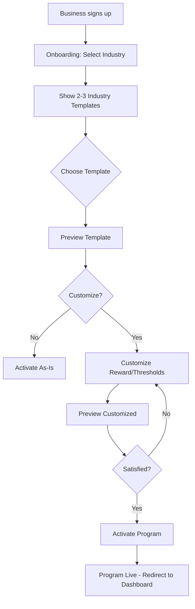

# Loyalty Templates

**Status**: 🟢 Approved
**Priority**: P0 (Critical - MVP Requirement)
**Phase**: Phase 1
**Teams**: Backend, Web, Mobile, Infrastructure
**Estimated Effort**: 2 weeks
**Target Release**: Phase 1 MVP (Month 3)

## Overview

### Problem Statement

**Business owners** need to launch loyalty programs quickly without technical expertise or loyalty program knowledge. Currently, creating a program from scratch requires:
- Understanding different loyalty mechanisms (points vs punch cards vs tiers)
- Configuring complex rules and thresholds
- Choosing appropriate reward structures
- Setting up terminology that resonates with customers

This process takes 2-4 hours and has a 40% abandonment rate, blocking customer acquisition.

### Solution Summary

Provide **21 pre-configured industry templates** that businesses can:
- Browse by industry category
- Preview with realistic examples
- Customize in under 10 minutes
- Launch immediately

Each template includes:
- Industry-appropriate loyalty rule type
- Pre-configured earning thresholds
- Sample reward definitions
- Industry-specific terminology
- Estimated ROI benchmarks

### Success Criteria

- [x] 80% of new businesses use templates (vs creating from scratch)
- [x] <10 minutes from signup to first program launch
- [x] >90% satisfaction score for template users
- [x] <5% customization abandonment rate
- [x] 21 industry templates available at launch

## User Stories

### Primary User Story

**As a** new business owner signing up for NxLoy
**I want** to select a pre-configured loyalty template for my industry
**So that** I can launch a proven loyalty program in under 10 minutes

**Acceptance Criteria**:
- [x] Given I'm on the program creation page, when I select my industry (e.g., "Coffee Shop"), then I see 2-3 relevant templates
- [x] Given I've selected a template, when I preview it, then I see realistic example data (e.g., "Buy 10 coffees, get 1 free")
- [x] Given I've selected a template, when I click "Customize", then I can modify key settings (reward, thresholds) without breaking the logic
- [x] Given I've customized the template, when I click "Activate", then the program goes live within 60 seconds
- [x] Given the program is live, when a customer enrolls, then they see the customized terminology (e.g., "Coffee Punch Card" not "Loyalty Program")

### Secondary User Stories

**As a** business owner
**I want** to see estimated ROI for each template
**So that** I can choose the template most likely to succeed for my business

**Acceptance Criteria**:
- [x] Given I'm browsing templates, when I view template details, then I see "Estimated ROI: 15-25% increase in repeat visits"
- [x] Given I'm comparing templates, when I switch between them, then I can see how ROI estimates differ

**As a** business owner in a niche industry
**I want** to use the "Other" template as a starting point
**So that** I can create a custom program when my industry isn't pre-configured

**Acceptance Criteria**:
- [x] Given no specific template matches my industry, when I select "Other", then I see a generic template I can fully customize
- [x] Given I've selected "Other", when I customize it, then I have full control over rule type, terminology, and thresholds

## Requirements

### Functional Requirements

**Must Have (MVP)**:
- [x] 21 industry templates pre-seeded in database
- [x] Template listing API (`GET /api/v1/templates`)
- [x] Template detail API (`GET /api/v1/templates/{id}`)
- [x] Filter templates by industry
- [x] Create loyalty program from template (`POST /api/v1/programs` with `templateId`)
- [x] Customization of key template parameters (reward, thresholds, terminology)
- [x] Template preview with realistic example data

**Should Have (Phase 1)**:
- [x] Template search by name or keyword
- [x] Template popularity ranking (most used templates first)
- [x] Template success metrics (avg ROI from existing users)
- [ ] Template versioning (for future updates)

**Could Have (Phase 2+)**:
- [ ] User-submitted templates (community marketplace)
- [ ] A/B testing templates (compare performance)
- [ ] AI-recommended templates based on business characteristics
- [ ] Template analytics (which customizations perform best)

**Won't Have (Explicitly Out of Scope)**:
- ❌ Custom template creation UI (businesses use "Other" and customize)
- ❌ Template sharing between businesses (privacy concerns)
- ❌ Paid premium templates (all templates free)

### Non-Functional Requirements

**Performance**:
- API response time: <100ms for template list (p95)
- Page load time: <1.5 seconds for template gallery
- Concurrent users: Support 1,000 simultaneous template browsers
- Database: Index on `industry` column for fast filtering

**Security**:
- Authentication: Not required for browsing templates (public)
- Authentication: Required for creating programs from templates (JWT)
- Data validation: All template customizations validated server-side
- Rate limiting: 100 requests/minute per IP for template browsing

**Scalability**:
- Horizontal scaling: Templates are read-only (easy to cache)
- Caching: Redis cache for template list (5 minute TTL)
- CDN: Template preview images served via CDN
- Database: Read replicas handle 99% of template queries

**Availability**:
- Uptime SLA: 99.9% (templates are critical for onboarding)
- Degraded mode: If database fails, serve cached templates
- Monitoring: Alerts if template list endpoint fails

## User Experience

### User Flow Diagram



### Wireframes / Mockups

**Template Gallery View**:
```
┌────────────────────────────────────────────┐
│  Choose Your Loyalty Program Template      │
├────────────────────────────────────────────┤
│  Filter: [Coffee ▾]  Search: [______]      │
├────────────────────────────────────────────┤
│  ┌─────────┐  ┌─────────┐  ┌─────────┐    │
│  │ ☕      │  │ ☕      │  │ 🏪     │    │
│  │ Coffee  │  │ Espresso│  │ Retail  │    │
│  │ Punch   │  │ Points  │  │ Points  │    │
│  │ Card    │  │ Program │  │ Program │    │
│  │         │  │         │  │         │    │
│  │ 10→1    │  │ 1pt/$1  │  │ 10pt/$1 │    │
│  │ [View]  │  │ [View]  │  │ [View]  │    │
│  └─────────┘  └─────────┘  └─────────┘    │
│                                            │
│  ROI: 15-25% ↑  ROI: 20-30% ↑  ROI: 15-20%│
└────────────────────────────────────────────┘
```

**Template Preview**:
```
┌────────────────────────────────────────────┐
│  Coffee Punch Card Template                │
├────────────────────────────────────────────┤
│  How it works:                             │
│  • Customers get a punch for each coffee   │
│  • After 10 punches, they get 1 free      │
│  • Card resets after reward redemption     │
│                                            │
│  Example:                                  │
│  "Buy 10 coffees, get 1 free!"            │
│                                            │
│  ┌──────────────────────────────────────┐  │
│  │ Coffee Punch Card                    │  │
│  │ ●●●●●●●○○○                          │  │
│  │ 7/10 punches                        │  │
│  └──────────────────────────────────────┘  │
│                                            │
│  Estimated ROI: 15-25% increase in visits  │
│                                            │
│  [Customize] [Activate As-Is]             │
└────────────────────────────────────────────┘
```

### UI Copy

**Page Title**: "Choose Your Loyalty Program Template"
**Primary CTA**: "Customize Template"
**Secondary CTA**: "Activate As-Is"
**Help Text**: "Start with a proven template customized for your industry. You can always change it later."
**Empty State**: "No templates found for this industry. Try the 'Other' template as a starting point."

## Technical Design

### Architecture Overview

```
┌─────────────┐     ┌─────────────┐     ┌─────────────┐
│   Web UI    │────▶│  Backend    │────▶│  Database   │
│  Template   │     │   API       │     │ (PostgreSQL)│
│   Gallery   │     │             │     │  templates  │
└─────────────┘     └─────────────┘     └─────────────┘
                           │
                           ▼
                    ┌─────────────┐
                    │Redis Cache  │
                    │(5min TTL)   │
                    └─────────────┘
```

### Domain Model

```typescript
// Domain entities
interface LoyaltyRuleTemplate {
  id: string;                       // UUID
  name: string;                     // "Coffee Punch Card"
  industry: BusinessIndustry;       // COFFEE, RETAIL, etc.
  ruleType: LoyaltyRuleType;       // PUNCH_CARD, POINTS_BASED, etc.
  config: TemplateConfig;          // Industry-specific configuration
  description: string;              // "Buy 10 coffees, get 1 free"
  estimatedROI: string;            // "15-25% increase in repeat visits"
  popularity: number;              // Usage count
  createdAt: Date;
  updatedAt: Date;
}

interface TemplateConfig {
  // Varies by ruleType
  // Example for PUNCH_CARD:
  requiredPunches?: number;        // 10
  reward?: RewardDefinition;       // { type: 'free_item', value: 'Free coffee' }
  terminology?: TemplateTerminology; // { cardName: 'Coffee Punch Card' }

  // Example for POINTS_BASED:
  pointsPerDollar?: number;        // 10
  minimumPurchase?: number;        // 5
  rewardThreshold?: number;        // 100 points
}

interface TemplateTerminology {
  cardName: string;                // "Coffee Punch Card"
  earnAction: string;              // "Get a punch"
  progressLabel: string;           // "punches earned"
  rewardLabel: string;             // "Free coffee"
}

interface RewardDefinition {
  type: 'free_item' | 'discount' | 'cashback';
  value: string | number;
}
```

### Database Schema Changes

**New Tables**:
```sql
CREATE TABLE loyalty_rule_templates (
  id UUID PRIMARY KEY DEFAULT gen_random_uuid(),
  name VARCHAR(255) NOT NULL,
  industry VARCHAR(50) NOT NULL,
  rule_type VARCHAR(50) NOT NULL,
  config JSONB NOT NULL,
  description TEXT,
  estimated_roi VARCHAR(255),
  popularity INTEGER DEFAULT 0,
  created_at TIMESTAMP DEFAULT NOW(),
  updated_at TIMESTAMP DEFAULT NOW()
);

CREATE INDEX idx_templates_industry ON loyalty_rule_templates(industry);
CREATE INDEX idx_templates_rule_type ON loyalty_rule_templates(rule_type);
CREATE INDEX idx_templates_popularity ON loyalty_rule_templates(popularity DESC);
```

**Modified Tables**:
```sql
-- Add template_id to loyalty_programs
ALTER TABLE loyalty_programs
ADD COLUMN template_id UUID REFERENCES loyalty_rule_templates(id);

CREATE INDEX idx_programs_template ON loyalty_programs(template_id);
```

**Seed Data** (see `packages/backend/prisma/seeds/templates.seed.ts`):
- 21 industry templates
- 1-3 templates per industry
- Realistic configurations

### API Endpoints

**See CONTRACTS.md for full OpenAPI specification**

Summary:
- `GET /api/v1/loyalty/templates` - List templates (filterable by industry, rule type)
- `GET /api/v1/loyalty/templates/{id}` - Get template details
- `POST /api/v1/loyalty/programs` - Create program from template (includes `templateId` field)

### Domain Events

**See CONTRACTS.md for full AsyncAPI specification**

Summary:
- `loyalty.program.created` - Published when program created from template (includes `templateId`)
- Template usage tracked via event subscriber to update `popularity` count

## Dependencies

### Internal Dependencies

- **Authentication**: User must be authenticated to create program from template
- **Business Profile**: Business must have completed profile to create program

### External Dependencies

- **None**: Templates are self-contained

### Blocked By

- [ ] Database schema migration must be deployed
- [ ] Authentication system must be complete

### Blocks

- [ ] Loyalty program creation (depends on templates being available)
- [ ] Onboarding flow (includes template selection)

## Testing Strategy

### Unit Tests

**Backend**:
- TemplateService.findAll() with industry filter
- TemplateService.findById() with invalid ID (404 error)
- TemplateService.createProgramFromTemplate() with customizations
- Template configuration validation

**Frontend**:
- TemplateCard component rendering
- TemplateGallery filtering by industry
- TemplatePreview displaying configuration
- TemplateCustomization form validation

**Coverage Target**: >85%

### Integration Tests

- GET /api/v1/templates returns 21 templates
- GET /api/v1/templates?industry=COFFEE returns only coffee templates
- POST /api/v1/programs with templateId creates program with template config
- POST /api/v1/programs with customized config overrides template defaults

### End-to-End Tests

See `ACCEPTANCE.feature` for Gherkin scenarios.

Example:
- Business owner browses templates by industry
- Business owner previews coffee shop template
- Business owner customizes reward from "1 free coffee" to "2 free coffees"
- Business owner activates program
- Customer enrolls and sees "Coffee Punch Card" (not generic "Loyalty Program")

### Performance Tests

- Load test: 1,000 concurrent users browsing templates
- Response time: <100ms for template list (p95)
- Cache hit rate: >95% for template list queries

## Rollout Plan

### Phase 1: Development (Week 1-2)

**Week 1**:
- Backend: Database schema migration
- Backend: Seed 21 industry templates
- Backend: Implement template APIs
- Web: Build template gallery UI
- Web: Build template preview UI

**Week 2**:
- Backend: Implement program creation from template
- Web: Build template customization UI
- Backend: Write unit and integration tests
- Web: Write component tests
- All: Write acceptance tests

### Phase 2: Testing (Week 3)

- Unit tests passing (>85% coverage)
- Integration tests passing
- E2E tests passing
- QA manual testing
- Bug fixes

### Phase 3: Staging Deployment (Week 3-4)

- Deploy to staging environment
- Internal team testing (dogfooding)
- Beta customer testing (5-10 businesses)
- Gather feedback and iterate

### Phase 4: Production Rollout (Week 4)

**Gradual Rollout**:
- Day 1: Templates available to all new sign-ups
- Day 3: Announce templates in email to existing customers
- Day 7: 100% adoption (templates are default onboarding flow)

**Rollback Plan**:
- Feature flag: `ENABLE_TEMPLATES` (can disable via environment variable)
- Database rollback: Keep old program creation flow functional
- Monitoring: Alerts for template API errors

### Phase 5: Post-Launch (Week 5+)

- Monitor metrics (usage rate, customization rate, activation rate)
- Collect user feedback (satisfaction survey)
- Iterate based on data (add/remove templates, adjust configurations)
- Document lessons learned

## Monitoring & Analytics

### Metrics to Track

**Usage Metrics**:
- Template views (which templates are most viewed)
- Template selections (which templates are most selected)
- Customization rate (% of users who customize vs activate as-is)
- Activation rate (% of users who activate after selecting template)
- Time to activation (median time from template selection to program live)

**Performance Metrics**:
- API response time (p50, p95, p99)
- Cache hit rate (Redis)
- Error rate (4xx, 5xx)
- Database query performance

**Business Metrics**:
- Conversion rate (signup → active program via template)
- Onboarding completion rate
- User satisfaction score (CSAT)
- Support ticket volume related to templates

### Dashboards

- Grafana: `nxloy-templates-usage`
- Datadog: `loyalty-templates-performance`

### Alerts

- Error rate >1%: Page engineering team
- Response time >200ms: Alert on-call engineer
- Template activation rate <50%: Alert product team (feature not working)
- Cache hit rate <90%: Alert infrastructure team

## Documentation

### User-Facing Documentation

- [x] Help article: "How to Choose a Loyalty Template"
- [x] Help article: "Customizing Your Template"
- [x] Video tutorial: "Creating Your First Program from a Template" (3 minutes)
- [x] FAQ: "Can I change my template after activation?" (Yes, create new program)

### Developer Documentation

- [x] API documentation: OpenAPI spec updated with template endpoints
- [x] Database migration guide: How to run template seed script
- [x] Architecture decision: Why 21 industries (ADR reference)
- [x] Runbook: "Template System Operations Guide"

## Risks & Mitigation

### Risk 1: Templates Don't Match Business Needs

**Probability**: Medium
**Impact**: High (low adoption, high abandonment)

**Description**: Pre-configured templates may not fit all business types within an industry.

**Mitigation**:
- Allow full customization of all template parameters
- Provide "Other" template for niche industries
- Monitor customization patterns to identify missing templates
- Iterate based on user feedback (add/modify templates)
- A/B test different template configurations

### Risk 2: Template Configuration Too Complex

**Probability**: Low
**Impact**: Medium (users give up during customization)

**Description**: Customization UI might overwhelm users with too many options.

**Mitigation**:
- Default to "Activate As-Is" (no customization required)
- Progressive disclosure (show advanced options only if requested)
- Real-time preview of changes
- Clear help text for each customization option
- User testing before launch

### Risk 3: Database Performance Degradation

**Probability**: Low
**Impact**: Low (templates are read-only and cacheable)

**Description**: High traffic to template endpoints could slow down database.

**Mitigation**:
- Redis caching (5 minute TTL, 99% hit rate)
- Database indexes on `industry` and `rule_type`
- Read replicas handle 99% of template queries
- Load testing before launch (1,000 concurrent users)

## Open Questions

- [x] **Q**: Should we allow businesses to save custom templates for reuse?
  - **A**: No (Phase 1). Phase 2 feature if demand is high.

- [x] **Q**: How do we handle template versioning (if we update a template)?
  - **A**: Existing programs are not affected. New programs use latest template version.

- [x] **Q**: Should we show competitor templates (e.g., "Like Starbucks Rewards")?
  - **A**: No. Legal risk. Use generic descriptions ("Points-based with tiers").

- [ ] **Q**: How many templates per industry is optimal?
  - **A**: TBD. Start with 1-2 most common, expand based on usage data.
  - **Decision Deadline**: Before Phase 1 launch
  - **Decision Owner**: Product Team

## Stakeholders

### Accountable

- **Product Owner**: [Name] - Final approval on template configurations
- **Engineering Lead**: [Name] - Technical approval and implementation

### Responsible

- **Backend Lead**: [Name] - API implementation, database design
- **Frontend Lead**: [Name] - UI implementation, user experience
- **QA Lead**: [Name] - Testing strategy and execution

### Consulted

- **UX Designer**: [Name] - Template gallery and preview design
- **Business Analyst**: [Name] - Industry research for template configurations
- **Customer Success**: [Name] - Feedback from beta customers

### Informed

- **Marketing**: [Name] - Template launch announcement
- **Sales**: [Name] - Selling point for new customers

## Timeline

| Milestone | Date | Owner | Status |
|-----------|------|-------|--------|
| Spec approval | 2025-11-20 | Product | ✅ Complete |
| Contract freeze | 2025-11-25 | Backend | ✅ Complete |
| Development complete | 2025-12-09 | Engineering | 🔵 In Progress |
| Testing complete | 2025-12-13 | QA | 🟡 Pending |
| Staging deployment | 2025-12-16 | DevOps | 🟡 Pending |
| Production launch | 2025-12-20 | Product | 🟡 Pending |

## References

### Related Documents

- [ADR-0002: Contract-First Development](../../../adr/0002-contract-first-development.md)
- [ADR-0004: Domain-Driven Organization](../../../adr/0004-domain-driven-organization.md)
- [Business Requirements: Industry Templates](../../BUSINESS-REQUIREMENTS.md#1-industry-templates)
- [Terminology: Loyalty Rule Types](../../TERMINOLOGY.md#loyalty-rule-types)
- [Use Cases: Template Usage](../../USE-CASES.md#implementation-timeline)

### External References

- [Industry Research: Loyalty Program Benchmarks](https://example.com/research)
- [Competitor Analysis: Template Marketplaces](https://example.com/competitors)
- [User Research: Template Preferences](https://example.com/user-research)

## Change Log

| Date | Version | Changes | Author |
|------|---------|---------|--------|
| 2025-11-20 | 1.0.0 | Initial draft | Product Team |
| 2025-11-25 | 1.1.0 | Updated after contract review | Backend Team |
| 2025-12-01 | 1.2.0 | Added ROI estimates per template | Business Analyst |

---

**Last Updated**: 2025-12-01
**Next Review**: 2026-01-01 (post-launch retrospective)
**Document Owner**: Product Team
