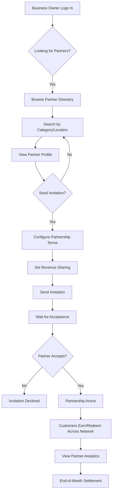

# Partner Network

**Status**: =á Draft
**Priority**: P1 (High - Phase 2)
**Phase**: Phase 2
**Teams**: Backend, Web, Mobile, Infrastructure
**Estimated Effort**: 3 weeks
**Target Release**: Phase 2 (Month 5-6)

## Overview

### Problem Statement

**Business owners** want to increase customer reach and engagement by partnering with complementary businesses. Currently:
- Small businesses lack the resources to build robust loyalty networks
- Customers have fragmented loyalty experiences across multiple businesses
- No easy way to earn/redeem rewards across partner businesses
- Complex revenue sharing and partnership management
- Difficulty discovering and vetting potential partners

This limits customer lifetime value and creates silos that reduce loyalty program effectiveness. Studies show coalition loyalty programs drive 30-40% higher engagement than standalone programs.

### Solution Summary

Provide a **partner network platform** that enables businesses to:
- Discover and invite complementary businesses to partner
- Create cross-business loyalty programs
- Allow customers to earn points at Partner A and redeem at Partner B
- Automatically calculate and track revenue sharing
- View unified analytics across partner network
- Manage partner relationships (invitations, approvals, terminations)

Each partnership includes:
- Partnership type (points coalition, cross-redemption, referral-based)
- Revenue sharing configuration (%, fixed fee, or custom)
- Geographic and category-based partner discovery
- Automated settlement and invoicing
- Partner performance analytics

### Success Criteria

- [x] 40% of businesses join at least one partner network within 3 months
- [x] <10 minutes to discover, invite, and activate a partnership
- [x] 30% increase in customer engagement for businesses in partner networks
- [x] <2% revenue sharing calculation errors
- [x] >85% partner satisfaction score

## User Stories

### Primary User Story

**As a** business owner
**I want** to partner with complementary businesses in my area
**So that** customers can earn and redeem rewards across multiple locations, increasing their engagement and my reach

**Acceptance Criteria**:
- [x] Given I'm on the partner directory, when I search by category (e.g., "Restaurants"), then I see local businesses I can invite
- [x] Given I've invited a partner, when they accept, then the partnership is automatically activated
- [x] Given a partnership is active, when my customer makes a purchase at the partner, then they earn points in my program
- [x] Given a customer redeems at a partner, when the reward is fulfilled, then revenue sharing is calculated automatically
- [x] Given I'm viewing analytics, when I check partner performance, then I see total transactions, revenue shared, and customer overlap

### Secondary User Stories

**As a** business owner
**I want** to set revenue sharing terms that are fair for both parties
**So that** partnerships are sustainable and mutually beneficial

**Acceptance Criteria**:
- [x] Given I'm creating a partnership, when I configure revenue sharing, then I can choose percentage-based, fixed-fee, or hybrid models
- [x] Given revenue sharing is configured, when transactions occur, then calculations are transparent and auditable
- [x] Given the month ends, when I view settlement reports, then I see exactly what I owe/am owed to each partner

**As a** customer
**I want** to earn rewards at multiple businesses in a network
**So that** I can accumulate points faster and have more redemption options

**Acceptance Criteria**:
- [x] Given I'm enrolled in a loyalty program, when I make purchases at partner businesses, then my points accumulate in one place
- [x] Given I have accumulated points, when I browse rewards, then I see options from all businesses in the network
- [x] Given I redeem at a partner business, when the reward is fulfilled, then my points are deducted correctly

**As a** business owner
**I want** to ensure partners meet quality standards
**So that** my brand reputation isn't damaged by poor partner experiences

**Acceptance Criteria**:
- [x] Given I'm reviewing a partnership invitation, when I view the partner's profile, then I see ratings, reviews, and business details
- [x] Given a partner consistently underperforms, when I terminate the partnership, then customers' existing points remain valid but no new earning occurs
- [x] Given I'm setting up a partnership, when I define partnership rules, then I can set minimum transaction values and eligible product categories

## Requirements

### Functional Requirements

**Must Have (MVP)**:
- [x] Partner directory (search and browse by category, location, ratings)
- [x] Partnership invitation system (send, accept, decline)
- [x] Partnership types (points coalition, cross-redemption only, referral-only)
- [x] Revenue sharing configuration (percentage, fixed, hybrid)
- [x] Cross-business points earning tracking
- [x] Cross-business redemption tracking
- [x] Automated revenue sharing calculation
- [x] Partner analytics dashboard (transactions, revenue shared, customer overlap)
- [x] Partnership lifecycle management (active, paused, terminated)
- [x] Settlement reports (monthly summaries of amounts owed/due)

**Should Have (Phase 2)**:
- [x] Partner ratings and reviews
- [x] Partnership templates (industry-specific configurations)
- [x] Multi-level partnerships (Partner A's partners can partner with Partner B)
- [x] Geographic radius-based partner discovery
- [x] Automated invoicing and payment processing (Stripe Connect integration)
- [ ] Partner referral bonuses (reward businesses for referring other partners)

**Could Have (Phase 3+)**:
- [ ] AI-powered partner recommendations based on customer behavior
- [ ] Dynamic revenue sharing (adjust based on performance)
- [ ] Partnership compliance monitoring (automatic alerts for policy violations)
- [ ] Customer preference-based partner suggestions
- [ ] Partnership performance forecasting

**Won't Have (Explicitly Out of Scope)**:
- L Direct payment processing between partners (use external accounting systems)
- L Legal contract generation (partnerships are agreements, not legal contracts)
- L Franchise or corporate chain management (different use case)
- L White-label partner portals (all partners use same NxLoy interface)

### Non-Functional Requirements

**Performance**:
- API response time: <250ms for partner directory search (p95)
- API response time: <150ms for transaction recording (p95)
- Page load time: <2 seconds for partner dashboard
- Concurrent users: Support 10,000 simultaneous partnership transactions
- Database: Indexes on location, category, partnership_status

**Security**:
- Authentication: JWT required for all partnership operations
- Authorization: Only business owners can create/manage partnerships
- Authorization: Partner transaction data is accessible only to involved parties
- Data isolation: Strict multi-tenancy to prevent cross-business data leaks
- Rate limiting: 100 requests/minute per business for partner operations
- Audit logging: All partnership changes and revenue sharing calculations logged

**Scalability**:
- Horizontal scaling: Stateless API servers
- Database: Partitioning by region for large-scale partner networks
- Caching: Redis cache for partner directory (15 minute TTL)
- Event-driven: Partnership events published to event bus for async processing
- Settlement calculation: Batch processing for end-of-month settlements

**Availability**:
- Uptime SLA: 99.9% (partnership transactions critical for revenue)
- Degraded mode: If partner service fails, transactions recorded locally and synced later
- Monitoring: Alerts if partnership transaction API fails or response time exceeds threshold

## User Experience

### User Flow Diagram



### Wireframes / Mockups

**Partner Directory**:
```

  Partner Network - Discover Partners       
$
  Category: [Restaurants ¾]  Radius: [5mi¾]
  Search: [__________________________]  [=
]
$
    
    Joe's Coffee Shop                   
   PPPPP 4.8 (127 reviews)             
                                          
   =Í 0.8 miles away                      
   =e 1,234 loyal customers               
   <÷  Coffee, Breakfast, Bakery          
                                          
   [View Profile] [Send Invitation]       
    
                                            
    
   <U Mario's Pizza                       
   PPPP 4.2 (89 reviews)              
                                          
   =Í 1.2 miles away                      
   =e 892 loyal customers                 
   <÷  Italian, Pizza, Casual Dining      
                                          
   [View Profile] [Send Invitation]       
    

```

**Partnership Configuration**:
```

  Configure Partnership with Joe's Coffee   
$
  Partnership Type:                         
  Ë Points Coalition (earn/redeem at both)  
  Ï Cross-Redemption Only (redeem only)     
  Ë Referral Only (reward for referrals)   
                                            
  Revenue Sharing:                          
      
   When customers redeem at partner:      
                                          
   You pay: [5___]% of reward value       
   Partner pays: [5___]% of reward        
                                          
   Minimum transaction: [$3.00____]       
      
                                            
  Preview:                                  
  " Customer spends $10 at your store       
  " Customer redeems $5 reward at partner   
  " You owe partner: $0.25 (5% of $5)       
                                            
  [Cancel]              [Send Invitation]   

```

**Partner Analytics Dashboard**:
```

  My Partner Network                        
$
  Overview                                  
  " 5 active partnerships                   
  " 847 shared customers                    
  " $1,234 net revenue shared (this month)  
                                            
  Partners:                                 
    
    Joe's Coffee Shop                   
   Status: =â Active (3 months)           
                                          
   234 cross-transactions                 
   87 shared customers                    
   $342 revenue earned from partner       
   $187 revenue paid to partner           
   Net: +$155                             
                                          
   [View Details] [Settings] [Pause]      
    
                                            
  [+ Add New Partner]                       

```

### UI Copy

**Page Title**: "Partner Network - Grow Together"
**Primary CTA**: "Find Partners" / "Send Invitation"
**Secondary CTA**: "View My Partnerships" / "View Analytics"
**Help Text**: "Partner with complementary businesses to offer customers more earning and redemption options. You'll share revenue based on agreed terms."
**Empty State**: "You haven't partnered with any businesses yet. Discover local partners to expand your network and increase customer engagement."
**Success Message**: "Partnership invitation sent! You'll be notified when they respond."
**Error Message**: "Unable to create partnership. Please check revenue sharing configuration."

## Technical Design

### Architecture Overview

```
          
   Web UI    ¶  Backend    ¶  Database   
  Partner            API             (PostgreSQL)
  Directory         (NestJS)         partnerships
           transactions
                                        
                           
                           ¼
                    
                     Event Bus   
                      (Redis)    
                     partnership 
                       events    
                    
                           
                           ¼
                    
                     Settlement  
                      Service    
                     (Batch Job) 
                    
```

### Domain Model

```typescript
// Partner Network domain entities
interface Partnership {
  id: string;                              // UUID
  businessAId: string;                     // UUID (initiator)
  businessBId: string;                     // UUID (invitee)
  type: PartnershipType;
  status: PartnershipStatus;
  config: PartnershipConfig;
  revenueSharingTerms: RevenueSharingConfig;
  invitedAt: Date;
  acceptedAt?: Date;
  activatedAt?: Date;
  pausedAt?: Date;
  terminatedAt?: Date;
  createdBy: string;                       // User UUID
  updatedAt: Date;
}

enum PartnershipType {
  POINTS_COALITION = 'POINTS_COALITION',   // Earn/redeem at both
  CROSS_REDEMPTION = 'CROSS_REDEMPTION',   // Redeem only at partners
  REFERRAL_ONLY = 'REFERRAL_ONLY'          // Reward referrals only
}

enum PartnershipStatus {
  PENDING = 'PENDING',                     // Invitation sent, waiting for response
  ACTIVE = 'ACTIVE',                       // Partnership active
  PAUSED = 'PAUSED',                       // Temporarily suspended
  TERMINATED = 'TERMINATED'                // Ended permanently
}

interface PartnershipConfig {
  allowedLocations?: string[];             // Specific locations or [] = all
  allowedCategories?: string[];            // Product categories eligible
  minimumTransaction?: number;             // Minimum purchase for points earning
  maxRedemptionPerCustomer?: number;       // Cap on redemptions per customer
  geographicRestrictions?: GeoRestriction; // Radius or region limits
}

interface RevenueSharingConfig {
  type: 'PERCENTAGE' | 'FIXED_FEE' | 'HYBRID';

  // PERCENTAGE model
  businessAShare?: number;                 // % of transaction value (e.g., 5)
  businessBShare?: number;                 // % of transaction value (e.g., 5)

  // FIXED_FEE model
  fixedFeePerTransaction?: number;         // Fixed fee per transaction (e.g., 0.25)

  // HYBRID model
  basePercentage?: number;                 // Base % (e.g., 3)
  bonusThreshold?: number;                 // Transaction count for bonus (e.g., 100)
  bonusPercentage?: number;                // Bonus % above threshold (e.g., 5)

  settlementFrequency: 'MONTHLY' | 'QUARTERLY' | 'ANNUAL';
}

interface PartnerTransaction {
  id: string;
  partnershipId: string;
  customerId: string;
  originBusinessId: string;                // Where customer earned
  redeemingBusinessId: string;             // Where customer redeemed
  transactionType: 'EARN' | 'REDEEM';
  amount: number;                          // Transaction value in cents
  pointsEarned?: number;
  pointsRedeemed?: number;
  revenueSharingAmount: number;            // Calculated sharing amount
  timestamp: Date;
}

interface PartnerDirectory {
  businessId: string;
  name: string;
  category: BusinessCategory;
  location: GeoLocation;
  rating: number;                          // 0-5
  reviewCount: number;
  loyalCustomerCount: number;
  partnershipCount: number;
  availableForPartnership: boolean;
}

interface Settlement {
  id: string;
  partnershipId: string;
  periodStart: Date;
  periodEnd: Date;
  totalTransactions: number;
  businessAOwed: number;                   // Amount A owes to B
  businessBOwed: number;                   // Amount B owes to A
  netSettlement: number;                   // Net amount (positive = A pays B)
  status: 'PENDING' | 'PROCESSED' | 'DISPUTED';
  processedAt?: Date;
}
```

### Database Schema Changes

**New Tables**:
```sql
CREATE TABLE partnerships (
  id UUID PRIMARY KEY DEFAULT gen_random_uuid(),
  business_a_id UUID NOT NULL REFERENCES businesses(id),
  business_b_id UUID NOT NULL REFERENCES businesses(id),
  type VARCHAR(50) NOT NULL,
  status VARCHAR(20) NOT NULL DEFAULT 'PENDING',
  config JSONB NOT NULL,
  revenue_sharing_terms JSONB NOT NULL,
  invited_at TIMESTAMP DEFAULT NOW(),
  accepted_at TIMESTAMP,
  activated_at TIMESTAMP,
  paused_at TIMESTAMP,
  terminated_at TIMESTAMP,
  created_by UUID NOT NULL REFERENCES users(id),
  updated_at TIMESTAMP DEFAULT NOW(),

  UNIQUE(business_a_id, business_b_id),
  CONSTRAINT valid_type CHECK (type IN ('POINTS_COALITION', 'CROSS_REDEMPTION', 'REFERRAL_ONLY')),
  CONSTRAINT valid_status CHECK (status IN ('PENDING', 'ACTIVE', 'PAUSED', 'TERMINATED')),
  CONSTRAINT different_businesses CHECK (business_a_id != business_b_id)
);

CREATE TABLE partner_transactions (
  id UUID PRIMARY KEY DEFAULT gen_random_uuid(),
  partnership_id UUID NOT NULL REFERENCES partnerships(id),
  customer_id UUID NOT NULL REFERENCES customers(id),
  origin_business_id UUID NOT NULL REFERENCES businesses(id),
  redeeming_business_id UUID NOT NULL REFERENCES businesses(id),
  transaction_type VARCHAR(10) NOT NULL,
  amount BIGINT NOT NULL,
  points_earned INT,
  points_redeemed INT,
  revenue_sharing_amount BIGINT NOT NULL,
  timestamp TIMESTAMP DEFAULT NOW(),

  CONSTRAINT valid_transaction_type CHECK (transaction_type IN ('EARN', 'REDEEM'))
);

CREATE TABLE settlements (
  id UUID PRIMARY KEY DEFAULT gen_random_uuid(),
  partnership_id UUID NOT NULL REFERENCES partnerships(id),
  period_start DATE NOT NULL,
  period_end DATE NOT NULL,
  total_transactions INT NOT NULL DEFAULT 0,
  business_a_owed BIGINT NOT NULL DEFAULT 0,
  business_b_owed BIGINT NOT NULL DEFAULT 0,
  net_settlement BIGINT NOT NULL DEFAULT 0,
  status VARCHAR(20) NOT NULL DEFAULT 'PENDING',
  processed_at TIMESTAMP,

  UNIQUE(partnership_id, period_start),
  CONSTRAINT valid_settlement_status CHECK (status IN ('PENDING', 'PROCESSED', 'DISPUTED'))
);

-- Indexes for performance
CREATE INDEX idx_partnerships_business_a ON partnerships(business_a_id);
CREATE INDEX idx_partnerships_business_b ON partnerships(business_b_id);
CREATE INDEX idx_partnerships_status ON partnerships(status);

CREATE INDEX idx_partner_txn_partnership ON partner_transactions(partnership_id);
CREATE INDEX idx_partner_txn_customer ON partner_transactions(customer_id);
CREATE INDEX idx_partner_txn_timestamp ON partner_transactions(timestamp DESC);

CREATE INDEX idx_settlements_partnership ON settlements(partnership_id);
CREATE INDEX idx_settlements_period ON settlements(period_start, period_end);
CREATE INDEX idx_settlements_status ON settlements(status);
```

### API Endpoints

**See CONTRACTS.md for full OpenAPI specification**

Summary:
- `GET /api/v1/partners/directory` - Search partner directory
- `GET /api/v1/partners/{businessId}` - Get partner profile
- `POST /api/v1/partnerships` - Create partnership invitation
- `GET /api/v1/partnerships` - List my partnerships
- `GET /api/v1/partnerships/{id}` - Get partnership details
- `PATCH /api/v1/partnerships/{id}/accept` - Accept partnership invitation
- `PATCH /api/v1/partnerships/{id}/decline` - Decline partnership invitation
- `PATCH /api/v1/partnerships/{id}/status` - Change status (pause, terminate)
- `PUT /api/v1/partnerships/{id}` - Update partnership configuration
- `POST /api/v1/partnerships/{id}/transactions` - Record partner transaction
- `GET /api/v1/partnerships/{id}/transactions` - List partnership transactions
- `GET /api/v1/partnerships/{id}/analytics` - Get partnership analytics
- `GET /api/v1/partnerships/{id}/settlements` - Get settlement history
- `POST /api/v1/partnerships/{id}/settlements/calculate` - Trigger settlement calculation

### Domain Events

**See CONTRACTS.md for full AsyncAPI specification**

Summary:
- `partner.partnership.created` - Published when partnership invitation sent
- `partner.partnership.accepted` - Published when invitation accepted
- `partner.partnership.activated` - Published when partnership becomes active
- `partner.partnership.paused` - Published when partnership paused
- `partner.partnership.terminated` - Published when partnership ended
- `partner.transaction.recorded` - Published when partner transaction occurs
- `partner.settlement.calculated` - Published when settlement calculated
- `partner.settlement.processed` - Published when settlement payment processed

## Dependencies

### Internal Dependencies

- **Business Profile**: Both businesses must have complete profiles
- **Loyalty Programs**: At least one business must have an active program
- **Customer Management**: For tracking shared customers
- **Transaction System**: For recording partner transactions

### External Dependencies

- **Stripe Connect** (Phase 2): For automated settlement payments
- **Geocoding API**: For location-based partner discovery

### Blocked By

- [ ] Loyalty programs must be fully implemented
- [ ] Transaction recording system must be complete
- [ ] Settlement calculation logic must be designed

### Blocks

- [ ] Multi-business analytics (depends on partner network data)
- [ ] Coalition marketing campaigns (depends on partner relationships)

## Testing Strategy

### Unit Tests

**Backend**:
- PartnershipService.create() with various partnership types
- PartnershipService.calculateRevenueSharing() for all sharing models
- PartnershipService.recordTransaction() with validation
- SettlementService.calculateMonthlySettlement() accuracy
- Directory search with filters (category, location, radius)

**Frontend**:
- Partner directory search and filtering
- Partnership invitation form validation
- Revenue sharing calculator
- Analytics dashboard rendering
- Settlement report display

**Coverage Target**: >85%

### Integration Tests

- POST /api/v1/partnerships creates partnership and publishes event
- PATCH /api/v1/partnerships/{id}/accept activates partnership
- POST /api/v1/partnerships/{id}/transactions calculates revenue sharing correctly
- GET /api/v1/partnerships/{id}/settlements returns accurate settlement data
- Revenue sharing calculation matches expected formulas

### End-to-End Tests

See `ACCEPTANCE.feature` for Gherkin scenarios.

Example:
- Business A searches directory for restaurant partners
- Business A sends invitation to Business B with 5% revenue sharing
- Business B accepts invitation
- Customer makes purchase at Business A, earns 100 points
- Customer redeems 100 points at Business B
- Revenue sharing of $0.50 calculated (5% of $10 redemption)
- End-of-month settlement shows Business A owes Business B $0.50
- Settlement is processed and businesses receive payment notifications

### Performance Tests

- Load test: 1,000 concurrent partner transaction recordings
- Response time: <250ms for directory search (p95)
- Response time: <150ms for transaction recording (p95)
- Settlement calculation performance with 10,000+ transactions

## Rollout Plan

### Phase 1: Development (Week 1-3)

**Week 1: Core Infrastructure**
- Backend: Database schema migration
- Backend: Partnership CRUD APIs
- Backend: Directory search API
- Web: Partner directory UI
- Web: Partnership invitation flow

**Week 2: Transaction & Revenue Sharing**
- Backend: Transaction recording API
- Backend: Revenue sharing calculation engine
- Backend: Analytics API
- Web: Transaction recording UI
- Web: Analytics dashboard

**Week 3: Settlement & Testing**
- Backend: Settlement calculation batch job
- Backend: Settlement reporting API
- Backend: Write unit and integration tests
- Web: Settlement report UI
- All: Write acceptance tests

### Phase 2: Testing (Week 4)

- Unit tests passing (>85% coverage)
- Integration tests passing
- E2E tests passing (full partnership lifecycle)
- QA manual testing
- Bug fixes
- Revenue sharing calculation validation

### Phase 3: Staging Deployment (Week 5)

- Deploy to staging environment
- Internal team testing (create test partnerships)
- Beta customer testing (5-10 partnerships)
- Gather feedback and iterate
- Performance testing under load

### Phase 4: Production Rollout (Week 6)

**Gradual Rollout**:
- Day 1: Partner network available to beta businesses
- Day 3: Open to all businesses in select regions
- Day 7: Full availability to all businesses
- Month 2: Add automated settlement payments (Stripe Connect)

**Rollback Plan**:
- Feature flag: `ENABLE_PARTNER_NETWORK`
- Database rollback: Migration rollback scripts prepared
- Monitoring: Alerts for partnership API errors
- Degraded mode: Record transactions locally, sync later

### Phase 5: Post-Launch (Week 7+)

- Monitor metrics (partnership creation rate, transaction volume)
- Collect user feedback (partner satisfaction survey)
- Iterate based on data (improve discovery, optimize revenue sharing)
- Document lessons learned
- Plan Phase 3 features (AI recommendations, dynamic sharing)

## Monitoring & Analytics

### Metrics to Track

**Usage Metrics**:
- Partnerships created per day
- Partnership acceptance rate
- Active partnerships count
- Partner transactions per day
- Revenue shared per month

**Performance Metrics**:
- API response time (p50, p95, p99)
- Database query performance
- Settlement calculation time
- Error rate (4xx, 5xx)

**Business Metrics**:
- % of businesses with at least 1 partnership
- Average # of partnerships per business
- Customer engagement increase in partner networks
- Revenue sharing accuracy
- Partner satisfaction score (CSAT)

### Dashboards

- Grafana: `nxloy-partner-network-usage`
- Datadog: `partner-network-performance`
- Custom: Partner analytics dashboard (in-app)

### Alerts

- Error rate >1%: Page engineering team
- Response time >400ms: Alert on-call engineer
- Settlement calculation failure: Page immediately (P1)
- Revenue sharing calculation error: Alert finance team
- Database CPU >80%: Alert infrastructure team

## Documentation

### User-Facing Documentation

- [x] Help article: "How to Find and Invite Partners"
- [x] Help article: "Understanding Revenue Sharing"
- [x] Help article: "Managing Your Partner Network"
- [x] Video tutorial: "Creating Your First Partnership" (5 minutes)
- [x] FAQ: "How is revenue sharing calculated?"
- [x] FAQ: "What happens if a partner terminates the partnership?"

### Developer Documentation

- [x] API documentation: OpenAPI spec updated
- [x] Revenue sharing calculation formulas
- [x] Settlement batch job documentation
- [x] Architecture decision: Partnership model design
- [x] Runbook: "Partner Network Operations Guide"

## Risks & Mitigation

### Risk 1: Revenue Sharing Calculation Errors

**Probability**: Medium
**Impact**: High (financial disputes, loss of trust)

**Description**: Complex revenue sharing formulas may produce incorrect calculations, leading to financial discrepancies.

**Mitigation**:
- Comprehensive unit tests for all sharing models
- Audit logging of all calculations
- Settlement review period (7 days) before processing
- Dispute resolution workflow
- Financial audit trail for all transactions

### Risk 2: Partnership Fraud or Abuse

**Probability**: Low
**Impact**: High (financial loss, platform reputation)

**Description**: Malicious businesses could create fake transactions to manipulate revenue sharing.

**Mitigation**:
- Transaction verification (minimum purchase requirements)
- Anomaly detection (flag unusual transaction patterns)
- Partnership approval process (verify business legitimacy)
- Rate limiting on partnership transactions
- Manual review for high-value partnerships

### Risk 3: Complex Partnership Management Overwhelms Users

**Probability**: Medium
**Impact**: Medium (low adoption, support tickets)

**Description**: Revenue sharing configuration and partnership management may be too complex for non-technical users.

**Mitigation**:
- Partnership templates (industry-standard configurations)
- Smart defaults (recommended revenue sharing %)
- Clear preview of financial implications
- In-app help and tutorials
- Dedicated support for first partnership setup

### Risk 4: Settlement Processing Delays

**Probability**: Low
**Impact**: Medium (partner dissatisfaction)

**Description**: Batch settlement calculation may fail or be delayed, causing payment delays.

**Mitigation**:
- Redundant settlement calculation (primary + backup job)
- Monitoring and alerts for settlement failures
- Manual settlement processing capability
- Clear communication of settlement timelines
- Grace period for payment disputes

## Open Questions

- [x] **Q**: Should partnerships be bidirectional or unidirectional?
  - **A**: Bidirectional. Both businesses must agree and both can earn/redeem.

- [x] **Q**: How do we handle disputes in revenue sharing?
  - **A**: 7-day review period after settlement calculation. Manual dispute resolution workflow.

- [x] **Q**: Can a business be in multiple partnerships simultaneously?
  - **A**: Yes. Unlimited partnerships allowed.

- [x] **Q**: What happens to customer points if a partnership is terminated?
  - **A**: Points remain valid but no new earning/redemption at former partner.

- [ ] **Q**: Should we support multi-level partnerships (A partners with B, B partners with C, does A get C?)?
  - **A**: TBD. Phase 3 feature if demand exists.
  - **Decision Deadline**: Before Phase 3 planning
  - **Decision Owner**: Product Team

- [ ] **Q**: How do we prevent competitors from partnering (e.g., two pizza shops)?
  - **A**: TBD. May add category exclusion rules.
  - **Decision Deadline**: Before production launch
  - **Decision Owner**: Product + Legal

## Stakeholders

### Accountable

- **Product Owner**: [Name] - Final approval on partnership model and revenue sharing
- **Engineering Lead**: [Name] - Technical approval and implementation

### Responsible

- **Backend Lead**: [Name] - API implementation, settlement calculation
- **Frontend Lead**: [Name] - Directory, invitation flow, analytics UI
- **QA Lead**: [Name] - Testing strategy, revenue sharing validation
- **Finance Lead**: [Name] - Revenue sharing model approval

### Consulted

- **UX Designer**: [Name] - Partner discovery and configuration UI
- **Business Analyst**: [Name] - Industry research for partnership models
- **Legal**: [Name] - Partnership agreement terms
- **Customer Success**: [Name] - Feedback from beta partnerships

### Informed

- **Marketing**: [Name] - Partner network launch announcement
- **Sales**: [Name] - Key selling point for new customers
- **Support**: [Name] - Training on partnership troubleshooting

## Timeline

| Milestone | Date | Owner | Status |
|-----------|------|-------|--------|
| Spec approval | 2026-02-15 | Product | =á Pending |
| Contract freeze | 2026-02-22 | Backend | =á Pending |
| Development complete | 2026-03-15 | Engineering | =á Pending |
| Testing complete | 2026-03-22 | QA | =á Pending |
| Staging deployment | 2026-03-29 | DevOps | =á Pending |
| Production launch | 2026-04-05 | Product | =á Pending |

## References

### Related Documents

- [ADR-0002: Contract-First Development](../../../adr/0002-contract-first-development.md)
- [ADR-0004: Domain-Driven Organization](../../../adr/0004-domain-driven-organization.md)
- [Business Requirements: Partner Network](../../BUSINESS-REQUIREMENTS.md#partner-network)
- [Product Roadmap: Phase 2](../../PRODUCT-ROADMAP.md#phase-2-expansion-months-4-6)
- [Terminology: Partner Network](../../TERMINOLOGY.md#partner-network-terms)

### External References

- [Industry Research: Coalition Loyalty Programs](https://example.com/research)
- [Competitor Analysis: Partner Network Platforms](https://example.com/competitors)
- [Revenue Sharing Models: Best Practices](https://example.com/revenue-sharing)

## Change Log

| Date | Version | Changes | Author |
|------|---------|---------|--------|
| 2025-11-06 | 1.0.0 | Initial draft | Ploy Lab |

---

**Last Updated**: 2025-11-06
**Next Review**: 2026-01-06 (post-development review)
**Document Owner**: Product Team
