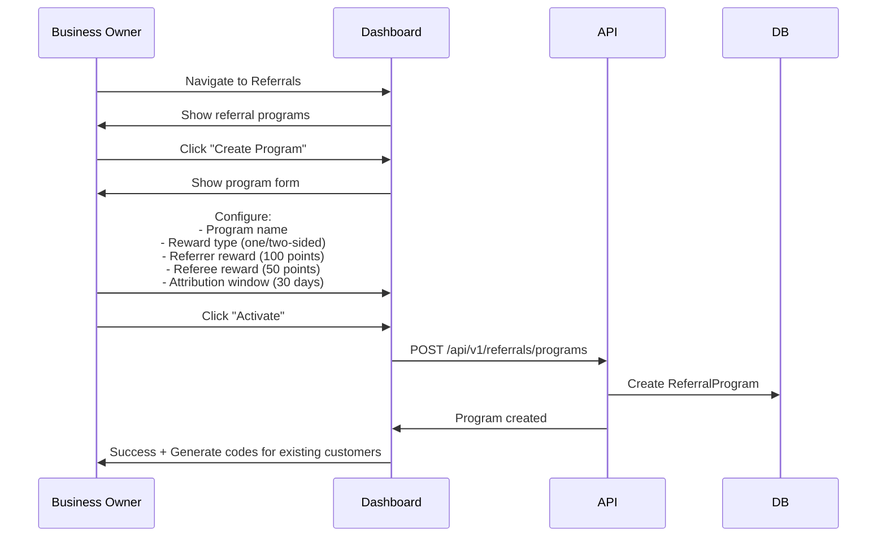
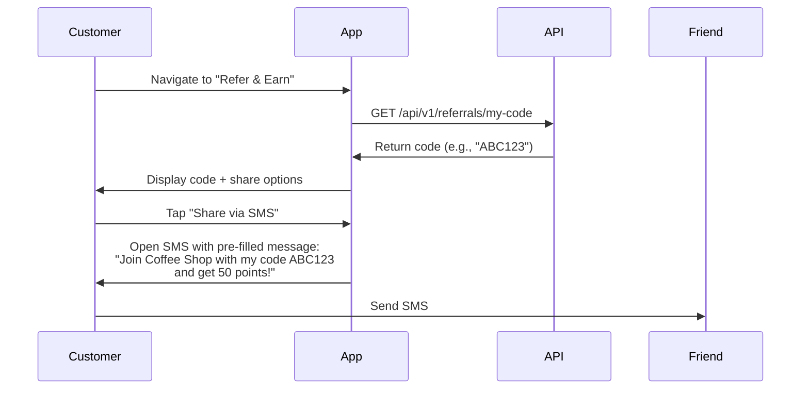
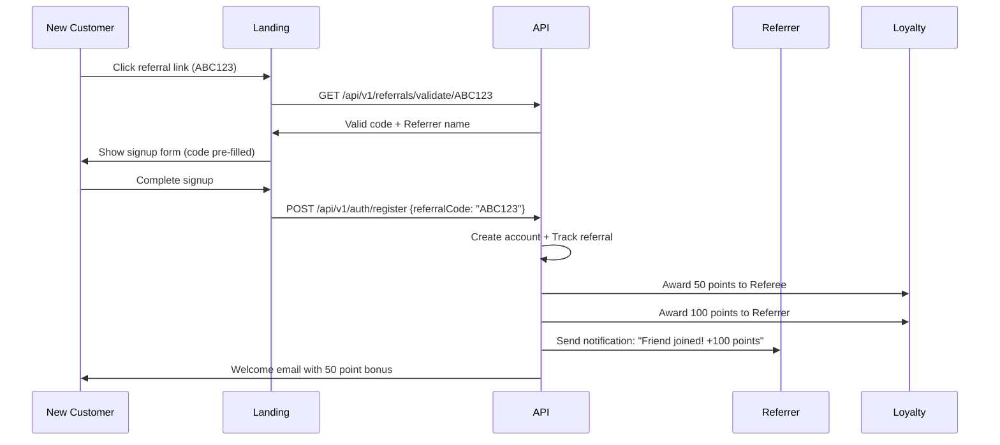
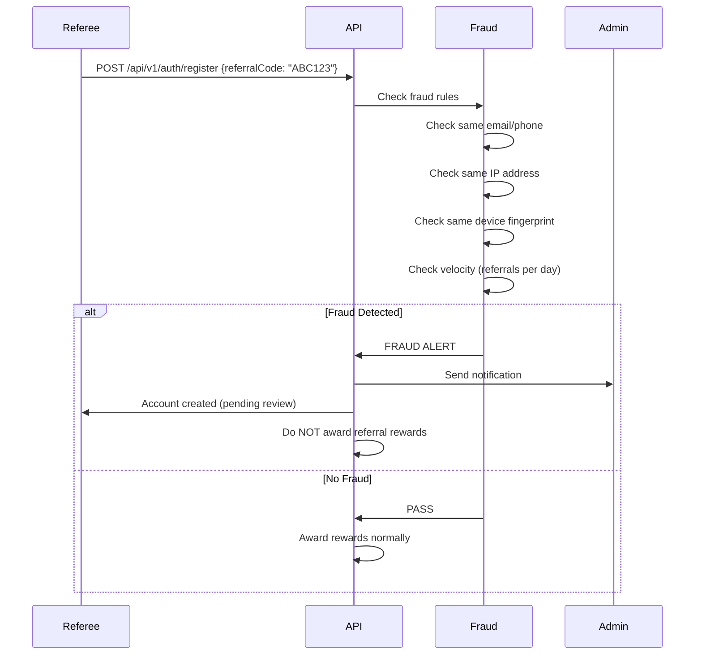

# Referral Programs

**Status**: 🟢 Approved
**Priority**: P1 (Phase 2)
**Phase**: Phase 2
**Teams**: Backend, Web, Mobile, Growth, Infrastructure
**Estimated Effort**: 3 weeks
**Target Release**: 2026-Q2

## Overview

### Problem Statement

**Business owners** need cost-effective customer acquisition strategies that leverage their existing customer base. Traditional marketing (ads, promotions) is expensive ($50-200+ per customer acquisition). **Customers** trust recommendations from friends more than advertisements. However, manually tracking referrals is error-prone, lacks transparency, and doesn't scale.

**Current Pain Points**:
- No systematic way to track who referred whom
- Manual reward fulfillment is time-consuming and inconsistent
- Difficult to measure referral program ROI
- Risk of fraud (self-referrals, fake accounts)
- No visibility into referral performance

### Solution Summary

Provide a comprehensive referral program management system that allows businesses to:
- Create referral programs with flexible reward structures (one-sided, two-sided)
- Generate unique referral codes/links for customers
- Automatically track referral attributions with configurable windows
- Award rewards to both referrer and referee automatically
- Detect and prevent fraud (self-referrals, duplicate accounts)
- Analyze referral performance and identify top referrers
- Integrate with loyalty programs for seamless point rewards

**Key Features**:
- Unique referral code generation (6-8 character codes)
- Multiple reward types (points, discounts, store credit)
- One-sided rewards (referrer only) or two-sided (both parties)
- Attribution window (7, 14, 30, 60, 90 days)
- Fraud detection rules and suspicious activity alerts
- Referral leaderboards and gamification
- Deep link support for mobile app referrals

### Success Criteria

- [ ] Metric 1: 40% of customers share their referral code within 7 days of enrollment
- [ ] Metric 2: 15% conversion rate on referral links (industry average: 10-12%)
- [ ] Metric 3: <$10 cost per acquisition via referrals (vs $50-200 for traditional marketing)
- [ ] Metric 4: 99.9% attribution accuracy (correct referrer credited)
- [ ] Metric 5: <100ms referral code generation time
- [ ] Metric 6: Fraud detection catches 95%+ of self-referrals
- [ ] Metric 7: <1 second referral link click-to-landing page load time

## User Stories

### Primary User Story

**As a** business owner
**I want** to create a referral program that rewards customers for bringing new customers
**So that** I can reduce customer acquisition costs and grow organically through word-of-mouth

**Acceptance Criteria**:
- [ ] Given I'm on the referral program creation page, when I configure rewards, then I can choose one-sided or two-sided rewards
- [ ] Given I've configured a program, when I activate it, then all eligible customers receive unique referral codes
- [ ] Given a customer shares their referral code, when a new customer signs up using it, then both parties receive rewards automatically
- [ ] Given I'm viewing referral analytics, when I check performance, then I see conversion rate, top referrers, and ROI
- [ ] Given suspicious activity is detected, when fraud rules trigger, then I receive an alert with details

### Secondary User Stories

**As a** customer (referrer)
**I want** to easily share my referral code with friends
**So that** I can earn rewards when they sign up

**Acceptance Criteria**:
- [ ] Given I'm in the app, when I access my referral code, then I see a shareable link and QR code
- [ ] Given I tap "Share", when I choose a channel (SMS, email, social), then the message is pre-populated with my code and benefits
- [ ] Given someone uses my referral, when they complete the action, then I receive a notification and see my reward balance updated
- [ ] Given I'm viewing my referrals, when I check my dashboard, then I see how many people I've referred and pending rewards

**As a** new customer (referee)
**I want** to easily use a referral code when signing up
**So that** I receive the promised sign-up bonus

**Acceptance Criteria**:
- [ ] Given I click a referral link, when I land on the signup page, then the referral code is pre-filled
- [ ] Given I'm on the signup page, when I manually enter a referral code, then validation confirms it's valid
- [ ] Given I complete signup with a referral code, when my account is created, then I see my sign-up bonus applied
- [ ] Given my referrer, when I make a qualifying purchase, then they receive their reward

**As a** business owner with influencers
**I want** to create custom referral codes for partners
**So that** I can track which influencers drive the most conversions

**Acceptance Criteria**:
- [ ] Given I'm creating a custom code, when I enter a vanity code (e.g., "COFFEE10"), then it's validated for uniqueness
- [ ] Given an influencer uses their custom code, when conversions happen, then I can see their performance separately
- [ ] Given influencer performance data, when I view analytics, then I can calculate their commission/payout

## Requirements

### Functional Requirements

**Must Have (MVP - Phase 2)**:
- [ ] Referral program CRUD operations
- [ ] Unique referral code generation (6-8 characters, alphanumeric)
- [ ] Referral link generation with deep link support
- [ ] One-sided reward programs (referrer only)
- [ ] Two-sided reward programs (referrer + referee)
- [ ] Multiple reward types:
  - Loyalty points
  - Percentage discount (10% off, 20% off)
  - Fixed amount discount ($10 off, $25 off)
  - Store credit
- [ ] Attribution window configuration (7, 14, 30, 60, 90 days)
- [ ] Referral conversion tracking (signup, first purchase)
- [ ] Automatic reward fulfillment
- [ ] Referral status tracking (sent, clicked, signed up, converted)
- [ ] Basic fraud detection:
  - Prevent self-referrals (same email/phone/device)
  - Detect duplicate accounts (same IP, device fingerprint)
  - Flag suspicious patterns (mass signups from one referrer)
- [ ] Referral analytics dashboard
- [ ] Referral history for customers
- [ ] Custom referral codes for partners/influencers

**Should Have (Phase 2)**:
- [ ] QR code generation for referral codes
- [ ] Social media sharing integrations (WhatsApp, Facebook, Instagram, Twitter)
- [ ] Email referral invitations (bulk invite friends)
- [ ] Referral leaderboards (top referrers)
- [ ] Gamification (badges for milestones: 5 referrals, 10 referrals, etc.)
- [ ] Multi-tier rewards (more referrals = better rewards)
- [ ] Expiring referral rewards (use within 30 days)
- [ ] Referral notifications (email, SMS, push)
- [ ] Advanced fraud detection:
  - Velocity checks (max referrals per day)
  - Geolocation anomalies
  - Behavioral analysis
- [ ] Referral program A/B testing
- [ ] Referral program versioning

**Could Have (Phase 3+)**:
- [ ] Referral chains (track multi-level referrals)
- [ ] Conditional rewards (spend $X to unlock referrer reward)
- [ ] Time-limited campaigns (2x referral rewards for 30 days)
- [ ] Partner referral networks (cross-business referrals)
- [ ] White-label referral widgets
- [ ] API for 3rd-party integrations
- [ ] Machine learning fraud detection

### Non-Functional Requirements

**Performance**:
- [ ] <100ms referral code generation (p95)
- [ ] <200ms referral attribution check (p95)
- [ ] <1 second referral link redirect (p95)
- [ ] Support 10,000+ referral conversions per hour
- [ ] Support 100,000+ active referral codes

**Scalability**:
- [ ] Horizontal scaling for referral processing
- [ ] Caching for frequently accessed referral codes
- [ ] Async processing for reward fulfillment

**Reliability**:
- [ ] 99.9% uptime for referral link service
- [ ] 99.99% attribution accuracy
- [ ] Zero duplicate reward payouts

**Security**:
- [ ] Referral codes are cryptographically secure
- [ ] Rate limiting on referral code generation (prevent brute force)
- [ ] Rate limiting on referral clicks (prevent DDoS)
- [ ] Fraud detection runs in real-time

**Compliance**:
- [ ] GDPR compliance (customer consent for sharing)
- [ ] FTC disclosure requirements for referral programs
- [ ] Anti-fraud regulations compliance

## User Experience

### User Flows

#### 1. Business Owner Creates Referral Program



#### 2. Customer Shares Referral



#### 3. New Customer Uses Referral Code



#### 4. Fraud Detection Flow



### Wireframes

#### Referral Dashboard (Business Owner)

```
┌─────────────────────────────────────────────────────────┐
│  Referral Programs                          [+ Create]  │
├─────────────────────────────────────────────────────────┤
│                                                         │
│  📊 Program Performance                                 │
│  ┌──────────────┬──────────────┬──────────────┐         │
│  │  Total       │  Conversion  │  Cost per    │         │
│  │  Referrals   │  Rate        │  Acquisition │         │
│  │  1,247       │  18.5%       │  $8.40       │         │
│  └──────────────┴──────────────┴──────────────┘         │
│                                                         │
│  🎁 Active Program: "Friend Bonus"         [Edit]       │
│  ├─ Referrer Reward: 100 points                         │
│  ├─ Referee Reward: 50 points                           │
│  ├─ Attribution Window: 30 days                         │
│  └─ Status: Active (231 conversions this month)         │
│                                                         │
│  🏆 Top Referrers (This Month)                          │
│  1. John Doe - 23 referrals                             │
│  2. Jane Smith - 18 referrals                           │
│  3. Mike Johnson - 15 referrals                         │
│                                                         │
└─────────────────────────────────────────────────────────┘
```

#### Customer Referral Page (Mobile)

```
┌───────────────────────────┐
│  < Back    Refer & Earn   │
├───────────────────────────┤
│                           │
│  🎁 Share & Earn Points   │
│                           │
│  Give 50 points           │
│  Get 100 points           │
│                           │
│  ┌─────────────────────┐  │
│  │   Your Code:        │  │
│  │   COFFEE123         │  │
│  │   [Copy]            │  │
│  └─────────────────────┘  │
│                           │
│  Share via:               │
│  [📱 SMS] [📧 Email]      │
│  [📷 QR Code] [🔗 Link]   │
│                           │
│  ───────────────────────  │
│                           │
│  Your Referrals (5)       │
│  ✓ Sarah - Joined         │
│  ✓ Mike - Joined          │
│  ✓ Lisa - Pending         │
│  ✓ Tom - Joined           │
│  ✓ Amy - Joined           │
│                           │
│  Total Earned: 400 points │
│                           │
└───────────────────────────┘
```

## Technical Design

### Domain Model

```typescript
// Referral Program Configuration
interface ReferralProgram {
  id: string;
  businessId: string;
  name: string;
  description: string;
  status: 'DRAFT' | 'ACTIVE' | 'PAUSED' | 'ENDED';

  // Reward Configuration
  rewardType: 'ONE_SIDED' | 'TWO_SIDED';
  referrerReward: RewardDefinition;
  refereeReward?: RewardDefinition; // Only for TWO_SIDED

  // Attribution Settings
  attributionWindow: number; // Days
  conversionEvent: 'SIGNUP' | 'FIRST_PURCHASE' | 'SPEND_THRESHOLD';
  conversionThreshold?: number; // For SPEND_THRESHOLD

  // Fraud Detection
  fraudDetectionEnabled: boolean;
  maxReferralsPerDay: number;

  // Timestamps
  createdAt: Date;
  updatedAt: Date;
  startsAt?: Date;
  endsAt?: Date;
}

interface RewardDefinition {
  type: 'POINTS' | 'DISCOUNT_PERCENT' | 'DISCOUNT_AMOUNT' | 'STORE_CREDIT';
  value: number;
  expiresInDays?: number;
}

// Referral Code
interface ReferralCode {
  id: string;
  code: string; // e.g., "COFFEE123"
  programId: string;
  customerId: string;
  type: 'AUTO_GENERATED' | 'CUSTOM'; // Custom for influencers

  // Tracking
  timesShared: number;
  timesClicked: number;
  conversions: number;

  // Status
  isActive: boolean;
  expiresAt?: Date;

  createdAt: Date;
}

// Referral Instance
interface Referral {
  id: string;
  programId: string;
  referralCodeId: string;

  // Parties
  referrerId: string; // Customer who referred
  refereeId?: string; // Customer who was referred (null until signup)

  // Attribution
  clickedAt: Date;
  signedUpAt?: Date;
  convertedAt?: Date;

  // Status
  status: 'CLICKED' | 'SIGNED_UP' | 'CONVERTED' | 'EXPIRED' | 'FRAUD';

  // Tracking
  ipAddress: string;
  userAgent: string;
  deviceFingerprint: string;

  // Fraud
  fraudScore: number; // 0-100
  fraudReason?: string;

  createdAt: Date;
  updatedAt: Date;
}

// Referral Conversion (Successful referral)
interface ReferralConversion {
  id: string;
  referralId: string;
  programId: string;
  referrerId: string;
  refereeId: string;

  // Rewards
  referrerRewardId: string; // Link to reward record
  refereeRewardId?: string;

  conversionType: 'SIGNUP' | 'FIRST_PURCHASE';
  conversionValue?: number; // Purchase amount

  convertedAt: Date;
  createdAt: Date;
}

// Referral Reward
interface ReferralReward {
  id: string;
  conversionId: string;
  customerId: string;
  programId: string;

  rewardType: 'POINTS' | 'DISCOUNT_PERCENT' | 'DISCOUNT_AMOUNT' | 'STORE_CREDIT';
  rewardValue: number;

  status: 'PENDING' | 'AWARDED' | 'EXPIRED' | 'REVOKED';

  awardedAt?: Date;
  expiresAt?: Date;
  revokedAt?: Date;
  revokedReason?: string;

  createdAt: Date;
}
```

### Database Schema (Prisma)

```prisma
model ReferralProgram {
  id                    String   @id @default(uuid()) @db.Uuid
  businessId            String   @db.Uuid
  name                  String   @db.VarChar(255)
  description           String?  @db.Text
  status                String   @db.VarChar(50) // DRAFT, ACTIVE, PAUSED, ENDED

  rewardType            String   @db.VarChar(50) // ONE_SIDED, TWO_SIDED
  referrerReward        Json     @db.JsonB
  refereeReward         Json?    @db.JsonB

  attributionWindow     Int      @default(30) // Days
  conversionEvent       String   @db.VarChar(50) // SIGNUP, FIRST_PURCHASE
  conversionThreshold   Decimal? @db.Decimal(10, 2)

  fraudDetectionEnabled Boolean  @default(true)
  maxReferralsPerDay    Int      @default(10)

  startsAt              DateTime?
  endsAt                DateTime?
  createdAt             DateTime @default(now())
  updatedAt             DateTime @updatedAt

  codes                 ReferralCode[]
  conversions           ReferralConversion[]

  @@index([businessId, status])
  @@map("referral_programs")
}

model ReferralCode {
  id           String   @id @default(uuid()) @db.Uuid
  code         String   @unique @db.VarChar(20)
  programId    String   @db.Uuid
  customerId   String   @db.Uuid
  type         String   @db.VarChar(50) // AUTO_GENERATED, CUSTOM

  timesShared  Int      @default(0)
  timesClicked Int      @default(0)
  conversions  Int      @default(0)

  isActive     Boolean  @default(true)
  expiresAt    DateTime?
  createdAt    DateTime @default(now())

  program      ReferralProgram @relation(fields: [programId], references: [id])
  referrals    Referral[]

  @@index([code])
  @@index([customerId])
  @@map("referral_codes")
}

model Referral {
  id               String   @id @default(uuid()) @db.Uuid
  programId        String   @db.Uuid
  referralCodeId   String   @db.Uuid
  referrerId       String   @db.Uuid
  refereeId        String?  @db.Uuid

  clickedAt        DateTime @default(now())
  signedUpAt       DateTime?
  convertedAt      DateTime?

  status           String   @db.VarChar(50)

  ipAddress        String   @db.VarChar(45)
  userAgent        String   @db.Text
  deviceFingerprint String  @db.VarChar(255)

  fraudScore       Int      @default(0)
  fraudReason      String?  @db.Text

  createdAt        DateTime @default(now())
  updatedAt        DateTime @updatedAt

  code             ReferralCode @relation(fields: [referralCodeId], references: [id])
  conversion       ReferralConversion?

  @@index([referralCodeId])
  @@index([referrerId])
  @@index([refereeId])
  @@index([status])
  @@map("referrals")
}

model ReferralConversion {
  id               String   @id @default(uuid()) @db.Uuid
  referralId       String   @unique @db.Uuid
  programId        String   @db.Uuid
  referrerId       String   @db.Uuid
  refereeId        String   @db.Uuid

  referrerRewardId String   @db.Uuid
  refereeRewardId  String?  @db.Uuid

  conversionType   String   @db.VarChar(50)
  conversionValue  Decimal? @db.Decimal(10, 2)

  convertedAt      DateTime @default(now())
  createdAt        DateTime @default(now())

  referral         Referral @relation(fields: [referralId], references: [id])
  program          ReferralProgram @relation(fields: [programId], references: [id])
  referrerReward   ReferralReward @relation("ReferrerReward", fields: [referrerRewardId], references: [id])
  refereeReward    ReferralReward? @relation("RefereeReward", fields: [refereeRewardId], references: [id])

  @@index([programId])
  @@index([referrerId])
  @@index([convertedAt])
  @@map("referral_conversions")
}

model ReferralReward {
  id           String   @id @default(uuid()) @db.Uuid
  conversionId String   @db.Uuid
  customerId   String   @db.Uuid
  programId    String   @db.Uuid

  rewardType   String   @db.VarChar(50)
  rewardValue  Decimal  @db.Decimal(10, 2)

  status       String   @db.VarChar(50) // PENDING, AWARDED, EXPIRED, REVOKED

  awardedAt    DateTime?
  expiresAt    DateTime?
  revokedAt    DateTime?
  revokedReason String?  @db.Text

  createdAt    DateTime @default(now())

  referrerConversions ReferralConversion[] @relation("ReferrerReward")
  refereeConversions  ReferralConversion[] @relation("RefereeReward")

  @@index([customerId, status])
  @@map("referral_rewards")
}
```

### API Endpoints

**Referral Program Management**:
```
POST   /api/v1/referrals/programs           # Create program
GET    /api/v1/referrals/programs           # List programs
GET    /api/v1/referrals/programs/:id       # Get program
PATCH  /api/v1/referrals/programs/:id       # Update program
DELETE /api/v1/referrals/programs/:id       # Delete program
POST   /api/v1/referrals/programs/:id/activate  # Activate
POST   /api/v1/referrals/programs/:id/pause     # Pause
```

**Referral Codes**:
```
GET    /api/v1/referrals/my-code            # Get current user's code
POST   /api/v1/referrals/codes              # Generate custom code
GET    /api/v1/referrals/codes/:code/validate  # Validate code
GET    /api/v1/referrals/codes/:code/stats  # Get code statistics
```

**Referral Tracking**:
```
POST   /api/v1/referrals/track-click        # Track referral link click
GET    /api/v1/referrals/my-referrals       # Get user's referrals
GET    /api/v1/referrals/my-rewards         # Get user's referral rewards
```

**Analytics**:
```
GET    /api/v1/referrals/analytics          # Get program analytics
GET    /api/v1/referrals/leaderboard        # Get top referrers
GET    /api/v1/referrals/conversions        # Get conversion history
```

### Domain Events

```yaml
# Referral sent (shared)
referral.sent:
  payload:
    referralId: uuid
    referrerId: uuid
    referralCode: string
    shareMethod: SMS | EMAIL | SOCIAL | LINK
    timestamp: datetime

# Referral clicked
referral.clicked:
  payload:
    referralId: uuid
    referralCode: string
    ipAddress: string
    userAgent: string
    timestamp: datetime

# Referral signed up
referral.accepted:
  payload:
    referralId: uuid
    referrerId: uuid
    refereeId: uuid
    referralCode: string
    timestamp: datetime

# Referral converted
referral.converted:
  payload:
    referralId: uuid
    conversionId: uuid
    referrerId: uuid
    refereeId: uuid
    programId: uuid
    conversionType: SIGNUP | FIRST_PURCHASE
    conversionValue: number
    timestamp: datetime

# Referral reward awarded
referral.reward.awarded:
  payload:
    rewardId: uuid
    conversionId: uuid
    customerId: uuid
    rewardType: POINTS | DISCOUNT | STORE_CREDIT
    rewardValue: number
    timestamp: datetime

# Fraud detected
referral.fraud.detected:
  payload:
    referralId: uuid
    referrerId: uuid
    refereeId: uuid
    fraudScore: number
    fraudReason: string
    timestamp: datetime
```

## Dependencies

### Internal Dependencies

- **Loyalty Domain** (Critical): Award points as referral rewards
- **Rewards Domain** (Critical): Issue discount codes, store credit
- **Customer Domain** (Critical): Identify referrers and referees, prevent duplicate accounts
- **Notification Service** (High): Send referral success notifications
- **Analytics Service** (Medium): Track referral metrics

### External Dependencies

- **URL Shortener**: Shorten referral links (optional, can use internal)
- **SMS Gateway**: Send referral invitations via SMS
- **Email Service**: Send referral invitations via email

## Testing Strategy

### Unit Tests

- Referral code generation (uniqueness, format)
- Reward calculation logic
- Fraud detection rules
- Attribution window validation

### Integration Tests

- End-to-end referral flow (share → click → signup → reward)
- Cross-domain integration (referrals → loyalty points)
- Fraud detection with mock scenarios

### E2E Tests

- Customer shares referral code via SMS
- New customer signs up with referral code
- Both parties receive rewards
- Business owner views referral analytics

### Performance Tests

- 10,000 referral clicks per minute
- 1,000 conversions per minute
- Referral code lookup performance

### Security Tests

- SQL injection on referral code validation
- Brute force referral code guessing
- Self-referral attempts
- Duplicate account creation

## Rollout Plan

### Phase 1: Core Referrals (Week 1-2)
- Referral program CRUD
- Referral code generation
- Basic tracking (click, signup, conversion)
- One-sided rewards
- Points-based rewards only

### Phase 2: Enhanced Features (Week 2-3)
- Two-sided rewards
- Multiple reward types (discounts, store credit)
- QR code generation
- Social sharing integrations
- Basic fraud detection

### Phase 3: Analytics & Gamification (Week 3)
- Referral analytics dashboard
- Leaderboards
- Custom referral codes for influencers
- Advanced fraud detection

### Phase 4: Optimization (Ongoing)
- Performance tuning
- A/B testing support
- ML-based fraud detection
- Multi-tier referral rewards

## Monitoring & Analytics

### Key Metrics

**Program Performance**:
- Total referrals sent
- Referral click-through rate
- Referral conversion rate
- Cost per acquisition via referrals
- Average time to conversion

**Customer Behavior**:
- % of customers who share their code
- Average referrals per customer
- Top referrers (leaderboard)
- Referral share methods (SMS, email, social)

**Fraud Detection**:
- Fraud detection rate
- False positive rate
- Blocked referrals
- Manual review queue size

**Business Impact**:
- Revenue attributed to referrals
- Customer lifetime value of referred customers
- Referral program ROI

### Monitoring & Alerts

- Alert: Fraud detection rate >5%
- Alert: Referral conversion rate drops >20%
- Alert: Referral code generation failures
- Alert: Reward fulfillment failures
- Dashboard: Real-time referral conversions

## Open Questions & Risks

### Open Questions

1. Should referral rewards expire? If so, default expiration?
2. Maximum referrals per customer per day/month?
3. Can customers refer the same person multiple times (different programs)?
4. Should we support multi-level referrals (friend of friend)?
5. How to handle refunds/cancellations after referral reward was issued?

### Risks

| Risk | Impact | Mitigation |
|------|--------|------------|
| Fraud (self-referrals, fake accounts) | High | Multi-layer fraud detection, manual review queue |
| Attribution errors (wrong referrer credited) | Medium | Robust tracking, device fingerprinting |
| Viral growth overwhelms system | Medium | Rate limiting, horizontal scaling, async processing |
| Privacy concerns (sharing customer data) | Low | Clear consent, GDPR compliance |
| Reward fulfillment delays | Low | Async processing with retry logic |

### Assumptions

- Customers have unique email addresses or phone numbers
- Referral codes are shared via digital channels (SMS, email, social)
- Conversion event happens within attribution window
- Majority of referrals are legitimate (low fraud rate)

## Success Metrics (Post-Launch)

**30 Days Post-Launch**:
- [ ] 25% of active customers generate referral codes
- [ ] 10% conversion rate on referral links
- [ ] <$15 cost per acquisition via referrals
- [ ] <2% fraud detection rate
- [ ] 99% attribution accuracy

**90 Days Post-Launch**:
- [ ] 40% of active customers generate referral codes
- [ ] 15% conversion rate on referral links
- [ ] <$10 cost per acquisition via referrals
- [ ] 20% of new customers come from referrals
- [ ] Referral program has positive ROI (3x+)

---

**Document Owner**: Growth Team
**Last Updated**: 2025-11-07
**Next Review**: Implementation kickoff

For implementation details, reference:
- **Domain Spec**: [referrals domain](../../domain-specs/referrals/README.md)
- **Master Reference**: [loyalty-templates](../loyalty-templates/) for implementation patterns
- **Related Features**: [loyalty-programs](../loyalty-programs/), [reward-catalog](../reward-catalog/)

---

## 🔄 Enhancement: Viral Coefficient (K-Factor) Tracking

**Added**: 2025-11-09
**Integration**: [Viral Analytics & Growth](../viral-analytics/FEATURE-SPEC.md)

### Overview

Extend referral program with viral coefficient (K-factor) tracking to measure and optimize viral growth.

### K-Factor Calculation

```
K = (New Customers from Referrals) / (Existing Customers)

Target: K = 0.3-0.5 for referral channel alone
Combined with challenges + influencers: K = 0.5-0.7 overall
```

### Enhanced Success Criteria

- [ ] Metric 8: K-factor ≥ 0.3 for referral channel (30% viral growth)
- [ ] Metric 9: Track secondary referrals (referrals from referred customers)
- [ ] Metric 10: Viral cycle time < 10 days (time from referral to next referral)
- [ ] Metric 11: 20% of referred customers become referrers themselves

### New Features

**1. Viral Loop Tracking**:
- Track referrals up to 3 levels deep (primary, secondary, tertiary)
- Calculate viral multiplier: Total referrals / Primary referrals
- Identify viral "trees" (customers who spawn large referral networks)

**2. Super Referrer Identification**:
- Automatically identify top 20% of referrers (Pareto principle)
- Offer 2x rewards to super referrers
- Personalized VIP outreach for high-potential customers
- See: [Social Graph Analysis](../influencer-network/FEATURE-SPEC.md#super-referrer-identification)

**3. Analytics Dashboard Enhancements**:
- Real-time K-factor tracking (daily, weekly, monthly)
- Channel breakdown (referral vs challenge vs influencer vs UGC)
- Viral loop visualization (tree diagram showing referral chains)
- Optimization recommendations powered by AI

**4. Database Schema Updates**:
- See: `/packages/database/prisma/schema/referrals.prisma` (ReferralAnalytics model)
- Added fields: `viralCoefficient`, `secondaryReferrals`, `tertiaryReferrals`, `viralCycleTime`

### Implementation Priority

**Phase 2B** (Months 5-6):
- Integrate with existing referral code system
- Add K-factor calculation engine
- Build viral analytics dashboard
- Launch super referrer identification

**Success Milestone**: Achieve K ≥ 0.3 within 3 months of launch

For full technical specifications, see [Viral Analytics Feature Spec](../viral-analytics/FEATURE-SPEC.md)
