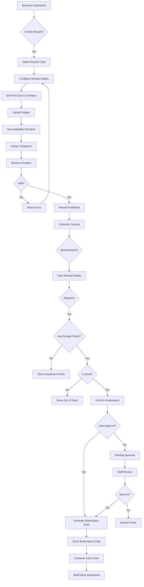

# Reward Catalog

**Status**: 🟢 Approved
**Priority**: P0 (Critical - MVP Requirement)
**Phase**: Phase 1
**Teams**: Backend, Web, Mobile, AI/MCP, Infrastructure
**Estimated Effort**: 3 weeks
**Target Release**: 2026-Q1

## Overview

### Problem Statement

**Business owners** need to create and manage a catalog of rewards that customers can redeem with loyalty points or earned rewards. Currently, there is no system to define, organize, and track reward inventory, redemptions, and availability in a scalable way.

### Solution Summary

Provide a comprehensive reward catalog management system that allows businesses to:
- Create and manage rewards (discounts, free items, experiences, digital gifts)
- Organize rewards into hierarchical categories
- Track inventory and redemption limits
- Set time-based availability (seasonal rewards, limited-time offers)
- Support multi-image galleries for visual appeal
- Manage redemption workflows with approval and audit trails
- Monitor reward performance and popularity

### Success Criteria

- [ ] Metric 1: 90% of businesses create at least 3 rewards within first week
- [ ] Metric 2: <3 seconds to load reward catalog (100+ rewards) on web/mobile
- [ ] Metric 3: 99.9% inventory accuracy (no over-redemption)
- [ ] Metric 4: <500ms API response time for catalog queries (p95)
- [ ] Metric 5: 95% redemption approval rate (automated + manual combined)

## User Stories

### Primary User Story

**As a** business owner
**I want** to create and manage a catalog of rewards
**So that** customers can redeem earned loyalty points for valuable incentives

**Acceptance Criteria**:
- [ ] Given I'm on the rewards page, when I create a reward, then I can specify type, cost, inventory, and availability
- [ ] Given I've created rewards, when I organize them into categories, then customers see organized catalog
- [ ] Given a reward has limited inventory, when stock reaches zero, then reward shows "Out of Stock"
- [ ] Given a customer redeems a reward, when inventory is tracked, then available count decrements
- [ ] Given I view reward analytics, when I check performance, then I see redemption rate, popularity, and revenue impact

### Secondary User Stories

**As a** customer
**I want** to browse available rewards by category
**So that** I can find rewards I'm interested in redeeming

**Acceptance Criteria**:
- [ ] Given I open the rewards catalog, when I browse categories, then I see organized list of rewards
- [ ] Given a reward has images, when I view details, then I see high-quality photos
- [ ] Given a reward requires points, when I check eligibility, then I see if I have enough points
- [ ] Given I redeem a reward, when redemption completes, then I receive a unique redemption code

**As a** business owner with seasonal campaigns
**I want** to schedule reward availability dates
**So that** I can run limited-time promotional rewards without manual intervention

**Acceptance Criteria**:
- [ ] Given I'm creating a reward, when I set start/end dates, then reward auto-activates and auto-expires
- [ ] Given a reward is expiring soon, when I view it, then I see expiration warning
- [ ] Given a reward has expired, when customers browse catalog, then it's hidden automatically

**As a** business staff member
**I want** to approve or reject redemption requests
**So that** I can validate customer eligibility and prevent fraud

**Acceptance Criteria**:
- [ ] Given a customer redeems a reward, when approval is required, then I receive notification
- [ ] Given I review a redemption, when I approve it, then customer receives confirmation and redemption code
- [ ] Given I reject a redemption, when I provide reason, then points are refunded to customer

## Requirements

### Functional Requirements

**Must Have (MVP - Phase 1)**:
- [ ] CRUD operations for reward catalog items
- [ ] Support 7 reward types:
  - DISCOUNT (percentage or fixed amount off)
  - FREE_ITEM (specific product/service)
  - CASHBACK (store credit)
  - EXPERIENCE (special event, VIP access)
  - DIGITAL_GIFT (digital downloads, vouchers)
  - POINTS_MULTIPLIER (earn bonus points)
  - EXCLUSIVE_ACCESS (early access, members-only)
- [ ] Hierarchical category system (parent/child categories)
- [ ] Multi-image support (primary image, gallery, thumbnails)
- [ ] Inventory management (total available, total redeemed, current stock)
- [ ] Redemption limits (max per customer, per day, per month)
- [ ] Time-based availability (startsAt/endsAt)
- [ ] Status management (ACTIVE, INACTIVE, EXPIRED, OUT_OF_STOCK)
- [ ] Redemption workflow (PENDING → APPROVED → REDEEMED)
- [ ] Redemption audit trail (who, when, what action)
- [ ] Unique redemption codes (prevent duplicate use)
- [ ] Business ownership validation
- [ ] Soft delete support

**Should Have (Phase 1)**:
- [ ] Reward search and filtering (by category, type, status, price range)
- [ ] Reward popularity tracking (view count, redemption rate)
- [ ] Bulk reward operations (activate/deactivate multiple)
- [ ] Reward templates (quick create from popular rewards)
- [ ] Customer redemption history
- [ ] Reward expiration notifications
- [ ] Image optimization (auto-generate thumbnails)
- [ ] Redemption approval workflows (auto-approve rules)

**Could Have (Phase 2+)**:
- [ ] Tiered rewards (different costs for different customer tiers)
- [ ] Dynamic pricing (adjust point cost based on demand)
- [ ] Reward recommendations (AI-powered suggestions)
- [ ] Partner rewards (cross-business redemption)
- [ ] Social sharing incentives (share reward to unlock discount)
- [ ] Gamification (collect all rewards in category for bonus)
- [ ] Gift redemptions (redeem reward for another customer)

**Won't Have (Explicitly Out of Scope)**:
- ❌ E-commerce checkout integration (separate feature)
- ❌ Physical inventory sync with POS (Phase 3+)
- ❌ Third-party reward marketplace (Phase 4+)
- ❌ Blockchain/NFT rewards (Phase 4)
- ❌ Real-time bidding for rewards (complex, Phase 3+)

### Non-Functional Requirements

**Performance**:
- API response time: <500ms for catalog queries (p95)
- Image loading: <2 seconds for high-res images
- Catalog page load: <3 seconds for 100+ rewards
- Search/filter: <300ms for 1,000+ rewards
- Inventory updates: Real-time (no race conditions)

**Security**:
- Authentication: JWT required for all endpoints
- Authorization: Business owners manage their own rewards only
- Redemption codes: Cryptographically secure (16+ characters)
- Image uploads: Virus scanning, file type validation
- Rate limiting: 100 requests per minute per business

**Scalability**:
- Support 1,000+ rewards per business
- Support 10,000+ concurrent redemptions per day
- Image CDN: CloudFront or equivalent for global delivery
- Database: Indexed queries for catalog listings
- Caching: Redis cache for popular rewards (10-minute TTL)

**Availability**:
- Uptime SLA: 99.9%
- Degraded mode: Read-only catalog if writes fail
- Monitoring: Alerts for high redemption failures
- Backup: Daily snapshots, point-in-time recovery

**Data Integrity**:
- Inventory atomicity: No over-redemption (use database locks)
- Redemption idempotency: Same request twice = same result
- Audit logging: Complete redemption history (immutable)
- Referential integrity: Cascade deletes to related entities

## User Experience

### User Flow Diagram



### Wireframes / Mockups

**Reward Creation Flow**:
1. **Step 1: Select Reward Type**
   - Card grid showing 7 reward types with icons
   - Descriptions of each type

2. **Step 2: Configure Details**
   - Name, description fields
   - Point cost input (with current exchange rate reference)
   - Monetary value input (optional, for analytics)
   - Validity period (days after redemption)

3. **Step 3: Inventory & Limits**
   - Total available quantity (unlimited checkbox)
   - Max redemptions per customer
   - Daily/monthly redemption limits

4. **Step 4: Schedule & Images**
   - Start/end date pickers
   - Image upload (drag-drop, multi-select)
   - Primary image designation

5. **Step 5: Categories & Publish**
   - Category tree selection (multi-select)
   - Preview panel showing customer view
   - "Publish" or "Save as Draft" buttons

**Customer Catalog View**:
- Category filters (sidebar or top bar)
- Reward cards with:
  - Primary image
  - Name and short description
  - Point cost
  - "Available" badge or "X left" counter
  - "Redeem" button
- Sort options (popular, price low-high, newest)
- Search bar with autocomplete

**Redemption Flow (Customer)**:
1. Reward detail page with gallery
2. "Redeem for X points" button
3. Confirmation modal with terms
4. Success screen with unique redemption code (QR code + text)
5. "Show this to staff" instructions

### UI Copy

**Page Title**: "Reward Catalog"
**Primary CTA**: "Create Reward"
**Help Text**: "Create rewards customers can redeem with earned loyalty points. Organize your catalog with categories and track redemptions."

**Reward Types**:
- 💰 Discount - "Percentage or fixed amount off next purchase"
- 🎁 Free Item - "Complimentary product or service"
- 💵 Cashback - "Store credit applied to customer account"
- ✨ Experience - "Special events, VIP access, exclusive perks"
- 📱 Digital Gift - "Digital downloads, vouchers, e-gift cards"
- 🔥 Points Multiplier - "Earn bonus points on purchases"
- 🔐 Exclusive Access - "Early access, members-only products"

**Status Labels**:
- 🟢 Active - "Available for redemption"
- 🟡 Inactive - "Hidden from customers"
- 🔴 Expired - "Availability period ended"
- ⚫ Out of Stock - "No inventory remaining"

**Redemption Status**:
- 🟡 Pending - "Awaiting staff approval"
- 🟢 Approved - "Ready to use"
- ✅ Redeemed - "Already used"
- ⏰ Expired - "Redemption window closed"
- ❌ Cancelled - "Refunded to customer"

## Technical Design

### Architecture Overview

```
┌─────────────────────────────────────────────────────────────┐
│                    Web/Mobile UI Layer                      │
│  - Reward Catalog Grid                                      │
│  - Reward Detail Page                                       │
│  - Redemption Flow                                          │
│  - Staff Approval Dashboard                                 │
└────────────────────┬────────────────────────────────────────┘
                     │
                     ▼
┌─────────────────────────────────────────────────────────────┐
│                 Backend API Layer (NestJS)                  │
│  ┌─────────────────────────────────────────────────────┐   │
│  │        RewardCatalogController                      │   │
│  │  - POST /rewards (create)                           │   │
│  │  - GET /rewards (list with filters)                 │   │
│  │  - GET /rewards/{id} (details)                      │   │
│  │  - PUT /rewards/{id} (update)                       │   │
│  │  - DELETE /rewards/{id} (soft delete)               │   │
│  │  - POST /rewards/{id}/images (upload)               │   │
│  │  - GET /rewards/categories (hierarchy)              │   │
│  └─────────────────────┬───────────────────────────────┘   │
│                        ▼                                    │
│  ┌─────────────────────────────────────────────────────┐   │
│  │        RedemptionController                         │   │
│  │  - POST /redemptions (redeem reward)                │   │
│  │  - GET /redemptions (customer history)              │   │
│  │  - POST /redemptions/{id}/approve (staff)           │   │
│  │  - POST /redemptions/{id}/reject (staff)            │   │
│  │  - POST /redemptions/{id}/mark-redeemed (staff)     │   │
│  │  - GET /redemptions/{code} (lookup by code)         │   │
│  └─────────────────────┬───────────────────────────────┘   │
│                        ▼                                    │
│  ┌─────────────────────────────────────────────────────┐   │
│  │        RewardCatalogService                         │   │
│  │  - CRUD operations with validation                  │   │
│  │  - Category management (hierarchy)                  │   │
│  │  - Image processing (upload, thumbnail generation)  │   │
│  │  - Inventory management (atomic updates)            │   │
│  │  - Status transitions (auto-expire, out-of-stock)   │   │
│  └─────────────────────┬───────────────────────────────┘   │
│                        ▼                                    │
│  ┌─────────────────────────────────────────────────────┐   │
│  │        RedemptionService                            │   │
│  │  - Redemption code generation (secure random)       │   │
│  │  - Point balance validation                         │   │
│  │  - Inventory locking (prevent over-redemption)      │   │
│  │  - Approval workflows (auto-approve rules)          │   │
│  │  - Audit logging (immutable trail)                  │   │
│  └─────────────────────┬───────────────────────────────┘   │
└────────────────────────┼────────────────────────────────────┘
                         │
                         ▼
┌─────────────────────────────────────────────────────────────┐
│                PostgreSQL Database                          │
│  - reward_catalog (rewards)                                 │
│  - reward_categories (hierarchy)                            │
│  - reward_category_assignments (many-to-many)               │
│  - reward_images (gallery)                                  │
│  - redemption_rules (approval logic)                        │
│  - reward_redemptions (transactions)                        │
│  - redemption_audit_logs (history)                          │
│  - reward_inventory_history (stock changes)                 │
└─────────────────────────────────────────────────────────────┘
                         │
                         ▼
┌─────────────────────────────────────────────────────────────┐
│                   Redis Cache Layer                         │
│  - Popular rewards (10-min TTL)                             │
│  - Category tree (1-hour TTL)                               │
│  - Redemption locks (60-second TTL)                         │
└─────────────────────────────────────────────────────────────┘
                         │
                         ▼
┌─────────────────────────────────────────────────────────────┐
│                   CDN / Image Storage                       │
│  - S3 for original images                                   │
│  - CloudFront for global delivery                           │
│  - Auto-generated thumbnails (100x100, 300x300, 800x800)    │
└─────────────────────────────────────────────────────────────┘
                         │
                         ▼
┌─────────────────────────────────────────────────────────────┐
│                Event Bus (AsyncAPI)                         │
│  - rewards.reward.created                                   │
│  - rewards.reward.updated                                   │
│  - rewards.reward.out_of_stock                              │
│  - rewards.redemption.requested                             │
│  - rewards.redemption.approved                              │
│  - rewards.redemption.redeemed                              │
│  - rewards.redemption.expired                               │
└─────────────────────────────────────────────────────────────┘
```

### Domain Model

```typescript
// Core entities
interface RewardCatalog {
  id: string;
  businessId: string;
  name: string;
  description: string;
  type: RewardType;
  costInPoints: number;
  monetaryValue: number | null; // In cents, for analytics
  status: RewardStatus;
  validityPeriodDays: number | null; // Days after redemption before expiring
  maxRedemptionsPerCustomer: number | null;
  totalAvailable: number | null; // null = unlimited
  totalRedeemed: number;
  isActive: boolean;
  startsAt: Date | null;
  endsAt: Date | null;
  primaryImageId: string | null;
  metadata: Record<string, any> | null;
  createdAt: Date;
  updatedAt: Date;
  deletedAt: Date | null;

  // Relations
  categories: RewardCategory[];
  images: RewardImage[];
  redemptionRules: RedemptionRule[];
  redemptions: RewardRedemption[];

  // Computed
  availableQuantity: number; // totalAvailable - totalRedeemed
  redemptionRate: number; // totalRedeemed / totalAvailable
  isAvailableNow: boolean; // status === ACTIVE && in date range && in stock
}

// Reward types
enum RewardType {
  DISCOUNT = 'DISCOUNT',
  FREE_ITEM = 'FREE_ITEM',
  CASHBACK = 'CASHBACK',
  EXPERIENCE = 'EXPERIENCE',
  DIGITAL_GIFT = 'DIGITAL_GIFT',
  POINTS_MULTIPLIER = 'POINTS_MULTIPLIER',
  EXCLUSIVE_ACCESS = 'EXCLUSIVE_ACCESS'
}

// Reward status
enum RewardStatus {
  ACTIVE = 'ACTIVE',
  INACTIVE = 'INACTIVE',
  EXPIRED = 'EXPIRED',
  OUT_OF_STOCK = 'OUT_OF_STOCK'
}

// Redemption status
enum RedemptionStatus {
  PENDING = 'PENDING',
  APPROVED = 'APPROVED',
  REDEEMED = 'REDEEMED',
  EXPIRED = 'EXPIRED',
  CANCELLED = 'CANCELLED',
  FAILED = 'FAILED'
}

// Category (hierarchical)
interface RewardCategory {
  id: string;
  businessId: string;
  name: string;
  description: string | null;
  parentId: string | null;
  sortOrder: number;
  isActive: boolean;
  createdAt: Date;
  updatedAt: Date;
  deletedAt: Date | null;

  // Relations
  parent: RewardCategory | null;
  children: RewardCategory[];
  rewards: RewardCatalog[]; // via RewardCategoryAssignment
}

// Images
interface RewardImage {
  id: string;
  rewardId: string;
  url: string;
  thumbnailUrl: string | null;
  altText: string;
  sortOrder: number;
  imageType: RewardImageType;
  metadata: Record<string, any> | null;
  uploadedAt: Date;
  createdAt: Date;
  updatedAt: Date;
}

enum RewardImageType {
  PRIMARY = 'PRIMARY',
  GALLERY = 'GALLERY',
  THUMBNAIL = 'THUMBNAIL'
}

// Redemption rules (auto-approval logic)
interface RedemptionRule {
  id: string;
  rewardId: string;
  ruleType: string; // 'auto_approve_under_value', 'require_approval_tier', etc.
  ruleConfig: Record<string, any>;
  isActive: boolean;
  priority: number; // Higher priority rules evaluated first
  createdAt: Date;
  updatedAt: Date;
}

// Redemption transaction
interface RewardRedemption {
  id: string;
  rewardId: string;
  customerId: string;
  loyaltyBalanceId: string | null;
  pointsUsed: number;
  status: RedemptionStatus;
  redemptionCode: string; // Unique 16-character alphanumeric
  approvedBy: string | null; // User ID of staff member
  approvedAt: Date | null;
  redeemedAt: Date | null; // When customer actually used the reward
  expiresAt: Date; // Calculated: redeemedAt + validityPeriodDays
  cancelledAt: Date | null;
  cancelledBy: string | null;
  cancellationReason: string | null;
  metadata: Record<string, any> | null;
  createdAt: Date;
  updatedAt: Date;

  // Relations
  reward: RewardCatalog;
  customer: Customer;
  loyaltyBalance: LoyaltyBalance | null;
  auditLogs: RedemptionAuditLog[];
}

// Audit trail (immutable)
interface RedemptionAuditLog {
  id: string;
  redemptionId: string;
  action: string; // 'created', 'approved', 'rejected', 'redeemed', 'expired', 'cancelled'
  performedBy: string | null; // User ID or 'system'
  previousStatus: RedemptionStatus | null;
  newStatus: RedemptionStatus;
  details: Record<string, any> | null;
  createdAt: Date;
}

// Inventory tracking
interface RewardInventoryHistory {
  id: string;
  rewardId: string;
  changeType: string; // 'initial_stock', 'redemption', 'manual_adjustment', 'restocked'
  quantity: number; // +/- change
  balanceBefore: number;
  balanceAfter: number;
  reason: string | null;
  performedBy: string | null;
  relatedId: string | null; // e.g., redemption ID
  createdAt: Date;
}
```

### Database Schema Changes

**Existing Tables** (already exists in Ploy):

```sql
-- See schema.prisma lines 626-801

-- Key tables:
-- - reward_catalog
-- - reward_categories (hierarchical)
-- - reward_category_assignments (many-to-many)
-- - reward_images
-- - redemption_rules
-- - reward_redemptions
-- - redemption_audit_logs
-- - reward_inventory_history
```

**New Migration** (for NxLoy):

```sql
-- Migration: 002_reward_catalog.sql

CREATE TYPE reward_type AS ENUM (
  'DISCOUNT',
  'FREE_ITEM',
  'CASHBACK',
  'EXPERIENCE',
  'DIGITAL_GIFT',
  'POINTS_MULTIPLIER',
  'EXCLUSIVE_ACCESS'
);

CREATE TYPE reward_status AS ENUM (
  'ACTIVE',
  'INACTIVE',
  'EXPIRED',
  'OUT_OF_STOCK'
);

CREATE TYPE redemption_status AS ENUM (
  'PENDING',
  'APPROVED',
  'REDEEMED',
  'EXPIRED',
  'CANCELLED',
  'FAILED'
);

CREATE TYPE reward_image_type AS ENUM (
  'PRIMARY',
  'GALLERY',
  'THUMBNAIL'
);

-- Reward catalog table
CREATE TABLE reward_catalog (
  id UUID PRIMARY KEY DEFAULT gen_random_uuid(),
  business_id UUID NOT NULL REFERENCES businesses(id) ON DELETE CASCADE,
  name VARCHAR(255) NOT NULL,
  description TEXT NOT NULL,
  type reward_type NOT NULL,
  cost_in_points INTEGER NOT NULL CHECK (cost_in_points > 0),
  monetary_value BIGINT, -- In cents
  status reward_status NOT NULL DEFAULT 'ACTIVE',
  validity_period_days INTEGER CHECK (validity_period_days > 0),
  max_redemptions_per_customer INTEGER CHECK (max_redemptions_per_customer > 0),
  total_available INTEGER CHECK (total_available IS NULL OR total_available >= 0),
  total_redeemed INTEGER NOT NULL DEFAULT 0,
  is_active BOOLEAN NOT NULL DEFAULT true,
  starts_at TIMESTAMP,
  ends_at TIMESTAMP,
  primary_image_id UUID,
  metadata JSONB,
  created_at TIMESTAMP NOT NULL DEFAULT NOW(),
  updated_at TIMESTAMP NOT NULL DEFAULT NOW(),
  deleted_at TIMESTAMP,

  CONSTRAINT valid_date_range CHECK (starts_at IS NULL OR ends_at IS NULL OR starts_at < ends_at),
  CONSTRAINT valid_inventory CHECK (total_redeemed <= COALESCE(total_available, total_redeemed))
);

-- Reward categories (hierarchical)
CREATE TABLE reward_categories (
  id UUID PRIMARY KEY DEFAULT gen_random_uuid(),
  business_id UUID NOT NULL REFERENCES businesses(id) ON DELETE CASCADE,
  name VARCHAR(255) NOT NULL,
  description TEXT,
  parent_id UUID REFERENCES reward_categories(id) ON DELETE CASCADE,
  sort_order INTEGER NOT NULL DEFAULT 0,
  is_active BOOLEAN NOT NULL DEFAULT true,
  created_at TIMESTAMP NOT NULL DEFAULT NOW(),
  updated_at TIMESTAMP NOT NULL DEFAULT NOW(),
  deleted_at TIMESTAMP,

  UNIQUE(business_id, name)
);

-- Reward category assignments (many-to-many)
CREATE TABLE reward_category_assignments (
  id UUID PRIMARY KEY DEFAULT gen_random_uuid(),
  reward_id UUID NOT NULL REFERENCES reward_catalog(id) ON DELETE CASCADE,
  category_id UUID NOT NULL REFERENCES reward_categories(id) ON DELETE CASCADE,
  created_at TIMESTAMP NOT NULL DEFAULT NOW(),

  UNIQUE(reward_id, category_id)
);

-- Reward images
CREATE TABLE reward_images (
  id UUID PRIMARY KEY DEFAULT gen_random_uuid(),
  reward_id UUID NOT NULL REFERENCES reward_catalog(id) ON DELETE CASCADE,
  url TEXT NOT NULL,
  thumbnail_url TEXT,
  alt_text VARCHAR(255) NOT NULL,
  sort_order INTEGER NOT NULL DEFAULT 0,
  image_type reward_image_type NOT NULL DEFAULT 'GALLERY',
  metadata JSONB,
  uploaded_at TIMESTAMP NOT NULL DEFAULT NOW(),
  created_at TIMESTAMP NOT NULL DEFAULT NOW(),
  updated_at TIMESTAMP NOT NULL DEFAULT NOW()
);

-- Redemption rules (auto-approval logic)
CREATE TABLE redemption_rules (
  id UUID PRIMARY KEY DEFAULT gen_random_uuid(),
  reward_id UUID NOT NULL REFERENCES reward_catalog(id) ON DELETE CASCADE,
  rule_type VARCHAR(100) NOT NULL,
  rule_config JSONB NOT NULL,
  is_active BOOLEAN NOT NULL DEFAULT true,
  priority INTEGER NOT NULL DEFAULT 0,
  created_at TIMESTAMP NOT NULL DEFAULT NOW(),
  updated_at TIMESTAMP NOT NULL DEFAULT NOW()
);

-- Reward redemptions
CREATE TABLE reward_redemptions (
  id UUID PRIMARY KEY DEFAULT gen_random_uuid(),
  reward_id UUID NOT NULL REFERENCES reward_catalog(id) ON DELETE CASCADE,
  customer_id UUID NOT NULL REFERENCES customers(id) ON DELETE CASCADE,
  loyalty_balance_id UUID REFERENCES loyalty_balances(id),
  points_used INTEGER NOT NULL CHECK (points_used > 0),
  status redemption_status NOT NULL DEFAULT 'PENDING',
  redemption_code VARCHAR(16) NOT NULL UNIQUE,
  approved_by UUID REFERENCES users(id),
  approved_at TIMESTAMP,
  redeemed_at TIMESTAMP,
  expires_at TIMESTAMP NOT NULL,
  cancelled_at TIMESTAMP,
  cancelled_by UUID REFERENCES users(id),
  cancellation_reason TEXT,
  metadata JSONB,
  created_at TIMESTAMP NOT NULL DEFAULT NOW(),
  updated_at TIMESTAMP NOT NULL DEFAULT NOW()
);

-- Redemption audit logs (immutable)
CREATE TABLE redemption_audit_logs (
  id UUID PRIMARY KEY DEFAULT gen_random_uuid(),
  redemption_id UUID NOT NULL REFERENCES reward_redemptions(id) ON DELETE CASCADE,
  action VARCHAR(50) NOT NULL,
  performed_by VARCHAR(100), -- User ID or 'system'
  previous_status redemption_status,
  new_status redemption_status NOT NULL,
  details JSONB,
  created_at TIMESTAMP NOT NULL DEFAULT NOW()
);

-- Reward inventory history
CREATE TABLE reward_inventory_history (
  id UUID PRIMARY KEY DEFAULT gen_random_uuid(),
  reward_id UUID NOT NULL REFERENCES reward_catalog(id) ON DELETE CASCADE,
  change_type VARCHAR(50) NOT NULL,
  quantity INTEGER NOT NULL,
  balance_before INTEGER NOT NULL,
  balance_after INTEGER NOT NULL,
  reason TEXT,
  performed_by VARCHAR(100),
  related_id UUID,
  created_at TIMESTAMP NOT NULL DEFAULT NOW()
);

-- Indexes
CREATE INDEX idx_rewards_business_active ON reward_catalog(business_id, is_active) WHERE deleted_at IS NULL;
CREATE INDEX idx_rewards_type ON reward_catalog(type) WHERE deleted_at IS NULL;
CREATE INDEX idx_rewards_status ON reward_catalog(status) WHERE deleted_at IS NULL;
CREATE INDEX idx_rewards_schedule ON reward_catalog(starts_at, ends_at) WHERE is_active = true;

CREATE INDEX idx_categories_business ON reward_categories(business_id, is_active) WHERE deleted_at IS NULL;
CREATE INDEX idx_categories_parent ON reward_categories(parent_id);
CREATE INDEX idx_categories_sort ON reward_categories(sort_order);

CREATE INDEX idx_category_assignments_reward ON reward_category_assignments(reward_id);
CREATE INDEX idx_category_assignments_category ON reward_category_assignments(category_id);

CREATE INDEX idx_reward_images_reward ON reward_images(reward_id, sort_order);
CREATE INDEX idx_reward_images_type ON reward_images(image_type);

CREATE INDEX idx_redemption_rules_reward ON redemption_rules(reward_id, is_active);
CREATE INDEX idx_redemption_rules_type ON redemption_rules(rule_type);
CREATE INDEX idx_redemption_rules_priority ON redemption_rules(priority);

CREATE INDEX idx_redemptions_customer_status ON reward_redemptions(customer_id, status);
CREATE INDEX idx_redemptions_reward ON reward_redemptions(reward_id);
CREATE INDEX idx_redemptions_code ON reward_redemptions(redemption_code);
CREATE INDEX idx_redemptions_status ON reward_redemptions(status);
CREATE INDEX idx_redemptions_expires ON reward_redemptions(expires_at);

CREATE INDEX idx_audit_logs_redemption ON redemption_audit_logs(redemption_id);
CREATE INDEX idx_audit_logs_action ON redemption_audit_logs(action);
CREATE INDEX idx_audit_logs_created ON redemption_audit_logs(created_at);

CREATE INDEX idx_inventory_history_reward ON reward_inventory_history(reward_id);
CREATE INDEX idx_inventory_history_type ON reward_inventory_history(change_type);
CREATE INDEX idx_inventory_history_created ON reward_inventory_history(created_at);

-- Triggers
CREATE TRIGGER update_reward_catalog_updated_at
BEFORE UPDATE ON reward_catalog
FOR EACH ROW
EXECUTE FUNCTION update_updated_at_column();

CREATE TRIGGER update_reward_categories_updated_at
BEFORE UPDATE ON reward_categories
FOR EACH ROW
EXECUTE FUNCTION update_updated_at_column();

CREATE TRIGGER update_reward_images_updated_at
BEFORE UPDATE ON reward_images
FOR EACH ROW
EXECUTE FUNCTION update_updated_at_column();

CREATE TRIGGER update_redemption_rules_updated_at
BEFORE UPDATE ON redemption_rules
FOR EACH ROW
EXECUTE FUNCTION update_updated_at_column();

CREATE TRIGGER update_reward_redemptions_updated_at
BEFORE UPDATE ON reward_redemptions
FOR EACH ROW
EXECUTE FUNCTION update_updated_at_column();
```

### API Endpoints

**See CONTRACTS.md for full OpenAPI specification**

Summary of endpoints:

**Reward Catalog CRUD**:
- `POST /api/v1/rewards` - Create reward
- `GET /api/v1/rewards` - List rewards (filters: type, status, category, priceRange)
- `GET /api/v1/rewards/{id}` - Get reward details
- `PUT /api/v1/rewards/{id}` - Update reward
- `DELETE /api/v1/rewards/{id}` - Soft delete reward

**Image Management**:
- `POST /api/v1/rewards/{id}/images` - Upload images
- `DELETE /api/v1/rewards/{id}/images/{imageId}` - Delete image
- `PUT /api/v1/rewards/{id}/images/{imageId}/primary` - Set as primary image

**Category Management**:
- `POST /api/v1/rewards/categories` - Create category
- `GET /api/v1/rewards/categories` - List categories (tree structure)
- `PUT /api/v1/rewards/categories/{id}` - Update category
- `DELETE /api/v1/rewards/categories/{id}` - Delete category

**Redemption Flow**:
- `POST /api/v1/redemptions` - Redeem reward (customer)
- `GET /api/v1/redemptions` - List redemptions (customer history)
- `GET /api/v1/redemptions/{code}` - Lookup by redemption code
- `POST /api/v1/redemptions/{id}/approve` - Approve redemption (staff)
- `POST /api/v1/redemptions/{id}/reject` - Reject redemption (staff)
- `POST /api/v1/redemptions/{id}/mark-redeemed` - Mark as used (staff)
- `POST /api/v1/redemptions/{id}/cancel` - Cancel redemption

### Domain Events

**See CONTRACTS.md for full AsyncAPI specification**

Summary of events:

**Reward Lifecycle Events**:
- `rewards.reward.created` - When reward is created
- `rewards.reward.updated` - When reward configuration changes
- `rewards.reward.activated` - When reward becomes active
- `rewards.reward.deactivated` - When reward is deactivated
- `rewards.reward.expired` - When reward passes end date
- `rewards.reward.out_of_stock` - When inventory reaches zero
- `rewards.reward.restocked` - When inventory is replenished

**Redemption Events**:
- `rewards.redemption.requested` - When customer initiates redemption
- `rewards.redemption.approved` - When staff approves redemption
- `rewards.redemption.rejected` - When staff rejects redemption
- `rewards.redemption.redeemed` - When customer uses redemption code
- `rewards.redemption.expired` - When redemption expires unused
- `rewards.redemption.cancelled` - When redemption is cancelled

## Dependencies

### Internal Dependencies

- **Loyalty Programs**: Redemptions tie to loyalty balances (parallel development OK)
- **Customer Management**: Redemptions belong to customers (must exist first)
- **Business Management**: Rewards belong to businesses (must exist first)
- **Authentication**: JWT tokens for API access (must exist first)
- **Authorization**: Business ownership validation (must exist first)

### External Dependencies

- **Prisma ORM**: Database access layer
- **NestJS**: Backend framework
- **PostgreSQL 14+**: Database with JSONB support
- **Redis**: Caching layer for popular rewards
- **AWS S3**: Image storage
- **CloudFront**: CDN for image delivery
- **Sharp**: Image processing library (thumbnail generation)

### Blocked By

- [ ] Business entity must exist
- [ ] Customer entity must exist
- [ ] Authentication system must be complete
- [ ] File upload infrastructure must be set up (S3, CDN)

### Blocks

- [ ] Reward redemption analytics (needs redemption data)
- [ ] Customer reward recommendations (needs reward catalog)
- [ ] Partner network rewards (needs reward catalog)

## Testing Strategy

### Unit Tests

**Backend**:
- RewardCatalogService methods (CRUD, validation, inventory management)
- RedemptionService methods (code generation, approval workflows, inventory locking)
- CategoryService methods (hierarchical operations)
- ImageService methods (upload, thumbnail generation, primary designation)

**Coverage Target**: >80% (100% for inventory management and redemption workflows)

### Integration Tests

**API Integration**:
- Full reward lifecycle (create → activate → redeem → expire)
- Inventory race conditions (concurrent redemptions)
- Image upload and retrieval
- Category hierarchy operations
- Redemption approval workflows

### End-to-End Tests

See `ACCEPTANCE.feature` for Gherkin scenarios.

**Critical Flows**:
1. Business creates reward with images and categories
2. Customer browses catalog, filters by category
3. Customer redeems reward, receives redemption code
4. Staff approves redemption, customer uses code
5. System auto-expires reward at end date
6. System marks reward out-of-stock when inventory depletes

### Performance Tests

**Load Test**:
- 1,000 concurrent catalog queries
- 500 concurrent redemptions
- 100 concurrent image uploads
- Target: <500ms p95 response time

## Rollout Plan

See standard rollout plan in Loyalty Programs feature spec (same 5-phase approach).

## Monitoring & Analytics

### Metrics to Track

**Usage Metrics**:
- Rewards created per day
- Redemptions per day (by reward type)
- Average redemption rate per reward
- Popular reward categories
- Image upload success rate

**Performance Metrics**:
- API response time (p50, p95, p99)
- Image load time
- Cache hit rate
- Inventory lock contention

**Business Metrics**:
- Average rewards per business
- Redemption approval rate
- Redemption completion rate (approved → redeemed)
- Out-of-stock incidents

## Documentation

- [ ] Help article: "Creating Your First Reward"
- [ ] Help article: "Managing Reward Inventory"
- [ ] Help article: "Redemption Approval Workflows"
- [ ] Video tutorial: "Setting Up Your Reward Catalog"

## Risks & Mitigation

### Risk 1: Over-Redemption (Inventory Race Conditions)

**Probability**: Medium
**Impact**: Critical

**Mitigation**:
- Use database row-level locks (SELECT FOR UPDATE)
- Atomic inventory decrement operations
- Redis distributed locks for additional safety
- Integration tests for concurrent redemptions

### Risk 2: Image Storage Costs

**Probability**: Low
**Impact**: Medium

**Mitigation**:
- Implement image compression (80% quality JPEG)
- Auto-generate thumbnails (don't serve full-res for listings)
- S3 lifecycle policies (archive old images)
- Monitor storage costs per business

## Open Questions

- [ ] **Question 1**: Should customers be able to gift redemptions to other customers?
  - **Decision Deadline**: Week 2 of development
  - **Decision Owner**: Product team
  - **Recommendation**: Phase 2 feature

- [ ] **Question 2**: How long should redemption codes remain valid after expiration?
  - **Decision Deadline**: Week 1 of development
  - **Decision Owner**: Product team
  - **Recommendation**: 7-day grace period

## Stakeholders

See Loyalty Programs feature spec for standard stakeholder list.

## Timeline

| Milestone | Date | Owner | Status |
|-----------|------|-------|--------|
| Spec approval | 2025-W45 | Product | 🟢 Approved |
| Contract freeze | 2025-W46 | Backend | 🟡 Pending |
| Development complete | 2025-W49 | Engineering | 🟡 Pending |
| Testing complete | 2025-W50 | QA | 🟡 Pending |
| Staging deployment | 2025-W51 | DevOps | 🟡 Pending |
| Production launch | 2026-W02 | Product | 🟡 Pending |

## References

### Related Documents

- [ADR-0002: Contract-First Development](/docs/adr/0002-contract-first-development.md)
- [Feature Spec: Loyalty Programs](/docs/requirements/features/loyalty-programs/FEATURE-SPEC.md)
- [CONTRACTS.md: OpenAPI Specification](/docs/contracts/CONTRACTS.md)

## Change Log

| Date | Version | Changes | Author |
|------|---------|---------|--------|
| 2025-11-06 | 1.0.0 | Initial draft | Ploy Lab |

---

**Last Updated**: 2025-11-06
**Next Review**: 2025-11-13
**Document Owner**: Backend Team
