# Social & Community Features - Feature Specification

**Feature**: Social & Community Features
**Version**: 1.0.0
**Status**: 🟡 Phase 5 Feature (Months 13-18)
**Priority**: P1 (Critical for Gen Z/Alpha demographics)
**Last Updated**: 2025-11-07

---

## Problem Statement

**Current Challenge**: Traditional loyalty programs are transactional and isolated experiences. Customers:
- Earn points alone (no social interaction)
- Don't know what other customers are doing
- Can't share achievements or compete with friends
- Miss opportunities for community engagement
- Have no way to gift or share rewards

**Business Impact**:
- Low emotional connection to brand (transactional only)
- Younger demographics (Gen Z, Gen Alpha) expect social features everywhere
- Missed viral marketing opportunities (no social sharing)
- Limited word-of-mouth growth (no community amplification)
- Competitive disadvantage vs. social-first brands (Nike, Starbucks)

**Why This Matters**:
- **66% of Gen Z** prefer brands with strong community features
- **Starbucks** saw 40% engagement increase after launching "Star Dash" group challenges
- **Peloton** built $8B valuation primarily on community features (leaderboards, group classes)
- **Nike Run Club** retains users 3x longer than generic fitness apps due to social features

---

## Solution Summary

Build a comprehensive social layer for loyalty programs that enables:

1. **Social Feed**: Instagram-style feed where customers share purchases, rewards, and achievements
2. **Group Challenges**: Team-based competitions (e.g., "Coffee Crew Challenge: Buy 50 coffees as a team this month")
3. **Leaderboards**: Public rankings by points, badges, or challenge completions
4. **Gifting**: Send rewards or points to friends/family
5. **Influencer Programs**: Partner with micro-influencers to promote loyalty program
6. **Social Badges**: Exclusive badges for social engagement (e.g., "First to Share," "Top Commenter")
7. **Community Events**: Virtual and in-person meetups for loyalty members

**Technology Stack**:
- Real-Time: Socket.io, Firebase Realtime Database
- Social Graph: Neo4j (graph database for friend relationships)
- Content Moderation: AWS Rekognition, Perspective API (Google)
- Push Notifications: Firebase Cloud Messaging, OneSignal
- Analytics: Mixpanel, Amplitude (social engagement tracking)

---

## Success Criteria

| Metric | Current Baseline | Target (6 months) | Measurement |
|--------|------------------|-------------------|-------------|
| Social Posts | 0 | 10,000+/month | Total posts in social feed |
| User-Generated Content | 0 | 50,000+ photos | Total photos uploaded |
| Challenge Participation | 0 | 30%+ of active users | Users who joined ≥1 challenge |
| Viral Coefficient | 1.0 | 1.3+ | New users per existing user |
| Social Referrals | 0 | 25%+ of new signups | Signups from social shares |
| Community Retention | N/A | 60%+ 90-day retention | Retention for community-active users |
| Social Gifting Volume | 0 | 100,000+ gifts/month | Total rewards/points gifted |
| NPS (Social Features) | N/A | 50+ | Net Promoter Score |

---

## User Stories

### Customer (Social Sharer)

**Story 1: Share Achievement to Social Feed**
```
As a loyal customer,
I want to share my "Gold Member" achievement to the community feed,
So that my friends can see my progress and celebrate with me.

Acceptance Criteria:
- "Share" button on achievement unlock screen
- Post includes achievement badge, customer name, and custom message
- Post visible to friends and public (based on privacy settings)
- Friends can like and comment on post
- Poster earns bonus points for social engagement (10 points per share)
```

**Story 2: Join Group Challenge with Friends**
```
As a coffee enthusiast,
I want to join a "Coffee Crew Challenge" with 4 friends,
So that we can compete together and earn bonus rewards.

Acceptance Criteria:
- Browse available group challenges
- Create team with 2-10 members (invite by email/username)
- Real-time progress tracking (team dashboard)
- Team leaderboard showing rankings vs. other teams
- Bonus rewards for team milestones (e.g., 50% bonus if team finishes top 10)
```

### Business Owner

**Story 3: Launch Viral Challenge Campaign**
```
As a business owner,
I want to create a "Summer Sip Challenge" that encourages customers to share photos,
So that I can generate user-generated content and drive social virality.

Acceptance Criteria:
- Create challenge with name, description, rules, rewards
- Set challenge type (individual vs. team, photo upload, points-based)
- Define success criteria (e.g., "Upload photo of iced coffee with hashtag #SummerSip")
- Track challenge metrics (participants, UGC, social shares, viral coefficient)
- Automatically award rewards to challenge completers
```

**Story 4: Partner with Micro-Influencers**
```
As a business owner,
I want to invite local influencers to promote my loyalty program,
So that I can reach new audiences and drive signups.

Acceptance Criteria:
- Create "Influencer" user type with special permissions
- Issue unique referral codes for influencers
- Track influencer performance (signups, conversions, revenue)
- Automated commission payouts (e.g., $5 per signup)
- Influencer dashboard showing performance metrics
```

### Community Manager

**Story 5: Moderate User-Generated Content**
```
As a community manager,
I want to review flagged posts before they go live,
So that I can ensure all content follows community guidelines.

Acceptance Criteria:
- AI-powered content moderation (filter profanity, inappropriate images)
- Manual review queue for flagged content
- Approve/reject posts with reason
- User notification on rejected content
- Ban repeat offenders (3 strikes → account suspension)
```

---

## Functional Requirements

### Must Have (Phase 5.1: Months 13-15)

#### FR1: Social Feed (Activity Stream)

**Description**: Instagram/Facebook-style feed where customers share loyalty activities

**Post Types**:
- **Achievement Unlock**: "Alice just earned Gold Member status! 🏆"
- **Reward Redemption**: "Bob redeemed Free Latte with 500 points"
- **Challenge Completion**: "Team Coffee Crew finished Summer Sip Challenge!"
- **Milestone Reached**: "Carol reached 10,000 lifetime points 🎉"
- **Photo Upload**: "Check out my morning coffee! #CoffeeRewards"

**Feed Algorithm**:
```typescript
interface FeedAlgorithm {
  // Ranking factors
  recency: number; // 0-1 (posts from last 24h ranked higher)
  engagement: number; // likes + comments
  relevance: number; // based on customer interests
  friendActivity: boolean; // posts from friends ranked higher
  viralityScore: number; // shares / impressions

  // Final score
  score = (
    recency * 0.3 +
    engagement * 0.25 +
    relevance * 0.2 +
    (friendActivity ? 1.0 : 0.5) +
    viralityScore * 0.15
  );
}
```

**Privacy Settings**:
- **Public**: Visible to all customers
- **Friends Only**: Visible to friends
- **Private**: Not shared to feed

**API Endpoints**:
```typescript
// Get personalized feed
GET /api/v1/social/feed?limit=20&offset=0

// Create post
POST /api/v1/social/posts
{
  "type": "ACHIEVEMENT_UNLOCK",
  "content": "Just earned Gold Member status!",
  "mediaUrl": "https://cdn.nxloy.com/images/gold-badge.png",
  "privacy": "PUBLIC",
  "metadata": {
    "achievementId": "achieve-123"
  }
}

// Like post
POST /api/v1/social/posts/{id}/like

// Comment on post
POST /api/v1/social/posts/{id}/comments
{
  "content": "Congrats! 🎉"
}

// Share post (to external social media)
POST /api/v1/social/posts/{id}/share
{
  "platform": "TWITTER" // TWITTER, FACEBOOK, INSTAGRAM
}
```

**Wireframe**:
```
┌─────────────────────────────────────────────────────────┐
│  ☰  Social Feed                         🔔 ➕ 👤       │
├─────────────────────────────────────────────────────────┤
│                                                         │
│  ┌───────────────────────────────────────────────────┐ │
│  │  👤 Alice Johnson                    2 hours ago  │ │
│  │  ─────────────────────────────────────────────────│ │
│  │  Just unlocked Gold Member status! 🏆             │ │
│  │                                                   │ │
│  │  [Gold Badge Image]                               │ │
│  │                                                   │ │
│  │  ❤️ 47 likes  💬 12 comments  🔗 Share           │ │
│  └───────────────────────────────────────────────────┘ │
│                                                         │
│  ┌───────────────────────────────────────────────────┐ │
│  │  👤 Bob Smith                        5 hours ago  │ │
│  │  ─────────────────────────────────────────────────│ │
│  │  Morning vibes ☕ #CoffeeRewards                  │ │
│  │                                                   │ │
│  │  [Photo of Coffee]                                │ │
│  │                                                   │ │
│  │  ❤️ 23 likes  💬 5 comments  🔗 Share            │ │
│  └───────────────────────────────────────────────────┘ │
│                                                         │
│  ┌───────────────────────────────────────────────────┐ │
│  │  🏆 Team Coffee Crew                 1 day ago    │ │
│  │  ─────────────────────────────────────────────────│ │
│  │  Completed Summer Sip Challenge! 🎉               │ │
│  │  Alice, Bob, Carol + 2 more                       │ │
│  │                                                   │ │
│  │  ❤️ 89 likes  💬 34 comments  🔗 Share           │ │
│  └───────────────────────────────────────────────────┘ │
│                                                         │
│  [Load More]                                            │
│                                                         │
└─────────────────────────────────────────────────────────┘
```

---

#### FR2: Group Challenges (Team Competitions)

**Description**: Team-based competitions where 2-10 customers collaborate to achieve goals

**Challenge Types**:

**1. Points-Based**:
- Goal: Team earns 10,000 points collectively in 30 days
- Example: "Coffee Crew Challenge" (5 friends, 2,000 points each)

**2. Activity-Based**:
- Goal: Team completes 50 purchases in 30 days
- Example: "Breakfast Club" (buy breakfast 10 times per person)

**3. Photo Upload**:
- Goal: Each team member uploads 5 photos with hashtag
- Example: "#SummerSip Challenge" (share iced coffee photos)

**Team Management**:
```typescript
interface Team {
  id: UUID;
  name: string;
  challengeId: UUID;
  members: TeamMember[];
  status: TeamStatus; // PENDING, ACTIVE, COMPLETED, FAILED
  progress: number; // 0-100%
  rank: number; // global ranking
  createdAt: Date;
}

interface TeamMember {
  customerId: UUID;
  role: MemberRole; // CAPTAIN, MEMBER
  joinedAt: Date;
  contribution: number; // points/activities contributed
}
```

**Leaderboard**:
```typescript
GET /api/v1/social/challenges/{id}/leaderboard

Response:
{
  "challenge": {
    "id": "challenge-123",
    "name": "Summer Sip Challenge",
    "startDate": "2025-06-01",
    "endDate": "2025-06-30",
    "totalTeams": 342
  },
  "leaderboard": [
    {
      "rank": 1,
      "teamId": "team-456",
      "teamName": "Coffee Crew",
      "members": ["Alice", "Bob", "Carol", "Dan", "Eve"],
      "progress": 100, // %
      "score": 12450 // total points
    },
    // ... more teams
  ],
  "yourTeam": {
    "rank": 23,
    "progress": 87,
    "score": 8920
  }
}
```

**Team Dashboard**:
```
┌─────────────────────────────────────────────────────────────┐
│  🏆 Summer Sip Challenge - Team: Coffee Crew                │
├─────────────────────────────────────────────────────────────┤
│                                                             │
│  Progress: ████████████████░░░░ 87% (8,920 / 10,000 pts)   │
│                                                             │
│  ⏰ 5 days remaining                                        │
│  🏅 Rank: #23 of 342 teams                                  │
│                                                             │
│  Team Members:                                              │
│  ┌────────────────────────────────────────────────────────┐ │
│  │ 👤 Alice (Captain)    2,340 pts  ████████████░░░░ 47% │ │
│  │ 👤 Bob                1,890 pts  ██████████░░░░░░ 38% │ │
│  │ 👤 Carol              1,650 pts  ████████░░░░░░░░ 33% │ │
│  │ 👤 Dan                1,540 pts  ████████░░░░░░░░ 31% │ │
│  │ 👤 Eve                1,500 pts  ████████░░░░░░░░ 30% │ │
│  └────────────────────────────────────────────────────────┘ │
│                                                             │
│  🎯 Next Milestone: 9,000 pts (unlock bonus reward)         │
│  🏆 Rewards:                                                │
│  • Complete challenge: 500 bonus points per member          │
│  • Top 10 finish: Exclusive "Champion" badge                │
│  • Top 3 finish: Free merchandise ($50 value)               │
│                                                             │
│  [View Leaderboard] [Invite Member] [Team Chat]            │
│                                                             │
└─────────────────────────────────────────────────────────────┘
```

**API Endpoints**:
```typescript
// Create team
POST /api/v1/social/challenges/{id}/teams
{
  "name": "Coffee Crew",
  "memberIds": ["cust-1", "cust-2", "cust-3"]
}

// Join existing team
POST /api/v1/social/teams/{id}/join

// Get team dashboard
GET /api/v1/social/teams/{id}

// Get team leaderboard
GET /api/v1/social/challenges/{id}/leaderboard

// Send team chat message
POST /api/v1/social/teams/{id}/messages
{
  "content": "Great job everyone! Let's finish strong 💪"
}
```

---

#### FR3: Leaderboards (Public Rankings)

**Description**: Public rankings by points, badges, challenge completions, or custom metrics

**Leaderboard Types**:

**1. Global Points Leaderboard**:
```
🏆 Top Points Earners (All-Time)

1. Alice Johnson       127,450 pts  🥇
2. Bob Smith           98,230 pts   🥈
3. Carol Martinez      87,690 pts   🥉
4. Dan Lee             76,540 pts
5. Eve Davis           72,380 pts
...
347. You               1,250 pts    (Top 28%)
```

**2. Monthly Challenge Leaderboard**:
```
🏆 June 2025 - Most Challenges Completed

1. Alice Johnson       12 challenges  🥇
2. Bob Smith           11 challenges  🥈
3. Carol Martinez      10 challenges  🥉
...
```

**3. Social Engagement Leaderboard**:
```
🏆 Social Superstars (This Month)

1. Alice Johnson       247 posts, 1.2K likes  🥇
2. Bob Smith           189 posts, 890 likes   🥈
3. Carol Martinez      156 posts, 720 likes   🥉
...
```

**Privacy & Opt-Out**:
```typescript
interface LeaderboardPrivacy {
  showOnGlobalLeaderboard: boolean; // default: true
  showRealName: boolean; // default: true (false = show username)
  showAvatar: boolean; // default: true
}

// Customer can opt out of leaderboards
PATCH /api/v1/customers/me/privacy
{
  "leaderboardPrivacy": {
    "showOnGlobalLeaderboard": false
  }
}
```

**API Endpoints**:
```typescript
// Get global points leaderboard
GET /api/v1/social/leaderboards/points
  ?scope=ALL_TIME // ALL_TIME, THIS_MONTH, THIS_WEEK
  &limit=100

// Get challenge leaderboard
GET /api/v1/social/leaderboards/challenges
  ?challengeId=challenge-123

// Get user's rank
GET /api/v1/social/leaderboards/points/my-rank
```

---

#### FR4: Gifting (Send Rewards to Friends)

**Description**: Send rewards or points to friends/family for special occasions

**Gifting Options**:

**1. Gift Points**:
```typescript
POST /api/v1/social/gifts/points
{
  "recipientId": "cust-456",
  "amount": 500, // points
  "message": "Happy birthday! 🎉",
  "occasion": "BIRTHDAY" // BIRTHDAY, HOLIDAY, THANK_YOU, JUST_BECAUSE
}
```

**2. Gift Reward**:
```typescript
POST /api/v1/social/gifts/rewards
{
  "recipientId": "cust-456",
  "rewardId": "reward-789",
  "message": "Enjoy a free coffee on me! ☕"
}
```

**3. Gift Card**:
```typescript
POST /api/v1/social/gifts/gift-card
{
  "recipientEmail": "friend@example.com",
  "amount": 25.00, // USD
  "message": "Thanks for being awesome!",
  "scheduledDelivery": "2025-12-25T09:00:00Z" // optional
}
```

**Gifting Limits** (Anti-Fraud):
- Max 1,000 points per gift
- Max 5 gifts per day per customer
- Max $100 gift card value per transaction
- Recipient must be verified (email/phone)

**Gift Notification**:
```
┌─────────────────────────────────────────────────────────┐
│  🎁 You Received a Gift!                                │
├─────────────────────────────────────────────────────────┤
│                                                         │
│  Alice Johnson sent you:                                │
│  500 points                                             │
│                                                         │
│  💬 "Happy birthday! 🎉"                                │
│                                                         │
│  [Accept Gift]  [Send Thank You Note]                  │
│                                                         │
└─────────────────────────────────────────────────────────┘
```

**API Endpoints**:
```typescript
// Send gift
POST /api/v1/social/gifts

// View received gifts
GET /api/v1/social/gifts/received

// View sent gifts
GET /api/v1/social/gifts/sent

// Accept gift
POST /api/v1/social/gifts/{id}/accept

// Send thank you note
POST /api/v1/social/gifts/{id}/thank-you
{
  "message": "Thank you so much! 😊"
}
```

---

### Should Have (Phase 5.2: Months 16-17)

#### FR5: Influencer Program

**Description**: Partner with micro-influencers to promote loyalty program

**Influencer Features**:

**1. Unique Referral Code**:
```typescript
{
  "influencerId": "cust-123",
  "referralCode": "ALICE10", // custom vanity code
  "commission": {
    "type": "PER_SIGNUP",
    "amount": 5.00 // $5 per signup
  },
  "bonuses": {
    "tier1": { "threshold": 100, "bonus": 500 }, // 100 signups → $500 bonus
    "tier2": { "threshold": 500, "bonus": 3000 }
  }
}
```

**2. Influencer Dashboard**:
```
┌─────────────────────────────────────────────────────────────┐
│  📊 Influencer Dashboard - Alice Johnson                    │
├─────────────────────────────────────────────────────────────┤
│                                                             │
│  Your Referral Code: ALICE10                                │
│  Share Link: nxloy.com/join/ALICE10                         │
│                                                             │
│  This Month (June 2025):                                    │
│  • 47 signups                                               │
│  • 23 conversions (paid customers)                          │
│  • $235 earned ($5 per signup)                              │
│  • Conversion rate: 48.9%                                   │
│                                                             │
│  All-Time Performance:                                      │
│  • 342 total signups                                        │
│  • $1,710 total earned                                      │
│  • Next bonus: 500 signups → $3,000 bonus (158 to go)      │
│                                                             │
│  Top Performing Posts:                                      │
│  1. Instagram post (June 5): 127 clicks, 18 signups        │
│  2. TikTok video (June 12): 89 clicks, 12 signups          │
│  3. Twitter thread (June 18): 56 clicks, 9 signups         │
│                                                             │
│  [Withdraw Earnings] [Get Promo Materials] [View Analytics]│
│                                                             │
└─────────────────────────────────────────────────────────────┘
```

**3. Promo Materials**:
- Branded images (Instagram posts, stories, reels)
- Video templates (TikTok, YouTube)
- Copy templates (captions, tweets)
- Unique discount codes for followers (e.g., "ALICE10" = 10% off first purchase)

**API Endpoints**:
```typescript
// Apply to become influencer
POST /api/v1/social/influencers/apply
{
  "socialProfiles": {
    "instagram": "alice_coffee",
    "tiktok": "alice_vibes",
    "followers": 12500
  },
  "why": "I love Coffee Rewards and want to share it with my followers!"
}

// Get influencer dashboard
GET /api/v1/social/influencers/me/dashboard

// Get promo materials
GET /api/v1/social/influencers/promo-materials

// Withdraw earnings
POST /api/v1/social/influencers/withdraw
{
  "amount": 235.00,
  "paymentMethod": "PAYPAL",
  "paypalEmail": "alice@example.com"
}
```

---

#### FR6: Social Badges (Engagement Rewards)

**Description**: Exclusive badges for social engagement

**Badge Types**:

**1. Sharing Badges**:
- **First Post**: Share your first activity to social feed
- **Social Butterfly**: Share 50+ posts
- **Viral Star**: Get 1,000+ likes on a single post

**2. Community Badges**:
- **Helpful Hero**: Give 100+ helpful comments
- **Challenge Master**: Complete 10+ group challenges
- **Team Captain**: Lead 5+ teams to challenge completion

**3. Influencer Badges**:
- **Referral Rookie**: Refer 10 friends
- **Referral Champion**: Refer 100 friends
- **Micro-Influencer**: Achieve influencer status

**Badge Display**:
```
Alice Johnson's Profile

┌────────────────────────────────────────┐
│  👤 Alice Johnson                      │
│  🥇 Gold Member                        │
│  📍 San Francisco, CA                  │
│                                        │
│  Badges: 12                            │
│  🏆 ⭐ 🎯 🔥 💎 🌟 👑 🚀 💪 🎉 🏅 ⚡ │
│                                        │
│  Stats:                                │
│  • 127,450 total points                │
│  • 47 posts, 1.2K likes received       │
│  • 12 challenges completed             │
│  • 89 friends                          │
│                                        │
│  [Add Friend] [Send Gift] [Message]   │
└────────────────────────────────────────┘
```

---

#### FR7: Community Events

**Description**: Virtual and in-person meetups for loyalty members

**Event Types**:

**1. Virtual Events**:
- Live Q&A with brand founder
- Coffee tasting webinar
- Exclusive product launch (members-only)

**2. In-Person Events**:
- VIP store opening
- Member appreciation party
- Coffee workshop (latte art, brewing techniques)

**RSVP & Ticketing**:
```typescript
POST /api/v1/social/events/{id}/rsvp
{
  "attendees": 2, // bring +1 guest
  "dietaryRestrictions": "Vegan"
}

// Event with points-based tickets
{
  "eventId": "event-123",
  "name": "Coffee Masterclass with Founder",
  "date": "2025-07-15T18:00:00Z",
  "location": "San Francisco Flagship Store",
  "capacity": 50,
  "ticketCost": 1000, // points
  "perks": ["Free coffee samples", "Exclusive merchandise", "Photo with founder"]
}
```

**Event Page**:
```
┌─────────────────────────────────────────────────────────────┐
│  🎉 Coffee Masterclass with Founder                         │
├─────────────────────────────────────────────────────────────┤
│                                                             │
│  📅 July 15, 2025 @ 6:00 PM                                 │
│  📍 San Francisco Flagship Store                            │
│  🎫 1,000 points per ticket                                 │
│  👥 23 / 50 spots remaining                                 │
│                                                             │
│  What's Included:                                           │
│  ✅ Free coffee samples (5 varieties)                       │
│  ✅ Exclusive merchandise ($30 value)                       │
│  ✅ Photo op with founder                                   │
│  ✅ Q&A session                                             │
│                                                             │
│  Who's Going:                                               │
│  👤 Alice, Bob, Carol + 20 more friends                     │
│                                                             │
│  [RSVP Now (1,000 pts)] [Add to Calendar] [Share]          │
│                                                             │
└─────────────────────────────────────────────────────────────┘
```

---

### Could Have (Phase 5.3: Month 18+)

#### FR8: Friend Finder (Discover Friends)
- Import contacts from phone
- Facebook friend sync
- "Discover nearby" (location-based friend suggestions)

#### FR9: Direct Messaging (1-on-1 Chat)
- Chat with friends
- Send rewards via chat
- Group chats for challenge teams

#### FR10: Social Achievements (Meta Badges)
- "Community Legend" (1 year of active social participation)
- "Challenge Dominator" (complete 50+ challenges)
- "Gift Giver" (send 100+ gifts)

---

## Non-Functional Requirements

### Performance

**NFR1: Feed Load Time**
- P50 latency: <500ms
- P95 latency: <1s
- Support 10,000+ concurrent users on feed

**NFR2: Real-Time Updates**
- New posts appear in feed within 5 seconds
- Challenge progress updates in real-time (<1s delay)
- Push notifications sent within 10 seconds of event

**NFR3: Image Upload & Processing**
- Max file size: 10MB
- Supported formats: JPEG, PNG, HEIC
- Image compression: <500KB after processing
- CDN delivery: <200ms to load images

### Scalability

**NFR4: Social Graph**
- Support 10M+ customer nodes
- 100M+ friendship edges
- Friend-of-friend queries: <50ms

**NFR5: Content Moderation**
- AI moderation: <2s to scan post
- Manual review queue: <24h response time
- Scale to 100,000+ posts/day

### Security & Privacy

**NFR6: Privacy Controls**
- Granular privacy settings (public, friends, private)
- Opt-out of leaderboards
- Block/report users
- GDPR-compliant data export

**NFR7: Content Moderation**
- Filter profanity, hate speech, spam
- NSFW image detection (AWS Rekognition)
- Manual review queue for flagged content

**NFR8: Anti-Fraud (Gifting)**
- Rate limits (5 gifts/day per customer)
- Fraud detection (unusual gifting patterns)
- Recipient verification (email/phone)

### Monitoring & Analytics

**NFR9: Social Engagement Tracking**
- Track posts, likes, comments, shares
- Viral coefficient (new users per existing user)
- Challenge participation rate
- Gifting volume and trends

**NFR10: A/B Testing**
- Test feed algorithms (engagement-based vs. chronological)
- Test challenge formats (team size, duration)
- Test social badges (which badges drive most engagement)

---

## User Flows

### Flow 1: Share Achievement to Social Feed

```mermaid
sequenceDiagram
    participant C as Customer
    participant App as Mobile App
    participant API as Backend API
    participant Feed as Social Feed Service
    participant Push as Push Notification Service

    C->>App: Unlocks "Gold Member" achievement
    App->>App: Show achievement popup
    Note over App: "🏆 Gold Member! Share with community?"
    C->>App: Clicks "Share"
    App->>API: POST /social/posts
    API->>Feed: Create post (achievement type)
    Feed->>Feed: Add to follower feeds
    Feed-->>API: Post created
    API->>Push: Send notifications to friends
    Push->>Friends: "Alice just earned Gold Member! 🏆"
    API-->>App: Post published
    App-->>C: "Shared! +10 bonus points"
    Note over C: Customer earns social engagement bonus
```



### Flow 2: Join Group Challenge with Friends


### Flow 3: Send Gift to Friend

```mermaid
sequenceDiagram
    participant Alice as Alice
    participant App as Mobile App
    participant API as Backend API
    participant Gift as Gifting Service
    participant Bob as Bob

    Alice->>App: Navigate to Bob's profile
    App->>App: Show "Send Gift" button
    Alice->>App: Click "Send Gift"
    App->>App: Show gift options
    Note over App: Points, Rewards, Gift Card
    Alice->>App: Select "500 Points"
    Alice->>App: Enter message "Happy birthday! 🎉"
    App->>API: POST /social/gifts/points
    API->>Gift: Validate (daily limit, balance)
    Gift->>Gift: Deduct 500 points from Alice
    Gift->>Gift: Add 500 points to Bob
    Gift-->>API: Gift sent
    API->>Bob: Push notification "Alice sent you 500 points!"
    API-->>App: Gift delivered
    App-->>Alice: "Gift sent! Bob will love it 🎁"
    Bob->>App: Opens app, sees gift
    Bob->>App: "Accept Gift"
    Bob->>App: Send thank you note
    App->>API: POST /social/gifts/{id}/thank-you
    API->>Alice: "Bob says thanks! 😊"
```



### Flow 4: Influencer Promotion

```mermaid
sequenceDiagram
    participant Influencer as Influencer (Alice)
    participant Follower as Follower (Bob)
    participant Instagram as Instagram
    participant API as Backend API
    participant Business as Business Dashboard

    Influencer->>API: GET /social/influencers/promo-materials
    API-->>Influencer: Branded images, copy templates
    Influencer->>Instagram: Post photo with caption
    Note over Instagram: "Check out Coffee Rewards! Use code ALICE10 for 10% off. Link in bio 🔗"
    Follower->>Instagram: Sees post, clicks link
    Instagram->>Follower: Redirect to nxloy.com/join/ALICE10
    Follower->>API: Sign up with referral code
    API->>API: Track signup (influencer = Alice)
    API->>Influencer: Credit $5 commission
    API->>Influencer: Push notification "Bob signed up! +$5"
    API->>Business: Update influencer dashboard
    Note over Business: Influencer performance metrics updated
```



---

## Wireframes

### Wireframe 1: Social Feed (Homepage)

```
┌─────────────────────────────────────────────────────────┐
│  ☰  Social                            🔔 ➕ 👤         │
├─────────────────────────────────────────────────────────┤
│                                                         │
│  Stories:                                               │
│  [○ Your Story] [○ Alice] [○ Bob] [○ Carol]...          │
│                                                         │
│  ┌───────────────────────────────────────────────────┐ │
│  │  👤 Alice Johnson                    2h ago       │ │
│  │  ─────────────────────────────────────────────────│ │
│  │  Just unlocked Gold Member! 🏆                    │ │
│  │                                                   │ │
│  │  [Gold Badge Image]                               │ │
│  │                                                   │ │
│  │  ❤️ 47  💬 12  🔗 Share                          │ │
│  │                                                   │ │
│  │  💬 Bob: Congrats! 🎉                             │ │
│  │  💬 Carol: Well deserved!                         │ │
│  │  [View 10 more comments]                          │ │
│  └───────────────────────────────────────────────────┘ │
│                                                         │
│  ┌───────────────────────────────────────────────────┐ │
│  │  👤 Bob Smith                        5h ago       │ │
│  │  ─────────────────────────────────────────────────│ │
│  │  Morning coffee vibes ☕ #CoffeeRewards           │ │
│  │                                                   │ │
│  │  [Photo of Latte Art]                             │ │
│  │                                                   │ │
│  │  ❤️ 23  💬 5  🔗 Share                           │ │
│  └───────────────────────────────────────────────────┘ │
│                                                         │
│  ┌───────────────────────────────────────────────────┐ │
│  │  🏆 Coffee Crew (Team)               1d ago       │ │
│  │  ─────────────────────────────────────────────────│ │
│  │  We did it! Summer Sip Challenge complete! 🎉    │ │
│  │  Alice, Bob, Carol, Dan, Eve                      │ │
│  │                                                   │ │
│  │  [Team Photo Grid]                                │ │
│  │                                                   │ │
│  │  ❤️ 89  💬 34  🔗 Share                          │ │
│  └───────────────────────────────────────────────────┘ │
│                                                         │
│  [Load More]                                            │
│                                                         │
└─────────────────────────────────────────────────────────┘
```

### Wireframe 2: Group Challenge Dashboard

```
┌─────────────────────────────────────────────────────────────┐
│  🏆 Summer Sip Challenge                                    │
├─────────────────────────────────────────────────────────────┤
│  [All Challenges] [My Challenges] [Leaderboard]             │
├─────────────────────────────────────────────────────────────┤
│                                                             │
│  Team: Coffee Crew                                          │
│  Captain: Alice Johnson                                     │
│                                                             │
│  Progress: ████████████████░░░░ 87% (8,920 / 10,000 pts)   │
│  ⏰ 5 days remaining                                        │
│  🏅 Rank: #23 of 342 teams                                  │
│                                                             │
│  Team Members:                                              │
│  ┌────────────────────────────────────────────────────────┐ │
│  │ 👤 Alice (Captain)    2,340 pts  ████████████░░░░ 47% │ │
│  │ 👤 Bob                1,890 pts  ██████████░░░░░░ 38% │ │
│  │ 👤 Carol              1,650 pts  ████████░░░░░░░░ 33% │ │
│  │ 👤 Dan                1,540 pts  ████████░░░░░░░░ 31% │ │
│  │ 👤 Eve                1,500 pts  ████████░░░░░░░░ 30% │ │
│  └────────────────────────────────────────────────────────┘ │
│                                                             │
│  🎯 Next Milestone: 9,000 pts → Unlock bonus reward!        │
│                                                             │
│  💬 Team Chat:                                              │
│  ┌────────────────────────────────────────────────────────┐ │
│  │ Alice: Great job everyone! 5 more days, let's go! 💪   │ │
│  │ Bob: I'll grab 2 coffees tomorrow morning ☕☕          │ │
│  │ Carol: Same! We got this! 🔥                           │ │
│  │ [Type message...]                                 [→]  │ │
│  └────────────────────────────────────────────────────────┘ │
│                                                             │
│  [View Leaderboard] [Invite Member] [Share Progress]       │
│                                                             │
└─────────────────────────────────────────────────────────────┘
```

### Wireframe 3: Gifting Flow

```
┌─────────────────────────────────────────────────────────┐
│  🎁 Send Gift to Bob Smith                              │
├─────────────────────────────────────────────────────────┤
│                                                         │
│  Choose Gift Type:                                      │
│                                                         │
│  ┌─────────────────────────────────────────────────┐   │
│  │  💰 Points                                [Select]│   │
│  │  Send 100-1,000 points                           │   │
│  └─────────────────────────────────────────────────┘   │
│                                                         │
│  ┌─────────────────────────────────────────────────┐   │
│  │  🎟️  Reward                              [Select]│   │
│  │  Send a specific reward                          │   │
│  └─────────────────────────────────────────────────┘   │
│                                                         │
│  ┌─────────────────────────────────────────────────┐   │
│  │  💳 Gift Card                            [Select]│   │
│  │  Send $10-$100 gift card                         │   │
│  └─────────────────────────────────────────────────┘   │
│                                                         │
├─────────────────────────────────────────────────────────┤
│                                                         │
│  Points Gift:                                           │
│  Amount: [500 ▼]  (100, 250, 500, 1000)                 │
│                                                         │
│  Message:                                               │
│  ┌─────────────────────────────────────────────────┐   │
│  │ Happy birthday! 🎉                               │   │
│  │                                                  │   │
│  └─────────────────────────────────────────────────┘   │
│                                                         │
│  Occasion: [Birthday ▼]                                 │
│  (Birthday, Holiday, Thank You, Just Because)           │
│                                                         │
│  Cost: 500 points (from your balance: 1,250)            │
│                                                         │
│  [Cancel]                                  [Send Gift]  │
│                                                         │
└─────────────────────────────────────────────────────────┘
```

---

## Technical Design

### Architecture Overview

```
┌─────────────────────────────────────────────────────────────┐
│                  Social & Community Layer                    │
├─────────────────────────────────────────────────────────────┤
│                                                             │
│  ┌────────────┐    ┌────────────┐    ┌────────────┐       │
│  │  Mobile    │    │    Web     │    │  Business  │       │
│  │    App     │    │    App     │    │  Dashboard │       │
│  └──────┬─────┘    └──────┬─────┘    └──────┬─────┘       │
│         │                 │                 │              │
│         └─────────────────┴─────────────────┘              │
│                           │                                │
│              ┌────────────▼────────────┐                   │
│              │     API Gateway          │                   │
│              │   (NestJS Backend)       │                   │
│              └────────────┬────────────┘                   │
│                           │                                │
│         ┌─────────────────┼─────────────────┐              │
│         │                 │                 │              │
│  ┌──────▼──────┐   ┌──────▼──────┐   ┌──────▼──────┐     │
│  │   Social    │   │  Challenge  │   │   Gifting   │     │
│  │   Service   │   │  Service    │   │  Service    │     │
│  └──────┬──────┘   └──────┬──────┘   └──────┬──────┘     │
│         │                 │                 │              │
│         └─────────────────┴─────────────────┘              │
│                           │                                │
│              ┌────────────▼────────────┐                   │
│              │   Social Platform       │                   │
│              └─────────────────────────┘                   │
│                                                             │
└─────────────────────────────────────────────────────────────┘

┌─────────────────────────────────────────────────────────────┐
│              Social Platform (Detailed)                     │
├─────────────────────────────────────────────────────────────┤
│                                                             │
│  ┌────────────────────────────────────────────────────┐    │
│  │              Social Feed Service                   │    │
│  │  • Feed generation (ranking algorithm)             │    │
│  │  • Post creation (text, images, videos)            │    │
│  │  • Likes, comments, shares                         │    │
│  │  • Real-time updates (Socket.io)                   │    │
│  └────────────┬───────────────────────────────────────┘    │
│               │                                             │
│  ┌────────────▼───────────────────────────────────────┐    │
│  │           Social Graph (Neo4j)                     │    │
│  │  • Friend relationships                             │    │
│  │  • Follower/following                               │    │
│  │  • Friend-of-friend queries                         │    │
│  └────────────┬───────────────────────────────────────┘    │
│               │                                             │
│  ┌────────────▼───────────────────────────────────────┐    │
│  │         Content Moderation Service                 │    │
│  │  • AI moderation (AWS Rekognition, Perspective)    │    │
│  │  • Manual review queue                              │    │
│  │  • Profanity filter, NSFW detection                │    │
│  └────────────┬───────────────────────────────────────┘    │
│               │                                             │
│  ┌────────────▼───────────────────────────────────────┐    │
│  │        Challenge Management Service                │    │
│  │  • Team creation and management                     │    │
│  │  • Progress tracking (real-time)                    │    │
│  │  • Leaderboard generation                           │    │
│  │  • Reward distribution                              │    │
│  └────────────┬───────────────────────────────────────┘    │
│               │                                             │
│  ┌────────────▼───────────────────────────────────────┐    │
│  │             Gifting Service                        │    │
│  │  • Point transfers                                  │    │
│  │  • Reward gifting                                   │    │
│  │  • Gift card generation                             │    │
│  │  • Fraud detection                                  │    │
│  └────────────┬───────────────────────────────────────┘    │
│               │                                             │
│  ┌────────────▼───────────────────────────────────────┐    │
│  │       Notification Service (Firebase)              │    │
│  │  • Push notifications                               │    │
│  │  • Email notifications                              │    │
│  │  • SMS notifications                                │    │
│  └────────────┬───────────────────────────────────────┘    │
│               │                                             │
│  ┌────────────▼───────────────────┬───────────────────┐    │
│  │                                │                   │    │
│  │  ┌──────────────┐  ┌───────────▼────────┐  ┌─────▼──┐ │
│  │  │ PostgreSQL   │  │   Neo4j (Graph)    │  │ Redis  │ │
│  │  │ (Posts)      │  │   (Social Graph)   │  │ (Cache)│ │
│  │  └──────────────┘  └────────────────────┘  └────────┘ │
│  │                                                         │
│  └─────────────────────────────────────────────────────────┘
│                                                             │
│  ┌─────────────────────────────────────────────────────┐   │
│  │         CDN (Cloudflare / CloudFront)               │   │
│  │  • Image hosting (user uploads)                      │   │
│  │  • Video hosting (challenge videos)                  │   │
│  │  • Static assets (avatars, badges)                   │   │
│  └─────────────────────────────────────────────────────┘   │
│                                                             │
└─────────────────────────────────────────────────────────────┘
```

### Domain Model

```typescript
// Social & Community Domain

// Aggregates

class SocialPostAggregate {
  id: UUID;
  customerId: UUID;
  businessId: UUID;
  type: PostType; // ACHIEVEMENT, REWARD_REDEMPTION, CHALLENGE, MILESTONE, PHOTO
  content: string;
  mediaUrl?: string;
  privacy: Privacy; // PUBLIC, FRIENDS, PRIVATE
  metadata: Json; // achievement ID, reward ID, etc.

  likes: number;
  comments: number;
  shares: number;

  createdAt: Date;
  updatedAt: Date;

  static create(
    customerId: UUID,
    businessId: UUID,
    type: PostType,
    content: string,
    privacy: Privacy
  ): SocialPostAggregate;

  public like(customerId: UUID): void;
  public unlike(customerId: UUID): void;
  public addComment(customerId: UUID, content: string): void;
  public share(platform: SocialPlatform): void;
  public moderate(moderatorId: UUID, action: ModerationAction): void;
}

class ChallengeTeamAggregate {
  id: UUID;
  challengeId: UUID;
  name: string;
  captainId: UUID;
  members: TeamMember[];
  status: TeamStatus; // PENDING, ACTIVE, COMPLETED, FAILED
  progress: number; // 0-100%
  score: number;
  rank?: number;

  createdAt: Date;
  completedAt?: Date;

  static create(
    challengeId: UUID,
    name: string,
    captainId: UUID,
    memberIds: UUID[]
  ): ChallengeTeamAggregate;

  public addMember(customerId: UUID): void;
  public removeMember(customerId: UUID): void;
  public updateProgress(memberId: UUID, contribution: number): void;
  public complete(): void;

  // Business Rules
  // - Min 2 members, max 10 members
  // - Captain cannot leave team
  // - Cannot join multiple teams for same challenge
}

class GiftAggregate {
  id: UUID;
  senderId: UUID;
  recipientId: UUID;
  businessId: UUID;
  type: GiftType; // POINTS, REWARD, GIFT_CARD
  amount?: number; // points or USD
  rewardId?: UUID;
  message: string;
  occasion?: GiftOccasion;

  status: GiftStatus; // PENDING, ACCEPTED, DECLINED, EXPIRED
  sentAt: Date;
  acceptedAt?: Date;

  static send(
    senderId: UUID,
    recipientId: UUID,
    type: GiftType,
    amount: number | undefined,
    rewardId: UUID | undefined,
    message: string
  ): GiftAggregate;

  public accept(): void;
  public decline(): void;
  public sendThankYou(message: string): void;

  // Business Rules
  // - Max 1,000 points per gift
  // - Max 5 gifts per day per sender
  // - Recipient must be verified
  // - Gift expires after 30 days if not accepted
}

class FriendshipAggregate {
  id: UUID;
  requesterId: UUID;
  addresseeId: UUID;
  status: FriendshipStatus; // PENDING, ACCEPTED, DECLINED, BLOCKED
  createdAt: Date;
  acceptedAt?: Date;

  static request(requesterId: UUID, addresseeId: UUID): FriendshipAggregate;

  public accept(): void;
  public decline(): void;
  public block(): void;
  public unfriend(): void;
}

// Value Objects

class TeamMember {
  constructor(
    public readonly customerId: UUID,
    public readonly role: MemberRole, // CAPTAIN, MEMBER
    public readonly joinedAt: Date,
    public readonly contribution: number // points/activities contributed
  ) {}
}

class FeedRankingScore {
  constructor(
    public readonly recency: number, // 0-1
    public readonly engagement: number, // likes + comments
    public readonly relevance: number, // 0-1
    public readonly friendActivity: boolean,
    public readonly viralityScore: number
  ) {}

  public calculateFinalScore(): number {
    return (
      this.recency * 0.3 +
      this.engagement * 0.25 +
      this.relevance * 0.2 +
      (this.friendActivity ? 1.0 : 0.5) +
      this.viralityScore * 0.15
    );
  }
}

// Domain Services

class GenerateSocialFeedService {
  async execute(
    customerId: UUID,
    limit: number,
    offset: number
  ): Promise<SocialPostAggregate[]> {
    // 1. Fetch customer's friends
    const friends = await this.socialGraphRepo.getFriends(customerId);

    // 2. Fetch recent posts from friends + popular posts
    const friendPosts = await this.postRepo.findByCustomerIds(
      friends.map(f => f.id),
      { limit: 100, since: subDays(new Date(), 7) }
    );
    const popularPosts = await this.postRepo.findPopular({ limit: 50 });

    // 3. Rank posts by algorithm
    const rankedPosts = this.rankPosts(friendPosts.concat(popularPosts), customerId);

    // 4. Paginate
    return rankedPosts.slice(offset, offset + limit);
  }

  private rankPosts(posts: SocialPostAggregate[], customerId: UUID): SocialPostAggregate[] {
    return posts
      .map(post => ({
        post,
        score: this.calculateRankingScore(post, customerId)
      }))
      .sort((a, b) => b.score - a.score)
      .map(({ post }) => post);
  }
}

class UpdateChallengeProgressService {
  async execute(
    teamId: UUID,
    memberId: UUID,
    contribution: number
  ): Promise<void> {
    // 1. Fetch team
    const team = await this.teamRepo.findById(teamId);

    // 2. Update member contribution
    team.updateProgress(memberId, contribution);

    // 3. Check if challenge complete
    if (team.progress >= 100) {
      team.complete();
      await this.awardTeamRewards(team);
    }

    // 4. Update rank
    const rank = await this.calculateTeamRank(team);
    team.rank = rank;

    // 5. Save team
    await this.teamRepo.save(team);

    // 6. Publish event
    await this.eventBus.publish(new ChallengeProgressUpdatedEvent(team));

    // 7. Send real-time update (Socket.io)
    await this.realtimeService.sendToTeam(teamId, {
      type: 'PROGRESS_UPDATE',
      progress: team.progress,
      rank: team.rank
    });
  }
}

class ProcessGiftService {
  async execute(
    senderId: UUID,
    recipientId: UUID,
    type: GiftType,
    amount: number,
    message: string
  ): Promise<GiftAggregate> {
    // 1. Validate sender balance (if points gift)
    if (type === 'POINTS') {
      const senderBalance = await this.pointsService.getBalance(senderId);
      if (senderBalance < amount) {
        throw new InsufficientBalanceError();
      }
    }

    // 2. Check daily gift limit
    const giftsToday = await this.giftRepo.countBySenderToday(senderId);
    if (giftsToday >= 5) {
      throw new DailyGiftLimitExceededError();
    }

    // 3. Fraud detection
    const isFraud = await this.fraudDetectionService.checkGift(senderId, recipientId, amount);
    if (isFraud) {
      throw new FraudDetectedError();
    }

    // 4. Create gift aggregate
    const gift = GiftAggregate.send(senderId, recipientId, type, amount, message);

    // 5. Save gift
    await this.giftRepo.save(gift);

    // 6. Send notification to recipient
    await this.notificationService.sendGiftNotification(recipientId, gift);

    // 7. Publish event
    await this.eventBus.publish(new GiftSentEvent(gift));

    return gift;
  }
}
```

### Database Schema

```prisma
// Prisma Schema - Social & Community

model SocialPost {
  id          String   @id @default(uuid()) @db.Uuid
  customerId  String   @db.Uuid
  businessId  String   @db.Uuid
  type        String   @db.VarChar(50) // ACHIEVEMENT, REWARD_REDEMPTION, etc.
  content     String   @db.Text
  mediaUrl    String?  @db.VarChar(500)
  privacy     String   @db.VarChar(20) // PUBLIC, FRIENDS, PRIVATE
  metadata    Json?

  // Engagement
  likes       Int      @default(0)
  comments    Int      @default(0)
  shares      Int      @default(0)

  // Moderation
  isModerated Boolean  @default(false)
  moderatedBy String?  @db.Uuid
  moderatedAt DateTime?

  createdAt   DateTime @default(now())
  updatedAt   DateTime @updatedAt

  // Relations
  customer    Customer      @relation(fields: [customerId], references: [id])
  business    Business      @relation(fields: [businessId], references: [id])
  postLikes   PostLike[]
  postComments PostComment[]

  @@index([customerId, createdAt])
  @@index([businessId, createdAt])
  @@index([type, createdAt])
  @@map("social_posts")
}

model PostLike {
  id         String   @id @default(uuid()) @db.Uuid
  postId     String   @db.Uuid
  customerId String   @db.Uuid
  createdAt  DateTime @default(now())

  // Relations
  post       SocialPost @relation(fields: [postId], references: [id], onDelete: Cascade)
  customer   Customer   @relation(fields: [customerId], references: [id])

  @@unique([postId, customerId])
  @@map("post_likes")
}

model PostComment {
  id         String   @id @default(uuid()) @db.Uuid
  postId     String   @db.Uuid
  customerId String   @db.Uuid
  content    String   @db.Text
  createdAt  DateTime @default(now())

  // Relations
  post       SocialPost @relation(fields: [postId], references: [id], onDelete: Cascade)
  customer   Customer   @relation(fields: [customerId], references: [id])

  @@index([postId, createdAt])
  @@map("post_comments")
}

model Challenge {
  id           String   @id @default(uuid()) @db.Uuid
  businessId   String   @db.Uuid
  name         String   @db.VarChar(200)
  description  String   @db.Text
  type         String   @db.VarChar(50) // POINTS_BASED, ACTIVITY_BASED, PHOTO_UPLOAD
  goalType     String   @db.VarChar(50) // INDIVIDUAL, TEAM
  goal         Json     // goal criteria
  rewards      Json     // reward structure

  startDate    DateTime
  endDate      DateTime
  maxTeams     Int?

  // Stats
  participants Int      @default(0)
  completions  Int      @default(0)

  createdAt    DateTime @default(now())
  updatedAt    DateTime @updatedAt

  // Relations
  business     Business       @relation(fields: [businessId], references: [id])
  teams        ChallengeTeam[]

  @@index([businessId, startDate])
  @@map("challenges")
}

model ChallengeTeam {
  id           String   @id @default(uuid()) @db.Uuid
  challengeId  String   @db.Uuid
  name         String   @db.VarChar(100)
  captainId    String   @db.Uuid
  status       String   @db.VarChar(20) // PENDING, ACTIVE, COMPLETED, FAILED
  progress     Float    @default(0) // 0-100%
  score        Int      @default(0)
  rank         Int?

  createdAt    DateTime @default(now())
  completedAt  DateTime?

  // Relations
  challenge    Challenge     @relation(fields: [challengeId], references: [id])
  captain      Customer      @relation("TeamCaptain", fields: [captainId], references: [id])
  members      TeamMember[]
  messages     TeamMessage[]

  @@index([challengeId, rank])
  @@map("challenge_teams")
}

model TeamMember {
  id           String   @id @default(uuid()) @db.Uuid
  teamId       String   @db.Uuid
  customerId   String   @db.Uuid
  role         String   @db.VarChar(20) // CAPTAIN, MEMBER
  contribution Int      @default(0) // points/activities contributed
  joinedAt     DateTime @default(now())

  // Relations
  team         ChallengeTeam @relation(fields: [teamId], references: [id], onDelete: Cascade)
  customer     Customer      @relation(fields: [customerId], references: [id])

  @@unique([teamId, customerId])
  @@map("team_members")
}

model TeamMessage {
  id         String   @id @default(uuid()) @db.Uuid
  teamId     String   @db.Uuid
  customerId String   @db.Uuid
  content    String   @db.Text
  createdAt  DateTime @default(now())

  // Relations
  team       ChallengeTeam @relation(fields: [teamId], references: [id], onDelete: Cascade)
  customer   Customer      @relation(fields: [customerId], references: [id])

  @@index([teamId, createdAt])
  @@map("team_messages")
}

model Gift {
  id          String   @id @default(uuid()) @db.Uuid
  senderId    String   @db.Uuid
  recipientId String   @db.Uuid
  businessId  String   @db.Uuid
  type        String   @db.VarChar(20) // POINTS, REWARD, GIFT_CARD
  amount      Int?     // points or USD cents
  rewardId    String?  @db.Uuid
  message     String   @db.Text
  occasion    String?  @db.VarChar(50)

  status      String   @db.VarChar(20) // PENDING, ACCEPTED, DECLINED, EXPIRED
  sentAt      DateTime @default(now())
  acceptedAt  DateTime?

  // Relations
  sender      Customer @relation("SentGifts", fields: [senderId], references: [id])
  recipient   Customer @relation("ReceivedGifts", fields: [recipientId], references: [id])
  business    Business @relation(fields: [businessId], references: [id])
  reward      Reward?  @relation(fields: [rewardId], references: [id])

  @@index([recipientId, status])
  @@index([senderId, sentAt])
  @@map("gifts")
}

model Friendship {
  id          String   @id @default(uuid()) @db.Uuid
  requesterId String   @db.Uuid
  addresseeId String   @db.Uuid
  status      String   @db.VarChar(20) // PENDING, ACCEPTED, DECLINED, BLOCKED
  createdAt   DateTime @default(now())
  acceptedAt  DateTime?

  // Relations
  requester   Customer @relation("SentFriendRequests", fields: [requesterId], references: [id])
  addressee   Customer @relation("ReceivedFriendRequests", fields: [addresseeId], references: [id])

  @@unique([requesterId, addresseeId])
  @@index([addresseeId, status])
  @@map("friendships")
}

model Influencer {
  id             String   @id @default(uuid()) @db.Uuid
  customerId     String   @db.Uuid @unique
  businessId     String   @db.Uuid
  referralCode   String   @db.VarChar(20) @unique
  status         String   @db.VarChar(20) // PENDING, APPROVED, REJECTED, SUSPENDED

  // Social profiles
  instagramHandle String?  @db.VarChar(100)
  tiktokHandle    String?  @db.VarChar(100)
  followers       Int      @default(0)

  // Commission structure
  commissionType  String   @db.VarChar(50) // PER_SIGNUP, PERCENTAGE
  commissionRate  Float    // USD per signup OR %
  totalEarnings   Float    @default(0) // USD

  // Stats
  totalSignups    Int      @default(0)
  totalConversions Int     @default(0)

  createdAt      DateTime @default(now())
  approvedAt     DateTime?

  // Relations
  customer       Customer @relation(fields: [customerId], references: [id])
  business       Business @relation(fields: [businessId], references: [id])

  @@index([businessId, status])
  @@map("influencers")
}

model SocialBadge {
  id          String   @id @default(uuid()) @db.Uuid
  customerId  String   @db.Uuid
  businessId  String   @db.Uuid
  badgeType   String   @db.VarChar(50) // FIRST_POST, SOCIAL_BUTTERFLY, VIRAL_STAR, etc.
  name        String   @db.VarChar(100)
  description String   @db.Text
  imageUrl    String   @db.VarChar(500)
  earnedAt    DateTime @default(now())

  // Relations
  customer    Customer @relation(fields: [customerId], references: [id])
  business    Business @relation(fields: [businessId], references: [id])

  @@unique([customerId, badgeType])
  @@index([customerId, earnedAt])
  @@map("social_badges")
}
```

---

## API Endpoints

### Social Feed

```typescript
// Get personalized feed
GET /api/v1/social/feed?limit=20&offset=0

// Create post
POST /api/v1/social/posts

// Like post
POST /api/v1/social/posts/{id}/like

// Unlike post
DELETE /api/v1/social/posts/{id}/like

// Comment on post
POST /api/v1/social/posts/{id}/comments

// Share post
POST /api/v1/social/posts/{id}/share

// Report post
POST /api/v1/social/posts/{id}/report
```

### Group Challenges

```typescript
// Get all challenges
GET /api/v1/social/challenges?status=ACTIVE&limit=20

// Get challenge details
GET /api/v1/social/challenges/{id}

// Create team
POST /api/v1/social/challenges/{id}/teams

// Join team
POST /api/v1/social/teams/{id}/join

// Get team dashboard
GET /api/v1/social/teams/{id}

// Get leaderboard
GET /api/v1/social/challenges/{id}/leaderboard

// Send team message
POST /api/v1/social/teams/{id}/messages
```

### Gifting

```typescript
// Send gift
POST /api/v1/social/gifts

// Get received gifts
GET /api/v1/social/gifts/received

// Get sent gifts
GET /api/v1/social/gifts/sent

// Accept gift
POST /api/v1/social/gifts/{id}/accept

// Decline gift
POST /api/v1/social/gifts/{id}/decline

// Send thank you
POST /api/v1/social/gifts/{id}/thank-you
```

### Friends

```typescript
// Send friend request
POST /api/v1/social/friends/request

// Accept friend request
POST /api/v1/social/friends/{id}/accept

// Get friends list
GET /api/v1/social/friends

// Get friend requests
GET /api/v1/social/friends/requests

// Unfriend
DELETE /api/v1/social/friends/{id}
```

### Influencers

```typescript
// Apply to become influencer
POST /api/v1/social/influencers/apply

// Get influencer dashboard
GET /api/v1/social/influencers/me/dashboard

// Get promo materials
GET /api/v1/social/influencers/promo-materials

// Withdraw earnings
POST /api/v1/social/influencers/withdraw
```

---

## Domain Events

```typescript
// Social feed events
social.post.created: {
  postId, customerId, businessId, type, content, privacy, timestamp
}

social.post.liked: {
  postId, customerId, likerId, totalLikes, timestamp
}

social.post.commented: {
  postId, customerId, commenterId, commentId, content, timestamp
}

social.post.shared: {
  postId, customerId, platform, timestamp
}

// Challenge events
social.challenge.team_created: {
  teamId, challengeId, name, captainId, memberIds, timestamp
}

social.challenge.progress_updated: {
  teamId, challengeId, progress, score, rank, timestamp
}

social.challenge.completed: {
  teamId, challengeId, finalScore, rank, completedAt, timestamp
}

// Gifting events
social.gift.sent: {
  giftId, senderId, recipientId, type, amount, message, timestamp
}

social.gift.accepted: {
  giftId, recipientId, type, amount, timestamp
}

// Friendship events
social.friendship.requested: {
  friendshipId, requesterId, addresseeId, timestamp
}

social.friendship.accepted: {
  friendshipId, requesterId, addresseeId, timestamp
}

// Influencer events
social.influencer.approved: {
  influencerId, customerId, referralCode, timestamp
}

social.influencer.signup: {
  influencerId, referralCode, signupId, commission, timestamp
}
```

---

## Dependencies

### External Services

1. **Real-Time Communication**
   - Socket.io (WebSocket server)
   - Firebase Realtime Database (alternative)
   - Pusher (alternative, managed service)

2. **Content Moderation**
   - AWS Rekognition (image moderation)
   - Google Perspective API (text toxicity detection)
   - Sightengine (combined image + text moderation)

3. **Push Notifications**
   - Firebase Cloud Messaging
   - OneSignal
   - Apple Push Notification Service (APNS)

4. **Social Graph**
   - Neo4j (graph database for friend relationships)
   - Amazon Neptune (alternative, managed graph DB)

5. **CDN**
   - Cloudflare (image hosting, caching)
   - CloudFront (Amazon CDN)
   - Imgix (image optimization)

### Internal Dependencies

1. **Customer Domain** - Customer profiles, authentication
2. **Loyalty Domain** - Points, achievements, badges
3. **Rewards Domain** - Reward catalog, redemptions
4. **Analytics Domain** - Event tracking, engagement metrics

---

## Testing Strategy

### Unit Tests

```typescript
// Test feed ranking algorithm
describe('FeedRankingService', () => {
  test('should rank friend posts higher than public posts', () => {
    const friendPost = createMockPost({ fromFriend: true, engagement: 10 });
    const publicPost = createMockPost({ fromFriend: false, engagement: 20 });

    const rankedPosts = service.rankPosts([friendPost, publicPost], customerId);

    expect(rankedPosts[0]).toBe(friendPost);
  });
});

// Test gifting limits
describe('ProcessGiftService', () => {
  test('should reject gift if daily limit exceeded', async () => {
    const senderId = 'cust-123';
    await createGifts(senderId, 5); // already sent 5 gifts today

    await expect(
      service.execute(senderId, 'cust-456', 'POINTS', 500, 'Hi!')
    ).rejects.toThrow(DailyGiftLimitExceededError);
  });
});
```

### Integration Tests

```typescript
// Test post creation and feed visibility
describe('POST /api/v1/social/posts', () => {
  test('should create post and show in followers feed', async () => {
    // Create post
    const response = await request(app)
      .post('/api/v1/social/posts')
      .send({
        type: 'ACHIEVEMENT_UNLOCK',
        content: 'Just earned Gold Member!',
        privacy: 'PUBLIC'
      });

    expect(response.status).toBe(201);

    // Check follower's feed
    const feedResponse = await request(app)
      .get('/api/v1/social/feed')
      .set('Authorization', `Bearer ${followerToken}`);

    expect(feedResponse.body.posts[0].id).toBe(response.body.id);
  });
});
```

### Real-Time Tests

```typescript
// Test real-time challenge progress updates
describe('Challenge Progress Updates', () => {
  test('should send real-time update to all team members', async () => {
    const teamId = 'team-123';
    const socket1 = io(`ws://localhost:8000?teamId=${teamId}`);
    const socket2 = io(`ws://localhost:8000?teamId=${teamId}`);

    // Update progress
    await challengeService.updateProgress(teamId, 'cust-456', 100);

    // Wait for Socket.io event
    await new Promise((resolve) => {
      socket1.on('PROGRESS_UPDATE', (data) => {
        expect(data.progress).toBeGreaterThan(0);
        resolve();
      });
    });
  });
});
```

---

## Rollout Plan

### Phase 5.1: Core Social Features (Months 13-15)

**Month 13: Social Feed**
- [ ] Build post creation API
- [ ] Implement feed ranking algorithm
- [ ] Build likes, comments, shares
- [ ] Deploy content moderation (AI + manual queue)

**Month 14: Group Challenges**
- [ ] Build challenge management system
- [ ] Implement team creation and invites
- [ ] Build real-time progress tracking
- [ ] Launch first pilot challenge (single business)

**Month 15: Gifting**
- [ ] Build gifting system (points, rewards, gift cards)
- [ ] Implement fraud detection
- [ ] Build gift notifications
- [ ] A/B test gifting vs. no gifting (engagement impact)

**Success Criteria (Month 15)**:
- 10,000+ social posts per month
- 30%+ challenge participation rate
- 100,000+ gifts sent per month
- 1.3+ viral coefficient (social referrals)

---

### Phase 5.2: Community Expansion (Months 16-17)

**Month 16: Influencer Program**
- [ ] Build influencer application flow
- [ ] Create influencer dashboard
- [ ] Generate promo materials
- [ ] Onboard 50+ micro-influencers (pilot)

**Month 17: Social Badges & Events**
- [ ] Create 20+ social badges
- [ ] Build badge display on profiles
- [ ] Launch community events feature
- [ ] Host first virtual event (500+ attendees)

**Success Criteria (Month 17)**:
- 50,000+ social posts per month
- 500+ influencer signups
- 25%+ of new customers from social referrals
- 60%+ 90-day retention (community-active users)

---

### Phase 5.3: Advanced Features (Month 18+)

**Month 18: Friend Finder & Messaging**
- [ ] Build friend discovery (contacts, Facebook sync)
- [ ] Implement direct messaging
- [ ] Launch group chats for challenge teams

**Ongoing: Community Management**
- [ ] Hire community managers (1 per 10,000 active users)
- [ ] Weekly UGC contests
- [ ] Monthly community spotlights
- [ ] Quarterly community surveys

---

## Monitoring & Analytics

### Social Engagement Dashboard

```
┌─────────────────────────────────────────────────────────────┐
│ 📊 Social & Community Metrics                               │
├─────────────────────────────────────────────────────────────┤
│                                                             │
│  This Month (June 2025):                                    │
│  • 52,340 social posts ↑ (+127% vs May)                    │
│  • 1.2M likes ↑ (+98%)                                      │
│  • 342K comments ↑ (+156%)                                  │
│  • 89K shares ↑ (+203%)                                     │
│                                                             │
│  Challenge Participation:                                   │
│  • 12 active challenges                                     │
│  • 8,920 participants (34% of active users)                 │
│  • 342 teams                                                │
│  • 78% completion rate                                      │
│                                                             │
│  Gifting:                                                   │
│  • 127K gifts sent ↑ (+45%)                                 │
│  • $342K in gift value                                      │
│  • 89% gift acceptance rate                                 │
│                                                             │
│  Viral Growth:                                              │
│  • Viral coefficient: 1.37 (target: 1.3+)                   │
│  • 28% of new signups from social referrals                 │
│  • 4,230 new users from social this month                   │
│                                                             │
│  Community Health:                                          │
│  • 67% 90-day retention (community-active users)            │
│  • 4.2 avg posts per active user per month                  │
│  • 12.5 avg likes received per post                         │
│                                                             │
└─────────────────────────────────────────────────────────────┘
```

---

## Open Questions

1. **Content Moderation Staffing**: How many community managers needed per 10K active users? (Assume 1:10,000 ratio?)

2. **Friendship Privacy**: Should customers be able to hide friend list from public? (Default: visible to friends only)

3. **Challenge Rewards**: Should business subsidize challenge rewards, or are bonus points sufficient? (Consider margin impact)

4. **Influencer Commission**: Flat $5 per signup, or tiered (Bronze/Silver/Gold influencers)? (Benchmark: $3-10 industry standard)

5. **Gifting Abuse**: How to prevent gifting fraud (e.g., creating fake accounts to gift self)? (Phone verification + ML fraud detection)

---

## Risks & Mitigation

### Risk 1: Low User Adoption (Medium Impact, Medium Probability)

**Risk**: Customers don't engage with social features, prefer transactional loyalty

**Mitigation**:
- Incentivize social participation (bonus points for first post, first challenge, etc.)
- Prominent placement in app (social feed as default homepage)
- Gamification (social badges, leaderboards)
- User education (tooltips, tutorials)
- A/B test social-first vs. transactional-first UX

### Risk 2: Content Moderation Overload (High Impact, Medium Probability)

**Risk**: Cannot scale manual moderation as UGC grows (100K+ posts/month)

**Mitigation**:
- AI-first moderation (AWS Rekognition, Perspective API)
- Tiered moderation (low-risk = auto-approve, high-risk = manual review)
- Community reporting (users flag inappropriate content)
- Hire freelance moderators (Upwork, Fiverr) for overflow
- Set content guidelines and enforce consistently

### Risk 3: Gifting Fraud (High Impact, Low Probability)

**Risk**: Users exploit gifting system (fake accounts, money laundering)

**Mitigation**:
- Daily gift limits (5 gifts/day per sender)
- Recipient verification (phone + email)
- ML fraud detection (unusual patterns)
- Manual review for large gifts ($50+)
- Penalties for repeat offenders (account suspension)

### Risk 4: Low Challenge Completion (Medium Impact, Medium Probability)

**Risk**: Customers join challenges but don't complete them (< 50% completion rate)

**Mitigation**:
- Realistic goal setting (data-driven challenge design)
- Progress reminders (push notifications, team chat)
- Mid-challenge incentives ("50% progress bonus")
- Social accountability (team dashboard, leaderboards)
- Post-mortem surveys ("Why didn't you complete the challenge?")

### Risk 5: Influencer Program Abuse (Medium Impact, Low Probability)

**Risk**: Influencers use bots or fake followers to inflate metrics

**Mitigation**:
- Manual vetting (review social profiles, engagement rates)
- Performance-based payouts (pay for conversions, not just signups)
- Fraud detection (suspicious signup patterns)
- Contract with clawback clause (refund if fraud detected)
- Limit to micro-influencers (<50K followers, higher engagement)

---

## References

- [Feature Spec: Customer Management](/docs/requirements/features/customer-management/FEATURE-SPEC.md)
- [Feature Spec: Loyalty Programs](/docs/requirements/features/loyalty-programs/FEATURE-SPEC.md)
- [Feature Spec: Referrals](/docs/requirements/features/referrals/FEATURE-SPEC.md)
- [Domain Spec: Customer](/docs/requirements/domain-specs/customer/)
- [Domain Spec: Loyalty](/docs/requirements/domain-specs/loyalty/)
- [Product Roadmap](/docs/requirements/PRODUCT-ROADMAP.md)

---

**Document Owner**: Backend Team (Social Squad)
**Last Updated**: 2025-11-07
**Status**: Ready for Review
