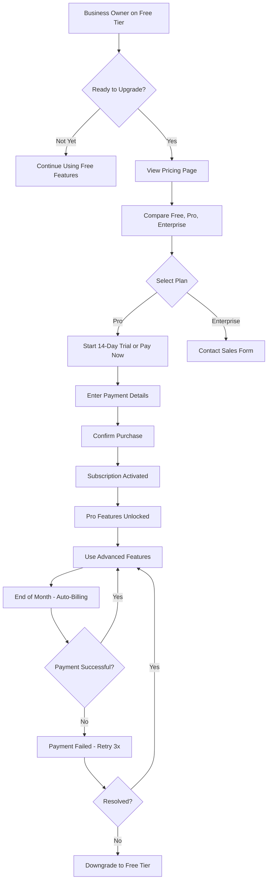

# Subscription Management

**Status**: =á Draft
**Priority**: P1 (High - Phase 2)
**Phase**: Phase 2
**Teams**: Backend, Web, Infrastructure
**Estimated Effort**: 3 weeks
**Target Release**: Phase 2 (Month 5-6)

## Overview

### Problem Statement

**NxLoy platform** needs a sustainable revenue model to support ongoing development and operations. Currently:
- No monetization strategy in place
- Unable to differentiate service tiers (free vs paid features)
- No usage tracking or billing system
- Cannot scale infrastructure costs with revenue
- Lacking incentive for businesses to upgrade for advanced features

Without a subscription model, the platform cannot sustain long-term growth or invest in advanced features like AI recommendations, blockchain integration, or white-label solutions.

### Solution Summary

Provide a **flexible subscription management system** that enables:
- 3-tier subscription model (Free, Pro, Enterprise)
- Feature-gated access based on subscription tier
- Usage-based billing for high-volume businesses
- Automated billing and payment processing (Stripe integration)
- Self-service plan upgrades/downgrades
- Invoice generation and payment history
- Trial periods for new businesses
- Annual vs monthly billing options

Each subscription tier includes:
- Feature access limits (programs, customers, transactions)
- Support level (community, email, dedicated account manager)
- API rate limits and webhook quotas
- Advanced features (AI recommendations, white-label, blockchain)
- Customizable for enterprise contracts

### Success Criteria

- [x] 25% of free-tier businesses upgrade to paid tier within 3 months
- [x] <2 minutes to complete checkout and activate subscription
- [x] 99.9% billing accuracy (no incorrect charges)
- [x] <1% churn rate for paid subscriptions
- [x] $150 average revenue per user (ARPU) for Pro tier
- [x] 10+ enterprise contracts within 6 months of launch

## User Stories

### Primary User Story

**As a** business owner on the free tier
**I want** to upgrade to a paid subscription to unlock advanced features
**So that** I can scale my loyalty program and access tools like AI recommendations and custom branding

**Acceptance Criteria**:
- [x] Given I'm on the free tier, when I view the pricing page, then I see clear comparison of Free, Pro, and Enterprise tiers
- [x] Given I want to upgrade, when I click "Upgrade to Pro", then I'm directed to a secure checkout flow
- [x] Given I've entered payment details, when I confirm, then my subscription activates immediately and features unlock
- [x] Given I'm on a paid tier, when I view my account, then I see usage stats (e.g., "247/1,000 customers this month")
- [x] Given I want to cancel, when I downgrade to free tier, then I retain data but lose access to paid features

### Secondary User Stories

**As a** business owner
**I want** to try Pro features before committing to a paid plan
**So that** I can validate the value before spending money

**Acceptance Criteria**:
- [x] Given I'm on the free tier, when I start a trial, then I get 14 days of full Pro access
- [x] Given my trial is ending, when 3 days remain, then I receive email reminders to upgrade
- [x] Given my trial ends, when I haven't upgraded, then I'm automatically downgraded to free tier

**As an** enterprise customer
**I want** to negotiate a custom contract with specific SLAs and pricing
**So that** I can meet my organization's compliance and budget requirements

**Acceptance Criteria**:
- [x] Given I'm interested in Enterprise, when I click "Contact Sales", then I'm connected with a sales representative
- [x] Given we've agreed on terms, when the contract is signed, then my custom plan is provisioned with agreed limits
- [x] Given I have an enterprise plan, when I view my dashboard, then I see custom SLA metrics and dedicated support contacts

**As a** platform administrator
**I want** to track subscription revenue and usage metrics
**So that** I can forecast growth and identify opportunities for plan optimization

**Acceptance Criteria**:
- [x] Given I'm viewing admin dashboard, when I check revenue metrics, then I see MRR, ARR, churn rate, and ARPU
- [x] Given I'm analyzing usage, when I view tier distribution, then I see breakdown of Free/Pro/Enterprise customers
- [x] Given I want to optimize pricing, when I view upgrade patterns, then I see which features drive conversions

## Requirements

### Functional Requirements

**Must Have (MVP)**:
- [x] 3-tier subscription model (Free, Pro, Enterprise)
- [x] Feature gating based on subscription tier
- [x] Stripe integration for payment processing
- [x] Self-service checkout flow
- [x] Subscription lifecycle management (create, upgrade, downgrade, cancel)
- [x] Usage tracking and quota enforcement
- [x] Invoice generation (monthly/annual)
- [x] Payment history and receipt access
- [x] 14-day free trial for Pro tier
- [x] Automated billing (recurring monthly/annual charges)
- [x] Email notifications (payment success, failure, trial ending)

**Should Have (Phase 2)**:
- [x] Annual billing with discount (save 15%)
- [x] Add-ons (extra API calls, additional users, white-label)
- [x] Usage-based billing for high-volume businesses
- [x] Proration for mid-cycle plan changes
- [x] Multi-currency support (USD, EUR, GBP, etc.)
- [ ] Referral credits (discount for referring other businesses)

**Could Have (Phase 3+)**:
- [ ] Custom enterprise pricing calculator
- [ ] Automatic plan recommendations based on usage
- [ ] Dunning management (retry failed payments automatically)
- [ ] Subscription pause feature (temporary suspension)
- [ ] Gift subscriptions (one business pays for another)

**Won't Have (Explicitly Out of Scope)**:
- L Cryptocurrency payments (too volatile, regulatory concerns)
- L Pay-per-transaction model (prefer predictable subscription revenue)
- L Freemium forever (free tier has hard limits to encourage upgrades)
- L Lifetime subscriptions (unsustainable revenue model)

### Non-Functional Requirements

**Performance**:
- API response time: <300ms for subscription operations (p95)
- Checkout flow: <10 seconds from click to confirmation
- Invoice generation: <5 seconds
- Concurrent checkouts: Support 1,000 simultaneous purchases
- Database: Indexes on subscription_status, business_id

**Security**:
- PCI DSS compliance: Use Stripe for all payment processing (no card data stored)
- Authentication: JWT required for all subscription operations
- Authorization: Only business owner can manage subscription
- Data encryption: All payment data encrypted in transit (TLS 1.3)
- Audit logging: All subscription changes logged (who, when, what changed)
- Rate limiting: 50 requests/minute per business for subscription operations

**Scalability**:
- Horizontal scaling: Stateless API servers
- Database: Read replicas for usage tracking queries
- Caching: Redis cache for subscription tier checks (5 minute TTL)
- Event-driven: Subscription events published to event bus
- Billing: Batch processing for monthly invoice generation

**Availability**:
- Uptime SLA: 99.9% (subscription access critical for business operations)
- Degraded mode: If Stripe fails, queue transactions and retry
- Monitoring: Alerts if checkout flow fails or payment processing errors exceed threshold

## User Experience

### User Flow Diagram



### Wireframes / Mockups

**Pricing Page**:
```

  Choose Your Plan                          
$
       
   Free        Pro        Enterprise 
   $0/month    $49/month   Custom    
                                     
    1 prog     Unlim      All Pro 
    100         programs    Custom  
     custmrs    1,000       limits  
    Basic       custmrs    SLA     
     support    AI rec     Dedic.  
                White       support 
                 label      White   
                API acc     label   
                Email      API acc 
                 support    Custom  
                             integr. 
                                     
  [Current]   [Upgrade]   [Contact]  
       
                                            
  Annual Billing: Save 15% ($499/year)      

```

**Checkout Flow**:
```

  Upgrade to Pro - Checkout                 
$
  Plan Summary:                             
      
   Pro Plan - $49/month                   
   " Unlimited programs                   
   " Up to 1,000 customers                
   " AI recommendations                   
   " White-label branding                 
                                          
   14-Day Free Trial                      
   You won't be charged until             
   Nov 20, 2025                           
      
                                            
  Payment Method:                           
      
   Card Number: [________________]        
   Expiry: [MM/YY_] CVV: [___]            
   Name: [________________________]        
                                          
   = Secured by Stripe                   
      
                                            
  Billing Address:                          
  [Auto-filled from business profile]       
                                            
  Total: $0.00 today, $49.00 on Nov 20      
                                            
  [Cancel]              [Start Free Trial]  

```

**Subscription Dashboard**:
```

  Subscription & Billing                    
$
  Current Plan: Pro                         
  Status: Active                            
  Next Billing: Dec 6, 2025 ($49.00)        
                                            
  Usage This Month:                         
      
   Customers:   247 / 1,000 (25%)         
   Programs:    3 / Unlimited             
   API Calls:   12,847 / 50,000 (26%)     
   Transactions: 1,234 / Unlimited        
      
                                            
  Payment Method:                           
  Visa ending in 4242 (Expires 12/2026)     
  [Update Payment Method]                   
                                            
  Billing History:                          
  " Nov 6, 2025 - $49.00 (Paid) [Receipt]   
  " Oct 6, 2025 - $49.00 (Paid) [Receipt]   
  " Sep 6, 2025 - $49.00 (Paid) [Receipt]   
                                            
  [Change Plan] [Cancel Subscription]       

```

### UI Copy

**Page Title**: "Choose the Right Plan for Your Business"
**Primary CTA**: "Start Free Trial" / "Upgrade to Pro"
**Secondary CTA**: "Contact Sales" (for Enterprise)
**Help Text**: "All plans include core loyalty features. Upgrade to unlock advanced tools like AI recommendations and white-label branding."
**Empty State**: N/A (always shows current plan)
**Success Message**: "Congratulations! Your Pro subscription is now active. Enjoy unlimited programs and AI recommendations."
**Error Message**: "Payment failed. Please check your card details and try again."
**Trial Ending Message**: "Your trial ends in 3 days. Upgrade now to keep Pro features."

## Technical Design

### Architecture Overview

```
          
   Web UI    ¶  Backend    ¶  Database   
  Checkout           API             (PostgreSQL)
  Dashboard         (NestJS)        subscriptions
            invoices   
                                        
                           
                           ¼
                    
                      Stripe API 
                      Payment    
                      Processing 
                    
                           
                           ¼
                    
                     Event Bus   
                      (Redis)    
                    subscription.
                       events    
                    
                           
                           ¼
                    
                      Billing    
                      Service    
                     (Batch Job) 
                    
```

### Domain Model

```typescript
// Subscription domain entities
interface Subscription {
  id: string;                              // UUID
  businessId: string;                      // UUID (tenant)
  planId: string;                          // UUID
  status: SubscriptionStatus;
  stripeSubscriptionId?: string;           // Stripe subscription ID
  stripeCustomerId: string;                // Stripe customer ID
  currentPeriodStart: Date;
  currentPeriodEnd: Date;
  trialStart?: Date;
  trialEnd?: Date;
  canceledAt?: Date;
  cancelAtPeriodEnd: boolean;              // Downgrade scheduled?
  createdAt: Date;
  updatedAt: Date;
}

enum SubscriptionStatus {
  TRIAL = 'TRIAL',                         // Free trial active
  ACTIVE = 'ACTIVE',                       // Paid and active
  PAST_DUE = 'PAST_DUE',                  // Payment failed, retrying
  CANCELED = 'CANCELED',                   // Canceled by user
  INCOMPLETE = 'INCOMPLETE'                // Checkout started but not completed
}

interface SubscriptionPlan {
  id: string;                              // UUID
  name: string;                            // 'Free', 'Pro', 'Enterprise'
  displayName: string;                     // 'Professional Plan'
  tier: PlanTier;
  priceMonthly: number;                    // In cents (e.g., 4900 = $49)
  priceAnnual?: number;                    // In cents (e.g., 49900 = $499)
  stripePriceId: string;                   // Stripe price ID
  features: PlanFeatures;
  limits: PlanLimits;
  isActive: boolean;                       // Can new customers subscribe?
  trialDays: number;                       // 14 for Pro, 0 for Free/Enterprise
  createdAt: Date;
  updatedAt: Date;
}

enum PlanTier {
  FREE = 'FREE',
  PRO = 'PRO',
  ENTERPRISE = 'ENTERPRISE'
}

interface PlanFeatures {
  unlimitedPrograms: boolean;
  aiRecommendations: boolean;
  whiteLabel: boolean;
  apiAccess: boolean;
  advancedAnalytics: boolean;
  blockchainRewards: boolean;              // Phase 4
  dedicatedSupport: boolean;
  customIntegrations: boolean;
  slaGuarantee: boolean;
}

interface PlanLimits {
  maxPrograms: number | null;              // null = unlimited
  maxCustomers: number | null;
  maxTransactionsPerMonth: number | null;
  maxApiCallsPerMonth: number | null;
  maxWebhooks: number | null;
  maxLocations: number | null;
  maxUsers: number | null;                 // Staff accounts
}

interface Invoice {
  id: string;
  subscriptionId: string;
  businessId: string;
  stripeInvoiceId: string;
  amount: number;                          // In cents
  currency: string;                        // 'usd', 'eur', etc.
  status: InvoiceStatus;
  periodStart: Date;
  periodEnd: Date;
  dueDate: Date;
  paidAt?: Date;
  invoiceUrl: string;                      // Stripe hosted invoice URL
  receiptUrl?: string;                     // Receipt after payment
  createdAt: Date;
}

enum InvoiceStatus {
  DRAFT = 'DRAFT',                         // Not yet finalized
  OPEN = 'OPEN',                           // Awaiting payment
  PAID = 'PAID',                           // Payment successful
  VOID = 'VOID',                           // Canceled/voided
  UNCOLLECTIBLE = 'UNCOLLECTIBLE'         // Payment failed permanently
}

interface UsageTracking {
  id: string;
  businessId: string;
  periodStart: Date;
  periodEnd: Date;
  programsCreated: number;
  activeCustomers: number;
  transactionsProcessed: number;
  apiCallsMade: number;
  webhooksSent: number;
  storageUsedMB: number;
}

interface PaymentMethod {
  id: string;
  businessId: string;
  stripePaymentMethodId: string;
  type: 'card' | 'bank_account';
  last4: string;                           // Last 4 digits
  brand?: string;                          // 'visa', 'mastercard', etc.
  expMonth?: number;
  expYear?: number;
  isDefault: boolean;
  createdAt: Date;
}
```

### Database Schema Changes

**New Tables**:
```sql
CREATE TABLE subscription_plans (
  id UUID PRIMARY KEY DEFAULT gen_random_uuid(),
  name VARCHAR(50) NOT NULL UNIQUE,
  display_name VARCHAR(100) NOT NULL,
  tier VARCHAR(20) NOT NULL,
  price_monthly BIGINT NOT NULL,
  price_annual BIGINT,
  stripe_price_id VARCHAR(100) NOT NULL,
  features JSONB NOT NULL,
  limits JSONB NOT NULL,
  is_active BOOLEAN DEFAULT TRUE,
  trial_days INT DEFAULT 0,
  created_at TIMESTAMP DEFAULT NOW(),
  updated_at TIMESTAMP DEFAULT NOW(),

  CONSTRAINT valid_tier CHECK (tier IN ('FREE', 'PRO', 'ENTERPRISE'))
);

CREATE TABLE subscriptions (
  id UUID PRIMARY KEY DEFAULT gen_random_uuid(),
  business_id UUID NOT NULL REFERENCES businesses(id) UNIQUE,
  plan_id UUID NOT NULL REFERENCES subscription_plans(id),
  status VARCHAR(20) NOT NULL DEFAULT 'INCOMPLETE',
  stripe_subscription_id VARCHAR(100),
  stripe_customer_id VARCHAR(100) NOT NULL,
  current_period_start TIMESTAMP NOT NULL,
  current_period_end TIMESTAMP NOT NULL,
  trial_start TIMESTAMP,
  trial_end TIMESTAMP,
  canceled_at TIMESTAMP,
  cancel_at_period_end BOOLEAN DEFAULT FALSE,
  created_at TIMESTAMP DEFAULT NOW(),
  updated_at TIMESTAMP DEFAULT NOW(),

  CONSTRAINT valid_status CHECK (status IN ('TRIAL', 'ACTIVE', 'PAST_DUE', 'CANCELED', 'INCOMPLETE'))
);

CREATE TABLE invoices (
  id UUID PRIMARY KEY DEFAULT gen_random_uuid(),
  subscription_id UUID NOT NULL REFERENCES subscriptions(id),
  business_id UUID NOT NULL REFERENCES businesses(id),
  stripe_invoice_id VARCHAR(100) NOT NULL UNIQUE,
  amount BIGINT NOT NULL,
  currency VARCHAR(10) NOT NULL DEFAULT 'usd',
  status VARCHAR(20) NOT NULL,
  period_start DATE NOT NULL,
  period_end DATE NOT NULL,
  due_date DATE NOT NULL,
  paid_at TIMESTAMP,
  invoice_url TEXT NOT NULL,
  receipt_url TEXT,
  created_at TIMESTAMP DEFAULT NOW(),

  CONSTRAINT valid_invoice_status CHECK (status IN ('DRAFT', 'OPEN', 'PAID', 'VOID', 'UNCOLLECTIBLE'))
);

CREATE TABLE usage_tracking (
  id UUID PRIMARY KEY DEFAULT gen_random_uuid(),
  business_id UUID NOT NULL REFERENCES businesses(id),
  period_start DATE NOT NULL,
  period_end DATE NOT NULL,
  programs_created INT DEFAULT 0,
  active_customers INT DEFAULT 0,
  transactions_processed INT DEFAULT 0,
  api_calls_made INT DEFAULT 0,
  webhooks_sent INT DEFAULT 0,
  storage_used_mb INT DEFAULT 0,
  created_at TIMESTAMP DEFAULT NOW(),

  UNIQUE(business_id, period_start)
);

CREATE TABLE payment_methods (
  id UUID PRIMARY KEY DEFAULT gen_random_uuid(),
  business_id UUID NOT NULL REFERENCES businesses(id),
  stripe_payment_method_id VARCHAR(100) NOT NULL UNIQUE,
  type VARCHAR(20) NOT NULL,
  last4 VARCHAR(4) NOT NULL,
  brand VARCHAR(50),
  exp_month INT,
  exp_year INT,
  is_default BOOLEAN DEFAULT FALSE,
  created_at TIMESTAMP DEFAULT NOW(),

  CONSTRAINT valid_payment_type CHECK (type IN ('card', 'bank_account'))
);

-- Indexes for performance
CREATE INDEX idx_subscriptions_business_id ON subscriptions(business_id);
CREATE INDEX idx_subscriptions_status ON subscriptions(status);
CREATE INDEX idx_subscriptions_stripe_customer ON subscriptions(stripe_customer_id);

CREATE INDEX idx_invoices_subscription_id ON invoices(subscription_id);
CREATE INDEX idx_invoices_business_id ON invoices(business_id);
CREATE INDEX idx_invoices_status ON invoices(status);
CREATE INDEX idx_invoices_due_date ON invoices(due_date);

CREATE INDEX idx_usage_business_id ON usage_tracking(business_id);
CREATE INDEX idx_usage_period ON usage_tracking(period_start, period_end);

CREATE INDEX idx_payment_methods_business_id ON payment_methods(business_id);
CREATE INDEX idx_payment_methods_default ON payment_methods(business_id, is_default) WHERE is_default = TRUE;
```

**Seed Data**:
```sql
-- Insert default subscription plans
INSERT INTO subscription_plans (name, display_name, tier, price_monthly, price_annual, stripe_price_id, features, limits, trial_days) VALUES
('free', 'Free Plan', 'FREE', 0, 0, 'price_free',
  '{"unlimitedPrograms": false, "aiRecommendations": false, "whiteLabel": false, "apiAccess": false, "advancedAnalytics": false, "blockchainRewards": false, "dedicatedSupport": false, "customIntegrations": false, "slaGuarantee": false}',
  '{"maxPrograms": 1, "maxCustomers": 100, "maxTransactionsPerMonth": 1000, "maxApiCallsPerMonth": 5000, "maxWebhooks": 1, "maxLocations": 1, "maxUsers": 1}',
  0),
('pro', 'Professional Plan', 'PRO', 4900, 49900, 'price_pro_monthly',
  '{"unlimitedPrograms": true, "aiRecommendations": true, "whiteLabel": true, "apiAccess": true, "advancedAnalytics": true, "blockchainRewards": false, "dedicatedSupport": false, "customIntegrations": false, "slaGuarantee": false}',
  '{"maxPrograms": null, "maxCustomers": 1000, "maxTransactionsPerMonth": null, "maxApiCallsPerMonth": 50000, "maxWebhooks": 10, "maxLocations": 5, "maxUsers": 5}',
  14),
('enterprise', 'Enterprise Plan', 'ENTERPRISE', 0, 0, 'price_enterprise_custom',
  '{"unlimitedPrograms": true, "aiRecommendations": true, "whiteLabel": true, "apiAccess": true, "advancedAnalytics": true, "blockchainRewards": true, "dedicatedSupport": true, "customIntegrations": true, "slaGuarantee": true}',
  '{"maxPrograms": null, "maxCustomers": null, "maxTransactionsPerMonth": null, "maxApiCallsPerMonth": null, "maxWebhooks": null, "maxLocations": null, "maxUsers": null}',
  0);
```

### API Endpoints

**See CONTRACTS.md for full OpenAPI specification**

Summary:
- `GET /api/v1/subscriptions/plans` - List available plans
- `GET /api/v1/subscriptions/plans/{id}` - Get plan details
- `GET /api/v1/subscriptions/current` - Get current subscription
- `POST /api/v1/subscriptions/checkout` - Start checkout session (returns Stripe session URL)
- `POST /api/v1/subscriptions/upgrade` - Upgrade plan
- `POST /api/v1/subscriptions/downgrade` - Downgrade plan
- `POST /api/v1/subscriptions/cancel` - Cancel subscription
- `GET /api/v1/subscriptions/usage` - Get current usage stats
- `GET /api/v1/subscriptions/invoices` - List invoices
- `GET /api/v1/subscriptions/invoices/{id}` - Get invoice details
- `POST /api/v1/subscriptions/payment-methods` - Add payment method
- `GET /api/v1/subscriptions/payment-methods` - List payment methods
- `PATCH /api/v1/subscriptions/payment-methods/{id}/default` - Set default payment method
- `DELETE /api/v1/subscriptions/payment-methods/{id}` - Remove payment method
- `POST /api/v1/webhooks/stripe` - Stripe webhook endpoint (payment events)

### Domain Events

**See CONTRACTS.md for full AsyncAPI specification**

Summary:
- `subscription.trial.started` - Published when trial begins
- `subscription.trial.ending` - Published 3 days before trial ends
- `subscription.trial.ended` - Published when trial expires
- `subscription.created` - Published when subscription created
- `subscription.activated` - Published when subscription becomes active
- `subscription.upgraded` - Published when plan upgraded
- `subscription.downgraded` - Published when plan downgraded
- `subscription.canceled` - Published when subscription canceled
- `subscription.payment.succeeded` - Published when payment successful
- `subscription.payment.failed` - Published when payment fails
- `invoice.created` - Published when invoice generated
- `invoice.paid` - Published when invoice paid

## Dependencies

### Internal Dependencies

- **Business Profile**: Business must have complete profile before subscribing
- **Authentication**: User must be authenticated and authorized as business owner

### External Dependencies

- **Stripe**: Payment processing, subscription management, invoicing
- **Email Service**: SendGrid or AWS SES for billing notifications

### Blocked By

- [ ] Stripe account setup and API keys
- [ ] Business profile system must be complete
- [ ] Payment method storage and PCI compliance review

### Blocks

- [ ] Feature gating (depends on subscription tier checks)
- [ ] Usage-based billing (depends on usage tracking)
- [ ] Enterprise features (white-label, custom integrations)

## Testing Strategy

### Unit Tests

**Backend**:
- SubscriptionService.createCheckoutSession() with valid/invalid plans
- SubscriptionService.handleStripeWebhook() for all event types
- SubscriptionService.checkFeatureAccess() with different tiers
- UsageTrackingService.incrementUsage() and quota enforcement
- Invoice generation logic

**Frontend**:
- Pricing page rendering (plan comparison)
- Checkout flow validation
- Usage dashboard display
- Payment method management

**Coverage Target**: >90% (critical financial logic)

### Integration Tests

- POST /api/v1/subscriptions/checkout creates Stripe session
- Stripe webhook updates subscription status correctly
- POST /api/v1/subscriptions/upgrade prorates charges correctly
- GET /api/v1/subscriptions/usage returns accurate counts
- Feature gating prevents access to paid features on free tier
- Trial expiration automatically downgrades to free tier

### End-to-End Tests

See `ACCEPTANCE.feature` for Gherkin scenarios.

Example:
- Business owner on free tier views pricing page
- Clicks "Upgrade to Pro" and starts 14-day trial
- Trial period tracked, features unlocked immediately
- 3 days before trial ends, receives email reminder
- Enters payment details and confirms subscription
- Subscription activates, first invoice generated
- Monthly recurring billing charged successfully
- Business owner views usage stats (within limits)
- Downgrades to free tier, retains data but loses features

### Performance Tests

- Load test: 1,000 concurrent checkout sessions
- Response time: <300ms for subscription operations (p95)
- Checkout flow: <10 seconds end-to-end
- Stripe webhook processing: <5 seconds

## Rollout Plan

### Phase 1: Development (Week 1-3)

**Week 1: Core Infrastructure**
- Backend: Database schema migration
- Backend: Subscription CRUD APIs
- Backend: Stripe integration setup
- Web: Pricing page UI
- Web: Checkout flow UI

**Week 2: Billing & Usage Tracking**
- Backend: Usage tracking service
- Backend: Invoice generation
- Backend: Stripe webhook handler
- Backend: Feature gating middleware
- Web: Subscription dashboard UI

**Week 3: Testing & Polish**
- Backend: Write unit and integration tests
- Backend: Test all Stripe webhooks
- Web: Payment method management UI
- Web: Usage dashboard
- All: Write acceptance tests

### Phase 2: Testing (Week 4)

- Unit tests passing (>90% coverage)
- Integration tests with Stripe test mode
- E2E tests (full checkout and billing cycle)
- QA manual testing (all plans)
- Security audit (PCI compliance review)
- Bug fixes

### Phase 3: Staging Deployment (Week 5)

- Deploy to staging environment
- Internal team testing (test subscriptions)
- Beta customer testing (5-10 businesses)
- Gather feedback and iterate
- Load testing (simulate Black Friday traffic)

### Phase 4: Production Rollout (Week 6)

**Gradual Rollout**:
- Day 1: Soft launch (invite-only beta)
- Day 7: Public launch (announce via email, blog)
- Month 1: Monitor metrics, iterate pricing
- Month 2: Add annual billing discount
- Month 3: Enterprise plan available

**Rollback Plan**:
- Feature flag: `ENABLE_SUBSCRIPTIONS`
- Grandfather existing users (free forever if needed)
- Database rollback: Migration rollback scripts prepared
- Monitoring: Alerts for payment processing errors
- Support: Dedicated team for subscription issues

### Phase 5: Post-Launch (Week 7+)

- Monitor metrics (conversion rate, churn, MRR)
- Collect user feedback (NPS, CSAT)
- Iterate pricing based on data
- Add requested features (add-ons, custom plans)
- Document lessons learned

## Monitoring & Analytics

### Metrics to Track

**Usage Metrics**:
- Free tier signups per day
- Trial starts per day
- Trial ’ Paid conversion rate
- Upgrade rate (Free ’ Pro)
- Downgrade rate (Pro ’ Free)
- Churn rate (monthly, annual)

**Performance Metrics**:
- Checkout completion rate
- Payment success rate
- API response time (p50, p95, p99)
- Stripe webhook processing time
- Invoice generation time

**Business Metrics**:
- MRR (Monthly Recurring Revenue)
- ARR (Annual Recurring Revenue)
- ARPU (Average Revenue Per User)
- LTV (Lifetime Value)
- CAC (Customer Acquisition Cost)
- LTV:CAC ratio

### Dashboards

- Grafana: `nxloy-subscription-usage`
- Datadog: `subscription-performance`
- Stripe Dashboard: Payment metrics
- Custom: Subscription revenue dashboard (in-app)

### Alerts

- Payment success rate <95%: Alert finance team
- Checkout abandonment >50%: Alert product team
- Stripe webhook processing failure: Page on-call engineer
- MRR decline >10% month-over-month: Alert executive team
- High churn rate >5%: Alert customer success team

## Documentation

### User-Facing Documentation

- [x] Help article: "Choosing the Right Plan"
- [x] Help article: "How to Upgrade Your Subscription"
- [x] Help article: "Understanding Your Invoice"
- [x] Help article: "How to Cancel Your Subscription"
- [x] Video tutorial: "Upgrading to Pro" (3 minutes)
- [x] FAQ: "What happens if my payment fails?"
- [x] FAQ: "Can I switch from monthly to annual billing?"

### Developer Documentation

- [x] API documentation: OpenAPI spec updated
- [x] Stripe integration guide
- [x] Webhook handling documentation
- [x] Feature gating implementation guide
- [x] Usage tracking instrumentation
- [x] Runbook: "Subscription Operations Guide"

## Risks & Mitigation

### Risk 1: Low Conversion Rate (Free ’ Paid)

**Probability**: High
**Impact**: High (revenue target not met)

**Description**: If <10% of free users upgrade, revenue will be insufficient to sustain platform.

**Mitigation**:
- Clear value proposition on pricing page
- 14-day free trial (no credit card required)
- In-app prompts when approaching free tier limits
- Success stories from paid customers
- A/B test pricing ($49 vs $39 vs $59)
- Offer annual discount (15% savings)

### Risk 2: Payment Processing Failures

**Probability**: Medium
**Impact**: High (revenue loss, customer churn)

**Description**: Credit card declines, expired cards, or insufficient funds cause failed payments.

**Mitigation**:
- Email notifications before billing date
- Automatic retry (3 attempts over 7 days)
- Grace period before downgrading (7 days)
- Update payment method flow (easy access)
- Dunning management (Phase 3)

### Risk 3: Stripe Integration Complexity

**Probability**: Medium
**Impact**: Medium (delays, bugs)

**Description**: Stripe webhooks, proration, and edge cases are complex and error-prone.

**Mitigation**:
- Comprehensive Stripe webhook testing
- Idempotency keys for all Stripe API calls
- Audit logging of all payment events
- Staging environment with Stripe test mode
- Regular Stripe API version updates

### Risk 4: Enterprise Sales Dependency

**Probability**: Medium
**Impact**: Medium (lower enterprise adoption)

**Description**: Enterprise sales require dedicated sales team and custom contracts, slowing growth.

**Mitigation**:
- Self-service enterprise trial (high limits)
- Automated proposal generation
- Standard enterprise contract template
- Partner with sales consultants (commission-based)
- Focus on Pro tier for initial revenue

### Risk 5: Feature Parity with Free Tier

**Probability**: Low
**Impact**: Medium (unclear differentiation)

**Description**: If free tier is too generous, users won't see value in upgrading.

**Mitigation**:
- Hard limits on free tier (1 program, 100 customers)
- Reserve valuable features for paid tiers (AI, white-label, API)
- Monitor usage patterns (identify power users to target)
- A/B test free tier limits
- Clear upgrade path in UI (e.g., "Unlock AI recommendations")

## Open Questions

- [x] **Q**: What is the optimal free tier limit (1 program vs 3 programs)?
  - **A**: Start with 1 program. Monitor upgrade rate and adjust if needed.

- [x] **Q**: Should we require credit card for free trial?
  - **A**: No. Reduces friction. Auto-downgrade if they don't upgrade.

- [x] **Q**: What discount should we offer for annual billing?
  - **A**: 15% (industry standard, equivalent to 2 free months).

- [x] **Q**: How do we handle mid-cycle upgrades (proration)?
  - **A**: Stripe handles proration automatically. Charge difference immediately.

- [ ] **Q**: Should we offer refunds for dissatisfied customers?
  - **A**: TBD. Start with no-refund policy, evaluate based on churn data.
  - **Decision Deadline**: Before production launch
  - **Decision Owner**: Finance + Customer Success

- [ ] **Q**: What is the minimum contract length for Enterprise?
  - **A**: TBD. Likely 12 months with quarterly billing.
  - **Decision Deadline**: Before enterprise sales start
  - **Decision Owner**: Sales Lead

## Stakeholders

### Accountable

- **Product Owner**: [Name] - Final approval on pricing and plan features
- **Engineering Lead**: [Name] - Technical approval and implementation
- **Finance Lead**: [Name] - Pricing strategy and revenue forecasts

### Responsible

- **Backend Lead**: [Name] - Subscription API, Stripe integration, usage tracking
- **Frontend Lead**: [Name] - Pricing page, checkout flow, subscription dashboard
- **QA Lead**: [Name] - Testing strategy, payment flow validation
- **DevOps Lead**: [Name] - Secure deployment, PCI compliance

### Consulted

- **UX Designer**: [Name] - Pricing page and checkout UX
- **Marketing**: [Name] - Positioning and messaging for tiers
- **Legal**: [Name] - Terms of service, refund policy, compliance
- **Customer Success**: [Name] - Feedback on feature gating

### Informed

- **All Teams**: Subscription launch impacts everyone
- **Support**: [Name] - Training on billing troubleshooting
- **Sales**: [Name] - Enterprise sales enablement

## Timeline

| Milestone | Date | Owner | Status |
|-----------|------|-------|--------|
| Spec approval | 2026-02-01 | Product | =á Pending |
| Stripe setup complete | 2026-02-08 | DevOps | =á Pending |
| Contract freeze | 2026-02-15 | Backend | =á Pending |
| Development complete | 2026-03-08 | Engineering | =á Pending |
| Testing complete | 2026-03-15 | QA | =á Pending |
| Security audit | 2026-03-22 | Security | =á Pending |
| Staging deployment | 2026-03-29 | DevOps | =á Pending |
| Production launch | 2026-04-05 | Product | =á Pending |

## References

### Related Documents

- [ADR-0002: Contract-First Development](../../../adr/0002-contract-first-development.md)
- [Business Requirements: Monetization Strategy](../../BUSINESS-REQUIREMENTS.md#monetization)
- [Product Roadmap: Phase 2](../../PRODUCT-ROADMAP.md#phase-2-expansion-months-4-6)

### External References

- [Stripe Documentation: Subscriptions](https://stripe.com/docs/billing/subscriptions)
- [SaaS Pricing Strategies: Best Practices](https://example.com/saas-pricing)
- [Subscription Metrics: MRR, Churn, LTV](https://example.com/subscription-metrics)
- [PCI DSS Compliance Guide](https://example.com/pci-compliance)

## Change Log

| Date | Version | Changes | Author |
|------|---------|---------|--------|
| 2025-11-06 | 1.0.0 | Initial draft | Ploy Lab |

---

**Last Updated**: 2025-11-06
**Next Review**: 2026-01-06 (post-development review)
**Document Owner**: Product Team
